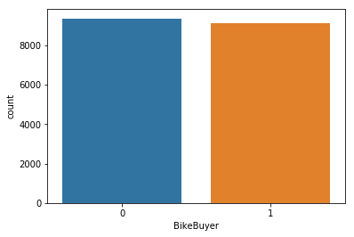
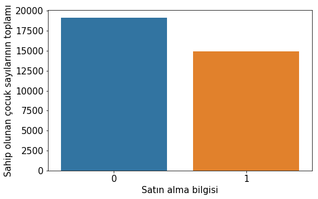
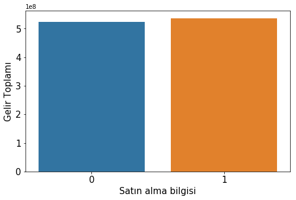
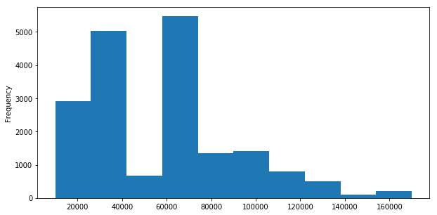
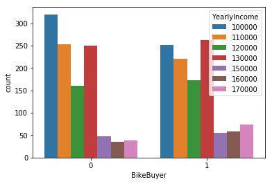
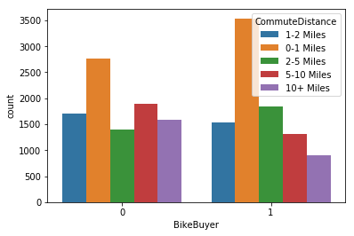
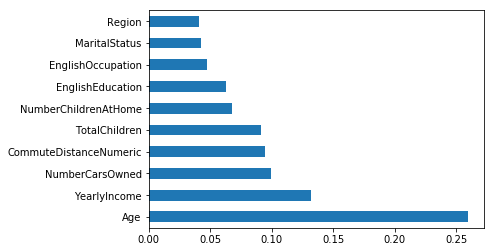
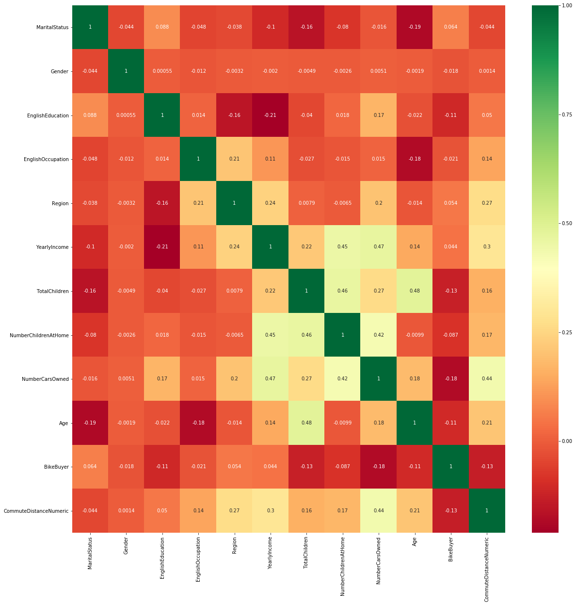

### Herkese selamlar bu veri çalışmasında amacımız bir bisiklet firmasına ait bisiklet alıp almayan insanların bilgilerini değerlendirip bu verileri kullanarak yeni insanların bisiklet alıp almayacağı tahminleme modeli oluşturmaktır.Bu çalışmanın devamı "bicycle_LogisticRegressionPrediction2" adlı dosyadadır.

### Veriyi Hazırlama


```python
import pandas as pd
import numpy as np
import seaborn as sns
import matplotlib.pyplot as plt
%matplotlib inline
import math
```


```python
#Veri tablosunu okuma
df = pd.read_excel (r'C:\Users\samay\Downloads\Data.xlsx')
```


```python
#Burada Notebookta görüntüleyeceğimiz tablonun tüm satır sütunlarını daraltma olmadan görebilmemiz için işlem yaptık.
pd.set_option('display.max_rows', 500)
pd.set_option('display.max_columns', 500)
pd.set_option('display.width', 150)
```


```python
df.head(5)
```


<div>
<style scoped>
    .dataframe tbody tr th:only-of-type {
        vertical-align: middle;
    }

    .dataframe tbody tr th {
        vertical-align: top;
    }

    .dataframe thead th {
        text-align: right;
    }
</style>
<table border="1" class="dataframe">
  <thead>
    <tr style="text-align: right;">
      <th></th>
      <th>CustomerKey</th>
      <th>GeographyKey</th>
      <th>CustomerAlternateKey</th>
      <th>Title</th>
      <th>FirstName</th>
      <th>MiddleName</th>
      <th>LastName</th>
      <th>NameStyle</th>
      <th>BirthDate</th>
      <th>MaritalStatus</th>
      <th>Suffix</th>
      <th>Gender</th>
      <th>EmailAddress</th>
      <th>YearlyIncome</th>
      <th>TotalChildren</th>
      <th>NumberChildrenAtHome</th>
      <th>EnglishEducation</th>
      <th>SpanishEducation</th>
      <th>FrenchEducation</th>
      <th>EnglishOccupation</th>
      <th>SpanishOccupation</th>
      <th>FrenchOccupation</th>
      <th>HouseOwnerFlag</th>
      <th>NumberCarsOwned</th>
      <th>AddressLine1</th>
      <th>AddressLine2</th>
      <th>Phone</th>
      <th>DateFirstPurchase</th>
      <th>CommuteDistance</th>
      <th>Region</th>
      <th>Age</th>
      <th>BikeBuyer</th>
    </tr>
  </thead>
  <tbody>
    <tr>
      <th>0</th>
      <td>11000</td>
      <td>26</td>
      <td>AW00011000</td>
      <td>NaN</td>
      <td>Jon</td>
      <td>V</td>
      <td>Yang</td>
      <td>0</td>
      <td>1971-10-06</td>
      <td>M</td>
      <td>NaN</td>
      <td>M</td>
      <td>jon24@adventure-works.com</td>
      <td>90000</td>
      <td>2</td>
      <td>0</td>
      <td>Bachelors</td>
      <td>Licenciatura</td>
      <td>Bac + 4</td>
      <td>Professional</td>
      <td>Profesional</td>
      <td>Cadre</td>
      <td>1</td>
      <td>0</td>
      <td>3761 N. 14th St</td>
      <td>NaN</td>
      <td>1 (11) 500 555-0162</td>
      <td>2011-01-19</td>
      <td>1-2 Miles</td>
      <td>Pacific</td>
      <td>48</td>
      <td>1</td>
    </tr>
    <tr>
      <th>1</th>
      <td>11001</td>
      <td>37</td>
      <td>AW00011001</td>
      <td>NaN</td>
      <td>Eugene</td>
      <td>L</td>
      <td>Huang</td>
      <td>0</td>
      <td>1976-05-10</td>
      <td>S</td>
      <td>NaN</td>
      <td>M</td>
      <td>eugene10@adventure-works.com</td>
      <td>60000</td>
      <td>3</td>
      <td>3</td>
      <td>Bachelors</td>
      <td>Licenciatura</td>
      <td>Bac + 4</td>
      <td>Professional</td>
      <td>Profesional</td>
      <td>Cadre</td>
      <td>0</td>
      <td>1</td>
      <td>2243 W St.</td>
      <td>NaN</td>
      <td>1 (11) 500 555-0110</td>
      <td>2011-01-15</td>
      <td>0-1 Miles</td>
      <td>Pacific</td>
      <td>43</td>
      <td>1</td>
    </tr>
    <tr>
      <th>2</th>
      <td>11002</td>
      <td>31</td>
      <td>AW00011002</td>
      <td>NaN</td>
      <td>Ruben</td>
      <td>NaN</td>
      <td>Torres</td>
      <td>0</td>
      <td>1971-02-09</td>
      <td>M</td>
      <td>NaN</td>
      <td>M</td>
      <td>ruben35@adventure-works.com</td>
      <td>60000</td>
      <td>3</td>
      <td>3</td>
      <td>Bachelors</td>
      <td>Licenciatura</td>
      <td>Bac + 4</td>
      <td>Professional</td>
      <td>Profesional</td>
      <td>Cadre</td>
      <td>1</td>
      <td>1</td>
      <td>5844 Linden Land</td>
      <td>NaN</td>
      <td>1 (11) 500 555-0184</td>
      <td>2011-01-07</td>
      <td>2-5 Miles</td>
      <td>Pacific</td>
      <td>49</td>
      <td>1</td>
    </tr>
    <tr>
      <th>3</th>
      <td>11003</td>
      <td>11</td>
      <td>AW00011003</td>
      <td>NaN</td>
      <td>Christy</td>
      <td>NaN</td>
      <td>Zhu</td>
      <td>0</td>
      <td>1973-08-14</td>
      <td>S</td>
      <td>NaN</td>
      <td>F</td>
      <td>christy12@adventure-works.com</td>
      <td>70000</td>
      <td>0</td>
      <td>0</td>
      <td>Bachelors</td>
      <td>Licenciatura</td>
      <td>Bac + 4</td>
      <td>Professional</td>
      <td>Profesional</td>
      <td>Cadre</td>
      <td>0</td>
      <td>1</td>
      <td>1825 Village Pl.</td>
      <td>NaN</td>
      <td>1 (11) 500 555-0162</td>
      <td>2010-12-29</td>
      <td>5-10 Miles</td>
      <td>Pacific</td>
      <td>46</td>
      <td>1</td>
    </tr>
    <tr>
      <th>4</th>
      <td>11004</td>
      <td>19</td>
      <td>AW00011004</td>
      <td>NaN</td>
      <td>Elizabeth</td>
      <td>NaN</td>
      <td>Johnson</td>
      <td>0</td>
      <td>1979-08-05</td>
      <td>S</td>
      <td>NaN</td>
      <td>F</td>
      <td>elizabeth5@adventure-works.com</td>
      <td>80000</td>
      <td>5</td>
      <td>5</td>
      <td>Bachelors</td>
      <td>Licenciatura</td>
      <td>Bac + 4</td>
      <td>Professional</td>
      <td>Profesional</td>
      <td>Cadre</td>
      <td>1</td>
      <td>4</td>
      <td>7553 Harness Circle</td>
      <td>NaN</td>
      <td>1 (11) 500 555-0131</td>
      <td>2011-01-23</td>
      <td>1-2 Miles</td>
      <td>Pacific</td>
      <td>40</td>
      <td>1</td>
    </tr>
  </tbody>
</table>
</div>


```python
#Burada NaN değer kontrolü ve sütun veri tipi kontrolü yapıyoruz.Nan değerleri olan sütunlar makine öğrenmesi modelimizde sorun çıkartır.
df.info()
df.isna().sum()
```

    <class 'pandas.core.frame.DataFrame'>
    RangeIndex: 18484 entries, 0 to 18483
    Data columns (total 32 columns):
    CustomerKey             18484 non-null int64
    GeographyKey            18484 non-null int64
    CustomerAlternateKey    18484 non-null object
    Title                   101 non-null object
    FirstName               18484 non-null object
    MiddleName              10654 non-null object
    LastName                18484 non-null object
    NameStyle               18484 non-null int64
    BirthDate               18484 non-null datetime64[ns]
    MaritalStatus           18484 non-null object
    Suffix                  3 non-null object
    Gender                  18484 non-null object
    EmailAddress            18484 non-null object
    YearlyIncome            18484 non-null int64
    TotalChildren           18484 non-null int64
    NumberChildrenAtHome    18484 non-null int64
    EnglishEducation        18484 non-null object
    SpanishEducation        18484 non-null object
    FrenchEducation         18484 non-null object
    EnglishOccupation       18484 non-null object
    SpanishOccupation       18484 non-null object
    FrenchOccupation        18484 non-null object
    HouseOwnerFlag          18484 non-null int64
    NumberCarsOwned         18484 non-null int64
    AddressLine1            18484 non-null object
    AddressLine2            312 non-null object
    Phone                   18484 non-null object
    DateFirstPurchase       18484 non-null datetime64[ns]
    CommuteDistance         18484 non-null object
    Region                  18484 non-null object
    Age                     18484 non-null int64
    BikeBuyer               18484 non-null int64
    dtypes: datetime64[ns](2), int64(10), object(20)
    memory usage: 4.5+ MB
    


    CustomerKey                 0
    GeographyKey                0
    CustomerAlternateKey        0
    Title                   18383
    FirstName                   0
    MiddleName               7830
    LastName                    0
    NameStyle                   0
    BirthDate                   0
    MaritalStatus               0
    Suffix                  18481
    Gender                      0
    EmailAddress                0
    YearlyIncome                0
    TotalChildren               0
    NumberChildrenAtHome        0
    EnglishEducation            0
    SpanishEducation            0
    FrenchEducation             0
    EnglishOccupation           0
    SpanishOccupation           0
    FrenchOccupation            0
    HouseOwnerFlag              0
    NumberCarsOwned             0
    AddressLine1                0
    AddressLine2            18172
    Phone                       0
    DateFirstPurchase           0
    CommuteDistance             0
    Region                      0
    Age                         0
    BikeBuyer                   0
    dtype: int64


```python
#Burada bisiklet almayı etkileyen sütunların değer kontrolünü yapıyoruz.Eğer az miktarda bile almayı etkilediğini
#düşünürsek oluşturacağımız ana veri tablosuna ekliyoruz
df.Title.unique()
```


    array([nan, 'Mr.', 'Ms.', 'Mrs.', 'Sr.', 'Ms'], dtype=object)


```python
#Üzerinde çalışma yapacağımız sütunlardan oluşan ana veri tablomuzu oluşturuyoruz
main_df=df[['MaritalStatus','Gender','EnglishEducation','EnglishOccupation','CommuteDistance','HouseOwnerFlag','Region',\
            'YearlyIncome','TotalChildren','NumberChildrenAtHome','NumberCarsOwned','Age','BikeBuyer']]
```


```python
main_df.head(5)
```


<div>
<style scoped>
    .dataframe tbody tr th:only-of-type {
        vertical-align: middle;
    }

    .dataframe tbody tr th {
        vertical-align: top;
    }

    .dataframe thead th {
        text-align: right;
    }
</style>
<table border="1" class="dataframe">
  <thead>
    <tr style="text-align: right;">
      <th></th>
      <th>MaritalStatus</th>
      <th>Gender</th>
      <th>EnglishEducation</th>
      <th>EnglishOccupation</th>
      <th>CommuteDistance</th>
      <th>HouseOwnerFlag</th>
      <th>Region</th>
      <th>YearlyIncome</th>
      <th>TotalChildren</th>
      <th>NumberChildrenAtHome</th>
      <th>NumberCarsOwned</th>
      <th>Age</th>
      <th>BikeBuyer</th>
    </tr>
  </thead>
  <tbody>
    <tr>
      <th>0</th>
      <td>M</td>
      <td>M</td>
      <td>Bachelors</td>
      <td>Professional</td>
      <td>1-2 Miles</td>
      <td>1</td>
      <td>Pacific</td>
      <td>90000</td>
      <td>2</td>
      <td>0</td>
      <td>0</td>
      <td>48</td>
      <td>1</td>
    </tr>
    <tr>
      <th>1</th>
      <td>S</td>
      <td>M</td>
      <td>Bachelors</td>
      <td>Professional</td>
      <td>0-1 Miles</td>
      <td>0</td>
      <td>Pacific</td>
      <td>60000</td>
      <td>3</td>
      <td>3</td>
      <td>1</td>
      <td>43</td>
      <td>1</td>
    </tr>
    <tr>
      <th>2</th>
      <td>M</td>
      <td>M</td>
      <td>Bachelors</td>
      <td>Professional</td>
      <td>2-5 Miles</td>
      <td>1</td>
      <td>Pacific</td>
      <td>60000</td>
      <td>3</td>
      <td>3</td>
      <td>1</td>
      <td>49</td>
      <td>1</td>
    </tr>
    <tr>
      <th>3</th>
      <td>S</td>
      <td>F</td>
      <td>Bachelors</td>
      <td>Professional</td>
      <td>5-10 Miles</td>
      <td>0</td>
      <td>Pacific</td>
      <td>70000</td>
      <td>0</td>
      <td>0</td>
      <td>1</td>
      <td>46</td>
      <td>1</td>
    </tr>
    <tr>
      <th>4</th>
      <td>S</td>
      <td>F</td>
      <td>Bachelors</td>
      <td>Professional</td>
      <td>1-2 Miles</td>
      <td>1</td>
      <td>Pacific</td>
      <td>80000</td>
      <td>5</td>
      <td>5</td>
      <td>4</td>
      <td>40</td>
      <td>1</td>
    </tr>
  </tbody>
</table>
</div>


```python
main_df.HouseOwnerFlag.value_counts()
```


    1    12502
    0     5982
    Name: HouseOwnerFlag, dtype: int64


```python
#Burada tek tek object tipteki veri sütunlarının farklı değerlerini kontrol ettik.'?,!,.' gibi aykırı işaretler olup olmadığına baktık.
#main_df.EnglishOccupation.value_counts(),main_df.Gender.value_counts(),main_df.EnglishEducation.value_counts() vs.
main_df.CommuteDistance.value_counts()
```


    0-1 Miles     6310
    2-5 Miles     3234
    1-2 Miles     3232
    5-10 Miles    3214
    10+ Miles     2494
    Name: CommuteDistance, dtype: int64


```python
#Burada yazı tipi(object) tüm sütunların önden ve arkadan boşlukları varsa o boşlukların hepsini yok ediyoruz
main_df.columns = main_df.columns.str.strip()
```


```python
main_df.info()
```

    <class 'pandas.core.frame.DataFrame'>
    RangeIndex: 18484 entries, 0 to 18483
    Data columns (total 13 columns):
    MaritalStatus           18484 non-null object
    Gender                  18484 non-null object
    EnglishEducation        18484 non-null object
    EnglishOccupation       18484 non-null object
    CommuteDistance         18484 non-null object
    HouseOwnerFlag          18484 non-null int64
    Region                  18484 non-null object
    YearlyIncome            18484 non-null int64
    TotalChildren           18484 non-null int64
    NumberChildrenAtHome    18484 non-null int64
    NumberCarsOwned         18484 non-null int64
    Age                     18484 non-null int64
    BikeBuyer               18484 non-null int64
    dtypes: int64(7), object(6)
    memory usage: 1.8+ MB
    


```python
#Burada Ev ile işyeri arasındaki uzaklığı modelin kategorik şekilde değil numerik şekilde lineer olarak dikkate almasını sağladım. 
main_df["CommuteDistanceNumeric"] = np.where(main_df["CommuteDistance"]=="0-1 Miles", 1,\
                                            (np.where(main_df["CommuteDistance"]=="1-2 Miles", 2,\
                                             np.where(main_df["CommuteDistance"]=="2-5 Miles", 4,\
                                             np.where(main_df["CommuteDistance"]=="5-10 Miles", 7,11)))))
                                    
                                             
```

    C:\Users\samay\Anaconda3\lib\site-packages\ipykernel_launcher.py:5: SettingWithCopyWarning: 
    A value is trying to be set on a copy of a slice from a DataFrame.
    Try using .loc[row_indexer,col_indexer] = value instead
    
    See the caveats in the documentation: http://pandas.pydata.org/pandas-docs/stable/indexing.html#indexing-view-versus-copy
      """
    


```python
main_df[['CommuteDistance','CommuteDistanceNumeric']]
```


<div>
<style scoped>
    .dataframe tbody tr th:only-of-type {
        vertical-align: middle;
    }

    .dataframe tbody tr th {
        vertical-align: top;
    }

    .dataframe thead th {
        text-align: right;
    }
</style>
<table border="1" class="dataframe">
  <thead>
    <tr style="text-align: right;">
      <th></th>
      <th>CommuteDistance</th>
      <th>CommuteDistanceNumeric</th>
    </tr>
  </thead>
  <tbody>
    <tr>
      <th>0</th>
      <td>1-2 Miles</td>
      <td>2</td>
    </tr>
    <tr>
      <th>1</th>
      <td>0-1 Miles</td>
      <td>1</td>
    </tr>
    <tr>
      <th>2</th>
      <td>2-5 Miles</td>
      <td>4</td>
    </tr>
    <tr>
      <th>3</th>
      <td>5-10 Miles</td>
      <td>7</td>
    </tr>
    <tr>
      <th>4</th>
      <td>1-2 Miles</td>
      <td>2</td>
    </tr>
    <tr>
      <th>5</th>
      <td>5-10 Miles</td>
      <td>7</td>
    </tr>
    <tr>
      <th>6</th>
      <td>5-10 Miles</td>
      <td>7</td>
    </tr>
    <tr>
      <th>7</th>
      <td>0-1 Miles</td>
      <td>1</td>
    </tr>
    <tr>
      <th>8</th>
      <td>10+ Miles</td>
      <td>11</td>
    </tr>
    <tr>
      <th>9</th>
      <td>5-10 Miles</td>
      <td>7</td>
    </tr>
    <tr>
      <th>10</th>
      <td>5-10 Miles</td>
      <td>7</td>
    </tr>
    <tr>
      <th>11</th>
      <td>10+ Miles</td>
      <td>11</td>
    </tr>
    <tr>
      <th>12</th>
      <td>1-2 Miles</td>
      <td>2</td>
    </tr>
    <tr>
      <th>13</th>
      <td>0-1 Miles</td>
      <td>1</td>
    </tr>
    <tr>
      <th>14</th>
      <td>1-2 Miles</td>
      <td>2</td>
    </tr>
    <tr>
      <th>15</th>
      <td>5-10 Miles</td>
      <td>7</td>
    </tr>
    <tr>
      <th>16</th>
      <td>5-10 Miles</td>
      <td>7</td>
    </tr>
    <tr>
      <th>17</th>
      <td>5-10 Miles</td>
      <td>7</td>
    </tr>
    <tr>
      <th>18</th>
      <td>5-10 Miles</td>
      <td>7</td>
    </tr>
    <tr>
      <th>19</th>
      <td>5-10 Miles</td>
      <td>7</td>
    </tr>
    <tr>
      <th>20</th>
      <td>1-2 Miles</td>
      <td>2</td>
    </tr>
    <tr>
      <th>21</th>
      <td>1-2 Miles</td>
      <td>2</td>
    </tr>
    <tr>
      <th>22</th>
      <td>5-10 Miles</td>
      <td>7</td>
    </tr>
    <tr>
      <th>23</th>
      <td>1-2 Miles</td>
      <td>2</td>
    </tr>
    <tr>
      <th>24</th>
      <td>5-10 Miles</td>
      <td>7</td>
    </tr>
    <tr>
      <th>25</th>
      <td>1-2 Miles</td>
      <td>2</td>
    </tr>
    <tr>
      <th>26</th>
      <td>1-2 Miles</td>
      <td>2</td>
    </tr>
    <tr>
      <th>27</th>
      <td>5-10 Miles</td>
      <td>7</td>
    </tr>
    <tr>
      <th>28</th>
      <td>1-2 Miles</td>
      <td>2</td>
    </tr>
    <tr>
      <th>29</th>
      <td>1-2 Miles</td>
      <td>2</td>
    </tr>
    <tr>
      <th>30</th>
      <td>1-2 Miles</td>
      <td>2</td>
    </tr>
    <tr>
      <th>31</th>
      <td>1-2 Miles</td>
      <td>2</td>
    </tr>
    <tr>
      <th>32</th>
      <td>1-2 Miles</td>
      <td>2</td>
    </tr>
    <tr>
      <th>33</th>
      <td>5-10 Miles</td>
      <td>7</td>
    </tr>
    <tr>
      <th>34</th>
      <td>5-10 Miles</td>
      <td>7</td>
    </tr>
    <tr>
      <th>35</th>
      <td>1-2 Miles</td>
      <td>2</td>
    </tr>
    <tr>
      <th>36</th>
      <td>1-2 Miles</td>
      <td>2</td>
    </tr>
    <tr>
      <th>37</th>
      <td>5-10 Miles</td>
      <td>7</td>
    </tr>
    <tr>
      <th>38</th>
      <td>5-10 Miles</td>
      <td>7</td>
    </tr>
    <tr>
      <th>39</th>
      <td>5-10 Miles</td>
      <td>7</td>
    </tr>
    <tr>
      <th>40</th>
      <td>1-2 Miles</td>
      <td>2</td>
    </tr>
    <tr>
      <th>41</th>
      <td>1-2 Miles</td>
      <td>2</td>
    </tr>
    <tr>
      <th>42</th>
      <td>0-1 Miles</td>
      <td>1</td>
    </tr>
    <tr>
      <th>43</th>
      <td>5-10 Miles</td>
      <td>7</td>
    </tr>
    <tr>
      <th>44</th>
      <td>1-2 Miles</td>
      <td>2</td>
    </tr>
    <tr>
      <th>45</th>
      <td>1-2 Miles</td>
      <td>2</td>
    </tr>
    <tr>
      <th>46</th>
      <td>5-10 Miles</td>
      <td>7</td>
    </tr>
    <tr>
      <th>47</th>
      <td>1-2 Miles</td>
      <td>2</td>
    </tr>
    <tr>
      <th>48</th>
      <td>5-10 Miles</td>
      <td>7</td>
    </tr>
    <tr>
      <th>49</th>
      <td>5-10 Miles</td>
      <td>7</td>
    </tr>
    <tr>
      <th>50</th>
      <td>5-10 Miles</td>
      <td>7</td>
    </tr>
    <tr>
      <th>51</th>
      <td>1-2 Miles</td>
      <td>2</td>
    </tr>
    <tr>
      <th>52</th>
      <td>5-10 Miles</td>
      <td>7</td>
    </tr>
    <tr>
      <th>53</th>
      <td>1-2 Miles</td>
      <td>2</td>
    </tr>
    <tr>
      <th>54</th>
      <td>5-10 Miles</td>
      <td>7</td>
    </tr>
    <tr>
      <th>55</th>
      <td>5-10 Miles</td>
      <td>7</td>
    </tr>
    <tr>
      <th>56</th>
      <td>5-10 Miles</td>
      <td>7</td>
    </tr>
    <tr>
      <th>57</th>
      <td>1-2 Miles</td>
      <td>2</td>
    </tr>
    <tr>
      <th>58</th>
      <td>1-2 Miles</td>
      <td>2</td>
    </tr>
    <tr>
      <th>59</th>
      <td>5-10 Miles</td>
      <td>7</td>
    </tr>
    <tr>
      <th>60</th>
      <td>5-10 Miles</td>
      <td>7</td>
    </tr>
    <tr>
      <th>61</th>
      <td>5-10 Miles</td>
      <td>7</td>
    </tr>
    <tr>
      <th>62</th>
      <td>5-10 Miles</td>
      <td>7</td>
    </tr>
    <tr>
      <th>63</th>
      <td>5-10 Miles</td>
      <td>7</td>
    </tr>
    <tr>
      <th>64</th>
      <td>5-10 Miles</td>
      <td>7</td>
    </tr>
    <tr>
      <th>65</th>
      <td>1-2 Miles</td>
      <td>2</td>
    </tr>
    <tr>
      <th>66</th>
      <td>5-10 Miles</td>
      <td>7</td>
    </tr>
    <tr>
      <th>67</th>
      <td>5-10 Miles</td>
      <td>7</td>
    </tr>
    <tr>
      <th>68</th>
      <td>5-10 Miles</td>
      <td>7</td>
    </tr>
    <tr>
      <th>69</th>
      <td>1-2 Miles</td>
      <td>2</td>
    </tr>
    <tr>
      <th>70</th>
      <td>5-10 Miles</td>
      <td>7</td>
    </tr>
    <tr>
      <th>71</th>
      <td>5-10 Miles</td>
      <td>7</td>
    </tr>
    <tr>
      <th>72</th>
      <td>1-2 Miles</td>
      <td>2</td>
    </tr>
    <tr>
      <th>73</th>
      <td>5-10 Miles</td>
      <td>7</td>
    </tr>
    <tr>
      <th>74</th>
      <td>5-10 Miles</td>
      <td>7</td>
    </tr>
    <tr>
      <th>75</th>
      <td>5-10 Miles</td>
      <td>7</td>
    </tr>
    <tr>
      <th>76</th>
      <td>5-10 Miles</td>
      <td>7</td>
    </tr>
    <tr>
      <th>77</th>
      <td>1-2 Miles</td>
      <td>2</td>
    </tr>
    <tr>
      <th>78</th>
      <td>1-2 Miles</td>
      <td>2</td>
    </tr>
    <tr>
      <th>79</th>
      <td>0-1 Miles</td>
      <td>1</td>
    </tr>
    <tr>
      <th>80</th>
      <td>0-1 Miles</td>
      <td>1</td>
    </tr>
    <tr>
      <th>81</th>
      <td>2-5 Miles</td>
      <td>4</td>
    </tr>
    <tr>
      <th>82</th>
      <td>1-2 Miles</td>
      <td>2</td>
    </tr>
    <tr>
      <th>83</th>
      <td>1-2 Miles</td>
      <td>2</td>
    </tr>
    <tr>
      <th>84</th>
      <td>1-2 Miles</td>
      <td>2</td>
    </tr>
    <tr>
      <th>85</th>
      <td>5-10 Miles</td>
      <td>7</td>
    </tr>
    <tr>
      <th>86</th>
      <td>0-1 Miles</td>
      <td>1</td>
    </tr>
    <tr>
      <th>87</th>
      <td>0-1 Miles</td>
      <td>1</td>
    </tr>
    <tr>
      <th>88</th>
      <td>2-5 Miles</td>
      <td>4</td>
    </tr>
    <tr>
      <th>89</th>
      <td>2-5 Miles</td>
      <td>4</td>
    </tr>
    <tr>
      <th>90</th>
      <td>2-5 Miles</td>
      <td>4</td>
    </tr>
    <tr>
      <th>91</th>
      <td>5-10 Miles</td>
      <td>7</td>
    </tr>
    <tr>
      <th>92</th>
      <td>1-2 Miles</td>
      <td>2</td>
    </tr>
    <tr>
      <th>93</th>
      <td>0-1 Miles</td>
      <td>1</td>
    </tr>
    <tr>
      <th>94</th>
      <td>0-1 Miles</td>
      <td>1</td>
    </tr>
    <tr>
      <th>95</th>
      <td>5-10 Miles</td>
      <td>7</td>
    </tr>
    <tr>
      <th>96</th>
      <td>5-10 Miles</td>
      <td>7</td>
    </tr>
    <tr>
      <th>97</th>
      <td>5-10 Miles</td>
      <td>7</td>
    </tr>
    <tr>
      <th>98</th>
      <td>0-1 Miles</td>
      <td>1</td>
    </tr>
    <tr>
      <th>99</th>
      <td>0-1 Miles</td>
      <td>1</td>
    </tr>
    <tr>
      <th>100</th>
      <td>5-10 Miles</td>
      <td>7</td>
    </tr>
    <tr>
      <th>101</th>
      <td>0-1 Miles</td>
      <td>1</td>
    </tr>
    <tr>
      <th>102</th>
      <td>1-2 Miles</td>
      <td>2</td>
    </tr>
    <tr>
      <th>103</th>
      <td>5-10 Miles</td>
      <td>7</td>
    </tr>
    <tr>
      <th>104</th>
      <td>0-1 Miles</td>
      <td>1</td>
    </tr>
    <tr>
      <th>105</th>
      <td>5-10 Miles</td>
      <td>7</td>
    </tr>
    <tr>
      <th>106</th>
      <td>5-10 Miles</td>
      <td>7</td>
    </tr>
    <tr>
      <th>107</th>
      <td>5-10 Miles</td>
      <td>7</td>
    </tr>
    <tr>
      <th>108</th>
      <td>0-1 Miles</td>
      <td>1</td>
    </tr>
    <tr>
      <th>109</th>
      <td>0-1 Miles</td>
      <td>1</td>
    </tr>
    <tr>
      <th>110</th>
      <td>5-10 Miles</td>
      <td>7</td>
    </tr>
    <tr>
      <th>111</th>
      <td>0-1 Miles</td>
      <td>1</td>
    </tr>
    <tr>
      <th>112</th>
      <td>0-1 Miles</td>
      <td>1</td>
    </tr>
    <tr>
      <th>113</th>
      <td>5-10 Miles</td>
      <td>7</td>
    </tr>
    <tr>
      <th>114</th>
      <td>5-10 Miles</td>
      <td>7</td>
    </tr>
    <tr>
      <th>115</th>
      <td>0-1 Miles</td>
      <td>1</td>
    </tr>
    <tr>
      <th>116</th>
      <td>5-10 Miles</td>
      <td>7</td>
    </tr>
    <tr>
      <th>117</th>
      <td>10+ Miles</td>
      <td>11</td>
    </tr>
    <tr>
      <th>118</th>
      <td>0-1 Miles</td>
      <td>1</td>
    </tr>
    <tr>
      <th>119</th>
      <td>0-1 Miles</td>
      <td>1</td>
    </tr>
    <tr>
      <th>120</th>
      <td>5-10 Miles</td>
      <td>7</td>
    </tr>
    <tr>
      <th>121</th>
      <td>10+ Miles</td>
      <td>11</td>
    </tr>
    <tr>
      <th>122</th>
      <td>5-10 Miles</td>
      <td>7</td>
    </tr>
    <tr>
      <th>123</th>
      <td>10+ Miles</td>
      <td>11</td>
    </tr>
    <tr>
      <th>124</th>
      <td>5-10 Miles</td>
      <td>7</td>
    </tr>
    <tr>
      <th>125</th>
      <td>5-10 Miles</td>
      <td>7</td>
    </tr>
    <tr>
      <th>126</th>
      <td>0-1 Miles</td>
      <td>1</td>
    </tr>
    <tr>
      <th>127</th>
      <td>5-10 Miles</td>
      <td>7</td>
    </tr>
    <tr>
      <th>128</th>
      <td>5-10 Miles</td>
      <td>7</td>
    </tr>
    <tr>
      <th>129</th>
      <td>5-10 Miles</td>
      <td>7</td>
    </tr>
    <tr>
      <th>130</th>
      <td>5-10 Miles</td>
      <td>7</td>
    </tr>
    <tr>
      <th>131</th>
      <td>0-1 Miles</td>
      <td>1</td>
    </tr>
    <tr>
      <th>132</th>
      <td>5-10 Miles</td>
      <td>7</td>
    </tr>
    <tr>
      <th>133</th>
      <td>0-1 Miles</td>
      <td>1</td>
    </tr>
    <tr>
      <th>134</th>
      <td>5-10 Miles</td>
      <td>7</td>
    </tr>
    <tr>
      <th>135</th>
      <td>5-10 Miles</td>
      <td>7</td>
    </tr>
    <tr>
      <th>136</th>
      <td>0-1 Miles</td>
      <td>1</td>
    </tr>
    <tr>
      <th>137</th>
      <td>5-10 Miles</td>
      <td>7</td>
    </tr>
    <tr>
      <th>138</th>
      <td>0-1 Miles</td>
      <td>1</td>
    </tr>
    <tr>
      <th>139</th>
      <td>5-10 Miles</td>
      <td>7</td>
    </tr>
    <tr>
      <th>140</th>
      <td>5-10 Miles</td>
      <td>7</td>
    </tr>
    <tr>
      <th>141</th>
      <td>0-1 Miles</td>
      <td>1</td>
    </tr>
    <tr>
      <th>142</th>
      <td>0-1 Miles</td>
      <td>1</td>
    </tr>
    <tr>
      <th>143</th>
      <td>5-10 Miles</td>
      <td>7</td>
    </tr>
    <tr>
      <th>144</th>
      <td>0-1 Miles</td>
      <td>1</td>
    </tr>
    <tr>
      <th>145</th>
      <td>0-1 Miles</td>
      <td>1</td>
    </tr>
    <tr>
      <th>146</th>
      <td>5-10 Miles</td>
      <td>7</td>
    </tr>
    <tr>
      <th>147</th>
      <td>0-1 Miles</td>
      <td>1</td>
    </tr>
    <tr>
      <th>148</th>
      <td>5-10 Miles</td>
      <td>7</td>
    </tr>
    <tr>
      <th>149</th>
      <td>0-1 Miles</td>
      <td>1</td>
    </tr>
    <tr>
      <th>150</th>
      <td>5-10 Miles</td>
      <td>7</td>
    </tr>
    <tr>
      <th>151</th>
      <td>0-1 Miles</td>
      <td>1</td>
    </tr>
    <tr>
      <th>152</th>
      <td>5-10 Miles</td>
      <td>7</td>
    </tr>
    <tr>
      <th>153</th>
      <td>5-10 Miles</td>
      <td>7</td>
    </tr>
    <tr>
      <th>154</th>
      <td>5-10 Miles</td>
      <td>7</td>
    </tr>
    <tr>
      <th>155</th>
      <td>1-2 Miles</td>
      <td>2</td>
    </tr>
    <tr>
      <th>156</th>
      <td>1-2 Miles</td>
      <td>2</td>
    </tr>
    <tr>
      <th>157</th>
      <td>5-10 Miles</td>
      <td>7</td>
    </tr>
    <tr>
      <th>158</th>
      <td>5-10 Miles</td>
      <td>7</td>
    </tr>
    <tr>
      <th>159</th>
      <td>1-2 Miles</td>
      <td>2</td>
    </tr>
    <tr>
      <th>160</th>
      <td>5-10 Miles</td>
      <td>7</td>
    </tr>
    <tr>
      <th>161</th>
      <td>1-2 Miles</td>
      <td>2</td>
    </tr>
    <tr>
      <th>162</th>
      <td>5-10 Miles</td>
      <td>7</td>
    </tr>
    <tr>
      <th>163</th>
      <td>5-10 Miles</td>
      <td>7</td>
    </tr>
    <tr>
      <th>164</th>
      <td>1-2 Miles</td>
      <td>2</td>
    </tr>
    <tr>
      <th>165</th>
      <td>1-2 Miles</td>
      <td>2</td>
    </tr>
    <tr>
      <th>166</th>
      <td>0-1 Miles</td>
      <td>1</td>
    </tr>
    <tr>
      <th>167</th>
      <td>0-1 Miles</td>
      <td>1</td>
    </tr>
    <tr>
      <th>168</th>
      <td>0-1 Miles</td>
      <td>1</td>
    </tr>
    <tr>
      <th>169</th>
      <td>0-1 Miles</td>
      <td>1</td>
    </tr>
    <tr>
      <th>170</th>
      <td>0-1 Miles</td>
      <td>1</td>
    </tr>
    <tr>
      <th>171</th>
      <td>1-2 Miles</td>
      <td>2</td>
    </tr>
    <tr>
      <th>172</th>
      <td>1-2 Miles</td>
      <td>2</td>
    </tr>
    <tr>
      <th>173</th>
      <td>0-1 Miles</td>
      <td>1</td>
    </tr>
    <tr>
      <th>174</th>
      <td>2-5 Miles</td>
      <td>4</td>
    </tr>
    <tr>
      <th>175</th>
      <td>5-10 Miles</td>
      <td>7</td>
    </tr>
    <tr>
      <th>176</th>
      <td>1-2 Miles</td>
      <td>2</td>
    </tr>
    <tr>
      <th>177</th>
      <td>5-10 Miles</td>
      <td>7</td>
    </tr>
    <tr>
      <th>178</th>
      <td>1-2 Miles</td>
      <td>2</td>
    </tr>
    <tr>
      <th>179</th>
      <td>5-10 Miles</td>
      <td>7</td>
    </tr>
    <tr>
      <th>180</th>
      <td>0-1 Miles</td>
      <td>1</td>
    </tr>
    <tr>
      <th>181</th>
      <td>0-1 Miles</td>
      <td>1</td>
    </tr>
    <tr>
      <th>182</th>
      <td>10+ Miles</td>
      <td>11</td>
    </tr>
    <tr>
      <th>183</th>
      <td>10+ Miles</td>
      <td>11</td>
    </tr>
    <tr>
      <th>184</th>
      <td>10+ Miles</td>
      <td>11</td>
    </tr>
    <tr>
      <th>185</th>
      <td>10+ Miles</td>
      <td>11</td>
    </tr>
    <tr>
      <th>186</th>
      <td>10+ Miles</td>
      <td>11</td>
    </tr>
    <tr>
      <th>187</th>
      <td>10+ Miles</td>
      <td>11</td>
    </tr>
    <tr>
      <th>188</th>
      <td>1-2 Miles</td>
      <td>2</td>
    </tr>
    <tr>
      <th>189</th>
      <td>10+ Miles</td>
      <td>11</td>
    </tr>
    <tr>
      <th>190</th>
      <td>10+ Miles</td>
      <td>11</td>
    </tr>
    <tr>
      <th>191</th>
      <td>10+ Miles</td>
      <td>11</td>
    </tr>
    <tr>
      <th>192</th>
      <td>2-5 Miles</td>
      <td>4</td>
    </tr>
    <tr>
      <th>193</th>
      <td>2-5 Miles</td>
      <td>4</td>
    </tr>
    <tr>
      <th>194</th>
      <td>2-5 Miles</td>
      <td>4</td>
    </tr>
    <tr>
      <th>195</th>
      <td>10+ Miles</td>
      <td>11</td>
    </tr>
    <tr>
      <th>196</th>
      <td>10+ Miles</td>
      <td>11</td>
    </tr>
    <tr>
      <th>197</th>
      <td>1-2 Miles</td>
      <td>2</td>
    </tr>
    <tr>
      <th>198</th>
      <td>10+ Miles</td>
      <td>11</td>
    </tr>
    <tr>
      <th>199</th>
      <td>10+ Miles</td>
      <td>11</td>
    </tr>
    <tr>
      <th>200</th>
      <td>1-2 Miles</td>
      <td>2</td>
    </tr>
    <tr>
      <th>201</th>
      <td>10+ Miles</td>
      <td>11</td>
    </tr>
    <tr>
      <th>202</th>
      <td>1-2 Miles</td>
      <td>2</td>
    </tr>
    <tr>
      <th>203</th>
      <td>10+ Miles</td>
      <td>11</td>
    </tr>
    <tr>
      <th>204</th>
      <td>2-5 Miles</td>
      <td>4</td>
    </tr>
    <tr>
      <th>205</th>
      <td>10+ Miles</td>
      <td>11</td>
    </tr>
    <tr>
      <th>206</th>
      <td>10+ Miles</td>
      <td>11</td>
    </tr>
    <tr>
      <th>207</th>
      <td>10+ Miles</td>
      <td>11</td>
    </tr>
    <tr>
      <th>208</th>
      <td>10+ Miles</td>
      <td>11</td>
    </tr>
    <tr>
      <th>209</th>
      <td>10+ Miles</td>
      <td>11</td>
    </tr>
    <tr>
      <th>210</th>
      <td>10+ Miles</td>
      <td>11</td>
    </tr>
    <tr>
      <th>211</th>
      <td>2-5 Miles</td>
      <td>4</td>
    </tr>
    <tr>
      <th>212</th>
      <td>2-5 Miles</td>
      <td>4</td>
    </tr>
    <tr>
      <th>213</th>
      <td>10+ Miles</td>
      <td>11</td>
    </tr>
    <tr>
      <th>214</th>
      <td>10+ Miles</td>
      <td>11</td>
    </tr>
    <tr>
      <th>215</th>
      <td>10+ Miles</td>
      <td>11</td>
    </tr>
    <tr>
      <th>216</th>
      <td>10+ Miles</td>
      <td>11</td>
    </tr>
    <tr>
      <th>217</th>
      <td>10+ Miles</td>
      <td>11</td>
    </tr>
    <tr>
      <th>218</th>
      <td>2-5 Miles</td>
      <td>4</td>
    </tr>
    <tr>
      <th>219</th>
      <td>10+ Miles</td>
      <td>11</td>
    </tr>
    <tr>
      <th>220</th>
      <td>10+ Miles</td>
      <td>11</td>
    </tr>
    <tr>
      <th>221</th>
      <td>1-2 Miles</td>
      <td>2</td>
    </tr>
    <tr>
      <th>222</th>
      <td>1-2 Miles</td>
      <td>2</td>
    </tr>
    <tr>
      <th>223</th>
      <td>2-5 Miles</td>
      <td>4</td>
    </tr>
    <tr>
      <th>224</th>
      <td>10+ Miles</td>
      <td>11</td>
    </tr>
    <tr>
      <th>225</th>
      <td>10+ Miles</td>
      <td>11</td>
    </tr>
    <tr>
      <th>226</th>
      <td>2-5 Miles</td>
      <td>4</td>
    </tr>
    <tr>
      <th>227</th>
      <td>10+ Miles</td>
      <td>11</td>
    </tr>
    <tr>
      <th>228</th>
      <td>10+ Miles</td>
      <td>11</td>
    </tr>
    <tr>
      <th>229</th>
      <td>10+ Miles</td>
      <td>11</td>
    </tr>
    <tr>
      <th>230</th>
      <td>2-5 Miles</td>
      <td>4</td>
    </tr>
    <tr>
      <th>231</th>
      <td>10+ Miles</td>
      <td>11</td>
    </tr>
    <tr>
      <th>232</th>
      <td>2-5 Miles</td>
      <td>4</td>
    </tr>
    <tr>
      <th>233</th>
      <td>10+ Miles</td>
      <td>11</td>
    </tr>
    <tr>
      <th>234</th>
      <td>10+ Miles</td>
      <td>11</td>
    </tr>
    <tr>
      <th>235</th>
      <td>10+ Miles</td>
      <td>11</td>
    </tr>
    <tr>
      <th>236</th>
      <td>10+ Miles</td>
      <td>11</td>
    </tr>
    <tr>
      <th>237</th>
      <td>0-1 Miles</td>
      <td>1</td>
    </tr>
    <tr>
      <th>238</th>
      <td>0-1 Miles</td>
      <td>1</td>
    </tr>
    <tr>
      <th>239</th>
      <td>5-10 Miles</td>
      <td>7</td>
    </tr>
    <tr>
      <th>240</th>
      <td>5-10 Miles</td>
      <td>7</td>
    </tr>
    <tr>
      <th>241</th>
      <td>5-10 Miles</td>
      <td>7</td>
    </tr>
    <tr>
      <th>242</th>
      <td>5-10 Miles</td>
      <td>7</td>
    </tr>
    <tr>
      <th>243</th>
      <td>0-1 Miles</td>
      <td>1</td>
    </tr>
    <tr>
      <th>244</th>
      <td>0-1 Miles</td>
      <td>1</td>
    </tr>
    <tr>
      <th>245</th>
      <td>5-10 Miles</td>
      <td>7</td>
    </tr>
    <tr>
      <th>246</th>
      <td>5-10 Miles</td>
      <td>7</td>
    </tr>
    <tr>
      <th>247</th>
      <td>0-1 Miles</td>
      <td>1</td>
    </tr>
    <tr>
      <th>248</th>
      <td>10+ Miles</td>
      <td>11</td>
    </tr>
    <tr>
      <th>249</th>
      <td>0-1 Miles</td>
      <td>1</td>
    </tr>
    <tr>
      <th>...</th>
      <td>...</td>
      <td>...</td>
    </tr>
    <tr>
      <th>18234</th>
      <td>5-10 Miles</td>
      <td>7</td>
    </tr>
    <tr>
      <th>18235</th>
      <td>1-2 Miles</td>
      <td>2</td>
    </tr>
    <tr>
      <th>18236</th>
      <td>5-10 Miles</td>
      <td>7</td>
    </tr>
    <tr>
      <th>18237</th>
      <td>5-10 Miles</td>
      <td>7</td>
    </tr>
    <tr>
      <th>18238</th>
      <td>1-2 Miles</td>
      <td>2</td>
    </tr>
    <tr>
      <th>18239</th>
      <td>1-2 Miles</td>
      <td>2</td>
    </tr>
    <tr>
      <th>18240</th>
      <td>0-1 Miles</td>
      <td>1</td>
    </tr>
    <tr>
      <th>18241</th>
      <td>1-2 Miles</td>
      <td>2</td>
    </tr>
    <tr>
      <th>18242</th>
      <td>5-10 Miles</td>
      <td>7</td>
    </tr>
    <tr>
      <th>18243</th>
      <td>5-10 Miles</td>
      <td>7</td>
    </tr>
    <tr>
      <th>18244</th>
      <td>5-10 Miles</td>
      <td>7</td>
    </tr>
    <tr>
      <th>18245</th>
      <td>0-1 Miles</td>
      <td>1</td>
    </tr>
    <tr>
      <th>18246</th>
      <td>2-5 Miles</td>
      <td>4</td>
    </tr>
    <tr>
      <th>18247</th>
      <td>5-10 Miles</td>
      <td>7</td>
    </tr>
    <tr>
      <th>18248</th>
      <td>5-10 Miles</td>
      <td>7</td>
    </tr>
    <tr>
      <th>18249</th>
      <td>5-10 Miles</td>
      <td>7</td>
    </tr>
    <tr>
      <th>18250</th>
      <td>1-2 Miles</td>
      <td>2</td>
    </tr>
    <tr>
      <th>18251</th>
      <td>5-10 Miles</td>
      <td>7</td>
    </tr>
    <tr>
      <th>18252</th>
      <td>0-1 Miles</td>
      <td>1</td>
    </tr>
    <tr>
      <th>18253</th>
      <td>2-5 Miles</td>
      <td>4</td>
    </tr>
    <tr>
      <th>18254</th>
      <td>5-10 Miles</td>
      <td>7</td>
    </tr>
    <tr>
      <th>18255</th>
      <td>1-2 Miles</td>
      <td>2</td>
    </tr>
    <tr>
      <th>18256</th>
      <td>10+ Miles</td>
      <td>11</td>
    </tr>
    <tr>
      <th>18257</th>
      <td>10+ Miles</td>
      <td>11</td>
    </tr>
    <tr>
      <th>18258</th>
      <td>10+ Miles</td>
      <td>11</td>
    </tr>
    <tr>
      <th>18259</th>
      <td>5-10 Miles</td>
      <td>7</td>
    </tr>
    <tr>
      <th>18260</th>
      <td>1-2 Miles</td>
      <td>2</td>
    </tr>
    <tr>
      <th>18261</th>
      <td>0-1 Miles</td>
      <td>1</td>
    </tr>
    <tr>
      <th>18262</th>
      <td>1-2 Miles</td>
      <td>2</td>
    </tr>
    <tr>
      <th>18263</th>
      <td>1-2 Miles</td>
      <td>2</td>
    </tr>
    <tr>
      <th>18264</th>
      <td>1-2 Miles</td>
      <td>2</td>
    </tr>
    <tr>
      <th>18265</th>
      <td>1-2 Miles</td>
      <td>2</td>
    </tr>
    <tr>
      <th>18266</th>
      <td>1-2 Miles</td>
      <td>2</td>
    </tr>
    <tr>
      <th>18267</th>
      <td>5-10 Miles</td>
      <td>7</td>
    </tr>
    <tr>
      <th>18268</th>
      <td>5-10 Miles</td>
      <td>7</td>
    </tr>
    <tr>
      <th>18269</th>
      <td>5-10 Miles</td>
      <td>7</td>
    </tr>
    <tr>
      <th>18270</th>
      <td>5-10 Miles</td>
      <td>7</td>
    </tr>
    <tr>
      <th>18271</th>
      <td>1-2 Miles</td>
      <td>2</td>
    </tr>
    <tr>
      <th>18272</th>
      <td>5-10 Miles</td>
      <td>7</td>
    </tr>
    <tr>
      <th>18273</th>
      <td>5-10 Miles</td>
      <td>7</td>
    </tr>
    <tr>
      <th>18274</th>
      <td>5-10 Miles</td>
      <td>7</td>
    </tr>
    <tr>
      <th>18275</th>
      <td>1-2 Miles</td>
      <td>2</td>
    </tr>
    <tr>
      <th>18276</th>
      <td>5-10 Miles</td>
      <td>7</td>
    </tr>
    <tr>
      <th>18277</th>
      <td>1-2 Miles</td>
      <td>2</td>
    </tr>
    <tr>
      <th>18278</th>
      <td>5-10 Miles</td>
      <td>7</td>
    </tr>
    <tr>
      <th>18279</th>
      <td>5-10 Miles</td>
      <td>7</td>
    </tr>
    <tr>
      <th>18280</th>
      <td>1-2 Miles</td>
      <td>2</td>
    </tr>
    <tr>
      <th>18281</th>
      <td>1-2 Miles</td>
      <td>2</td>
    </tr>
    <tr>
      <th>18282</th>
      <td>5-10 Miles</td>
      <td>7</td>
    </tr>
    <tr>
      <th>18283</th>
      <td>1-2 Miles</td>
      <td>2</td>
    </tr>
    <tr>
      <th>18284</th>
      <td>1-2 Miles</td>
      <td>2</td>
    </tr>
    <tr>
      <th>18285</th>
      <td>1-2 Miles</td>
      <td>2</td>
    </tr>
    <tr>
      <th>18286</th>
      <td>0-1 Miles</td>
      <td>1</td>
    </tr>
    <tr>
      <th>18287</th>
      <td>5-10 Miles</td>
      <td>7</td>
    </tr>
    <tr>
      <th>18288</th>
      <td>0-1 Miles</td>
      <td>1</td>
    </tr>
    <tr>
      <th>18289</th>
      <td>5-10 Miles</td>
      <td>7</td>
    </tr>
    <tr>
      <th>18290</th>
      <td>0-1 Miles</td>
      <td>1</td>
    </tr>
    <tr>
      <th>18291</th>
      <td>0-1 Miles</td>
      <td>1</td>
    </tr>
    <tr>
      <th>18292</th>
      <td>0-1 Miles</td>
      <td>1</td>
    </tr>
    <tr>
      <th>18293</th>
      <td>1-2 Miles</td>
      <td>2</td>
    </tr>
    <tr>
      <th>18294</th>
      <td>0-1 Miles</td>
      <td>1</td>
    </tr>
    <tr>
      <th>18295</th>
      <td>1-2 Miles</td>
      <td>2</td>
    </tr>
    <tr>
      <th>18296</th>
      <td>1-2 Miles</td>
      <td>2</td>
    </tr>
    <tr>
      <th>18297</th>
      <td>0-1 Miles</td>
      <td>1</td>
    </tr>
    <tr>
      <th>18298</th>
      <td>5-10 Miles</td>
      <td>7</td>
    </tr>
    <tr>
      <th>18299</th>
      <td>5-10 Miles</td>
      <td>7</td>
    </tr>
    <tr>
      <th>18300</th>
      <td>5-10 Miles</td>
      <td>7</td>
    </tr>
    <tr>
      <th>18301</th>
      <td>1-2 Miles</td>
      <td>2</td>
    </tr>
    <tr>
      <th>18302</th>
      <td>5-10 Miles</td>
      <td>7</td>
    </tr>
    <tr>
      <th>18303</th>
      <td>5-10 Miles</td>
      <td>7</td>
    </tr>
    <tr>
      <th>18304</th>
      <td>10+ Miles</td>
      <td>11</td>
    </tr>
    <tr>
      <th>18305</th>
      <td>10+ Miles</td>
      <td>11</td>
    </tr>
    <tr>
      <th>18306</th>
      <td>0-1 Miles</td>
      <td>1</td>
    </tr>
    <tr>
      <th>18307</th>
      <td>5-10 Miles</td>
      <td>7</td>
    </tr>
    <tr>
      <th>18308</th>
      <td>0-1 Miles</td>
      <td>1</td>
    </tr>
    <tr>
      <th>18309</th>
      <td>5-10 Miles</td>
      <td>7</td>
    </tr>
    <tr>
      <th>18310</th>
      <td>5-10 Miles</td>
      <td>7</td>
    </tr>
    <tr>
      <th>18311</th>
      <td>5-10 Miles</td>
      <td>7</td>
    </tr>
    <tr>
      <th>18312</th>
      <td>5-10 Miles</td>
      <td>7</td>
    </tr>
    <tr>
      <th>18313</th>
      <td>5-10 Miles</td>
      <td>7</td>
    </tr>
    <tr>
      <th>18314</th>
      <td>5-10 Miles</td>
      <td>7</td>
    </tr>
    <tr>
      <th>18315</th>
      <td>5-10 Miles</td>
      <td>7</td>
    </tr>
    <tr>
      <th>18316</th>
      <td>2-5 Miles</td>
      <td>4</td>
    </tr>
    <tr>
      <th>18317</th>
      <td>2-5 Miles</td>
      <td>4</td>
    </tr>
    <tr>
      <th>18318</th>
      <td>1-2 Miles</td>
      <td>2</td>
    </tr>
    <tr>
      <th>18319</th>
      <td>0-1 Miles</td>
      <td>1</td>
    </tr>
    <tr>
      <th>18320</th>
      <td>5-10 Miles</td>
      <td>7</td>
    </tr>
    <tr>
      <th>18321</th>
      <td>5-10 Miles</td>
      <td>7</td>
    </tr>
    <tr>
      <th>18322</th>
      <td>5-10 Miles</td>
      <td>7</td>
    </tr>
    <tr>
      <th>18323</th>
      <td>5-10 Miles</td>
      <td>7</td>
    </tr>
    <tr>
      <th>18324</th>
      <td>5-10 Miles</td>
      <td>7</td>
    </tr>
    <tr>
      <th>18325</th>
      <td>0-1 Miles</td>
      <td>1</td>
    </tr>
    <tr>
      <th>18326</th>
      <td>0-1 Miles</td>
      <td>1</td>
    </tr>
    <tr>
      <th>18327</th>
      <td>0-1 Miles</td>
      <td>1</td>
    </tr>
    <tr>
      <th>18328</th>
      <td>5-10 Miles</td>
      <td>7</td>
    </tr>
    <tr>
      <th>18329</th>
      <td>5-10 Miles</td>
      <td>7</td>
    </tr>
    <tr>
      <th>18330</th>
      <td>5-10 Miles</td>
      <td>7</td>
    </tr>
    <tr>
      <th>18331</th>
      <td>0-1 Miles</td>
      <td>1</td>
    </tr>
    <tr>
      <th>18332</th>
      <td>5-10 Miles</td>
      <td>7</td>
    </tr>
    <tr>
      <th>18333</th>
      <td>0-1 Miles</td>
      <td>1</td>
    </tr>
    <tr>
      <th>18334</th>
      <td>0-1 Miles</td>
      <td>1</td>
    </tr>
    <tr>
      <th>18335</th>
      <td>0-1 Miles</td>
      <td>1</td>
    </tr>
    <tr>
      <th>18336</th>
      <td>0-1 Miles</td>
      <td>1</td>
    </tr>
    <tr>
      <th>18337</th>
      <td>5-10 Miles</td>
      <td>7</td>
    </tr>
    <tr>
      <th>18338</th>
      <td>5-10 Miles</td>
      <td>7</td>
    </tr>
    <tr>
      <th>18339</th>
      <td>5-10 Miles</td>
      <td>7</td>
    </tr>
    <tr>
      <th>18340</th>
      <td>0-1 Miles</td>
      <td>1</td>
    </tr>
    <tr>
      <th>18341</th>
      <td>5-10 Miles</td>
      <td>7</td>
    </tr>
    <tr>
      <th>18342</th>
      <td>0-1 Miles</td>
      <td>1</td>
    </tr>
    <tr>
      <th>18343</th>
      <td>0-1 Miles</td>
      <td>1</td>
    </tr>
    <tr>
      <th>18344</th>
      <td>5-10 Miles</td>
      <td>7</td>
    </tr>
    <tr>
      <th>18345</th>
      <td>0-1 Miles</td>
      <td>1</td>
    </tr>
    <tr>
      <th>18346</th>
      <td>0-1 Miles</td>
      <td>1</td>
    </tr>
    <tr>
      <th>18347</th>
      <td>0-1 Miles</td>
      <td>1</td>
    </tr>
    <tr>
      <th>18348</th>
      <td>2-5 Miles</td>
      <td>4</td>
    </tr>
    <tr>
      <th>18349</th>
      <td>0-1 Miles</td>
      <td>1</td>
    </tr>
    <tr>
      <th>18350</th>
      <td>2-5 Miles</td>
      <td>4</td>
    </tr>
    <tr>
      <th>18351</th>
      <td>0-1 Miles</td>
      <td>1</td>
    </tr>
    <tr>
      <th>18352</th>
      <td>10+ Miles</td>
      <td>11</td>
    </tr>
    <tr>
      <th>18353</th>
      <td>10+ Miles</td>
      <td>11</td>
    </tr>
    <tr>
      <th>18354</th>
      <td>2-5 Miles</td>
      <td>4</td>
    </tr>
    <tr>
      <th>18355</th>
      <td>0-1 Miles</td>
      <td>1</td>
    </tr>
    <tr>
      <th>18356</th>
      <td>0-1 Miles</td>
      <td>1</td>
    </tr>
    <tr>
      <th>18357</th>
      <td>0-1 Miles</td>
      <td>1</td>
    </tr>
    <tr>
      <th>18358</th>
      <td>0-1 Miles</td>
      <td>1</td>
    </tr>
    <tr>
      <th>18359</th>
      <td>0-1 Miles</td>
      <td>1</td>
    </tr>
    <tr>
      <th>18360</th>
      <td>0-1 Miles</td>
      <td>1</td>
    </tr>
    <tr>
      <th>18361</th>
      <td>2-5 Miles</td>
      <td>4</td>
    </tr>
    <tr>
      <th>18362</th>
      <td>2-5 Miles</td>
      <td>4</td>
    </tr>
    <tr>
      <th>18363</th>
      <td>2-5 Miles</td>
      <td>4</td>
    </tr>
    <tr>
      <th>18364</th>
      <td>0-1 Miles</td>
      <td>1</td>
    </tr>
    <tr>
      <th>18365</th>
      <td>2-5 Miles</td>
      <td>4</td>
    </tr>
    <tr>
      <th>18366</th>
      <td>0-1 Miles</td>
      <td>1</td>
    </tr>
    <tr>
      <th>18367</th>
      <td>0-1 Miles</td>
      <td>1</td>
    </tr>
    <tr>
      <th>18368</th>
      <td>0-1 Miles</td>
      <td>1</td>
    </tr>
    <tr>
      <th>18369</th>
      <td>0-1 Miles</td>
      <td>1</td>
    </tr>
    <tr>
      <th>18370</th>
      <td>2-5 Miles</td>
      <td>4</td>
    </tr>
    <tr>
      <th>18371</th>
      <td>0-1 Miles</td>
      <td>1</td>
    </tr>
    <tr>
      <th>18372</th>
      <td>0-1 Miles</td>
      <td>1</td>
    </tr>
    <tr>
      <th>18373</th>
      <td>0-1 Miles</td>
      <td>1</td>
    </tr>
    <tr>
      <th>18374</th>
      <td>0-1 Miles</td>
      <td>1</td>
    </tr>
    <tr>
      <th>18375</th>
      <td>0-1 Miles</td>
      <td>1</td>
    </tr>
    <tr>
      <th>18376</th>
      <td>0-1 Miles</td>
      <td>1</td>
    </tr>
    <tr>
      <th>18377</th>
      <td>0-1 Miles</td>
      <td>1</td>
    </tr>
    <tr>
      <th>18378</th>
      <td>0-1 Miles</td>
      <td>1</td>
    </tr>
    <tr>
      <th>18379</th>
      <td>0-1 Miles</td>
      <td>1</td>
    </tr>
    <tr>
      <th>18380</th>
      <td>0-1 Miles</td>
      <td>1</td>
    </tr>
    <tr>
      <th>18381</th>
      <td>0-1 Miles</td>
      <td>1</td>
    </tr>
    <tr>
      <th>18382</th>
      <td>0-1 Miles</td>
      <td>1</td>
    </tr>
    <tr>
      <th>18383</th>
      <td>0-1 Miles</td>
      <td>1</td>
    </tr>
    <tr>
      <th>18384</th>
      <td>0-1 Miles</td>
      <td>1</td>
    </tr>
    <tr>
      <th>18385</th>
      <td>0-1 Miles</td>
      <td>1</td>
    </tr>
    <tr>
      <th>18386</th>
      <td>2-5 Miles</td>
      <td>4</td>
    </tr>
    <tr>
      <th>18387</th>
      <td>0-1 Miles</td>
      <td>1</td>
    </tr>
    <tr>
      <th>18388</th>
      <td>0-1 Miles</td>
      <td>1</td>
    </tr>
    <tr>
      <th>18389</th>
      <td>0-1 Miles</td>
      <td>1</td>
    </tr>
    <tr>
      <th>18390</th>
      <td>0-1 Miles</td>
      <td>1</td>
    </tr>
    <tr>
      <th>18391</th>
      <td>0-1 Miles</td>
      <td>1</td>
    </tr>
    <tr>
      <th>18392</th>
      <td>0-1 Miles</td>
      <td>1</td>
    </tr>
    <tr>
      <th>18393</th>
      <td>0-1 Miles</td>
      <td>1</td>
    </tr>
    <tr>
      <th>18394</th>
      <td>2-5 Miles</td>
      <td>4</td>
    </tr>
    <tr>
      <th>18395</th>
      <td>1-2 Miles</td>
      <td>2</td>
    </tr>
    <tr>
      <th>18396</th>
      <td>0-1 Miles</td>
      <td>1</td>
    </tr>
    <tr>
      <th>18397</th>
      <td>0-1 Miles</td>
      <td>1</td>
    </tr>
    <tr>
      <th>18398</th>
      <td>0-1 Miles</td>
      <td>1</td>
    </tr>
    <tr>
      <th>18399</th>
      <td>0-1 Miles</td>
      <td>1</td>
    </tr>
    <tr>
      <th>18400</th>
      <td>0-1 Miles</td>
      <td>1</td>
    </tr>
    <tr>
      <th>18401</th>
      <td>0-1 Miles</td>
      <td>1</td>
    </tr>
    <tr>
      <th>18402</th>
      <td>0-1 Miles</td>
      <td>1</td>
    </tr>
    <tr>
      <th>18403</th>
      <td>0-1 Miles</td>
      <td>1</td>
    </tr>
    <tr>
      <th>18404</th>
      <td>0-1 Miles</td>
      <td>1</td>
    </tr>
    <tr>
      <th>18405</th>
      <td>2-5 Miles</td>
      <td>4</td>
    </tr>
    <tr>
      <th>18406</th>
      <td>0-1 Miles</td>
      <td>1</td>
    </tr>
    <tr>
      <th>18407</th>
      <td>0-1 Miles</td>
      <td>1</td>
    </tr>
    <tr>
      <th>18408</th>
      <td>0-1 Miles</td>
      <td>1</td>
    </tr>
    <tr>
      <th>18409</th>
      <td>0-1 Miles</td>
      <td>1</td>
    </tr>
    <tr>
      <th>18410</th>
      <td>0-1 Miles</td>
      <td>1</td>
    </tr>
    <tr>
      <th>18411</th>
      <td>0-1 Miles</td>
      <td>1</td>
    </tr>
    <tr>
      <th>18412</th>
      <td>0-1 Miles</td>
      <td>1</td>
    </tr>
    <tr>
      <th>18413</th>
      <td>0-1 Miles</td>
      <td>1</td>
    </tr>
    <tr>
      <th>18414</th>
      <td>0-1 Miles</td>
      <td>1</td>
    </tr>
    <tr>
      <th>18415</th>
      <td>2-5 Miles</td>
      <td>4</td>
    </tr>
    <tr>
      <th>18416</th>
      <td>0-1 Miles</td>
      <td>1</td>
    </tr>
    <tr>
      <th>18417</th>
      <td>0-1 Miles</td>
      <td>1</td>
    </tr>
    <tr>
      <th>18418</th>
      <td>5-10 Miles</td>
      <td>7</td>
    </tr>
    <tr>
      <th>18419</th>
      <td>2-5 Miles</td>
      <td>4</td>
    </tr>
    <tr>
      <th>18420</th>
      <td>2-5 Miles</td>
      <td>4</td>
    </tr>
    <tr>
      <th>18421</th>
      <td>2-5 Miles</td>
      <td>4</td>
    </tr>
    <tr>
      <th>18422</th>
      <td>2-5 Miles</td>
      <td>4</td>
    </tr>
    <tr>
      <th>18423</th>
      <td>2-5 Miles</td>
      <td>4</td>
    </tr>
    <tr>
      <th>18424</th>
      <td>0-1 Miles</td>
      <td>1</td>
    </tr>
    <tr>
      <th>18425</th>
      <td>0-1 Miles</td>
      <td>1</td>
    </tr>
    <tr>
      <th>18426</th>
      <td>0-1 Miles</td>
      <td>1</td>
    </tr>
    <tr>
      <th>18427</th>
      <td>0-1 Miles</td>
      <td>1</td>
    </tr>
    <tr>
      <th>18428</th>
      <td>1-2 Miles</td>
      <td>2</td>
    </tr>
    <tr>
      <th>18429</th>
      <td>0-1 Miles</td>
      <td>1</td>
    </tr>
    <tr>
      <th>18430</th>
      <td>0-1 Miles</td>
      <td>1</td>
    </tr>
    <tr>
      <th>18431</th>
      <td>0-1 Miles</td>
      <td>1</td>
    </tr>
    <tr>
      <th>18432</th>
      <td>0-1 Miles</td>
      <td>1</td>
    </tr>
    <tr>
      <th>18433</th>
      <td>1-2 Miles</td>
      <td>2</td>
    </tr>
    <tr>
      <th>18434</th>
      <td>0-1 Miles</td>
      <td>1</td>
    </tr>
    <tr>
      <th>18435</th>
      <td>0-1 Miles</td>
      <td>1</td>
    </tr>
    <tr>
      <th>18436</th>
      <td>0-1 Miles</td>
      <td>1</td>
    </tr>
    <tr>
      <th>18437</th>
      <td>0-1 Miles</td>
      <td>1</td>
    </tr>
    <tr>
      <th>18438</th>
      <td>0-1 Miles</td>
      <td>1</td>
    </tr>
    <tr>
      <th>18439</th>
      <td>0-1 Miles</td>
      <td>1</td>
    </tr>
    <tr>
      <th>18440</th>
      <td>0-1 Miles</td>
      <td>1</td>
    </tr>
    <tr>
      <th>18441</th>
      <td>0-1 Miles</td>
      <td>1</td>
    </tr>
    <tr>
      <th>18442</th>
      <td>0-1 Miles</td>
      <td>1</td>
    </tr>
    <tr>
      <th>18443</th>
      <td>0-1 Miles</td>
      <td>1</td>
    </tr>
    <tr>
      <th>18444</th>
      <td>0-1 Miles</td>
      <td>1</td>
    </tr>
    <tr>
      <th>18445</th>
      <td>0-1 Miles</td>
      <td>1</td>
    </tr>
    <tr>
      <th>18446</th>
      <td>0-1 Miles</td>
      <td>1</td>
    </tr>
    <tr>
      <th>18447</th>
      <td>2-5 Miles</td>
      <td>4</td>
    </tr>
    <tr>
      <th>18448</th>
      <td>0-1 Miles</td>
      <td>1</td>
    </tr>
    <tr>
      <th>18449</th>
      <td>0-1 Miles</td>
      <td>1</td>
    </tr>
    <tr>
      <th>18450</th>
      <td>1-2 Miles</td>
      <td>2</td>
    </tr>
    <tr>
      <th>18451</th>
      <td>2-5 Miles</td>
      <td>4</td>
    </tr>
    <tr>
      <th>18452</th>
      <td>2-5 Miles</td>
      <td>4</td>
    </tr>
    <tr>
      <th>18453</th>
      <td>0-1 Miles</td>
      <td>1</td>
    </tr>
    <tr>
      <th>18454</th>
      <td>2-5 Miles</td>
      <td>4</td>
    </tr>
    <tr>
      <th>18455</th>
      <td>2-5 Miles</td>
      <td>4</td>
    </tr>
    <tr>
      <th>18456</th>
      <td>2-5 Miles</td>
      <td>4</td>
    </tr>
    <tr>
      <th>18457</th>
      <td>2-5 Miles</td>
      <td>4</td>
    </tr>
    <tr>
      <th>18458</th>
      <td>2-5 Miles</td>
      <td>4</td>
    </tr>
    <tr>
      <th>18459</th>
      <td>2-5 Miles</td>
      <td>4</td>
    </tr>
    <tr>
      <th>18460</th>
      <td>0-1 Miles</td>
      <td>1</td>
    </tr>
    <tr>
      <th>18461</th>
      <td>0-1 Miles</td>
      <td>1</td>
    </tr>
    <tr>
      <th>18462</th>
      <td>0-1 Miles</td>
      <td>1</td>
    </tr>
    <tr>
      <th>18463</th>
      <td>2-5 Miles</td>
      <td>4</td>
    </tr>
    <tr>
      <th>18464</th>
      <td>1-2 Miles</td>
      <td>2</td>
    </tr>
    <tr>
      <th>18465</th>
      <td>0-1 Miles</td>
      <td>1</td>
    </tr>
    <tr>
      <th>18466</th>
      <td>0-1 Miles</td>
      <td>1</td>
    </tr>
    <tr>
      <th>18467</th>
      <td>0-1 Miles</td>
      <td>1</td>
    </tr>
    <tr>
      <th>18468</th>
      <td>0-1 Miles</td>
      <td>1</td>
    </tr>
    <tr>
      <th>18469</th>
      <td>0-1 Miles</td>
      <td>1</td>
    </tr>
    <tr>
      <th>18470</th>
      <td>1-2 Miles</td>
      <td>2</td>
    </tr>
    <tr>
      <th>18471</th>
      <td>2-5 Miles</td>
      <td>4</td>
    </tr>
    <tr>
      <th>18472</th>
      <td>1-2 Miles</td>
      <td>2</td>
    </tr>
    <tr>
      <th>18473</th>
      <td>2-5 Miles</td>
      <td>4</td>
    </tr>
    <tr>
      <th>18474</th>
      <td>0-1 Miles</td>
      <td>1</td>
    </tr>
    <tr>
      <th>18475</th>
      <td>2-5 Miles</td>
      <td>4</td>
    </tr>
    <tr>
      <th>18476</th>
      <td>0-1 Miles</td>
      <td>1</td>
    </tr>
    <tr>
      <th>18477</th>
      <td>1-2 Miles</td>
      <td>2</td>
    </tr>
    <tr>
      <th>18478</th>
      <td>0-1 Miles</td>
      <td>1</td>
    </tr>
    <tr>
      <th>18479</th>
      <td>0-1 Miles</td>
      <td>1</td>
    </tr>
    <tr>
      <th>18480</th>
      <td>0-1 Miles</td>
      <td>1</td>
    </tr>
    <tr>
      <th>18481</th>
      <td>0-1 Miles</td>
      <td>1</td>
    </tr>
    <tr>
      <th>18482</th>
      <td>0-1 Miles</td>
      <td>1</td>
    </tr>
    <tr>
      <th>18483</th>
      <td>0-1 Miles</td>
      <td>1</td>
    </tr>
  </tbody>
</table>
<p>18484 rows × 2 columns</p>
</div>


```python
#Modelimizde kullanmayacağımız CommuteDistance sütununu sildik 
main_df.drop(columns='CommuteDistance',inplace=True)
```

    C:\Users\samay\Anaconda3\lib\site-packages\pandas\core\frame.py:3940: SettingWithCopyWarning: 
    A value is trying to be set on a copy of a slice from a DataFrame
    
    See the caveats in the documentation: http://pandas.pydata.org/pandas-docs/stable/indexing.html#indexing-view-versus-copy
      errors=errors)
    


```python
#Burada kategorik sütunları veri setine tanıttık
main_df["MaritalStatus"] = main_df["MaritalStatus"].astype('category')
main_df["Gender"] = main_df["Gender"].astype('category')
main_df["EnglishEducation"] = main_df["EnglishEducation"].astype('category')
main_df["EnglishOccupation"] = main_df["EnglishOccupation"].astype('category')
main_df["Region"] = main_df["Region"].astype('category')
main_df["HouseOwnerFlag"] = main_df["HouseOwnerFlag"].astype('category')
```

    C:\Users\samay\Anaconda3\lib\site-packages\ipykernel_launcher.py:2: SettingWithCopyWarning: 
    A value is trying to be set on a copy of a slice from a DataFrame.
    Try using .loc[row_indexer,col_indexer] = value instead
    
    See the caveats in the documentation: http://pandas.pydata.org/pandas-docs/stable/indexing.html#indexing-view-versus-copy
      
    C:\Users\samay\Anaconda3\lib\site-packages\ipykernel_launcher.py:3: SettingWithCopyWarning: 
    A value is trying to be set on a copy of a slice from a DataFrame.
    Try using .loc[row_indexer,col_indexer] = value instead
    
    See the caveats in the documentation: http://pandas.pydata.org/pandas-docs/stable/indexing.html#indexing-view-versus-copy
      This is separate from the ipykernel package so we can avoid doing imports until
    C:\Users\samay\Anaconda3\lib\site-packages\ipykernel_launcher.py:4: SettingWithCopyWarning: 
    A value is trying to be set on a copy of a slice from a DataFrame.
    Try using .loc[row_indexer,col_indexer] = value instead
    
    See the caveats in the documentation: http://pandas.pydata.org/pandas-docs/stable/indexing.html#indexing-view-versus-copy
      after removing the cwd from sys.path.
    C:\Users\samay\Anaconda3\lib\site-packages\ipykernel_launcher.py:5: SettingWithCopyWarning: 
    A value is trying to be set on a copy of a slice from a DataFrame.
    Try using .loc[row_indexer,col_indexer] = value instead
    
    See the caveats in the documentation: http://pandas.pydata.org/pandas-docs/stable/indexing.html#indexing-view-versus-copy
      """
    C:\Users\samay\Anaconda3\lib\site-packages\ipykernel_launcher.py:6: SettingWithCopyWarning: 
    A value is trying to be set on a copy of a slice from a DataFrame.
    Try using .loc[row_indexer,col_indexer] = value instead
    
    See the caveats in the documentation: http://pandas.pydata.org/pandas-docs/stable/indexing.html#indexing-view-versus-copy
      
    C:\Users\samay\Anaconda3\lib\site-packages\ipykernel_launcher.py:7: SettingWithCopyWarning: 
    A value is trying to be set on a copy of a slice from a DataFrame.
    Try using .loc[row_indexer,col_indexer] = value instead
    
    See the caveats in the documentation: http://pandas.pydata.org/pandas-docs/stable/indexing.html#indexing-view-versus-copy
      import sys
    


```python
main_df.info()
```

    <class 'pandas.core.frame.DataFrame'>
    RangeIndex: 18484 entries, 0 to 18483
    Data columns (total 13 columns):
    MaritalStatus             18484 non-null category
    Gender                    18484 non-null category
    EnglishEducation          18484 non-null category
    EnglishOccupation         18484 non-null category
    HouseOwnerFlag            18484 non-null category
    Region                    18484 non-null category
    YearlyIncome              18484 non-null int64
    TotalChildren             18484 non-null int64
    NumberChildrenAtHome      18484 non-null int64
    NumberCarsOwned           18484 non-null int64
    Age                       18484 non-null int64
    BikeBuyer                 18484 non-null int64
    CommuteDistanceNumeric    18484 non-null int32
    dtypes: category(6), int32(1), int64(6)
    memory usage: 1.0 MB
    

### Veri Analizi


```python
sns.countplot(x='BikeBuyer',data=df)
```


    <matplotlib.axes._subplots.AxesSubplot at 0x1f764ca8128>





Toplamda 18484 adet müşteri bilgisi yaklaşık ikiye bölünerek bisiklet alan,almayan sayısı oluşturulmuş


```python
sns.countplot(x='BikeBuyer',hue='Gender',data=df)
```


    <matplotlib.axes._subplots.AxesSubplot at 0x1f76254ecf8>


Cinsiyet dağılımının da yaklaşık oranlarda dağıldığını görüyoruz.


```python
#filtered_buyer=df[df['BikeBuyer']==1]
final_buyer_age=df.groupby('BikeBuyer')['TotalChildren'].sum().sort_values(ascending=False)
plt.figure(figsize=(8,5))
sns.barplot(x=final_buyer_age.index[0:10], y=final_buyer_age.values[0:10])
plt.xticks(rotation= 0,fontsize=15)
plt.yticks(rotation= 0,fontsize=15)
plt.xlabel('Satın alma bilgisi',fontsize=15)
plt.ylabel('Sahip olunan çocuk sayılarının toplamı',fontsize=15)
```


    Text(0, 0.5, 'Sahip olunan çocuk sayılarının toplamı')





Bisiklet alan insanların almayanlara göre daha az çocuğa sahip olduğunu görüyoruz :)


```python
final_buyer_age=df.groupby('BikeBuyer')['YearlyIncome'].sum().sort_values(ascending=False)
plt.figure(figsize=(8,5))
sns.barplot(x=final_buyer_age.index[0:10], y=final_buyer_age.values[0:10])
plt.xticks(rotation= 0,fontsize=15)
plt.yticks(rotation= 0,fontsize=15)
plt.xlabel('Satın alma bilgisi',fontsize=15)
plt.ylabel('Gelir Toplamı',fontsize=15)
```


    Text(0, 0.5, 'Gelir Toplamı')





Görüldüğü üzere bisiklet alan insanlar ile almayan insanların gelir düzeyleri yakın tutulmuş.


```python
df['YearlyIncome'].plot.hist(figsize=(10,5))
```


    <matplotlib.axes._subplots.AxesSubplot at 0x1f7624b8198>





Şu anda veri setindeki müşterilerin genel yıllık gelir dağılımını görüyoruz.Acaba yıllık geliri 100 bin dolardan fazla olan zenginlerin bisiklet alıp almama durumları nedir?


```python
filtered_buyer=df[df['YearlyIncome']>=100000]
sns.countplot(x='BikeBuyer',hue='YearlyIncome',data=filtered_buyer)
```


    <matplotlib.axes._subplots.AxesSubplot at 0x1f762474ba8>





Bu kişiler de veri setinde alıp almama durumu için eşit dağıtılmış


```python
sns.countplot(x='BikeBuyer',hue='CommuteDistance',data=df)
```


    <matplotlib.axes._subplots.AxesSubplot at 0x1f764197f60>





Ev-iş arası mesafenin bisiklet alımına etkisi

-------

### Veri analizimizden sonra hangi sütunların sonuca daha fazla etki ettiğini öğrenmemiz modelimizin tahminleme başarısını(accuracy score) arttıracaktır.Bu yüzden şimdi etkili sütunlara karar vermek için univariate selection,feature importance,correlation matrix with heatmap yöntemlerine bakalım

**Univariate Selection**


```python
#Burada Label coding yaptık
from sklearn.preprocessing import LabelEncoder

lb_make = LabelEncoder()
main_df["MaritalStatus"] = lb_make.fit_transform(main_df["MaritalStatus"])
main_df["Gender"] = lb_make.fit_transform(main_df["Gender"])
main_df["EnglishEducation"] = lb_make.fit_transform(main_df["EnglishEducation"])
main_df["EnglishOccupation"] = lb_make.fit_transform(main_df["EnglishOccupation"])
main_df["Region"] = lb_make.fit_transform(main_df["Region"])
```

    C:\Users\samay\Anaconda3\lib\site-packages\ipykernel_launcher.py:5: SettingWithCopyWarning: 
    A value is trying to be set on a copy of a slice from a DataFrame.
    Try using .loc[row_indexer,col_indexer] = value instead
    
    See the caveats in the documentation: http://pandas.pydata.org/pandas-docs/stable/indexing.html#indexing-view-versus-copy
      """
    C:\Users\samay\Anaconda3\lib\site-packages\ipykernel_launcher.py:6: SettingWithCopyWarning: 
    A value is trying to be set on a copy of a slice from a DataFrame.
    Try using .loc[row_indexer,col_indexer] = value instead
    
    See the caveats in the documentation: http://pandas.pydata.org/pandas-docs/stable/indexing.html#indexing-view-versus-copy
      
    C:\Users\samay\Anaconda3\lib\site-packages\ipykernel_launcher.py:7: SettingWithCopyWarning: 
    A value is trying to be set on a copy of a slice from a DataFrame.
    Try using .loc[row_indexer,col_indexer] = value instead
    
    See the caveats in the documentation: http://pandas.pydata.org/pandas-docs/stable/indexing.html#indexing-view-versus-copy
      import sys
    C:\Users\samay\Anaconda3\lib\site-packages\ipykernel_launcher.py:8: SettingWithCopyWarning: 
    A value is trying to be set on a copy of a slice from a DataFrame.
    Try using .loc[row_indexer,col_indexer] = value instead
    
    See the caveats in the documentation: http://pandas.pydata.org/pandas-docs/stable/indexing.html#indexing-view-versus-copy
      
    C:\Users\samay\Anaconda3\lib\site-packages\ipykernel_launcher.py:9: SettingWithCopyWarning: 
    A value is trying to be set on a copy of a slice from a DataFrame.
    Try using .loc[row_indexer,col_indexer] = value instead
    
    See the caveats in the documentation: http://pandas.pydata.org/pandas-docs/stable/indexing.html#indexing-view-versus-copy
      if __name__ == '__main__':
    


```python
main_df
```


<div>
<style scoped>
    .dataframe tbody tr th:only-of-type {
        vertical-align: middle;
    }

    .dataframe tbody tr th {
        vertical-align: top;
    }

    .dataframe thead th {
        text-align: right;
    }
</style>
<table border="1" class="dataframe">
  <thead>
    <tr style="text-align: right;">
      <th></th>
      <th>MaritalStatus</th>
      <th>Gender</th>
      <th>EnglishEducation</th>
      <th>EnglishOccupation</th>
      <th>HouseOwnerFlag</th>
      <th>Region</th>
      <th>YearlyIncome</th>
      <th>TotalChildren</th>
      <th>NumberChildrenAtHome</th>
      <th>NumberCarsOwned</th>
      <th>Age</th>
      <th>BikeBuyer</th>
      <th>CommuteDistanceNumeric</th>
    </tr>
  </thead>
  <tbody>
    <tr>
      <th>0</th>
      <td>0</td>
      <td>1</td>
      <td>0</td>
      <td>3</td>
      <td>1</td>
      <td>2</td>
      <td>90000</td>
      <td>2</td>
      <td>0</td>
      <td>0</td>
      <td>48</td>
      <td>1</td>
      <td>2</td>
    </tr>
    <tr>
      <th>1</th>
      <td>1</td>
      <td>1</td>
      <td>0</td>
      <td>3</td>
      <td>0</td>
      <td>2</td>
      <td>60000</td>
      <td>3</td>
      <td>3</td>
      <td>1</td>
      <td>43</td>
      <td>1</td>
      <td>1</td>
    </tr>
    <tr>
      <th>2</th>
      <td>0</td>
      <td>1</td>
      <td>0</td>
      <td>3</td>
      <td>1</td>
      <td>2</td>
      <td>60000</td>
      <td>3</td>
      <td>3</td>
      <td>1</td>
      <td>49</td>
      <td>1</td>
      <td>4</td>
    </tr>
    <tr>
      <th>3</th>
      <td>1</td>
      <td>0</td>
      <td>0</td>
      <td>3</td>
      <td>0</td>
      <td>2</td>
      <td>70000</td>
      <td>0</td>
      <td>0</td>
      <td>1</td>
      <td>46</td>
      <td>1</td>
      <td>7</td>
    </tr>
    <tr>
      <th>4</th>
      <td>1</td>
      <td>0</td>
      <td>0</td>
      <td>3</td>
      <td>1</td>
      <td>2</td>
      <td>80000</td>
      <td>5</td>
      <td>5</td>
      <td>4</td>
      <td>40</td>
      <td>1</td>
      <td>2</td>
    </tr>
    <tr>
      <th>5</th>
      <td>1</td>
      <td>1</td>
      <td>0</td>
      <td>3</td>
      <td>1</td>
      <td>2</td>
      <td>70000</td>
      <td>0</td>
      <td>0</td>
      <td>1</td>
      <td>43</td>
      <td>1</td>
      <td>7</td>
    </tr>
    <tr>
      <th>6</th>
      <td>1</td>
      <td>0</td>
      <td>0</td>
      <td>3</td>
      <td>1</td>
      <td>2</td>
      <td>70000</td>
      <td>0</td>
      <td>0</td>
      <td>1</td>
      <td>43</td>
      <td>1</td>
      <td>7</td>
    </tr>
    <tr>
      <th>7</th>
      <td>0</td>
      <td>1</td>
      <td>0</td>
      <td>3</td>
      <td>1</td>
      <td>2</td>
      <td>60000</td>
      <td>3</td>
      <td>3</td>
      <td>2</td>
      <td>50</td>
      <td>1</td>
      <td>1</td>
    </tr>
    <tr>
      <th>8</th>
      <td>1</td>
      <td>0</td>
      <td>0</td>
      <td>3</td>
      <td>1</td>
      <td>2</td>
      <td>60000</td>
      <td>4</td>
      <td>4</td>
      <td>3</td>
      <td>44</td>
      <td>1</td>
      <td>11</td>
    </tr>
    <tr>
      <th>9</th>
      <td>1</td>
      <td>1</td>
      <td>0</td>
      <td>3</td>
      <td>0</td>
      <td>2</td>
      <td>70000</td>
      <td>0</td>
      <td>0</td>
      <td>1</td>
      <td>50</td>
      <td>1</td>
      <td>7</td>
    </tr>
    <tr>
      <th>10</th>
      <td>1</td>
      <td>0</td>
      <td>0</td>
      <td>3</td>
      <td>0</td>
      <td>2</td>
      <td>70000</td>
      <td>0</td>
      <td>0</td>
      <td>1</td>
      <td>50</td>
      <td>1</td>
      <td>7</td>
    </tr>
    <tr>
      <th>11</th>
      <td>0</td>
      <td>1</td>
      <td>0</td>
      <td>3</td>
      <td>1</td>
      <td>2</td>
      <td>60000</td>
      <td>4</td>
      <td>4</td>
      <td>4</td>
      <td>50</td>
      <td>1</td>
      <td>11</td>
    </tr>
    <tr>
      <th>12</th>
      <td>0</td>
      <td>0</td>
      <td>0</td>
      <td>1</td>
      <td>1</td>
      <td>1</td>
      <td>100000</td>
      <td>2</td>
      <td>0</td>
      <td>2</td>
      <td>41</td>
      <td>0</td>
      <td>2</td>
    </tr>
    <tr>
      <th>13</th>
      <td>0</td>
      <td>1</td>
      <td>0</td>
      <td>1</td>
      <td>1</td>
      <td>1</td>
      <td>100000</td>
      <td>2</td>
      <td>0</td>
      <td>3</td>
      <td>40</td>
      <td>0</td>
      <td>1</td>
    </tr>
    <tr>
      <th>14</th>
      <td>1</td>
      <td>0</td>
      <td>0</td>
      <td>1</td>
      <td>0</td>
      <td>1</td>
      <td>100000</td>
      <td>3</td>
      <td>0</td>
      <td>3</td>
      <td>46</td>
      <td>0</td>
      <td>2</td>
    </tr>
    <tr>
      <th>15</th>
      <td>1</td>
      <td>0</td>
      <td>3</td>
      <td>4</td>
      <td>0</td>
      <td>1</td>
      <td>30000</td>
      <td>0</td>
      <td>0</td>
      <td>1</td>
      <td>35</td>
      <td>1</td>
      <td>7</td>
    </tr>
    <tr>
      <th>16</th>
      <td>0</td>
      <td>1</td>
      <td>3</td>
      <td>4</td>
      <td>1</td>
      <td>1</td>
      <td>30000</td>
      <td>0</td>
      <td>0</td>
      <td>1</td>
      <td>35</td>
      <td>1</td>
      <td>7</td>
    </tr>
    <tr>
      <th>17</th>
      <td>1</td>
      <td>0</td>
      <td>2</td>
      <td>4</td>
      <td>1</td>
      <td>2</td>
      <td>20000</td>
      <td>4</td>
      <td>0</td>
      <td>2</td>
      <td>70</td>
      <td>1</td>
      <td>7</td>
    </tr>
    <tr>
      <th>18</th>
      <td>1</td>
      <td>1</td>
      <td>3</td>
      <td>0</td>
      <td>1</td>
      <td>2</td>
      <td>30000</td>
      <td>2</td>
      <td>0</td>
      <td>2</td>
      <td>64</td>
      <td>1</td>
      <td>7</td>
    </tr>
    <tr>
      <th>19</th>
      <td>1</td>
      <td>1</td>
      <td>2</td>
      <td>4</td>
      <td>0</td>
      <td>1</td>
      <td>40000</td>
      <td>0</td>
      <td>0</td>
      <td>2</td>
      <td>36</td>
      <td>0</td>
      <td>7</td>
    </tr>
    <tr>
      <th>20</th>
      <td>1</td>
      <td>1</td>
      <td>2</td>
      <td>4</td>
      <td>0</td>
      <td>1</td>
      <td>40000</td>
      <td>0</td>
      <td>0</td>
      <td>2</td>
      <td>35</td>
      <td>1</td>
      <td>2</td>
    </tr>
    <tr>
      <th>21</th>
      <td>1</td>
      <td>0</td>
      <td>3</td>
      <td>4</td>
      <td>0</td>
      <td>1</td>
      <td>40000</td>
      <td>0</td>
      <td>0</td>
      <td>1</td>
      <td>35</td>
      <td>1</td>
      <td>2</td>
    </tr>
    <tr>
      <th>22</th>
      <td>0</td>
      <td>1</td>
      <td>3</td>
      <td>4</td>
      <td>1</td>
      <td>1</td>
      <td>40000</td>
      <td>0</td>
      <td>0</td>
      <td>1</td>
      <td>35</td>
      <td>1</td>
      <td>7</td>
    </tr>
    <tr>
      <th>23</th>
      <td>0</td>
      <td>1</td>
      <td>3</td>
      <td>4</td>
      <td>1</td>
      <td>1</td>
      <td>40000</td>
      <td>0</td>
      <td>0</td>
      <td>1</td>
      <td>35</td>
      <td>0</td>
      <td>2</td>
    </tr>
    <tr>
      <th>24</th>
      <td>0</td>
      <td>1</td>
      <td>3</td>
      <td>4</td>
      <td>1</td>
      <td>1</td>
      <td>60000</td>
      <td>0</td>
      <td>0</td>
      <td>2</td>
      <td>35</td>
      <td>0</td>
      <td>7</td>
    </tr>
    <tr>
      <th>25</th>
      <td>0</td>
      <td>1</td>
      <td>4</td>
      <td>0</td>
      <td>1</td>
      <td>2</td>
      <td>10000</td>
      <td>2</td>
      <td>1</td>
      <td>2</td>
      <td>68</td>
      <td>1</td>
      <td>2</td>
    </tr>
    <tr>
      <th>26</th>
      <td>1</td>
      <td>1</td>
      <td>3</td>
      <td>0</td>
      <td>0</td>
      <td>2</td>
      <td>30000</td>
      <td>2</td>
      <td>0</td>
      <td>2</td>
      <td>68</td>
      <td>1</td>
      <td>2</td>
    </tr>
    <tr>
      <th>27</th>
      <td>0</td>
      <td>1</td>
      <td>3</td>
      <td>0</td>
      <td>1</td>
      <td>2</td>
      <td>30000</td>
      <td>2</td>
      <td>0</td>
      <td>2</td>
      <td>67</td>
      <td>1</td>
      <td>7</td>
    </tr>
    <tr>
      <th>28</th>
      <td>0</td>
      <td>0</td>
      <td>3</td>
      <td>0</td>
      <td>1</td>
      <td>2</td>
      <td>30000</td>
      <td>2</td>
      <td>0</td>
      <td>2</td>
      <td>68</td>
      <td>1</td>
      <td>2</td>
    </tr>
    <tr>
      <th>29</th>
      <td>0</td>
      <td>1</td>
      <td>3</td>
      <td>0</td>
      <td>1</td>
      <td>2</td>
      <td>30000</td>
      <td>2</td>
      <td>0</td>
      <td>2</td>
      <td>67</td>
      <td>1</td>
      <td>2</td>
    </tr>
    <tr>
      <th>30</th>
      <td>0</td>
      <td>0</td>
      <td>4</td>
      <td>0</td>
      <td>1</td>
      <td>2</td>
      <td>10000</td>
      <td>2</td>
      <td>1</td>
      <td>2</td>
      <td>62</td>
      <td>1</td>
      <td>2</td>
    </tr>
    <tr>
      <th>31</th>
      <td>0</td>
      <td>0</td>
      <td>2</td>
      <td>4</td>
      <td>1</td>
      <td>2</td>
      <td>20000</td>
      <td>4</td>
      <td>0</td>
      <td>2</td>
      <td>67</td>
      <td>1</td>
      <td>2</td>
    </tr>
    <tr>
      <th>32</th>
      <td>0</td>
      <td>0</td>
      <td>2</td>
      <td>4</td>
      <td>1</td>
      <td>2</td>
      <td>20000</td>
      <td>4</td>
      <td>0</td>
      <td>2</td>
      <td>67</td>
      <td>1</td>
      <td>2</td>
    </tr>
    <tr>
      <th>33</th>
      <td>0</td>
      <td>1</td>
      <td>2</td>
      <td>4</td>
      <td>1</td>
      <td>2</td>
      <td>20000</td>
      <td>4</td>
      <td>0</td>
      <td>2</td>
      <td>61</td>
      <td>1</td>
      <td>7</td>
    </tr>
    <tr>
      <th>34</th>
      <td>0</td>
      <td>0</td>
      <td>2</td>
      <td>4</td>
      <td>1</td>
      <td>2</td>
      <td>20000</td>
      <td>4</td>
      <td>0</td>
      <td>2</td>
      <td>67</td>
      <td>1</td>
      <td>7</td>
    </tr>
    <tr>
      <th>35</th>
      <td>0</td>
      <td>0</td>
      <td>4</td>
      <td>0</td>
      <td>1</td>
      <td>2</td>
      <td>10000</td>
      <td>2</td>
      <td>1</td>
      <td>2</td>
      <td>66</td>
      <td>1</td>
      <td>2</td>
    </tr>
    <tr>
      <th>36</th>
      <td>0</td>
      <td>0</td>
      <td>3</td>
      <td>4</td>
      <td>1</td>
      <td>1</td>
      <td>60000</td>
      <td>0</td>
      <td>0</td>
      <td>2</td>
      <td>35</td>
      <td>1</td>
      <td>2</td>
    </tr>
    <tr>
      <th>37</th>
      <td>1</td>
      <td>0</td>
      <td>4</td>
      <td>0</td>
      <td>0</td>
      <td>1</td>
      <td>40000</td>
      <td>0</td>
      <td>0</td>
      <td>2</td>
      <td>36</td>
      <td>1</td>
      <td>7</td>
    </tr>
    <tr>
      <th>38</th>
      <td>0</td>
      <td>0</td>
      <td>4</td>
      <td>0</td>
      <td>1</td>
      <td>2</td>
      <td>10000</td>
      <td>2</td>
      <td>1</td>
      <td>2</td>
      <td>66</td>
      <td>1</td>
      <td>7</td>
    </tr>
    <tr>
      <th>39</th>
      <td>0</td>
      <td>1</td>
      <td>3</td>
      <td>0</td>
      <td>1</td>
      <td>2</td>
      <td>30000</td>
      <td>3</td>
      <td>0</td>
      <td>2</td>
      <td>65</td>
      <td>1</td>
      <td>7</td>
    </tr>
    <tr>
      <th>40</th>
      <td>0</td>
      <td>1</td>
      <td>3</td>
      <td>4</td>
      <td>1</td>
      <td>1</td>
      <td>30000</td>
      <td>0</td>
      <td>0</td>
      <td>2</td>
      <td>37</td>
      <td>1</td>
      <td>2</td>
    </tr>
    <tr>
      <th>41</th>
      <td>0</td>
      <td>0</td>
      <td>3</td>
      <td>4</td>
      <td>1</td>
      <td>1</td>
      <td>60000</td>
      <td>0</td>
      <td>0</td>
      <td>2</td>
      <td>36</td>
      <td>1</td>
      <td>2</td>
    </tr>
    <tr>
      <th>42</th>
      <td>0</td>
      <td>0</td>
      <td>3</td>
      <td>4</td>
      <td>1</td>
      <td>1</td>
      <td>70000</td>
      <td>0</td>
      <td>0</td>
      <td>2</td>
      <td>37</td>
      <td>1</td>
      <td>1</td>
    </tr>
    <tr>
      <th>43</th>
      <td>0</td>
      <td>1</td>
      <td>3</td>
      <td>4</td>
      <td>1</td>
      <td>1</td>
      <td>60000</td>
      <td>0</td>
      <td>0</td>
      <td>2</td>
      <td>38</td>
      <td>0</td>
      <td>7</td>
    </tr>
    <tr>
      <th>44</th>
      <td>0</td>
      <td>1</td>
      <td>4</td>
      <td>0</td>
      <td>1</td>
      <td>2</td>
      <td>20000</td>
      <td>2</td>
      <td>1</td>
      <td>2</td>
      <td>65</td>
      <td>1</td>
      <td>2</td>
    </tr>
    <tr>
      <th>45</th>
      <td>1</td>
      <td>1</td>
      <td>2</td>
      <td>4</td>
      <td>0</td>
      <td>2</td>
      <td>30000</td>
      <td>3</td>
      <td>0</td>
      <td>2</td>
      <td>64</td>
      <td>0</td>
      <td>2</td>
    </tr>
    <tr>
      <th>46</th>
      <td>0</td>
      <td>0</td>
      <td>2</td>
      <td>4</td>
      <td>1</td>
      <td>2</td>
      <td>30000</td>
      <td>3</td>
      <td>0</td>
      <td>2</td>
      <td>64</td>
      <td>1</td>
      <td>7</td>
    </tr>
    <tr>
      <th>47</th>
      <td>0</td>
      <td>0</td>
      <td>2</td>
      <td>4</td>
      <td>0</td>
      <td>2</td>
      <td>30000</td>
      <td>3</td>
      <td>0</td>
      <td>2</td>
      <td>64</td>
      <td>1</td>
      <td>2</td>
    </tr>
    <tr>
      <th>48</th>
      <td>0</td>
      <td>1</td>
      <td>2</td>
      <td>4</td>
      <td>1</td>
      <td>2</td>
      <td>30000</td>
      <td>3</td>
      <td>0</td>
      <td>2</td>
      <td>63</td>
      <td>1</td>
      <td>7</td>
    </tr>
    <tr>
      <th>49</th>
      <td>1</td>
      <td>0</td>
      <td>4</td>
      <td>0</td>
      <td>1</td>
      <td>1</td>
      <td>40000</td>
      <td>0</td>
      <td>0</td>
      <td>2</td>
      <td>34</td>
      <td>0</td>
      <td>7</td>
    </tr>
    <tr>
      <th>50</th>
      <td>0</td>
      <td>1</td>
      <td>2</td>
      <td>4</td>
      <td>1</td>
      <td>2</td>
      <td>30000</td>
      <td>3</td>
      <td>0</td>
      <td>2</td>
      <td>62</td>
      <td>1</td>
      <td>7</td>
    </tr>
    <tr>
      <th>51</th>
      <td>1</td>
      <td>1</td>
      <td>2</td>
      <td>4</td>
      <td>0</td>
      <td>2</td>
      <td>30000</td>
      <td>3</td>
      <td>0</td>
      <td>2</td>
      <td>63</td>
      <td>0</td>
      <td>2</td>
    </tr>
    <tr>
      <th>52</th>
      <td>1</td>
      <td>0</td>
      <td>3</td>
      <td>0</td>
      <td>0</td>
      <td>2</td>
      <td>40000</td>
      <td>2</td>
      <td>0</td>
      <td>2</td>
      <td>63</td>
      <td>1</td>
      <td>7</td>
    </tr>
    <tr>
      <th>53</th>
      <td>0</td>
      <td>0</td>
      <td>3</td>
      <td>4</td>
      <td>0</td>
      <td>1</td>
      <td>60000</td>
      <td>0</td>
      <td>0</td>
      <td>2</td>
      <td>34</td>
      <td>1</td>
      <td>2</td>
    </tr>
    <tr>
      <th>54</th>
      <td>0</td>
      <td>0</td>
      <td>3</td>
      <td>4</td>
      <td>1</td>
      <td>2</td>
      <td>40000</td>
      <td>2</td>
      <td>0</td>
      <td>2</td>
      <td>62</td>
      <td>1</td>
      <td>7</td>
    </tr>
    <tr>
      <th>55</th>
      <td>0</td>
      <td>1</td>
      <td>3</td>
      <td>4</td>
      <td>1</td>
      <td>2</td>
      <td>40000</td>
      <td>2</td>
      <td>0</td>
      <td>2</td>
      <td>62</td>
      <td>1</td>
      <td>7</td>
    </tr>
    <tr>
      <th>56</th>
      <td>0</td>
      <td>0</td>
      <td>3</td>
      <td>4</td>
      <td>1</td>
      <td>2</td>
      <td>40000</td>
      <td>3</td>
      <td>0</td>
      <td>2</td>
      <td>61</td>
      <td>1</td>
      <td>7</td>
    </tr>
    <tr>
      <th>57</th>
      <td>0</td>
      <td>1</td>
      <td>1</td>
      <td>1</td>
      <td>1</td>
      <td>2</td>
      <td>70000</td>
      <td>2</td>
      <td>0</td>
      <td>2</td>
      <td>49</td>
      <td>1</td>
      <td>2</td>
    </tr>
    <tr>
      <th>58</th>
      <td>0</td>
      <td>1</td>
      <td>3</td>
      <td>4</td>
      <td>1</td>
      <td>2</td>
      <td>80000</td>
      <td>2</td>
      <td>0</td>
      <td>2</td>
      <td>54</td>
      <td>1</td>
      <td>2</td>
    </tr>
    <tr>
      <th>59</th>
      <td>1</td>
      <td>0</td>
      <td>3</td>
      <td>4</td>
      <td>1</td>
      <td>2</td>
      <td>80000</td>
      <td>2</td>
      <td>0</td>
      <td>2</td>
      <td>60</td>
      <td>0</td>
      <td>7</td>
    </tr>
    <tr>
      <th>60</th>
      <td>0</td>
      <td>1</td>
      <td>3</td>
      <td>4</td>
      <td>1</td>
      <td>2</td>
      <td>80000</td>
      <td>2</td>
      <td>0</td>
      <td>2</td>
      <td>60</td>
      <td>1</td>
      <td>7</td>
    </tr>
    <tr>
      <th>61</th>
      <td>0</td>
      <td>1</td>
      <td>3</td>
      <td>4</td>
      <td>1</td>
      <td>2</td>
      <td>80000</td>
      <td>2</td>
      <td>0</td>
      <td>2</td>
      <td>44</td>
      <td>1</td>
      <td>7</td>
    </tr>
    <tr>
      <th>62</th>
      <td>0</td>
      <td>1</td>
      <td>2</td>
      <td>4</td>
      <td>1</td>
      <td>1</td>
      <td>40000</td>
      <td>0</td>
      <td>0</td>
      <td>2</td>
      <td>39</td>
      <td>1</td>
      <td>7</td>
    </tr>
    <tr>
      <th>63</th>
      <td>1</td>
      <td>0</td>
      <td>2</td>
      <td>4</td>
      <td>1</td>
      <td>1</td>
      <td>40000</td>
      <td>0</td>
      <td>0</td>
      <td>2</td>
      <td>39</td>
      <td>1</td>
      <td>7</td>
    </tr>
    <tr>
      <th>64</th>
      <td>0</td>
      <td>1</td>
      <td>2</td>
      <td>4</td>
      <td>1</td>
      <td>1</td>
      <td>40000</td>
      <td>0</td>
      <td>0</td>
      <td>2</td>
      <td>38</td>
      <td>1</td>
      <td>7</td>
    </tr>
    <tr>
      <th>65</th>
      <td>0</td>
      <td>0</td>
      <td>3</td>
      <td>4</td>
      <td>0</td>
      <td>1</td>
      <td>60000</td>
      <td>0</td>
      <td>0</td>
      <td>2</td>
      <td>40</td>
      <td>0</td>
      <td>2</td>
    </tr>
    <tr>
      <th>66</th>
      <td>0</td>
      <td>0</td>
      <td>3</td>
      <td>3</td>
      <td>1</td>
      <td>1</td>
      <td>70000</td>
      <td>0</td>
      <td>0</td>
      <td>2</td>
      <td>40</td>
      <td>0</td>
      <td>7</td>
    </tr>
    <tr>
      <th>67</th>
      <td>1</td>
      <td>1</td>
      <td>3</td>
      <td>3</td>
      <td>1</td>
      <td>1</td>
      <td>60000</td>
      <td>0</td>
      <td>0</td>
      <td>2</td>
      <td>37</td>
      <td>0</td>
      <td>7</td>
    </tr>
    <tr>
      <th>68</th>
      <td>1</td>
      <td>0</td>
      <td>2</td>
      <td>4</td>
      <td>1</td>
      <td>2</td>
      <td>80000</td>
      <td>2</td>
      <td>0</td>
      <td>2</td>
      <td>53</td>
      <td>0</td>
      <td>7</td>
    </tr>
    <tr>
      <th>69</th>
      <td>1</td>
      <td>0</td>
      <td>2</td>
      <td>4</td>
      <td>0</td>
      <td>2</td>
      <td>80000</td>
      <td>2</td>
      <td>0</td>
      <td>2</td>
      <td>53</td>
      <td>1</td>
      <td>2</td>
    </tr>
    <tr>
      <th>70</th>
      <td>0</td>
      <td>1</td>
      <td>2</td>
      <td>4</td>
      <td>1</td>
      <td>2</td>
      <td>80000</td>
      <td>2</td>
      <td>0</td>
      <td>2</td>
      <td>59</td>
      <td>1</td>
      <td>7</td>
    </tr>
    <tr>
      <th>71</th>
      <td>1</td>
      <td>0</td>
      <td>2</td>
      <td>4</td>
      <td>1</td>
      <td>2</td>
      <td>80000</td>
      <td>2</td>
      <td>0</td>
      <td>2</td>
      <td>59</td>
      <td>0</td>
      <td>7</td>
    </tr>
    <tr>
      <th>72</th>
      <td>1</td>
      <td>0</td>
      <td>2</td>
      <td>4</td>
      <td>0</td>
      <td>2</td>
      <td>80000</td>
      <td>2</td>
      <td>0</td>
      <td>2</td>
      <td>59</td>
      <td>1</td>
      <td>2</td>
    </tr>
    <tr>
      <th>73</th>
      <td>1</td>
      <td>0</td>
      <td>2</td>
      <td>4</td>
      <td>1</td>
      <td>2</td>
      <td>70000</td>
      <td>2</td>
      <td>0</td>
      <td>2</td>
      <td>58</td>
      <td>0</td>
      <td>7</td>
    </tr>
    <tr>
      <th>74</th>
      <td>1</td>
      <td>1</td>
      <td>2</td>
      <td>4</td>
      <td>1</td>
      <td>2</td>
      <td>70000</td>
      <td>2</td>
      <td>0</td>
      <td>2</td>
      <td>58</td>
      <td>0</td>
      <td>7</td>
    </tr>
    <tr>
      <th>75</th>
      <td>1</td>
      <td>0</td>
      <td>2</td>
      <td>3</td>
      <td>1</td>
      <td>2</td>
      <td>80000</td>
      <td>2</td>
      <td>0</td>
      <td>2</td>
      <td>56</td>
      <td>1</td>
      <td>7</td>
    </tr>
    <tr>
      <th>76</th>
      <td>1</td>
      <td>1</td>
      <td>2</td>
      <td>3</td>
      <td>1</td>
      <td>2</td>
      <td>80000</td>
      <td>2</td>
      <td>0</td>
      <td>2</td>
      <td>57</td>
      <td>1</td>
      <td>7</td>
    </tr>
    <tr>
      <th>77</th>
      <td>1</td>
      <td>0</td>
      <td>2</td>
      <td>3</td>
      <td>0</td>
      <td>2</td>
      <td>80000</td>
      <td>2</td>
      <td>0</td>
      <td>2</td>
      <td>56</td>
      <td>1</td>
      <td>2</td>
    </tr>
    <tr>
      <th>78</th>
      <td>1</td>
      <td>0</td>
      <td>2</td>
      <td>3</td>
      <td>0</td>
      <td>1</td>
      <td>40000</td>
      <td>0</td>
      <td>0</td>
      <td>2</td>
      <td>35</td>
      <td>0</td>
      <td>2</td>
    </tr>
    <tr>
      <th>79</th>
      <td>1</td>
      <td>1</td>
      <td>1</td>
      <td>1</td>
      <td>1</td>
      <td>2</td>
      <td>160000</td>
      <td>0</td>
      <td>0</td>
      <td>2</td>
      <td>49</td>
      <td>0</td>
      <td>1</td>
    </tr>
    <tr>
      <th>80</th>
      <td>0</td>
      <td>1</td>
      <td>1</td>
      <td>1</td>
      <td>1</td>
      <td>2</td>
      <td>170000</td>
      <td>0</td>
      <td>0</td>
      <td>2</td>
      <td>55</td>
      <td>1</td>
      <td>1</td>
    </tr>
    <tr>
      <th>81</th>
      <td>0</td>
      <td>0</td>
      <td>0</td>
      <td>1</td>
      <td>1</td>
      <td>1</td>
      <td>120000</td>
      <td>2</td>
      <td>2</td>
      <td>3</td>
      <td>48</td>
      <td>0</td>
      <td>4</td>
    </tr>
    <tr>
      <th>82</th>
      <td>1</td>
      <td>0</td>
      <td>1</td>
      <td>1</td>
      <td>0</td>
      <td>1</td>
      <td>130000</td>
      <td>0</td>
      <td>1</td>
      <td>3</td>
      <td>48</td>
      <td>1</td>
      <td>2</td>
    </tr>
    <tr>
      <th>83</th>
      <td>0</td>
      <td>0</td>
      <td>1</td>
      <td>1</td>
      <td>1</td>
      <td>1</td>
      <td>130000</td>
      <td>0</td>
      <td>1</td>
      <td>3</td>
      <td>42</td>
      <td>1</td>
      <td>2</td>
    </tr>
    <tr>
      <th>84</th>
      <td>1</td>
      <td>1</td>
      <td>4</td>
      <td>4</td>
      <td>0</td>
      <td>1</td>
      <td>80000</td>
      <td>2</td>
      <td>0</td>
      <td>2</td>
      <td>56</td>
      <td>1</td>
      <td>2</td>
    </tr>
    <tr>
      <th>85</th>
      <td>1</td>
      <td>0</td>
      <td>2</td>
      <td>3</td>
      <td>0</td>
      <td>1</td>
      <td>60000</td>
      <td>2</td>
      <td>0</td>
      <td>2</td>
      <td>57</td>
      <td>0</td>
      <td>7</td>
    </tr>
    <tr>
      <th>86</th>
      <td>0</td>
      <td>1</td>
      <td>3</td>
      <td>3</td>
      <td>1</td>
      <td>1</td>
      <td>70000</td>
      <td>2</td>
      <td>1</td>
      <td>0</td>
      <td>56</td>
      <td>0</td>
      <td>1</td>
    </tr>
    <tr>
      <th>87</th>
      <td>0</td>
      <td>0</td>
      <td>3</td>
      <td>3</td>
      <td>0</td>
      <td>1</td>
      <td>70000</td>
      <td>3</td>
      <td>2</td>
      <td>0</td>
      <td>56</td>
      <td>0</td>
      <td>1</td>
    </tr>
    <tr>
      <th>88</th>
      <td>0</td>
      <td>1</td>
      <td>0</td>
      <td>1</td>
      <td>1</td>
      <td>1</td>
      <td>80000</td>
      <td>2</td>
      <td>1</td>
      <td>0</td>
      <td>56</td>
      <td>1</td>
      <td>4</td>
    </tr>
    <tr>
      <th>89</th>
      <td>1</td>
      <td>0</td>
      <td>0</td>
      <td>1</td>
      <td>1</td>
      <td>1</td>
      <td>80000</td>
      <td>2</td>
      <td>1</td>
      <td>1</td>
      <td>57</td>
      <td>1</td>
      <td>4</td>
    </tr>
    <tr>
      <th>90</th>
      <td>1</td>
      <td>1</td>
      <td>3</td>
      <td>3</td>
      <td>1</td>
      <td>1</td>
      <td>90000</td>
      <td>2</td>
      <td>0</td>
      <td>1</td>
      <td>51</td>
      <td>1</td>
      <td>4</td>
    </tr>
    <tr>
      <th>91</th>
      <td>0</td>
      <td>1</td>
      <td>3</td>
      <td>3</td>
      <td>1</td>
      <td>1</td>
      <td>90000</td>
      <td>2</td>
      <td>0</td>
      <td>1</td>
      <td>57</td>
      <td>0</td>
      <td>7</td>
    </tr>
    <tr>
      <th>92</th>
      <td>0</td>
      <td>0</td>
      <td>0</td>
      <td>3</td>
      <td>1</td>
      <td>2</td>
      <td>90000</td>
      <td>2</td>
      <td>2</td>
      <td>0</td>
      <td>47</td>
      <td>1</td>
      <td>2</td>
    </tr>
    <tr>
      <th>93</th>
      <td>0</td>
      <td>0</td>
      <td>1</td>
      <td>1</td>
      <td>1</td>
      <td>2</td>
      <td>100000</td>
      <td>0</td>
      <td>0</td>
      <td>0</td>
      <td>41</td>
      <td>1</td>
      <td>1</td>
    </tr>
    <tr>
      <th>94</th>
      <td>1</td>
      <td>1</td>
      <td>3</td>
      <td>4</td>
      <td>0</td>
      <td>2</td>
      <td>70000</td>
      <td>1</td>
      <td>0</td>
      <td>1</td>
      <td>52</td>
      <td>0</td>
      <td>1</td>
    </tr>
    <tr>
      <th>95</th>
      <td>1</td>
      <td>1</td>
      <td>3</td>
      <td>4</td>
      <td>1</td>
      <td>2</td>
      <td>70000</td>
      <td>1</td>
      <td>0</td>
      <td>1</td>
      <td>52</td>
      <td>1</td>
      <td>7</td>
    </tr>
    <tr>
      <th>96</th>
      <td>0</td>
      <td>1</td>
      <td>0</td>
      <td>3</td>
      <td>1</td>
      <td>2</td>
      <td>60000</td>
      <td>1</td>
      <td>0</td>
      <td>1</td>
      <td>52</td>
      <td>1</td>
      <td>7</td>
    </tr>
    <tr>
      <th>97</th>
      <td>0</td>
      <td>1</td>
      <td>3</td>
      <td>4</td>
      <td>1</td>
      <td>2</td>
      <td>60000</td>
      <td>1</td>
      <td>0</td>
      <td>1</td>
      <td>47</td>
      <td>1</td>
      <td>7</td>
    </tr>
    <tr>
      <th>98</th>
      <td>1</td>
      <td>0</td>
      <td>3</td>
      <td>4</td>
      <td>0</td>
      <td>2</td>
      <td>60000</td>
      <td>1</td>
      <td>0</td>
      <td>1</td>
      <td>53</td>
      <td>0</td>
      <td>1</td>
    </tr>
    <tr>
      <th>99</th>
      <td>0</td>
      <td>1</td>
      <td>0</td>
      <td>3</td>
      <td>1</td>
      <td>2</td>
      <td>60000</td>
      <td>1</td>
      <td>0</td>
      <td>1</td>
      <td>53</td>
      <td>1</td>
      <td>1</td>
    </tr>
    <tr>
      <th>100</th>
      <td>1</td>
      <td>0</td>
      <td>3</td>
      <td>4</td>
      <td>1</td>
      <td>2</td>
      <td>60000</td>
      <td>1</td>
      <td>0</td>
      <td>1</td>
      <td>53</td>
      <td>1</td>
      <td>7</td>
    </tr>
    <tr>
      <th>101</th>
      <td>1</td>
      <td>0</td>
      <td>0</td>
      <td>3</td>
      <td>0</td>
      <td>2</td>
      <td>70000</td>
      <td>0</td>
      <td>0</td>
      <td>1</td>
      <td>49</td>
      <td>1</td>
      <td>1</td>
    </tr>
    <tr>
      <th>102</th>
      <td>1</td>
      <td>0</td>
      <td>0</td>
      <td>3</td>
      <td>1</td>
      <td>2</td>
      <td>80000</td>
      <td>5</td>
      <td>5</td>
      <td>4</td>
      <td>49</td>
      <td>0</td>
      <td>2</td>
    </tr>
    <tr>
      <th>103</th>
      <td>1</td>
      <td>0</td>
      <td>0</td>
      <td>3</td>
      <td>1</td>
      <td>2</td>
      <td>70000</td>
      <td>0</td>
      <td>0</td>
      <td>1</td>
      <td>38</td>
      <td>1</td>
      <td>7</td>
    </tr>
    <tr>
      <th>104</th>
      <td>0</td>
      <td>1</td>
      <td>0</td>
      <td>3</td>
      <td>0</td>
      <td>2</td>
      <td>70000</td>
      <td>0</td>
      <td>0</td>
      <td>1</td>
      <td>44</td>
      <td>1</td>
      <td>1</td>
    </tr>
    <tr>
      <th>105</th>
      <td>1</td>
      <td>0</td>
      <td>0</td>
      <td>3</td>
      <td>0</td>
      <td>2</td>
      <td>70000</td>
      <td>0</td>
      <td>0</td>
      <td>1</td>
      <td>49</td>
      <td>1</td>
      <td>7</td>
    </tr>
    <tr>
      <th>106</th>
      <td>1</td>
      <td>1</td>
      <td>0</td>
      <td>3</td>
      <td>0</td>
      <td>2</td>
      <td>70000</td>
      <td>0</td>
      <td>0</td>
      <td>1</td>
      <td>49</td>
      <td>1</td>
      <td>7</td>
    </tr>
    <tr>
      <th>107</th>
      <td>0</td>
      <td>0</td>
      <td>0</td>
      <td>3</td>
      <td>1</td>
      <td>2</td>
      <td>90000</td>
      <td>1</td>
      <td>0</td>
      <td>1</td>
      <td>43</td>
      <td>1</td>
      <td>7</td>
    </tr>
    <tr>
      <th>108</th>
      <td>1</td>
      <td>0</td>
      <td>0</td>
      <td>3</td>
      <td>0</td>
      <td>2</td>
      <td>70000</td>
      <td>0</td>
      <td>0</td>
      <td>2</td>
      <td>51</td>
      <td>1</td>
      <td>1</td>
    </tr>
    <tr>
      <th>109</th>
      <td>1</td>
      <td>1</td>
      <td>0</td>
      <td>3</td>
      <td>0</td>
      <td>2</td>
      <td>70000</td>
      <td>0</td>
      <td>0</td>
      <td>2</td>
      <td>39</td>
      <td>1</td>
      <td>1</td>
    </tr>
    <tr>
      <th>110</th>
      <td>0</td>
      <td>1</td>
      <td>3</td>
      <td>4</td>
      <td>1</td>
      <td>2</td>
      <td>60000</td>
      <td>1</td>
      <td>0</td>
      <td>1</td>
      <td>52</td>
      <td>1</td>
      <td>7</td>
    </tr>
    <tr>
      <th>111</th>
      <td>0</td>
      <td>0</td>
      <td>3</td>
      <td>4</td>
      <td>1</td>
      <td>2</td>
      <td>60000</td>
      <td>1</td>
      <td>0</td>
      <td>1</td>
      <td>52</td>
      <td>1</td>
      <td>1</td>
    </tr>
    <tr>
      <th>112</th>
      <td>0</td>
      <td>0</td>
      <td>3</td>
      <td>4</td>
      <td>1</td>
      <td>2</td>
      <td>60000</td>
      <td>1</td>
      <td>0</td>
      <td>1</td>
      <td>51</td>
      <td>1</td>
      <td>1</td>
    </tr>
    <tr>
      <th>113</th>
      <td>0</td>
      <td>1</td>
      <td>0</td>
      <td>3</td>
      <td>1</td>
      <td>2</td>
      <td>70000</td>
      <td>5</td>
      <td>4</td>
      <td>2</td>
      <td>47</td>
      <td>0</td>
      <td>7</td>
    </tr>
    <tr>
      <th>114</th>
      <td>1</td>
      <td>0</td>
      <td>3</td>
      <td>4</td>
      <td>1</td>
      <td>2</td>
      <td>70000</td>
      <td>5</td>
      <td>4</td>
      <td>2</td>
      <td>52</td>
      <td>0</td>
      <td>7</td>
    </tr>
    <tr>
      <th>115</th>
      <td>0</td>
      <td>1</td>
      <td>3</td>
      <td>4</td>
      <td>1</td>
      <td>2</td>
      <td>70000</td>
      <td>5</td>
      <td>4</td>
      <td>2</td>
      <td>52</td>
      <td>0</td>
      <td>1</td>
    </tr>
    <tr>
      <th>116</th>
      <td>0</td>
      <td>1</td>
      <td>3</td>
      <td>4</td>
      <td>1</td>
      <td>2</td>
      <td>70000</td>
      <td>5</td>
      <td>4</td>
      <td>2</td>
      <td>40</td>
      <td>0</td>
      <td>7</td>
    </tr>
    <tr>
      <th>117</th>
      <td>0</td>
      <td>0</td>
      <td>3</td>
      <td>4</td>
      <td>1</td>
      <td>2</td>
      <td>70000</td>
      <td>5</td>
      <td>4</td>
      <td>3</td>
      <td>53</td>
      <td>1</td>
      <td>11</td>
    </tr>
    <tr>
      <th>118</th>
      <td>1</td>
      <td>1</td>
      <td>3</td>
      <td>4</td>
      <td>0</td>
      <td>2</td>
      <td>80000</td>
      <td>1</td>
      <td>0</td>
      <td>1</td>
      <td>57</td>
      <td>0</td>
      <td>1</td>
    </tr>
    <tr>
      <th>119</th>
      <td>1</td>
      <td>1</td>
      <td>3</td>
      <td>0</td>
      <td>0</td>
      <td>2</td>
      <td>30000</td>
      <td>2</td>
      <td>0</td>
      <td>2</td>
      <td>79</td>
      <td>0</td>
      <td>1</td>
    </tr>
    <tr>
      <th>120</th>
      <td>1</td>
      <td>0</td>
      <td>0</td>
      <td>1</td>
      <td>1</td>
      <td>2</td>
      <td>40000</td>
      <td>2</td>
      <td>0</td>
      <td>1</td>
      <td>78</td>
      <td>1</td>
      <td>7</td>
    </tr>
    <tr>
      <th>121</th>
      <td>0</td>
      <td>1</td>
      <td>3</td>
      <td>4</td>
      <td>1</td>
      <td>2</td>
      <td>70000</td>
      <td>5</td>
      <td>4</td>
      <td>3</td>
      <td>53</td>
      <td>0</td>
      <td>11</td>
    </tr>
    <tr>
      <th>122</th>
      <td>0</td>
      <td>1</td>
      <td>3</td>
      <td>4</td>
      <td>1</td>
      <td>2</td>
      <td>70000</td>
      <td>5</td>
      <td>4</td>
      <td>3</td>
      <td>54</td>
      <td>0</td>
      <td>7</td>
    </tr>
    <tr>
      <th>123</th>
      <td>0</td>
      <td>1</td>
      <td>3</td>
      <td>4</td>
      <td>1</td>
      <td>2</td>
      <td>70000</td>
      <td>5</td>
      <td>4</td>
      <td>3</td>
      <td>54</td>
      <td>0</td>
      <td>11</td>
    </tr>
    <tr>
      <th>124</th>
      <td>1</td>
      <td>1</td>
      <td>3</td>
      <td>4</td>
      <td>1</td>
      <td>2</td>
      <td>80000</td>
      <td>1</td>
      <td>0</td>
      <td>1</td>
      <td>51</td>
      <td>1</td>
      <td>7</td>
    </tr>
    <tr>
      <th>125</th>
      <td>1</td>
      <td>0</td>
      <td>3</td>
      <td>4</td>
      <td>1</td>
      <td>2</td>
      <td>70000</td>
      <td>1</td>
      <td>0</td>
      <td>1</td>
      <td>58</td>
      <td>0</td>
      <td>7</td>
    </tr>
    <tr>
      <th>126</th>
      <td>0</td>
      <td>1</td>
      <td>2</td>
      <td>4</td>
      <td>0</td>
      <td>2</td>
      <td>10000</td>
      <td>2</td>
      <td>1</td>
      <td>2</td>
      <td>65</td>
      <td>1</td>
      <td>1</td>
    </tr>
    <tr>
      <th>127</th>
      <td>0</td>
      <td>0</td>
      <td>2</td>
      <td>4</td>
      <td>1</td>
      <td>1</td>
      <td>40000</td>
      <td>0</td>
      <td>0</td>
      <td>1</td>
      <td>38</td>
      <td>0</td>
      <td>7</td>
    </tr>
    <tr>
      <th>128</th>
      <td>0</td>
      <td>0</td>
      <td>2</td>
      <td>4</td>
      <td>1</td>
      <td>1</td>
      <td>40000</td>
      <td>0</td>
      <td>0</td>
      <td>1</td>
      <td>38</td>
      <td>0</td>
      <td>7</td>
    </tr>
    <tr>
      <th>129</th>
      <td>1</td>
      <td>0</td>
      <td>2</td>
      <td>4</td>
      <td>1</td>
      <td>1</td>
      <td>40000</td>
      <td>0</td>
      <td>0</td>
      <td>1</td>
      <td>39</td>
      <td>1</td>
      <td>7</td>
    </tr>
    <tr>
      <th>130</th>
      <td>0</td>
      <td>0</td>
      <td>2</td>
      <td>4</td>
      <td>1</td>
      <td>1</td>
      <td>30000</td>
      <td>0</td>
      <td>0</td>
      <td>2</td>
      <td>34</td>
      <td>0</td>
      <td>7</td>
    </tr>
    <tr>
      <th>131</th>
      <td>0</td>
      <td>0</td>
      <td>2</td>
      <td>4</td>
      <td>0</td>
      <td>1</td>
      <td>30000</td>
      <td>0</td>
      <td>0</td>
      <td>2</td>
      <td>34</td>
      <td>0</td>
      <td>1</td>
    </tr>
    <tr>
      <th>132</th>
      <td>1</td>
      <td>0</td>
      <td>2</td>
      <td>4</td>
      <td>0</td>
      <td>1</td>
      <td>30000</td>
      <td>0</td>
      <td>0</td>
      <td>2</td>
      <td>33</td>
      <td>1</td>
      <td>7</td>
    </tr>
    <tr>
      <th>133</th>
      <td>1</td>
      <td>0</td>
      <td>4</td>
      <td>0</td>
      <td>0</td>
      <td>1</td>
      <td>30000</td>
      <td>0</td>
      <td>0</td>
      <td>2</td>
      <td>33</td>
      <td>0</td>
      <td>1</td>
    </tr>
    <tr>
      <th>134</th>
      <td>1</td>
      <td>1</td>
      <td>2</td>
      <td>4</td>
      <td>1</td>
      <td>2</td>
      <td>10000</td>
      <td>5</td>
      <td>0</td>
      <td>2</td>
      <td>63</td>
      <td>1</td>
      <td>7</td>
    </tr>
    <tr>
      <th>135</th>
      <td>1</td>
      <td>1</td>
      <td>4</td>
      <td>0</td>
      <td>0</td>
      <td>1</td>
      <td>30000</td>
      <td>0</td>
      <td>0</td>
      <td>2</td>
      <td>34</td>
      <td>1</td>
      <td>7</td>
    </tr>
    <tr>
      <th>136</th>
      <td>1</td>
      <td>0</td>
      <td>2</td>
      <td>4</td>
      <td>0</td>
      <td>1</td>
      <td>40000</td>
      <td>0</td>
      <td>0</td>
      <td>2</td>
      <td>35</td>
      <td>1</td>
      <td>1</td>
    </tr>
    <tr>
      <th>137</th>
      <td>0</td>
      <td>0</td>
      <td>2</td>
      <td>4</td>
      <td>1</td>
      <td>1</td>
      <td>40000</td>
      <td>0</td>
      <td>0</td>
      <td>2</td>
      <td>36</td>
      <td>0</td>
      <td>7</td>
    </tr>
    <tr>
      <th>138</th>
      <td>0</td>
      <td>0</td>
      <td>2</td>
      <td>4</td>
      <td>0</td>
      <td>1</td>
      <td>40000</td>
      <td>0</td>
      <td>0</td>
      <td>2</td>
      <td>35</td>
      <td>0</td>
      <td>1</td>
    </tr>
    <tr>
      <th>139</th>
      <td>1</td>
      <td>0</td>
      <td>3</td>
      <td>0</td>
      <td>0</td>
      <td>2</td>
      <td>30000</td>
      <td>2</td>
      <td>0</td>
      <td>2</td>
      <td>70</td>
      <td>0</td>
      <td>7</td>
    </tr>
    <tr>
      <th>140</th>
      <td>1</td>
      <td>1</td>
      <td>4</td>
      <td>0</td>
      <td>0</td>
      <td>1</td>
      <td>30000</td>
      <td>0</td>
      <td>0</td>
      <td>2</td>
      <td>37</td>
      <td>0</td>
      <td>7</td>
    </tr>
    <tr>
      <th>141</th>
      <td>0</td>
      <td>0</td>
      <td>2</td>
      <td>4</td>
      <td>0</td>
      <td>1</td>
      <td>40000</td>
      <td>0</td>
      <td>0</td>
      <td>2</td>
      <td>37</td>
      <td>0</td>
      <td>1</td>
    </tr>
    <tr>
      <th>142</th>
      <td>1</td>
      <td>1</td>
      <td>2</td>
      <td>4</td>
      <td>0</td>
      <td>1</td>
      <td>40000</td>
      <td>0</td>
      <td>0</td>
      <td>2</td>
      <td>37</td>
      <td>0</td>
      <td>1</td>
    </tr>
    <tr>
      <th>143</th>
      <td>0</td>
      <td>1</td>
      <td>2</td>
      <td>4</td>
      <td>1</td>
      <td>1</td>
      <td>40000</td>
      <td>0</td>
      <td>0</td>
      <td>2</td>
      <td>37</td>
      <td>0</td>
      <td>7</td>
    </tr>
    <tr>
      <th>144</th>
      <td>1</td>
      <td>1</td>
      <td>2</td>
      <td>4</td>
      <td>0</td>
      <td>1</td>
      <td>40000</td>
      <td>0</td>
      <td>0</td>
      <td>2</td>
      <td>34</td>
      <td>1</td>
      <td>1</td>
    </tr>
    <tr>
      <th>145</th>
      <td>1</td>
      <td>0</td>
      <td>2</td>
      <td>4</td>
      <td>0</td>
      <td>1</td>
      <td>40000</td>
      <td>0</td>
      <td>0</td>
      <td>2</td>
      <td>34</td>
      <td>1</td>
      <td>1</td>
    </tr>
    <tr>
      <th>146</th>
      <td>1</td>
      <td>0</td>
      <td>0</td>
      <td>1</td>
      <td>1</td>
      <td>2</td>
      <td>40000</td>
      <td>2</td>
      <td>0</td>
      <td>2</td>
      <td>75</td>
      <td>0</td>
      <td>7</td>
    </tr>
    <tr>
      <th>147</th>
      <td>0</td>
      <td>1</td>
      <td>1</td>
      <td>1</td>
      <td>1</td>
      <td>2</td>
      <td>60000</td>
      <td>2</td>
      <td>0</td>
      <td>1</td>
      <td>75</td>
      <td>1</td>
      <td>1</td>
    </tr>
    <tr>
      <th>148</th>
      <td>0</td>
      <td>1</td>
      <td>0</td>
      <td>1</td>
      <td>1</td>
      <td>2</td>
      <td>40000</td>
      <td>2</td>
      <td>0</td>
      <td>2</td>
      <td>73</td>
      <td>0</td>
      <td>7</td>
    </tr>
    <tr>
      <th>149</th>
      <td>0</td>
      <td>1</td>
      <td>0</td>
      <td>1</td>
      <td>1</td>
      <td>2</td>
      <td>40000</td>
      <td>2</td>
      <td>0</td>
      <td>2</td>
      <td>73</td>
      <td>0</td>
      <td>1</td>
    </tr>
    <tr>
      <th>150</th>
      <td>1</td>
      <td>1</td>
      <td>0</td>
      <td>1</td>
      <td>1</td>
      <td>2</td>
      <td>40000</td>
      <td>2</td>
      <td>0</td>
      <td>2</td>
      <td>73</td>
      <td>0</td>
      <td>7</td>
    </tr>
    <tr>
      <th>151</th>
      <td>1</td>
      <td>0</td>
      <td>1</td>
      <td>1</td>
      <td>0</td>
      <td>2</td>
      <td>60000</td>
      <td>2</td>
      <td>0</td>
      <td>1</td>
      <td>72</td>
      <td>1</td>
      <td>1</td>
    </tr>
    <tr>
      <th>152</th>
      <td>1</td>
      <td>1</td>
      <td>2</td>
      <td>4</td>
      <td>1</td>
      <td>1</td>
      <td>40000</td>
      <td>0</td>
      <td>0</td>
      <td>2</td>
      <td>38</td>
      <td>1</td>
      <td>7</td>
    </tr>
    <tr>
      <th>153</th>
      <td>0</td>
      <td>0</td>
      <td>2</td>
      <td>4</td>
      <td>1</td>
      <td>1</td>
      <td>40000</td>
      <td>0</td>
      <td>0</td>
      <td>2</td>
      <td>38</td>
      <td>0</td>
      <td>7</td>
    </tr>
    <tr>
      <th>154</th>
      <td>1</td>
      <td>0</td>
      <td>3</td>
      <td>4</td>
      <td>1</td>
      <td>1</td>
      <td>40000</td>
      <td>0</td>
      <td>0</td>
      <td>1</td>
      <td>38</td>
      <td>1</td>
      <td>7</td>
    </tr>
    <tr>
      <th>155</th>
      <td>1</td>
      <td>1</td>
      <td>3</td>
      <td>4</td>
      <td>0</td>
      <td>1</td>
      <td>40000</td>
      <td>0</td>
      <td>0</td>
      <td>1</td>
      <td>38</td>
      <td>1</td>
      <td>2</td>
    </tr>
    <tr>
      <th>156</th>
      <td>1</td>
      <td>0</td>
      <td>3</td>
      <td>4</td>
      <td>0</td>
      <td>1</td>
      <td>40000</td>
      <td>0</td>
      <td>0</td>
      <td>1</td>
      <td>38</td>
      <td>1</td>
      <td>2</td>
    </tr>
    <tr>
      <th>157</th>
      <td>0</td>
      <td>0</td>
      <td>2</td>
      <td>4</td>
      <td>1</td>
      <td>1</td>
      <td>40000</td>
      <td>0</td>
      <td>0</td>
      <td>2</td>
      <td>39</td>
      <td>0</td>
      <td>7</td>
    </tr>
    <tr>
      <th>158</th>
      <td>1</td>
      <td>1</td>
      <td>2</td>
      <td>4</td>
      <td>1</td>
      <td>1</td>
      <td>40000</td>
      <td>0</td>
      <td>0</td>
      <td>2</td>
      <td>38</td>
      <td>1</td>
      <td>7</td>
    </tr>
    <tr>
      <th>159</th>
      <td>1</td>
      <td>0</td>
      <td>2</td>
      <td>4</td>
      <td>0</td>
      <td>1</td>
      <td>40000</td>
      <td>0</td>
      <td>0</td>
      <td>2</td>
      <td>38</td>
      <td>0</td>
      <td>2</td>
    </tr>
    <tr>
      <th>160</th>
      <td>1</td>
      <td>1</td>
      <td>3</td>
      <td>4</td>
      <td>0</td>
      <td>1</td>
      <td>40000</td>
      <td>0</td>
      <td>0</td>
      <td>1</td>
      <td>40</td>
      <td>1</td>
      <td>7</td>
    </tr>
    <tr>
      <th>161</th>
      <td>1</td>
      <td>0</td>
      <td>3</td>
      <td>4</td>
      <td>0</td>
      <td>1</td>
      <td>40000</td>
      <td>0</td>
      <td>0</td>
      <td>1</td>
      <td>40</td>
      <td>0</td>
      <td>2</td>
    </tr>
    <tr>
      <th>162</th>
      <td>1</td>
      <td>1</td>
      <td>3</td>
      <td>4</td>
      <td>1</td>
      <td>1</td>
      <td>40000</td>
      <td>0</td>
      <td>0</td>
      <td>1</td>
      <td>40</td>
      <td>1</td>
      <td>7</td>
    </tr>
    <tr>
      <th>163</th>
      <td>0</td>
      <td>1</td>
      <td>3</td>
      <td>4</td>
      <td>1</td>
      <td>1</td>
      <td>40000</td>
      <td>0</td>
      <td>0</td>
      <td>1</td>
      <td>39</td>
      <td>0</td>
      <td>7</td>
    </tr>
    <tr>
      <th>164</th>
      <td>1</td>
      <td>1</td>
      <td>3</td>
      <td>4</td>
      <td>0</td>
      <td>1</td>
      <td>40000</td>
      <td>0</td>
      <td>0</td>
      <td>1</td>
      <td>40</td>
      <td>0</td>
      <td>2</td>
    </tr>
    <tr>
      <th>165</th>
      <td>0</td>
      <td>0</td>
      <td>3</td>
      <td>4</td>
      <td>0</td>
      <td>1</td>
      <td>60000</td>
      <td>0</td>
      <td>0</td>
      <td>1</td>
      <td>41</td>
      <td>0</td>
      <td>2</td>
    </tr>
    <tr>
      <th>166</th>
      <td>1</td>
      <td>0</td>
      <td>3</td>
      <td>4</td>
      <td>0</td>
      <td>1</td>
      <td>70000</td>
      <td>0</td>
      <td>0</td>
      <td>2</td>
      <td>42</td>
      <td>0</td>
      <td>1</td>
    </tr>
    <tr>
      <th>167</th>
      <td>1</td>
      <td>0</td>
      <td>0</td>
      <td>1</td>
      <td>0</td>
      <td>1</td>
      <td>80000</td>
      <td>0</td>
      <td>0</td>
      <td>1</td>
      <td>42</td>
      <td>1</td>
      <td>1</td>
    </tr>
    <tr>
      <th>168</th>
      <td>1</td>
      <td>1</td>
      <td>0</td>
      <td>1</td>
      <td>0</td>
      <td>1</td>
      <td>80000</td>
      <td>0</td>
      <td>0</td>
      <td>1</td>
      <td>46</td>
      <td>1</td>
      <td>1</td>
    </tr>
    <tr>
      <th>169</th>
      <td>0</td>
      <td>1</td>
      <td>0</td>
      <td>1</td>
      <td>1</td>
      <td>1</td>
      <td>90000</td>
      <td>4</td>
      <td>4</td>
      <td>1</td>
      <td>46</td>
      <td>0</td>
      <td>1</td>
    </tr>
    <tr>
      <th>170</th>
      <td>0</td>
      <td>0</td>
      <td>0</td>
      <td>1</td>
      <td>1</td>
      <td>1</td>
      <td>90000</td>
      <td>4</td>
      <td>4</td>
      <td>1</td>
      <td>46</td>
      <td>0</td>
      <td>1</td>
    </tr>
    <tr>
      <th>171</th>
      <td>1</td>
      <td>1</td>
      <td>0</td>
      <td>1</td>
      <td>1</td>
      <td>1</td>
      <td>100000</td>
      <td>1</td>
      <td>0</td>
      <td>2</td>
      <td>41</td>
      <td>1</td>
      <td>2</td>
    </tr>
    <tr>
      <th>172</th>
      <td>0</td>
      <td>0</td>
      <td>0</td>
      <td>1</td>
      <td>1</td>
      <td>1</td>
      <td>100000</td>
      <td>1</td>
      <td>0</td>
      <td>2</td>
      <td>46</td>
      <td>0</td>
      <td>2</td>
    </tr>
    <tr>
      <th>173</th>
      <td>1</td>
      <td>0</td>
      <td>1</td>
      <td>1</td>
      <td>0</td>
      <td>1</td>
      <td>110000</td>
      <td>0</td>
      <td>0</td>
      <td>4</td>
      <td>47</td>
      <td>0</td>
      <td>1</td>
    </tr>
    <tr>
      <th>174</th>
      <td>0</td>
      <td>1</td>
      <td>1</td>
      <td>1</td>
      <td>1</td>
      <td>1</td>
      <td>110000</td>
      <td>0</td>
      <td>1</td>
      <td>0</td>
      <td>47</td>
      <td>0</td>
      <td>4</td>
    </tr>
    <tr>
      <th>175</th>
      <td>1</td>
      <td>1</td>
      <td>3</td>
      <td>4</td>
      <td>1</td>
      <td>1</td>
      <td>70000</td>
      <td>0</td>
      <td>0</td>
      <td>2</td>
      <td>51</td>
      <td>1</td>
      <td>7</td>
    </tr>
    <tr>
      <th>176</th>
      <td>0</td>
      <td>1</td>
      <td>0</td>
      <td>1</td>
      <td>1</td>
      <td>1</td>
      <td>90000</td>
      <td>4</td>
      <td>4</td>
      <td>1</td>
      <td>41</td>
      <td>0</td>
      <td>2</td>
    </tr>
    <tr>
      <th>177</th>
      <td>0</td>
      <td>1</td>
      <td>1</td>
      <td>1</td>
      <td>1</td>
      <td>1</td>
      <td>110000</td>
      <td>2</td>
      <td>4</td>
      <td>2</td>
      <td>72</td>
      <td>0</td>
      <td>7</td>
    </tr>
    <tr>
      <th>178</th>
      <td>0</td>
      <td>1</td>
      <td>1</td>
      <td>1</td>
      <td>1</td>
      <td>1</td>
      <td>100000</td>
      <td>2</td>
      <td>3</td>
      <td>3</td>
      <td>65</td>
      <td>0</td>
      <td>2</td>
    </tr>
    <tr>
      <th>179</th>
      <td>0</td>
      <td>0</td>
      <td>1</td>
      <td>1</td>
      <td>1</td>
      <td>1</td>
      <td>120000</td>
      <td>2</td>
      <td>4</td>
      <td>3</td>
      <td>60</td>
      <td>0</td>
      <td>7</td>
    </tr>
    <tr>
      <th>180</th>
      <td>0</td>
      <td>0</td>
      <td>0</td>
      <td>1</td>
      <td>1</td>
      <td>1</td>
      <td>160000</td>
      <td>1</td>
      <td>3</td>
      <td>4</td>
      <td>71</td>
      <td>0</td>
      <td>1</td>
    </tr>
    <tr>
      <th>181</th>
      <td>0</td>
      <td>1</td>
      <td>1</td>
      <td>1</td>
      <td>1</td>
      <td>1</td>
      <td>170000</td>
      <td>2</td>
      <td>3</td>
      <td>2</td>
      <td>60</td>
      <td>0</td>
      <td>1</td>
    </tr>
    <tr>
      <th>182</th>
      <td>1</td>
      <td>0</td>
      <td>0</td>
      <td>1</td>
      <td>1</td>
      <td>1</td>
      <td>70000</td>
      <td>4</td>
      <td>0</td>
      <td>2</td>
      <td>70</td>
      <td>0</td>
      <td>11</td>
    </tr>
    <tr>
      <th>183</th>
      <td>1</td>
      <td>0</td>
      <td>0</td>
      <td>1</td>
      <td>1</td>
      <td>1</td>
      <td>70000</td>
      <td>4</td>
      <td>0</td>
      <td>2</td>
      <td>70</td>
      <td>0</td>
      <td>11</td>
    </tr>
    <tr>
      <th>184</th>
      <td>1</td>
      <td>0</td>
      <td>0</td>
      <td>1</td>
      <td>1</td>
      <td>1</td>
      <td>70000</td>
      <td>4</td>
      <td>0</td>
      <td>2</td>
      <td>64</td>
      <td>0</td>
      <td>11</td>
    </tr>
    <tr>
      <th>185</th>
      <td>1</td>
      <td>0</td>
      <td>0</td>
      <td>1</td>
      <td>1</td>
      <td>1</td>
      <td>70000</td>
      <td>4</td>
      <td>0</td>
      <td>2</td>
      <td>69</td>
      <td>0</td>
      <td>11</td>
    </tr>
    <tr>
      <th>186</th>
      <td>1</td>
      <td>0</td>
      <td>0</td>
      <td>1</td>
      <td>1</td>
      <td>1</td>
      <td>70000</td>
      <td>4</td>
      <td>0</td>
      <td>2</td>
      <td>70</td>
      <td>0</td>
      <td>11</td>
    </tr>
    <tr>
      <th>187</th>
      <td>0</td>
      <td>0</td>
      <td>1</td>
      <td>1</td>
      <td>1</td>
      <td>1</td>
      <td>60000</td>
      <td>4</td>
      <td>0</td>
      <td>2</td>
      <td>70</td>
      <td>0</td>
      <td>11</td>
    </tr>
    <tr>
      <th>188</th>
      <td>0</td>
      <td>0</td>
      <td>1</td>
      <td>1</td>
      <td>0</td>
      <td>1</td>
      <td>60000</td>
      <td>4</td>
      <td>0</td>
      <td>2</td>
      <td>69</td>
      <td>0</td>
      <td>2</td>
    </tr>
    <tr>
      <th>189</th>
      <td>1</td>
      <td>1</td>
      <td>1</td>
      <td>1</td>
      <td>1</td>
      <td>1</td>
      <td>60000</td>
      <td>4</td>
      <td>0</td>
      <td>2</td>
      <td>70</td>
      <td>1</td>
      <td>11</td>
    </tr>
    <tr>
      <th>190</th>
      <td>0</td>
      <td>1</td>
      <td>0</td>
      <td>1</td>
      <td>1</td>
      <td>1</td>
      <td>70000</td>
      <td>5</td>
      <td>0</td>
      <td>2</td>
      <td>70</td>
      <td>0</td>
      <td>11</td>
    </tr>
    <tr>
      <th>191</th>
      <td>1</td>
      <td>0</td>
      <td>0</td>
      <td>1</td>
      <td>1</td>
      <td>1</td>
      <td>70000</td>
      <td>5</td>
      <td>0</td>
      <td>3</td>
      <td>68</td>
      <td>1</td>
      <td>11</td>
    </tr>
    <tr>
      <th>192</th>
      <td>0</td>
      <td>1</td>
      <td>0</td>
      <td>1</td>
      <td>1</td>
      <td>1</td>
      <td>60000</td>
      <td>4</td>
      <td>0</td>
      <td>2</td>
      <td>68</td>
      <td>0</td>
      <td>4</td>
    </tr>
    <tr>
      <th>193</th>
      <td>0</td>
      <td>1</td>
      <td>0</td>
      <td>1</td>
      <td>1</td>
      <td>1</td>
      <td>60000</td>
      <td>4</td>
      <td>0</td>
      <td>2</td>
      <td>69</td>
      <td>0</td>
      <td>4</td>
    </tr>
    <tr>
      <th>194</th>
      <td>0</td>
      <td>0</td>
      <td>0</td>
      <td>1</td>
      <td>1</td>
      <td>1</td>
      <td>60000</td>
      <td>4</td>
      <td>0</td>
      <td>2</td>
      <td>69</td>
      <td>0</td>
      <td>4</td>
    </tr>
    <tr>
      <th>195</th>
      <td>0</td>
      <td>0</td>
      <td>0</td>
      <td>1</td>
      <td>1</td>
      <td>1</td>
      <td>60000</td>
      <td>5</td>
      <td>0</td>
      <td>3</td>
      <td>68</td>
      <td>0</td>
      <td>11</td>
    </tr>
    <tr>
      <th>196</th>
      <td>0</td>
      <td>1</td>
      <td>0</td>
      <td>1</td>
      <td>1</td>
      <td>1</td>
      <td>60000</td>
      <td>5</td>
      <td>0</td>
      <td>3</td>
      <td>68</td>
      <td>0</td>
      <td>11</td>
    </tr>
    <tr>
      <th>197</th>
      <td>0</td>
      <td>0</td>
      <td>0</td>
      <td>1</td>
      <td>0</td>
      <td>1</td>
      <td>70000</td>
      <td>3</td>
      <td>1</td>
      <td>1</td>
      <td>68</td>
      <td>0</td>
      <td>2</td>
    </tr>
    <tr>
      <th>198</th>
      <td>1</td>
      <td>0</td>
      <td>0</td>
      <td>1</td>
      <td>1</td>
      <td>1</td>
      <td>70000</td>
      <td>4</td>
      <td>1</td>
      <td>1</td>
      <td>67</td>
      <td>0</td>
      <td>11</td>
    </tr>
    <tr>
      <th>199</th>
      <td>0</td>
      <td>0</td>
      <td>0</td>
      <td>1</td>
      <td>1</td>
      <td>1</td>
      <td>70000</td>
      <td>4</td>
      <td>1</td>
      <td>1</td>
      <td>62</td>
      <td>0</td>
      <td>11</td>
    </tr>
    <tr>
      <th>200</th>
      <td>0</td>
      <td>1</td>
      <td>0</td>
      <td>1</td>
      <td>1</td>
      <td>1</td>
      <td>70000</td>
      <td>4</td>
      <td>1</td>
      <td>1</td>
      <td>66</td>
      <td>0</td>
      <td>2</td>
    </tr>
    <tr>
      <th>201</th>
      <td>0</td>
      <td>0</td>
      <td>0</td>
      <td>1</td>
      <td>1</td>
      <td>1</td>
      <td>70000</td>
      <td>4</td>
      <td>1</td>
      <td>1</td>
      <td>67</td>
      <td>0</td>
      <td>11</td>
    </tr>
    <tr>
      <th>202</th>
      <td>0</td>
      <td>0</td>
      <td>0</td>
      <td>1</td>
      <td>0</td>
      <td>1</td>
      <td>80000</td>
      <td>5</td>
      <td>0</td>
      <td>2</td>
      <td>61</td>
      <td>0</td>
      <td>2</td>
    </tr>
    <tr>
      <th>203</th>
      <td>0</td>
      <td>1</td>
      <td>2</td>
      <td>3</td>
      <td>1</td>
      <td>1</td>
      <td>40000</td>
      <td>2</td>
      <td>1</td>
      <td>2</td>
      <td>60</td>
      <td>0</td>
      <td>11</td>
    </tr>
    <tr>
      <th>204</th>
      <td>0</td>
      <td>0</td>
      <td>2</td>
      <td>3</td>
      <td>1</td>
      <td>1</td>
      <td>40000</td>
      <td>2</td>
      <td>1</td>
      <td>2</td>
      <td>66</td>
      <td>0</td>
      <td>4</td>
    </tr>
    <tr>
      <th>205</th>
      <td>0</td>
      <td>0</td>
      <td>2</td>
      <td>3</td>
      <td>1</td>
      <td>1</td>
      <td>40000</td>
      <td>2</td>
      <td>1</td>
      <td>2</td>
      <td>66</td>
      <td>0</td>
      <td>11</td>
    </tr>
    <tr>
      <th>206</th>
      <td>0</td>
      <td>1</td>
      <td>3</td>
      <td>3</td>
      <td>1</td>
      <td>1</td>
      <td>60000</td>
      <td>2</td>
      <td>1</td>
      <td>1</td>
      <td>65</td>
      <td>0</td>
      <td>11</td>
    </tr>
    <tr>
      <th>207</th>
      <td>1</td>
      <td>0</td>
      <td>3</td>
      <td>3</td>
      <td>1</td>
      <td>1</td>
      <td>60000</td>
      <td>2</td>
      <td>1</td>
      <td>1</td>
      <td>66</td>
      <td>0</td>
      <td>11</td>
    </tr>
    <tr>
      <th>208</th>
      <td>0</td>
      <td>0</td>
      <td>0</td>
      <td>1</td>
      <td>1</td>
      <td>1</td>
      <td>60000</td>
      <td>2</td>
      <td>1</td>
      <td>0</td>
      <td>66</td>
      <td>0</td>
      <td>11</td>
    </tr>
    <tr>
      <th>209</th>
      <td>0</td>
      <td>0</td>
      <td>0</td>
      <td>1</td>
      <td>1</td>
      <td>1</td>
      <td>60000</td>
      <td>2</td>
      <td>1</td>
      <td>0</td>
      <td>66</td>
      <td>0</td>
      <td>11</td>
    </tr>
    <tr>
      <th>210</th>
      <td>0</td>
      <td>1</td>
      <td>3</td>
      <td>3</td>
      <td>1</td>
      <td>1</td>
      <td>70000</td>
      <td>4</td>
      <td>1</td>
      <td>2</td>
      <td>66</td>
      <td>0</td>
      <td>11</td>
    </tr>
    <tr>
      <th>211</th>
      <td>0</td>
      <td>0</td>
      <td>2</td>
      <td>3</td>
      <td>1</td>
      <td>1</td>
      <td>40000</td>
      <td>2</td>
      <td>1</td>
      <td>2</td>
      <td>59</td>
      <td>0</td>
      <td>4</td>
    </tr>
    <tr>
      <th>212</th>
      <td>0</td>
      <td>0</td>
      <td>2</td>
      <td>3</td>
      <td>1</td>
      <td>1</td>
      <td>40000</td>
      <td>2</td>
      <td>1</td>
      <td>2</td>
      <td>64</td>
      <td>0</td>
      <td>4</td>
    </tr>
    <tr>
      <th>213</th>
      <td>1</td>
      <td>0</td>
      <td>3</td>
      <td>3</td>
      <td>1</td>
      <td>1</td>
      <td>60000</td>
      <td>2</td>
      <td>1</td>
      <td>2</td>
      <td>65</td>
      <td>0</td>
      <td>11</td>
    </tr>
    <tr>
      <th>214</th>
      <td>1</td>
      <td>1</td>
      <td>3</td>
      <td>3</td>
      <td>1</td>
      <td>1</td>
      <td>60000</td>
      <td>2</td>
      <td>1</td>
      <td>2</td>
      <td>64</td>
      <td>0</td>
      <td>11</td>
    </tr>
    <tr>
      <th>215</th>
      <td>0</td>
      <td>0</td>
      <td>4</td>
      <td>4</td>
      <td>1</td>
      <td>1</td>
      <td>40000</td>
      <td>2</td>
      <td>1</td>
      <td>2</td>
      <td>58</td>
      <td>0</td>
      <td>11</td>
    </tr>
    <tr>
      <th>216</th>
      <td>1</td>
      <td>0</td>
      <td>3</td>
      <td>3</td>
      <td>1</td>
      <td>1</td>
      <td>60000</td>
      <td>2</td>
      <td>1</td>
      <td>2</td>
      <td>64</td>
      <td>1</td>
      <td>11</td>
    </tr>
    <tr>
      <th>217</th>
      <td>1</td>
      <td>0</td>
      <td>3</td>
      <td>3</td>
      <td>1</td>
      <td>1</td>
      <td>60000</td>
      <td>2</td>
      <td>1</td>
      <td>2</td>
      <td>64</td>
      <td>1</td>
      <td>11</td>
    </tr>
    <tr>
      <th>218</th>
      <td>1</td>
      <td>0</td>
      <td>3</td>
      <td>3</td>
      <td>0</td>
      <td>1</td>
      <td>60000</td>
      <td>2</td>
      <td>1</td>
      <td>2</td>
      <td>58</td>
      <td>0</td>
      <td>4</td>
    </tr>
    <tr>
      <th>219</th>
      <td>0</td>
      <td>1</td>
      <td>2</td>
      <td>3</td>
      <td>1</td>
      <td>1</td>
      <td>60000</td>
      <td>2</td>
      <td>1</td>
      <td>2</td>
      <td>63</td>
      <td>0</td>
      <td>11</td>
    </tr>
    <tr>
      <th>220</th>
      <td>0</td>
      <td>0</td>
      <td>3</td>
      <td>3</td>
      <td>1</td>
      <td>1</td>
      <td>60000</td>
      <td>2</td>
      <td>1</td>
      <td>1</td>
      <td>59</td>
      <td>0</td>
      <td>11</td>
    </tr>
    <tr>
      <th>221</th>
      <td>0</td>
      <td>1</td>
      <td>3</td>
      <td>3</td>
      <td>1</td>
      <td>1</td>
      <td>70000</td>
      <td>4</td>
      <td>2</td>
      <td>1</td>
      <td>64</td>
      <td>0</td>
      <td>2</td>
    </tr>
    <tr>
      <th>222</th>
      <td>0</td>
      <td>0</td>
      <td>0</td>
      <td>1</td>
      <td>1</td>
      <td>1</td>
      <td>80000</td>
      <td>3</td>
      <td>1</td>
      <td>1</td>
      <td>64</td>
      <td>0</td>
      <td>2</td>
    </tr>
    <tr>
      <th>223</th>
      <td>1</td>
      <td>0</td>
      <td>2</td>
      <td>3</td>
      <td>1</td>
      <td>1</td>
      <td>70000</td>
      <td>2</td>
      <td>1</td>
      <td>2</td>
      <td>62</td>
      <td>0</td>
      <td>4</td>
    </tr>
    <tr>
      <th>224</th>
      <td>1</td>
      <td>0</td>
      <td>2</td>
      <td>3</td>
      <td>1</td>
      <td>1</td>
      <td>70000</td>
      <td>2</td>
      <td>1</td>
      <td>2</td>
      <td>62</td>
      <td>1</td>
      <td>11</td>
    </tr>
    <tr>
      <th>225</th>
      <td>0</td>
      <td>0</td>
      <td>3</td>
      <td>3</td>
      <td>1</td>
      <td>1</td>
      <td>60000</td>
      <td>2</td>
      <td>1</td>
      <td>1</td>
      <td>58</td>
      <td>0</td>
      <td>11</td>
    </tr>
    <tr>
      <th>226</th>
      <td>0</td>
      <td>0</td>
      <td>3</td>
      <td>3</td>
      <td>1</td>
      <td>1</td>
      <td>60000</td>
      <td>2</td>
      <td>1</td>
      <td>1</td>
      <td>57</td>
      <td>0</td>
      <td>4</td>
    </tr>
    <tr>
      <th>227</th>
      <td>1</td>
      <td>1</td>
      <td>3</td>
      <td>3</td>
      <td>1</td>
      <td>1</td>
      <td>60000</td>
      <td>2</td>
      <td>1</td>
      <td>2</td>
      <td>57</td>
      <td>1</td>
      <td>11</td>
    </tr>
    <tr>
      <th>228</th>
      <td>0</td>
      <td>0</td>
      <td>3</td>
      <td>3</td>
      <td>1</td>
      <td>1</td>
      <td>60000</td>
      <td>2</td>
      <td>1</td>
      <td>2</td>
      <td>63</td>
      <td>0</td>
      <td>11</td>
    </tr>
    <tr>
      <th>229</th>
      <td>1</td>
      <td>1</td>
      <td>3</td>
      <td>3</td>
      <td>1</td>
      <td>1</td>
      <td>70000</td>
      <td>4</td>
      <td>2</td>
      <td>1</td>
      <td>62</td>
      <td>0</td>
      <td>11</td>
    </tr>
    <tr>
      <th>230</th>
      <td>0</td>
      <td>0</td>
      <td>3</td>
      <td>3</td>
      <td>0</td>
      <td>1</td>
      <td>70000</td>
      <td>4</td>
      <td>2</td>
      <td>2</td>
      <td>63</td>
      <td>0</td>
      <td>4</td>
    </tr>
    <tr>
      <th>231</th>
      <td>0</td>
      <td>1</td>
      <td>2</td>
      <td>3</td>
      <td>1</td>
      <td>1</td>
      <td>60000</td>
      <td>2</td>
      <td>1</td>
      <td>2</td>
      <td>56</td>
      <td>0</td>
      <td>11</td>
    </tr>
    <tr>
      <th>232</th>
      <td>0</td>
      <td>0</td>
      <td>2</td>
      <td>3</td>
      <td>0</td>
      <td>1</td>
      <td>60000</td>
      <td>3</td>
      <td>1</td>
      <td>2</td>
      <td>61</td>
      <td>0</td>
      <td>4</td>
    </tr>
    <tr>
      <th>233</th>
      <td>0</td>
      <td>1</td>
      <td>3</td>
      <td>3</td>
      <td>1</td>
      <td>1</td>
      <td>70000</td>
      <td>4</td>
      <td>2</td>
      <td>2</td>
      <td>56</td>
      <td>0</td>
      <td>11</td>
    </tr>
    <tr>
      <th>234</th>
      <td>1</td>
      <td>0</td>
      <td>3</td>
      <td>3</td>
      <td>1</td>
      <td>1</td>
      <td>70000</td>
      <td>4</td>
      <td>2</td>
      <td>2</td>
      <td>61</td>
      <td>0</td>
      <td>11</td>
    </tr>
    <tr>
      <th>235</th>
      <td>0</td>
      <td>1</td>
      <td>3</td>
      <td>3</td>
      <td>1</td>
      <td>1</td>
      <td>70000</td>
      <td>4</td>
      <td>2</td>
      <td>2</td>
      <td>62</td>
      <td>0</td>
      <td>11</td>
    </tr>
    <tr>
      <th>236</th>
      <td>1</td>
      <td>1</td>
      <td>3</td>
      <td>3</td>
      <td>1</td>
      <td>1</td>
      <td>70000</td>
      <td>5</td>
      <td>2</td>
      <td>2</td>
      <td>62</td>
      <td>0</td>
      <td>11</td>
    </tr>
    <tr>
      <th>237</th>
      <td>1</td>
      <td>1</td>
      <td>0</td>
      <td>1</td>
      <td>0</td>
      <td>0</td>
      <td>130000</td>
      <td>2</td>
      <td>3</td>
      <td>4</td>
      <td>55</td>
      <td>1</td>
      <td>1</td>
    </tr>
    <tr>
      <th>238</th>
      <td>1</td>
      <td>0</td>
      <td>0</td>
      <td>1</td>
      <td>0</td>
      <td>0</td>
      <td>130000</td>
      <td>2</td>
      <td>3</td>
      <td>4</td>
      <td>56</td>
      <td>1</td>
      <td>1</td>
    </tr>
    <tr>
      <th>239</th>
      <td>0</td>
      <td>0</td>
      <td>3</td>
      <td>3</td>
      <td>0</td>
      <td>0</td>
      <td>130000</td>
      <td>2</td>
      <td>4</td>
      <td>2</td>
      <td>50</td>
      <td>1</td>
      <td>7</td>
    </tr>
    <tr>
      <th>240</th>
      <td>0</td>
      <td>0</td>
      <td>3</td>
      <td>3</td>
      <td>1</td>
      <td>0</td>
      <td>160000</td>
      <td>2</td>
      <td>3</td>
      <td>4</td>
      <td>55</td>
      <td>1</td>
      <td>7</td>
    </tr>
    <tr>
      <th>241</th>
      <td>1</td>
      <td>0</td>
      <td>3</td>
      <td>3</td>
      <td>1</td>
      <td>0</td>
      <td>100000</td>
      <td>2</td>
      <td>3</td>
      <td>4</td>
      <td>45</td>
      <td>1</td>
      <td>7</td>
    </tr>
    <tr>
      <th>242</th>
      <td>0</td>
      <td>1</td>
      <td>3</td>
      <td>3</td>
      <td>1</td>
      <td>0</td>
      <td>110000</td>
      <td>2</td>
      <td>4</td>
      <td>3</td>
      <td>56</td>
      <td>1</td>
      <td>7</td>
    </tr>
    <tr>
      <th>243</th>
      <td>0</td>
      <td>0</td>
      <td>3</td>
      <td>3</td>
      <td>1</td>
      <td>0</td>
      <td>150000</td>
      <td>2</td>
      <td>3</td>
      <td>3</td>
      <td>56</td>
      <td>1</td>
      <td>1</td>
    </tr>
    <tr>
      <th>244</th>
      <td>1</td>
      <td>0</td>
      <td>0</td>
      <td>1</td>
      <td>0</td>
      <td>0</td>
      <td>170000</td>
      <td>2</td>
      <td>3</td>
      <td>3</td>
      <td>51</td>
      <td>1</td>
      <td>1</td>
    </tr>
    <tr>
      <th>245</th>
      <td>0</td>
      <td>1</td>
      <td>2</td>
      <td>3</td>
      <td>0</td>
      <td>0</td>
      <td>120000</td>
      <td>3</td>
      <td>4</td>
      <td>4</td>
      <td>57</td>
      <td>1</td>
      <td>7</td>
    </tr>
    <tr>
      <th>246</th>
      <td>0</td>
      <td>0</td>
      <td>2</td>
      <td>3</td>
      <td>0</td>
      <td>0</td>
      <td>120000</td>
      <td>3</td>
      <td>4</td>
      <td>4</td>
      <td>57</td>
      <td>1</td>
      <td>7</td>
    </tr>
    <tr>
      <th>247</th>
      <td>1</td>
      <td>0</td>
      <td>3</td>
      <td>3</td>
      <td>0</td>
      <td>0</td>
      <td>130000</td>
      <td>3</td>
      <td>4</td>
      <td>3</td>
      <td>58</td>
      <td>1</td>
      <td>1</td>
    </tr>
    <tr>
      <th>248</th>
      <td>0</td>
      <td>1</td>
      <td>3</td>
      <td>3</td>
      <td>1</td>
      <td>0</td>
      <td>110000</td>
      <td>3</td>
      <td>4</td>
      <td>4</td>
      <td>53</td>
      <td>0</td>
      <td>11</td>
    </tr>
    <tr>
      <th>249</th>
      <td>0</td>
      <td>0</td>
      <td>3</td>
      <td>3</td>
      <td>1</td>
      <td>0</td>
      <td>130000</td>
      <td>3</td>
      <td>4</td>
      <td>3</td>
      <td>53</td>
      <td>1</td>
      <td>1</td>
    </tr>
    <tr>
      <th>...</th>
      <td>...</td>
      <td>...</td>
      <td>...</td>
      <td>...</td>
      <td>...</td>
      <td>...</td>
      <td>...</td>
      <td>...</td>
      <td>...</td>
      <td>...</td>
      <td>...</td>
      <td>...</td>
      <td>...</td>
    </tr>
    <tr>
      <th>18234</th>
      <td>0</td>
      <td>1</td>
      <td>0</td>
      <td>1</td>
      <td>1</td>
      <td>1</td>
      <td>110000</td>
      <td>5</td>
      <td>3</td>
      <td>1</td>
      <td>50</td>
      <td>0</td>
      <td>7</td>
    </tr>
    <tr>
      <th>18235</th>
      <td>1</td>
      <td>1</td>
      <td>3</td>
      <td>3</td>
      <td>0</td>
      <td>1</td>
      <td>120000</td>
      <td>4</td>
      <td>3</td>
      <td>2</td>
      <td>50</td>
      <td>0</td>
      <td>2</td>
    </tr>
    <tr>
      <th>18236</th>
      <td>1</td>
      <td>1</td>
      <td>3</td>
      <td>3</td>
      <td>1</td>
      <td>1</td>
      <td>120000</td>
      <td>4</td>
      <td>3</td>
      <td>3</td>
      <td>51</td>
      <td>1</td>
      <td>7</td>
    </tr>
    <tr>
      <th>18237</th>
      <td>1</td>
      <td>0</td>
      <td>3</td>
      <td>3</td>
      <td>1</td>
      <td>1</td>
      <td>120000</td>
      <td>4</td>
      <td>3</td>
      <td>3</td>
      <td>51</td>
      <td>1</td>
      <td>7</td>
    </tr>
    <tr>
      <th>18238</th>
      <td>1</td>
      <td>1</td>
      <td>3</td>
      <td>3</td>
      <td>0</td>
      <td>1</td>
      <td>150000</td>
      <td>4</td>
      <td>1</td>
      <td>3</td>
      <td>51</td>
      <td>1</td>
      <td>2</td>
    </tr>
    <tr>
      <th>18239</th>
      <td>1</td>
      <td>0</td>
      <td>3</td>
      <td>3</td>
      <td>0</td>
      <td>1</td>
      <td>150000</td>
      <td>4</td>
      <td>1</td>
      <td>4</td>
      <td>51</td>
      <td>1</td>
      <td>2</td>
    </tr>
    <tr>
      <th>18240</th>
      <td>1</td>
      <td>0</td>
      <td>3</td>
      <td>3</td>
      <td>0</td>
      <td>1</td>
      <td>80000</td>
      <td>5</td>
      <td>4</td>
      <td>3</td>
      <td>52</td>
      <td>0</td>
      <td>1</td>
    </tr>
    <tr>
      <th>18241</th>
      <td>1</td>
      <td>0</td>
      <td>3</td>
      <td>3</td>
      <td>0</td>
      <td>1</td>
      <td>90000</td>
      <td>5</td>
      <td>4</td>
      <td>4</td>
      <td>46</td>
      <td>0</td>
      <td>2</td>
    </tr>
    <tr>
      <th>18242</th>
      <td>0</td>
      <td>1</td>
      <td>3</td>
      <td>3</td>
      <td>1</td>
      <td>1</td>
      <td>100000</td>
      <td>3</td>
      <td>2</td>
      <td>4</td>
      <td>51</td>
      <td>1</td>
      <td>7</td>
    </tr>
    <tr>
      <th>18243</th>
      <td>1</td>
      <td>1</td>
      <td>0</td>
      <td>1</td>
      <td>1</td>
      <td>1</td>
      <td>110000</td>
      <td>1</td>
      <td>3</td>
      <td>1</td>
      <td>51</td>
      <td>0</td>
      <td>7</td>
    </tr>
    <tr>
      <th>18244</th>
      <td>1</td>
      <td>1</td>
      <td>0</td>
      <td>1</td>
      <td>1</td>
      <td>1</td>
      <td>110000</td>
      <td>1</td>
      <td>3</td>
      <td>2</td>
      <td>52</td>
      <td>0</td>
      <td>7</td>
    </tr>
    <tr>
      <th>18245</th>
      <td>0</td>
      <td>1</td>
      <td>0</td>
      <td>1</td>
      <td>1</td>
      <td>1</td>
      <td>130000</td>
      <td>1</td>
      <td>2</td>
      <td>4</td>
      <td>51</td>
      <td>0</td>
      <td>1</td>
    </tr>
    <tr>
      <th>18246</th>
      <td>1</td>
      <td>1</td>
      <td>0</td>
      <td>1</td>
      <td>0</td>
      <td>1</td>
      <td>130000</td>
      <td>1</td>
      <td>2</td>
      <td>4</td>
      <td>52</td>
      <td>0</td>
      <td>4</td>
    </tr>
    <tr>
      <th>18247</th>
      <td>1</td>
      <td>0</td>
      <td>3</td>
      <td>3</td>
      <td>1</td>
      <td>1</td>
      <td>70000</td>
      <td>5</td>
      <td>4</td>
      <td>3</td>
      <td>42</td>
      <td>1</td>
      <td>7</td>
    </tr>
    <tr>
      <th>18248</th>
      <td>1</td>
      <td>1</td>
      <td>2</td>
      <td>3</td>
      <td>1</td>
      <td>1</td>
      <td>90000</td>
      <td>4</td>
      <td>3</td>
      <td>2</td>
      <td>53</td>
      <td>0</td>
      <td>7</td>
    </tr>
    <tr>
      <th>18249</th>
      <td>0</td>
      <td>1</td>
      <td>2</td>
      <td>3</td>
      <td>1</td>
      <td>1</td>
      <td>90000</td>
      <td>4</td>
      <td>3</td>
      <td>2</td>
      <td>53</td>
      <td>0</td>
      <td>7</td>
    </tr>
    <tr>
      <th>18250</th>
      <td>1</td>
      <td>1</td>
      <td>3</td>
      <td>3</td>
      <td>0</td>
      <td>1</td>
      <td>100000</td>
      <td>3</td>
      <td>2</td>
      <td>4</td>
      <td>47</td>
      <td>0</td>
      <td>2</td>
    </tr>
    <tr>
      <th>18251</th>
      <td>0</td>
      <td>0</td>
      <td>0</td>
      <td>1</td>
      <td>1</td>
      <td>1</td>
      <td>110000</td>
      <td>1</td>
      <td>3</td>
      <td>3</td>
      <td>53</td>
      <td>0</td>
      <td>7</td>
    </tr>
    <tr>
      <th>18252</th>
      <td>0</td>
      <td>1</td>
      <td>0</td>
      <td>1</td>
      <td>1</td>
      <td>1</td>
      <td>130000</td>
      <td>1</td>
      <td>3</td>
      <td>3</td>
      <td>52</td>
      <td>1</td>
      <td>1</td>
    </tr>
    <tr>
      <th>18253</th>
      <td>1</td>
      <td>0</td>
      <td>0</td>
      <td>1</td>
      <td>0</td>
      <td>1</td>
      <td>130000</td>
      <td>3</td>
      <td>3</td>
      <td>3</td>
      <td>53</td>
      <td>0</td>
      <td>4</td>
    </tr>
    <tr>
      <th>18254</th>
      <td>0</td>
      <td>0</td>
      <td>2</td>
      <td>3</td>
      <td>1</td>
      <td>1</td>
      <td>60000</td>
      <td>2</td>
      <td>0</td>
      <td>2</td>
      <td>58</td>
      <td>1</td>
      <td>7</td>
    </tr>
    <tr>
      <th>18255</th>
      <td>1</td>
      <td>1</td>
      <td>3</td>
      <td>3</td>
      <td>0</td>
      <td>1</td>
      <td>80000</td>
      <td>3</td>
      <td>2</td>
      <td>1</td>
      <td>59</td>
      <td>1</td>
      <td>2</td>
    </tr>
    <tr>
      <th>18256</th>
      <td>0</td>
      <td>1</td>
      <td>2</td>
      <td>3</td>
      <td>0</td>
      <td>1</td>
      <td>90000</td>
      <td>2</td>
      <td>1</td>
      <td>1</td>
      <td>58</td>
      <td>1</td>
      <td>11</td>
    </tr>
    <tr>
      <th>18257</th>
      <td>1</td>
      <td>1</td>
      <td>2</td>
      <td>3</td>
      <td>1</td>
      <td>1</td>
      <td>90000</td>
      <td>2</td>
      <td>1</td>
      <td>1</td>
      <td>58</td>
      <td>0</td>
      <td>11</td>
    </tr>
    <tr>
      <th>18258</th>
      <td>0</td>
      <td>0</td>
      <td>2</td>
      <td>3</td>
      <td>1</td>
      <td>1</td>
      <td>90000</td>
      <td>2</td>
      <td>1</td>
      <td>1</td>
      <td>58</td>
      <td>1</td>
      <td>11</td>
    </tr>
    <tr>
      <th>18259</th>
      <td>1</td>
      <td>1</td>
      <td>4</td>
      <td>4</td>
      <td>1</td>
      <td>1</td>
      <td>70000</td>
      <td>2</td>
      <td>0</td>
      <td>2</td>
      <td>59</td>
      <td>0</td>
      <td>7</td>
    </tr>
    <tr>
      <th>18260</th>
      <td>1</td>
      <td>1</td>
      <td>1</td>
      <td>1</td>
      <td>0</td>
      <td>1</td>
      <td>70000</td>
      <td>4</td>
      <td>0</td>
      <td>2</td>
      <td>79</td>
      <td>0</td>
      <td>2</td>
    </tr>
    <tr>
      <th>18261</th>
      <td>1</td>
      <td>1</td>
      <td>1</td>
      <td>1</td>
      <td>0</td>
      <td>1</td>
      <td>130000</td>
      <td>2</td>
      <td>3</td>
      <td>3</td>
      <td>79</td>
      <td>1</td>
      <td>1</td>
    </tr>
    <tr>
      <th>18262</th>
      <td>1</td>
      <td>0</td>
      <td>1</td>
      <td>1</td>
      <td>0</td>
      <td>1</td>
      <td>50000</td>
      <td>2</td>
      <td>0</td>
      <td>2</td>
      <td>78</td>
      <td>0</td>
      <td>2</td>
    </tr>
    <tr>
      <th>18263</th>
      <td>0</td>
      <td>1</td>
      <td>1</td>
      <td>1</td>
      <td>0</td>
      <td>1</td>
      <td>70000</td>
      <td>4</td>
      <td>0</td>
      <td>2</td>
      <td>78</td>
      <td>0</td>
      <td>2</td>
    </tr>
    <tr>
      <th>18264</th>
      <td>0</td>
      <td>0</td>
      <td>0</td>
      <td>1</td>
      <td>0</td>
      <td>1</td>
      <td>90000</td>
      <td>4</td>
      <td>0</td>
      <td>2</td>
      <td>78</td>
      <td>1</td>
      <td>2</td>
    </tr>
    <tr>
      <th>18265</th>
      <td>1</td>
      <td>0</td>
      <td>0</td>
      <td>1</td>
      <td>0</td>
      <td>1</td>
      <td>90000</td>
      <td>4</td>
      <td>0</td>
      <td>2</td>
      <td>77</td>
      <td>1</td>
      <td>2</td>
    </tr>
    <tr>
      <th>18266</th>
      <td>1</td>
      <td>1</td>
      <td>3</td>
      <td>3</td>
      <td>0</td>
      <td>1</td>
      <td>80000</td>
      <td>5</td>
      <td>4</td>
      <td>3</td>
      <td>54</td>
      <td>0</td>
      <td>2</td>
    </tr>
    <tr>
      <th>18267</th>
      <td>0</td>
      <td>0</td>
      <td>3</td>
      <td>3</td>
      <td>1</td>
      <td>1</td>
      <td>80000</td>
      <td>5</td>
      <td>4</td>
      <td>3</td>
      <td>48</td>
      <td>0</td>
      <td>7</td>
    </tr>
    <tr>
      <th>18268</th>
      <td>0</td>
      <td>1</td>
      <td>2</td>
      <td>3</td>
      <td>1</td>
      <td>1</td>
      <td>90000</td>
      <td>4</td>
      <td>3</td>
      <td>3</td>
      <td>54</td>
      <td>0</td>
      <td>7</td>
    </tr>
    <tr>
      <th>18269</th>
      <td>0</td>
      <td>0</td>
      <td>2</td>
      <td>3</td>
      <td>1</td>
      <td>1</td>
      <td>90000</td>
      <td>4</td>
      <td>3</td>
      <td>3</td>
      <td>54</td>
      <td>0</td>
      <td>7</td>
    </tr>
    <tr>
      <th>18270</th>
      <td>0</td>
      <td>1</td>
      <td>3</td>
      <td>3</td>
      <td>1</td>
      <td>1</td>
      <td>100000</td>
      <td>0</td>
      <td>3</td>
      <td>1</td>
      <td>54</td>
      <td>0</td>
      <td>7</td>
    </tr>
    <tr>
      <th>18271</th>
      <td>1</td>
      <td>1</td>
      <td>3</td>
      <td>3</td>
      <td>0</td>
      <td>1</td>
      <td>100000</td>
      <td>0</td>
      <td>3</td>
      <td>1</td>
      <td>48</td>
      <td>0</td>
      <td>2</td>
    </tr>
    <tr>
      <th>18272</th>
      <td>0</td>
      <td>1</td>
      <td>3</td>
      <td>3</td>
      <td>1</td>
      <td>1</td>
      <td>100000</td>
      <td>0</td>
      <td>3</td>
      <td>2</td>
      <td>54</td>
      <td>0</td>
      <td>7</td>
    </tr>
    <tr>
      <th>18273</th>
      <td>0</td>
      <td>1</td>
      <td>3</td>
      <td>3</td>
      <td>1</td>
      <td>1</td>
      <td>100000</td>
      <td>0</td>
      <td>3</td>
      <td>2</td>
      <td>49</td>
      <td>0</td>
      <td>7</td>
    </tr>
    <tr>
      <th>18274</th>
      <td>1</td>
      <td>1</td>
      <td>2</td>
      <td>3</td>
      <td>1</td>
      <td>1</td>
      <td>120000</td>
      <td>5</td>
      <td>4</td>
      <td>3</td>
      <td>54</td>
      <td>1</td>
      <td>7</td>
    </tr>
    <tr>
      <th>18275</th>
      <td>1</td>
      <td>0</td>
      <td>1</td>
      <td>1</td>
      <td>0</td>
      <td>1</td>
      <td>70000</td>
      <td>3</td>
      <td>0</td>
      <td>2</td>
      <td>61</td>
      <td>1</td>
      <td>2</td>
    </tr>
    <tr>
      <th>18276</th>
      <td>0</td>
      <td>0</td>
      <td>1</td>
      <td>1</td>
      <td>1</td>
      <td>1</td>
      <td>70000</td>
      <td>3</td>
      <td>0</td>
      <td>2</td>
      <td>61</td>
      <td>1</td>
      <td>7</td>
    </tr>
    <tr>
      <th>18277</th>
      <td>1</td>
      <td>0</td>
      <td>1</td>
      <td>1</td>
      <td>0</td>
      <td>1</td>
      <td>70000</td>
      <td>3</td>
      <td>0</td>
      <td>2</td>
      <td>61</td>
      <td>1</td>
      <td>2</td>
    </tr>
    <tr>
      <th>18278</th>
      <td>1</td>
      <td>0</td>
      <td>1</td>
      <td>1</td>
      <td>1</td>
      <td>1</td>
      <td>70000</td>
      <td>3</td>
      <td>0</td>
      <td>2</td>
      <td>55</td>
      <td>1</td>
      <td>7</td>
    </tr>
    <tr>
      <th>18279</th>
      <td>1</td>
      <td>0</td>
      <td>1</td>
      <td>1</td>
      <td>1</td>
      <td>1</td>
      <td>70000</td>
      <td>3</td>
      <td>0</td>
      <td>2</td>
      <td>61</td>
      <td>1</td>
      <td>7</td>
    </tr>
    <tr>
      <th>18280</th>
      <td>1</td>
      <td>0</td>
      <td>3</td>
      <td>3</td>
      <td>0</td>
      <td>1</td>
      <td>40000</td>
      <td>3</td>
      <td>0</td>
      <td>2</td>
      <td>52</td>
      <td>1</td>
      <td>2</td>
    </tr>
    <tr>
      <th>18281</th>
      <td>1</td>
      <td>1</td>
      <td>3</td>
      <td>3</td>
      <td>0</td>
      <td>1</td>
      <td>40000</td>
      <td>4</td>
      <td>0</td>
      <td>2</td>
      <td>59</td>
      <td>1</td>
      <td>2</td>
    </tr>
    <tr>
      <th>18282</th>
      <td>0</td>
      <td>0</td>
      <td>2</td>
      <td>3</td>
      <td>1</td>
      <td>1</td>
      <td>30000</td>
      <td>4</td>
      <td>0</td>
      <td>2</td>
      <td>64</td>
      <td>0</td>
      <td>7</td>
    </tr>
    <tr>
      <th>18283</th>
      <td>0</td>
      <td>1</td>
      <td>2</td>
      <td>3</td>
      <td>0</td>
      <td>1</td>
      <td>30000</td>
      <td>4</td>
      <td>0</td>
      <td>2</td>
      <td>65</td>
      <td>0</td>
      <td>2</td>
    </tr>
    <tr>
      <th>18284</th>
      <td>1</td>
      <td>0</td>
      <td>2</td>
      <td>3</td>
      <td>0</td>
      <td>1</td>
      <td>30000</td>
      <td>4</td>
      <td>0</td>
      <td>2</td>
      <td>64</td>
      <td>0</td>
      <td>2</td>
    </tr>
    <tr>
      <th>18285</th>
      <td>1</td>
      <td>1</td>
      <td>2</td>
      <td>3</td>
      <td>0</td>
      <td>1</td>
      <td>40000</td>
      <td>4</td>
      <td>0</td>
      <td>2</td>
      <td>65</td>
      <td>1</td>
      <td>2</td>
    </tr>
    <tr>
      <th>18286</th>
      <td>1</td>
      <td>1</td>
      <td>0</td>
      <td>3</td>
      <td>0</td>
      <td>2</td>
      <td>60000</td>
      <td>3</td>
      <td>3</td>
      <td>2</td>
      <td>44</td>
      <td>0</td>
      <td>1</td>
    </tr>
    <tr>
      <th>18287</th>
      <td>0</td>
      <td>0</td>
      <td>0</td>
      <td>3</td>
      <td>1</td>
      <td>2</td>
      <td>60000</td>
      <td>4</td>
      <td>4</td>
      <td>1</td>
      <td>50</td>
      <td>0</td>
      <td>7</td>
    </tr>
    <tr>
      <th>18288</th>
      <td>0</td>
      <td>1</td>
      <td>0</td>
      <td>3</td>
      <td>0</td>
      <td>2</td>
      <td>60000</td>
      <td>4</td>
      <td>4</td>
      <td>2</td>
      <td>38</td>
      <td>0</td>
      <td>1</td>
    </tr>
    <tr>
      <th>18289</th>
      <td>1</td>
      <td>1</td>
      <td>0</td>
      <td>3</td>
      <td>1</td>
      <td>2</td>
      <td>70000</td>
      <td>0</td>
      <td>0</td>
      <td>1</td>
      <td>44</td>
      <td>1</td>
      <td>7</td>
    </tr>
    <tr>
      <th>18290</th>
      <td>1</td>
      <td>1</td>
      <td>0</td>
      <td>3</td>
      <td>0</td>
      <td>2</td>
      <td>60000</td>
      <td>5</td>
      <td>5</td>
      <td>2</td>
      <td>50</td>
      <td>0</td>
      <td>1</td>
    </tr>
    <tr>
      <th>18291</th>
      <td>0</td>
      <td>0</td>
      <td>0</td>
      <td>3</td>
      <td>0</td>
      <td>2</td>
      <td>60000</td>
      <td>3</td>
      <td>2</td>
      <td>2</td>
      <td>50</td>
      <td>1</td>
      <td>1</td>
    </tr>
    <tr>
      <th>18292</th>
      <td>1</td>
      <td>0</td>
      <td>0</td>
      <td>3</td>
      <td>0</td>
      <td>2</td>
      <td>90000</td>
      <td>2</td>
      <td>2</td>
      <td>0</td>
      <td>42</td>
      <td>1</td>
      <td>1</td>
    </tr>
    <tr>
      <th>18293</th>
      <td>1</td>
      <td>1</td>
      <td>0</td>
      <td>3</td>
      <td>1</td>
      <td>2</td>
      <td>90000</td>
      <td>3</td>
      <td>3</td>
      <td>0</td>
      <td>47</td>
      <td>1</td>
      <td>2</td>
    </tr>
    <tr>
      <th>18294</th>
      <td>1</td>
      <td>0</td>
      <td>3</td>
      <td>4</td>
      <td>0</td>
      <td>2</td>
      <td>60000</td>
      <td>1</td>
      <td>0</td>
      <td>1</td>
      <td>53</td>
      <td>1</td>
      <td>1</td>
    </tr>
    <tr>
      <th>18295</th>
      <td>1</td>
      <td>1</td>
      <td>1</td>
      <td>1</td>
      <td>1</td>
      <td>2</td>
      <td>110000</td>
      <td>0</td>
      <td>0</td>
      <td>2</td>
      <td>48</td>
      <td>1</td>
      <td>2</td>
    </tr>
    <tr>
      <th>18296</th>
      <td>1</td>
      <td>0</td>
      <td>1</td>
      <td>1</td>
      <td>0</td>
      <td>2</td>
      <td>110000</td>
      <td>0</td>
      <td>0</td>
      <td>3</td>
      <td>47</td>
      <td>0</td>
      <td>2</td>
    </tr>
    <tr>
      <th>18297</th>
      <td>1</td>
      <td>0</td>
      <td>3</td>
      <td>4</td>
      <td>0</td>
      <td>2</td>
      <td>60000</td>
      <td>1</td>
      <td>0</td>
      <td>1</td>
      <td>48</td>
      <td>1</td>
      <td>1</td>
    </tr>
    <tr>
      <th>18298</th>
      <td>1</td>
      <td>0</td>
      <td>3</td>
      <td>4</td>
      <td>1</td>
      <td>2</td>
      <td>60000</td>
      <td>1</td>
      <td>0</td>
      <td>1</td>
      <td>54</td>
      <td>1</td>
      <td>7</td>
    </tr>
    <tr>
      <th>18299</th>
      <td>0</td>
      <td>0</td>
      <td>3</td>
      <td>4</td>
      <td>1</td>
      <td>2</td>
      <td>60000</td>
      <td>1</td>
      <td>0</td>
      <td>1</td>
      <td>53</td>
      <td>1</td>
      <td>7</td>
    </tr>
    <tr>
      <th>18300</th>
      <td>1</td>
      <td>1</td>
      <td>0</td>
      <td>3</td>
      <td>0</td>
      <td>2</td>
      <td>70000</td>
      <td>0</td>
      <td>0</td>
      <td>1</td>
      <td>48</td>
      <td>1</td>
      <td>7</td>
    </tr>
    <tr>
      <th>18301</th>
      <td>0</td>
      <td>1</td>
      <td>0</td>
      <td>3</td>
      <td>1</td>
      <td>2</td>
      <td>80000</td>
      <td>5</td>
      <td>5</td>
      <td>4</td>
      <td>43</td>
      <td>0</td>
      <td>2</td>
    </tr>
    <tr>
      <th>18302</th>
      <td>1</td>
      <td>0</td>
      <td>0</td>
      <td>3</td>
      <td>0</td>
      <td>2</td>
      <td>70000</td>
      <td>0</td>
      <td>0</td>
      <td>1</td>
      <td>50</td>
      <td>0</td>
      <td>7</td>
    </tr>
    <tr>
      <th>18303</th>
      <td>1</td>
      <td>1</td>
      <td>0</td>
      <td>3</td>
      <td>1</td>
      <td>2</td>
      <td>70000</td>
      <td>0</td>
      <td>0</td>
      <td>1</td>
      <td>50</td>
      <td>1</td>
      <td>7</td>
    </tr>
    <tr>
      <th>18304</th>
      <td>0</td>
      <td>1</td>
      <td>0</td>
      <td>3</td>
      <td>1</td>
      <td>2</td>
      <td>100000</td>
      <td>5</td>
      <td>0</td>
      <td>1</td>
      <td>55</td>
      <td>0</td>
      <td>11</td>
    </tr>
    <tr>
      <th>18305</th>
      <td>1</td>
      <td>0</td>
      <td>0</td>
      <td>3</td>
      <td>0</td>
      <td>2</td>
      <td>100000</td>
      <td>5</td>
      <td>0</td>
      <td>1</td>
      <td>55</td>
      <td>0</td>
      <td>11</td>
    </tr>
    <tr>
      <th>18306</th>
      <td>1</td>
      <td>1</td>
      <td>0</td>
      <td>3</td>
      <td>0</td>
      <td>2</td>
      <td>70000</td>
      <td>0</td>
      <td>0</td>
      <td>1</td>
      <td>45</td>
      <td>1</td>
      <td>1</td>
    </tr>
    <tr>
      <th>18307</th>
      <td>1</td>
      <td>1</td>
      <td>0</td>
      <td>3</td>
      <td>0</td>
      <td>2</td>
      <td>70000</td>
      <td>0</td>
      <td>0</td>
      <td>1</td>
      <td>51</td>
      <td>0</td>
      <td>7</td>
    </tr>
    <tr>
      <th>18308</th>
      <td>1</td>
      <td>1</td>
      <td>0</td>
      <td>3</td>
      <td>0</td>
      <td>2</td>
      <td>70000</td>
      <td>0</td>
      <td>0</td>
      <td>2</td>
      <td>40</td>
      <td>1</td>
      <td>1</td>
    </tr>
    <tr>
      <th>18309</th>
      <td>1</td>
      <td>1</td>
      <td>0</td>
      <td>3</td>
      <td>1</td>
      <td>2</td>
      <td>70000</td>
      <td>0</td>
      <td>0</td>
      <td>2</td>
      <td>51</td>
      <td>1</td>
      <td>7</td>
    </tr>
    <tr>
      <th>18310</th>
      <td>1</td>
      <td>1</td>
      <td>0</td>
      <td>3</td>
      <td>0</td>
      <td>2</td>
      <td>70000</td>
      <td>0</td>
      <td>0</td>
      <td>2</td>
      <td>50</td>
      <td>1</td>
      <td>7</td>
    </tr>
    <tr>
      <th>18311</th>
      <td>1</td>
      <td>0</td>
      <td>3</td>
      <td>4</td>
      <td>1</td>
      <td>2</td>
      <td>60000</td>
      <td>1</td>
      <td>0</td>
      <td>1</td>
      <td>52</td>
      <td>1</td>
      <td>7</td>
    </tr>
    <tr>
      <th>18312</th>
      <td>1</td>
      <td>0</td>
      <td>3</td>
      <td>4</td>
      <td>1</td>
      <td>2</td>
      <td>70000</td>
      <td>5</td>
      <td>4</td>
      <td>2</td>
      <td>46</td>
      <td>0</td>
      <td>7</td>
    </tr>
    <tr>
      <th>18313</th>
      <td>0</td>
      <td>1</td>
      <td>3</td>
      <td>4</td>
      <td>1</td>
      <td>2</td>
      <td>60000</td>
      <td>1</td>
      <td>0</td>
      <td>1</td>
      <td>52</td>
      <td>1</td>
      <td>7</td>
    </tr>
    <tr>
      <th>18314</th>
      <td>0</td>
      <td>0</td>
      <td>3</td>
      <td>4</td>
      <td>1</td>
      <td>2</td>
      <td>60000</td>
      <td>1</td>
      <td>0</td>
      <td>1</td>
      <td>47</td>
      <td>1</td>
      <td>7</td>
    </tr>
    <tr>
      <th>18315</th>
      <td>0</td>
      <td>0</td>
      <td>0</td>
      <td>3</td>
      <td>1</td>
      <td>2</td>
      <td>90000</td>
      <td>2</td>
      <td>0</td>
      <td>1</td>
      <td>44</td>
      <td>0</td>
      <td>7</td>
    </tr>
    <tr>
      <th>18316</th>
      <td>1</td>
      <td>1</td>
      <td>0</td>
      <td>3</td>
      <td>0</td>
      <td>2</td>
      <td>90000</td>
      <td>2</td>
      <td>0</td>
      <td>1</td>
      <td>55</td>
      <td>1</td>
      <td>4</td>
    </tr>
    <tr>
      <th>18317</th>
      <td>1</td>
      <td>1</td>
      <td>0</td>
      <td>3</td>
      <td>0</td>
      <td>2</td>
      <td>90000</td>
      <td>2</td>
      <td>0</td>
      <td>1</td>
      <td>56</td>
      <td>1</td>
      <td>4</td>
    </tr>
    <tr>
      <th>18318</th>
      <td>0</td>
      <td>1</td>
      <td>0</td>
      <td>1</td>
      <td>1</td>
      <td>2</td>
      <td>100000</td>
      <td>4</td>
      <td>0</td>
      <td>2</td>
      <td>55</td>
      <td>1</td>
      <td>2</td>
    </tr>
    <tr>
      <th>18319</th>
      <td>1</td>
      <td>1</td>
      <td>3</td>
      <td>4</td>
      <td>0</td>
      <td>2</td>
      <td>70000</td>
      <td>1</td>
      <td>0</td>
      <td>1</td>
      <td>57</td>
      <td>1</td>
      <td>1</td>
    </tr>
    <tr>
      <th>18320</th>
      <td>0</td>
      <td>1</td>
      <td>3</td>
      <td>4</td>
      <td>0</td>
      <td>2</td>
      <td>70000</td>
      <td>5</td>
      <td>4</td>
      <td>3</td>
      <td>49</td>
      <td>0</td>
      <td>7</td>
    </tr>
    <tr>
      <th>18321</th>
      <td>1</td>
      <td>1</td>
      <td>3</td>
      <td>4</td>
      <td>1</td>
      <td>2</td>
      <td>70000</td>
      <td>5</td>
      <td>4</td>
      <td>3</td>
      <td>53</td>
      <td>0</td>
      <td>7</td>
    </tr>
    <tr>
      <th>18322</th>
      <td>1</td>
      <td>1</td>
      <td>2</td>
      <td>4</td>
      <td>1</td>
      <td>1</td>
      <td>30000</td>
      <td>0</td>
      <td>0</td>
      <td>2</td>
      <td>38</td>
      <td>0</td>
      <td>7</td>
    </tr>
    <tr>
      <th>18323</th>
      <td>1</td>
      <td>0</td>
      <td>2</td>
      <td>4</td>
      <td>1</td>
      <td>1</td>
      <td>40000</td>
      <td>0</td>
      <td>0</td>
      <td>2</td>
      <td>38</td>
      <td>0</td>
      <td>7</td>
    </tr>
    <tr>
      <th>18324</th>
      <td>0</td>
      <td>0</td>
      <td>2</td>
      <td>4</td>
      <td>1</td>
      <td>1</td>
      <td>40000</td>
      <td>0</td>
      <td>0</td>
      <td>2</td>
      <td>38</td>
      <td>0</td>
      <td>7</td>
    </tr>
    <tr>
      <th>18325</th>
      <td>0</td>
      <td>1</td>
      <td>2</td>
      <td>4</td>
      <td>0</td>
      <td>1</td>
      <td>40000</td>
      <td>0</td>
      <td>0</td>
      <td>2</td>
      <td>38</td>
      <td>0</td>
      <td>1</td>
    </tr>
    <tr>
      <th>18326</th>
      <td>1</td>
      <td>0</td>
      <td>2</td>
      <td>4</td>
      <td>0</td>
      <td>1</td>
      <td>30000</td>
      <td>0</td>
      <td>0</td>
      <td>2</td>
      <td>34</td>
      <td>1</td>
      <td>1</td>
    </tr>
    <tr>
      <th>18327</th>
      <td>0</td>
      <td>1</td>
      <td>2</td>
      <td>4</td>
      <td>0</td>
      <td>1</td>
      <td>30000</td>
      <td>0</td>
      <td>0</td>
      <td>2</td>
      <td>34</td>
      <td>0</td>
      <td>1</td>
    </tr>
    <tr>
      <th>18328</th>
      <td>0</td>
      <td>1</td>
      <td>2</td>
      <td>4</td>
      <td>1</td>
      <td>1</td>
      <td>30000</td>
      <td>0</td>
      <td>0</td>
      <td>2</td>
      <td>34</td>
      <td>0</td>
      <td>7</td>
    </tr>
    <tr>
      <th>18329</th>
      <td>1</td>
      <td>1</td>
      <td>2</td>
      <td>4</td>
      <td>1</td>
      <td>1</td>
      <td>30000</td>
      <td>0</td>
      <td>0</td>
      <td>2</td>
      <td>35</td>
      <td>0</td>
      <td>7</td>
    </tr>
    <tr>
      <th>18330</th>
      <td>0</td>
      <td>0</td>
      <td>2</td>
      <td>4</td>
      <td>1</td>
      <td>1</td>
      <td>40000</td>
      <td>0</td>
      <td>0</td>
      <td>2</td>
      <td>34</td>
      <td>0</td>
      <td>7</td>
    </tr>
    <tr>
      <th>18331</th>
      <td>0</td>
      <td>1</td>
      <td>3</td>
      <td>0</td>
      <td>0</td>
      <td>2</td>
      <td>30000</td>
      <td>2</td>
      <td>0</td>
      <td>2</td>
      <td>71</td>
      <td>0</td>
      <td>1</td>
    </tr>
    <tr>
      <th>18332</th>
      <td>1</td>
      <td>0</td>
      <td>3</td>
      <td>0</td>
      <td>0</td>
      <td>2</td>
      <td>30000</td>
      <td>2</td>
      <td>0</td>
      <td>2</td>
      <td>77</td>
      <td>0</td>
      <td>7</td>
    </tr>
    <tr>
      <th>18333</th>
      <td>1</td>
      <td>0</td>
      <td>0</td>
      <td>1</td>
      <td>0</td>
      <td>2</td>
      <td>40000</td>
      <td>2</td>
      <td>0</td>
      <td>2</td>
      <td>76</td>
      <td>0</td>
      <td>1</td>
    </tr>
    <tr>
      <th>18334</th>
      <td>1</td>
      <td>0</td>
      <td>4</td>
      <td>0</td>
      <td>0</td>
      <td>1</td>
      <td>30000</td>
      <td>0</td>
      <td>0</td>
      <td>2</td>
      <td>35</td>
      <td>1</td>
      <td>1</td>
    </tr>
    <tr>
      <th>18335</th>
      <td>1</td>
      <td>1</td>
      <td>4</td>
      <td>0</td>
      <td>0</td>
      <td>1</td>
      <td>30000</td>
      <td>0</td>
      <td>0</td>
      <td>2</td>
      <td>36</td>
      <td>1</td>
      <td>1</td>
    </tr>
    <tr>
      <th>18336</th>
      <td>1</td>
      <td>1</td>
      <td>2</td>
      <td>4</td>
      <td>0</td>
      <td>1</td>
      <td>40000</td>
      <td>0</td>
      <td>0</td>
      <td>2</td>
      <td>36</td>
      <td>1</td>
      <td>1</td>
    </tr>
    <tr>
      <th>18337</th>
      <td>1</td>
      <td>1</td>
      <td>3</td>
      <td>0</td>
      <td>1</td>
      <td>2</td>
      <td>30000</td>
      <td>2</td>
      <td>0</td>
      <td>2</td>
      <td>76</td>
      <td>0</td>
      <td>7</td>
    </tr>
    <tr>
      <th>18338</th>
      <td>0</td>
      <td>0</td>
      <td>0</td>
      <td>1</td>
      <td>1</td>
      <td>2</td>
      <td>40000</td>
      <td>2</td>
      <td>0</td>
      <td>2</td>
      <td>76</td>
      <td>0</td>
      <td>7</td>
    </tr>
    <tr>
      <th>18339</th>
      <td>1</td>
      <td>1</td>
      <td>4</td>
      <td>0</td>
      <td>0</td>
      <td>1</td>
      <td>30000</td>
      <td>0</td>
      <td>0</td>
      <td>2</td>
      <td>34</td>
      <td>0</td>
      <td>7</td>
    </tr>
    <tr>
      <th>18340</th>
      <td>1</td>
      <td>0</td>
      <td>4</td>
      <td>0</td>
      <td>0</td>
      <td>1</td>
      <td>30000</td>
      <td>0</td>
      <td>0</td>
      <td>2</td>
      <td>34</td>
      <td>1</td>
      <td>1</td>
    </tr>
    <tr>
      <th>18341</th>
      <td>1</td>
      <td>1</td>
      <td>4</td>
      <td>0</td>
      <td>0</td>
      <td>1</td>
      <td>30000</td>
      <td>0</td>
      <td>0</td>
      <td>2</td>
      <td>35</td>
      <td>0</td>
      <td>7</td>
    </tr>
    <tr>
      <th>18342</th>
      <td>0</td>
      <td>0</td>
      <td>3</td>
      <td>0</td>
      <td>0</td>
      <td>2</td>
      <td>30000</td>
      <td>2</td>
      <td>0</td>
      <td>2</td>
      <td>74</td>
      <td>1</td>
      <td>1</td>
    </tr>
    <tr>
      <th>18343</th>
      <td>0</td>
      <td>1</td>
      <td>0</td>
      <td>1</td>
      <td>0</td>
      <td>2</td>
      <td>40000</td>
      <td>2</td>
      <td>0</td>
      <td>2</td>
      <td>74</td>
      <td>1</td>
      <td>1</td>
    </tr>
    <tr>
      <th>18344</th>
      <td>1</td>
      <td>1</td>
      <td>0</td>
      <td>1</td>
      <td>1</td>
      <td>2</td>
      <td>40000</td>
      <td>2</td>
      <td>0</td>
      <td>2</td>
      <td>71</td>
      <td>1</td>
      <td>7</td>
    </tr>
    <tr>
      <th>18345</th>
      <td>1</td>
      <td>1</td>
      <td>0</td>
      <td>1</td>
      <td>0</td>
      <td>2</td>
      <td>40000</td>
      <td>2</td>
      <td>0</td>
      <td>2</td>
      <td>61</td>
      <td>1</td>
      <td>1</td>
    </tr>
    <tr>
      <th>18346</th>
      <td>1</td>
      <td>0</td>
      <td>1</td>
      <td>1</td>
      <td>0</td>
      <td>2</td>
      <td>50000</td>
      <td>2</td>
      <td>0</td>
      <td>1</td>
      <td>72</td>
      <td>1</td>
      <td>1</td>
    </tr>
    <tr>
      <th>18347</th>
      <td>0</td>
      <td>1</td>
      <td>0</td>
      <td>3</td>
      <td>0</td>
      <td>1</td>
      <td>40000</td>
      <td>0</td>
      <td>0</td>
      <td>1</td>
      <td>43</td>
      <td>0</td>
      <td>1</td>
    </tr>
    <tr>
      <th>18348</th>
      <td>0</td>
      <td>1</td>
      <td>0</td>
      <td>4</td>
      <td>1</td>
      <td>1</td>
      <td>50000</td>
      <td>3</td>
      <td>3</td>
      <td>1</td>
      <td>49</td>
      <td>0</td>
      <td>4</td>
    </tr>
    <tr>
      <th>18349</th>
      <td>1</td>
      <td>0</td>
      <td>0</td>
      <td>4</td>
      <td>0</td>
      <td>1</td>
      <td>50000</td>
      <td>3</td>
      <td>3</td>
      <td>2</td>
      <td>43</td>
      <td>0</td>
      <td>1</td>
    </tr>
    <tr>
      <th>18350</th>
      <td>1</td>
      <td>0</td>
      <td>0</td>
      <td>4</td>
      <td>1</td>
      <td>1</td>
      <td>50000</td>
      <td>3</td>
      <td>3</td>
      <td>2</td>
      <td>48</td>
      <td>1</td>
      <td>4</td>
    </tr>
    <tr>
      <th>18351</th>
      <td>1</td>
      <td>1</td>
      <td>0</td>
      <td>4</td>
      <td>0</td>
      <td>1</td>
      <td>50000</td>
      <td>3</td>
      <td>3</td>
      <td>2</td>
      <td>49</td>
      <td>0</td>
      <td>1</td>
    </tr>
    <tr>
      <th>18352</th>
      <td>1</td>
      <td>0</td>
      <td>0</td>
      <td>4</td>
      <td>0</td>
      <td>1</td>
      <td>50000</td>
      <td>3</td>
      <td>3</td>
      <td>3</td>
      <td>49</td>
      <td>1</td>
      <td>11</td>
    </tr>
    <tr>
      <th>18353</th>
      <td>0</td>
      <td>1</td>
      <td>0</td>
      <td>4</td>
      <td>1</td>
      <td>1</td>
      <td>50000</td>
      <td>3</td>
      <td>3</td>
      <td>3</td>
      <td>38</td>
      <td>0</td>
      <td>11</td>
    </tr>
    <tr>
      <th>18354</th>
      <td>1</td>
      <td>1</td>
      <td>1</td>
      <td>3</td>
      <td>1</td>
      <td>1</td>
      <td>60000</td>
      <td>0</td>
      <td>0</td>
      <td>0</td>
      <td>48</td>
      <td>1</td>
      <td>4</td>
    </tr>
    <tr>
      <th>18355</th>
      <td>0</td>
      <td>0</td>
      <td>1</td>
      <td>0</td>
      <td>1</td>
      <td>0</td>
      <td>40000</td>
      <td>0</td>
      <td>0</td>
      <td>0</td>
      <td>45</td>
      <td>1</td>
      <td>1</td>
    </tr>
    <tr>
      <th>18356</th>
      <td>0</td>
      <td>1</td>
      <td>1</td>
      <td>0</td>
      <td>1</td>
      <td>0</td>
      <td>40000</td>
      <td>0</td>
      <td>0</td>
      <td>0</td>
      <td>46</td>
      <td>1</td>
      <td>1</td>
    </tr>
    <tr>
      <th>18357</th>
      <td>1</td>
      <td>1</td>
      <td>1</td>
      <td>0</td>
      <td>0</td>
      <td>0</td>
      <td>40000</td>
      <td>0</td>
      <td>0</td>
      <td>0</td>
      <td>40</td>
      <td>1</td>
      <td>1</td>
    </tr>
    <tr>
      <th>18358</th>
      <td>0</td>
      <td>0</td>
      <td>1</td>
      <td>0</td>
      <td>0</td>
      <td>0</td>
      <td>40000</td>
      <td>0</td>
      <td>0</td>
      <td>0</td>
      <td>46</td>
      <td>1</td>
      <td>1</td>
    </tr>
    <tr>
      <th>18359</th>
      <td>0</td>
      <td>1</td>
      <td>1</td>
      <td>0</td>
      <td>0</td>
      <td>0</td>
      <td>40000</td>
      <td>0</td>
      <td>0</td>
      <td>0</td>
      <td>45</td>
      <td>1</td>
      <td>1</td>
    </tr>
    <tr>
      <th>18360</th>
      <td>1</td>
      <td>1</td>
      <td>0</td>
      <td>3</td>
      <td>0</td>
      <td>0</td>
      <td>40000</td>
      <td>0</td>
      <td>0</td>
      <td>0</td>
      <td>40</td>
      <td>1</td>
      <td>1</td>
    </tr>
    <tr>
      <th>18361</th>
      <td>1</td>
      <td>0</td>
      <td>3</td>
      <td>2</td>
      <td>0</td>
      <td>0</td>
      <td>20000</td>
      <td>1</td>
      <td>1</td>
      <td>1</td>
      <td>47</td>
      <td>1</td>
      <td>4</td>
    </tr>
    <tr>
      <th>18362</th>
      <td>1</td>
      <td>1</td>
      <td>3</td>
      <td>2</td>
      <td>1</td>
      <td>0</td>
      <td>20000</td>
      <td>1</td>
      <td>1</td>
      <td>1</td>
      <td>46</td>
      <td>1</td>
      <td>4</td>
    </tr>
    <tr>
      <th>18363</th>
      <td>1</td>
      <td>0</td>
      <td>3</td>
      <td>2</td>
      <td>1</td>
      <td>0</td>
      <td>20000</td>
      <td>1</td>
      <td>1</td>
      <td>1</td>
      <td>46</td>
      <td>1</td>
      <td>4</td>
    </tr>
    <tr>
      <th>18364</th>
      <td>0</td>
      <td>1</td>
      <td>4</td>
      <td>2</td>
      <td>1</td>
      <td>0</td>
      <td>10000</td>
      <td>4</td>
      <td>4</td>
      <td>1</td>
      <td>48</td>
      <td>1</td>
      <td>1</td>
    </tr>
    <tr>
      <th>18365</th>
      <td>1</td>
      <td>0</td>
      <td>2</td>
      <td>2</td>
      <td>1</td>
      <td>0</td>
      <td>20000</td>
      <td>1</td>
      <td>1</td>
      <td>1</td>
      <td>48</td>
      <td>1</td>
      <td>4</td>
    </tr>
    <tr>
      <th>18366</th>
      <td>1</td>
      <td>1</td>
      <td>0</td>
      <td>3</td>
      <td>0</td>
      <td>0</td>
      <td>40000</td>
      <td>0</td>
      <td>0</td>
      <td>0</td>
      <td>47</td>
      <td>1</td>
      <td>1</td>
    </tr>
    <tr>
      <th>18367</th>
      <td>1</td>
      <td>1</td>
      <td>0</td>
      <td>3</td>
      <td>0</td>
      <td>0</td>
      <td>40000</td>
      <td>0</td>
      <td>0</td>
      <td>0</td>
      <td>36</td>
      <td>1</td>
      <td>1</td>
    </tr>
    <tr>
      <th>18368</th>
      <td>1</td>
      <td>1</td>
      <td>0</td>
      <td>3</td>
      <td>0</td>
      <td>0</td>
      <td>40000</td>
      <td>0</td>
      <td>0</td>
      <td>0</td>
      <td>47</td>
      <td>1</td>
      <td>1</td>
    </tr>
    <tr>
      <th>18369</th>
      <td>1</td>
      <td>1</td>
      <td>0</td>
      <td>3</td>
      <td>1</td>
      <td>0</td>
      <td>40000</td>
      <td>0</td>
      <td>0</td>
      <td>0</td>
      <td>35</td>
      <td>1</td>
      <td>1</td>
    </tr>
    <tr>
      <th>18370</th>
      <td>1</td>
      <td>1</td>
      <td>0</td>
      <td>0</td>
      <td>0</td>
      <td>0</td>
      <td>30000</td>
      <td>1</td>
      <td>0</td>
      <td>1</td>
      <td>86</td>
      <td>0</td>
      <td>4</td>
    </tr>
    <tr>
      <th>18371</th>
      <td>0</td>
      <td>1</td>
      <td>2</td>
      <td>2</td>
      <td>1</td>
      <td>0</td>
      <td>20000</td>
      <td>2</td>
      <td>2</td>
      <td>0</td>
      <td>47</td>
      <td>1</td>
      <td>1</td>
    </tr>
    <tr>
      <th>18372</th>
      <td>0</td>
      <td>0</td>
      <td>0</td>
      <td>4</td>
      <td>1</td>
      <td>0</td>
      <td>30000</td>
      <td>1</td>
      <td>1</td>
      <td>2</td>
      <td>47</td>
      <td>0</td>
      <td>1</td>
    </tr>
    <tr>
      <th>18373</th>
      <td>0</td>
      <td>1</td>
      <td>0</td>
      <td>4</td>
      <td>1</td>
      <td>0</td>
      <td>30000</td>
      <td>1</td>
      <td>1</td>
      <td>2</td>
      <td>48</td>
      <td>0</td>
      <td>1</td>
    </tr>
    <tr>
      <th>18374</th>
      <td>0</td>
      <td>1</td>
      <td>2</td>
      <td>2</td>
      <td>1</td>
      <td>0</td>
      <td>20000</td>
      <td>2</td>
      <td>2</td>
      <td>1</td>
      <td>49</td>
      <td>1</td>
      <td>1</td>
    </tr>
    <tr>
      <th>18375</th>
      <td>0</td>
      <td>1</td>
      <td>2</td>
      <td>2</td>
      <td>1</td>
      <td>0</td>
      <td>20000</td>
      <td>2</td>
      <td>2</td>
      <td>1</td>
      <td>48</td>
      <td>1</td>
      <td>1</td>
    </tr>
    <tr>
      <th>18376</th>
      <td>1</td>
      <td>1</td>
      <td>2</td>
      <td>2</td>
      <td>1</td>
      <td>0</td>
      <td>20000</td>
      <td>2</td>
      <td>2</td>
      <td>2</td>
      <td>48</td>
      <td>0</td>
      <td>1</td>
    </tr>
    <tr>
      <th>18377</th>
      <td>0</td>
      <td>0</td>
      <td>0</td>
      <td>4</td>
      <td>1</td>
      <td>0</td>
      <td>30000</td>
      <td>1</td>
      <td>1</td>
      <td>2</td>
      <td>49</td>
      <td>0</td>
      <td>1</td>
    </tr>
    <tr>
      <th>18378</th>
      <td>0</td>
      <td>1</td>
      <td>0</td>
      <td>4</td>
      <td>0</td>
      <td>0</td>
      <td>30000</td>
      <td>1</td>
      <td>1</td>
      <td>2</td>
      <td>49</td>
      <td>0</td>
      <td>1</td>
    </tr>
    <tr>
      <th>18379</th>
      <td>0</td>
      <td>1</td>
      <td>0</td>
      <td>4</td>
      <td>1</td>
      <td>0</td>
      <td>30000</td>
      <td>1</td>
      <td>1</td>
      <td>2</td>
      <td>43</td>
      <td>0</td>
      <td>1</td>
    </tr>
    <tr>
      <th>18380</th>
      <td>0</td>
      <td>0</td>
      <td>2</td>
      <td>2</td>
      <td>1</td>
      <td>0</td>
      <td>20000</td>
      <td>3</td>
      <td>3</td>
      <td>0</td>
      <td>49</td>
      <td>1</td>
      <td>1</td>
    </tr>
    <tr>
      <th>18381</th>
      <td>0</td>
      <td>1</td>
      <td>2</td>
      <td>2</td>
      <td>1</td>
      <td>0</td>
      <td>20000</td>
      <td>3</td>
      <td>3</td>
      <td>0</td>
      <td>50</td>
      <td>1</td>
      <td>1</td>
    </tr>
    <tr>
      <th>18382</th>
      <td>0</td>
      <td>0</td>
      <td>2</td>
      <td>2</td>
      <td>1</td>
      <td>0</td>
      <td>20000</td>
      <td>3</td>
      <td>3</td>
      <td>0</td>
      <td>49</td>
      <td>1</td>
      <td>1</td>
    </tr>
    <tr>
      <th>18383</th>
      <td>1</td>
      <td>0</td>
      <td>4</td>
      <td>2</td>
      <td>0</td>
      <td>0</td>
      <td>10000</td>
      <td>3</td>
      <td>2</td>
      <td>2</td>
      <td>51</td>
      <td>0</td>
      <td>1</td>
    </tr>
    <tr>
      <th>18384</th>
      <td>0</td>
      <td>0</td>
      <td>4</td>
      <td>2</td>
      <td>1</td>
      <td>0</td>
      <td>10000</td>
      <td>4</td>
      <td>2</td>
      <td>2</td>
      <td>51</td>
      <td>0</td>
      <td>1</td>
    </tr>
    <tr>
      <th>18385</th>
      <td>1</td>
      <td>1</td>
      <td>2</td>
      <td>2</td>
      <td>0</td>
      <td>0</td>
      <td>20000</td>
      <td>4</td>
      <td>4</td>
      <td>1</td>
      <td>51</td>
      <td>1</td>
      <td>1</td>
    </tr>
    <tr>
      <th>18386</th>
      <td>1</td>
      <td>1</td>
      <td>3</td>
      <td>2</td>
      <td>1</td>
      <td>0</td>
      <td>20000</td>
      <td>2</td>
      <td>0</td>
      <td>1</td>
      <td>71</td>
      <td>0</td>
      <td>4</td>
    </tr>
    <tr>
      <th>18387</th>
      <td>1</td>
      <td>0</td>
      <td>2</td>
      <td>2</td>
      <td>0</td>
      <td>0</td>
      <td>10000</td>
      <td>4</td>
      <td>0</td>
      <td>2</td>
      <td>75</td>
      <td>0</td>
      <td>1</td>
    </tr>
    <tr>
      <th>18388</th>
      <td>0</td>
      <td>1</td>
      <td>0</td>
      <td>3</td>
      <td>1</td>
      <td>0</td>
      <td>40000</td>
      <td>0</td>
      <td>0</td>
      <td>0</td>
      <td>42</td>
      <td>1</td>
      <td>1</td>
    </tr>
    <tr>
      <th>18389</th>
      <td>0</td>
      <td>1</td>
      <td>0</td>
      <td>3</td>
      <td>1</td>
      <td>0</td>
      <td>40000</td>
      <td>0</td>
      <td>0</td>
      <td>0</td>
      <td>48</td>
      <td>1</td>
      <td>1</td>
    </tr>
    <tr>
      <th>18390</th>
      <td>1</td>
      <td>0</td>
      <td>0</td>
      <td>3</td>
      <td>1</td>
      <td>0</td>
      <td>40000</td>
      <td>0</td>
      <td>0</td>
      <td>0</td>
      <td>48</td>
      <td>1</td>
      <td>1</td>
    </tr>
    <tr>
      <th>18391</th>
      <td>1</td>
      <td>0</td>
      <td>0</td>
      <td>3</td>
      <td>0</td>
      <td>0</td>
      <td>40000</td>
      <td>0</td>
      <td>0</td>
      <td>0</td>
      <td>47</td>
      <td>1</td>
      <td>1</td>
    </tr>
    <tr>
      <th>18392</th>
      <td>0</td>
      <td>0</td>
      <td>0</td>
      <td>3</td>
      <td>1</td>
      <td>0</td>
      <td>40000</td>
      <td>0</td>
      <td>0</td>
      <td>0</td>
      <td>48</td>
      <td>1</td>
      <td>1</td>
    </tr>
    <tr>
      <th>18393</th>
      <td>1</td>
      <td>0</td>
      <td>3</td>
      <td>0</td>
      <td>0</td>
      <td>0</td>
      <td>30000</td>
      <td>2</td>
      <td>2</td>
      <td>0</td>
      <td>50</td>
      <td>0</td>
      <td>1</td>
    </tr>
    <tr>
      <th>18394</th>
      <td>1</td>
      <td>0</td>
      <td>3</td>
      <td>0</td>
      <td>1</td>
      <td>0</td>
      <td>30000</td>
      <td>1</td>
      <td>0</td>
      <td>1</td>
      <td>46</td>
      <td>0</td>
      <td>4</td>
    </tr>
    <tr>
      <th>18395</th>
      <td>1</td>
      <td>0</td>
      <td>3</td>
      <td>0</td>
      <td>0</td>
      <td>0</td>
      <td>20000</td>
      <td>2</td>
      <td>0</td>
      <td>1</td>
      <td>80</td>
      <td>0</td>
      <td>2</td>
    </tr>
    <tr>
      <th>18396</th>
      <td>0</td>
      <td>1</td>
      <td>0</td>
      <td>4</td>
      <td>0</td>
      <td>0</td>
      <td>30000</td>
      <td>1</td>
      <td>0</td>
      <td>1</td>
      <td>80</td>
      <td>0</td>
      <td>1</td>
    </tr>
    <tr>
      <th>18397</th>
      <td>0</td>
      <td>1</td>
      <td>3</td>
      <td>0</td>
      <td>1</td>
      <td>0</td>
      <td>30000</td>
      <td>2</td>
      <td>2</td>
      <td>1</td>
      <td>43</td>
      <td>1</td>
      <td>1</td>
    </tr>
    <tr>
      <th>18398</th>
      <td>1</td>
      <td>1</td>
      <td>0</td>
      <td>3</td>
      <td>0</td>
      <td>0</td>
      <td>40000</td>
      <td>0</td>
      <td>0</td>
      <td>0</td>
      <td>49</td>
      <td>1</td>
      <td>1</td>
    </tr>
    <tr>
      <th>18399</th>
      <td>1</td>
      <td>0</td>
      <td>0</td>
      <td>3</td>
      <td>1</td>
      <td>0</td>
      <td>40000</td>
      <td>0</td>
      <td>0</td>
      <td>0</td>
      <td>44</td>
      <td>1</td>
      <td>1</td>
    </tr>
    <tr>
      <th>18400</th>
      <td>0</td>
      <td>1</td>
      <td>0</td>
      <td>4</td>
      <td>1</td>
      <td>0</td>
      <td>40000</td>
      <td>1</td>
      <td>0</td>
      <td>0</td>
      <td>43</td>
      <td>1</td>
      <td>1</td>
    </tr>
    <tr>
      <th>18401</th>
      <td>0</td>
      <td>1</td>
      <td>0</td>
      <td>4</td>
      <td>1</td>
      <td>0</td>
      <td>40000</td>
      <td>1</td>
      <td>0</td>
      <td>0</td>
      <td>43</td>
      <td>1</td>
      <td>1</td>
    </tr>
    <tr>
      <th>18402</th>
      <td>1</td>
      <td>1</td>
      <td>3</td>
      <td>0</td>
      <td>0</td>
      <td>0</td>
      <td>30000</td>
      <td>2</td>
      <td>2</td>
      <td>2</td>
      <td>50</td>
      <td>0</td>
      <td>1</td>
    </tr>
    <tr>
      <th>18403</th>
      <td>0</td>
      <td>1</td>
      <td>0</td>
      <td>4</td>
      <td>1</td>
      <td>0</td>
      <td>40000</td>
      <td>1</td>
      <td>0</td>
      <td>0</td>
      <td>50</td>
      <td>1</td>
      <td>1</td>
    </tr>
    <tr>
      <th>18404</th>
      <td>1</td>
      <td>0</td>
      <td>3</td>
      <td>0</td>
      <td>0</td>
      <td>0</td>
      <td>30000</td>
      <td>3</td>
      <td>3</td>
      <td>0</td>
      <td>45</td>
      <td>1</td>
      <td>1</td>
    </tr>
    <tr>
      <th>18405</th>
      <td>1</td>
      <td>0</td>
      <td>2</td>
      <td>2</td>
      <td>0</td>
      <td>0</td>
      <td>20000</td>
      <td>0</td>
      <td>0</td>
      <td>1</td>
      <td>36</td>
      <td>0</td>
      <td>4</td>
    </tr>
    <tr>
      <th>18406</th>
      <td>0</td>
      <td>0</td>
      <td>4</td>
      <td>2</td>
      <td>0</td>
      <td>0</td>
      <td>10000</td>
      <td>0</td>
      <td>0</td>
      <td>2</td>
      <td>37</td>
      <td>0</td>
      <td>1</td>
    </tr>
    <tr>
      <th>18407</th>
      <td>0</td>
      <td>0</td>
      <td>2</td>
      <td>2</td>
      <td>1</td>
      <td>0</td>
      <td>20000</td>
      <td>4</td>
      <td>4</td>
      <td>1</td>
      <td>38</td>
      <td>1</td>
      <td>1</td>
    </tr>
    <tr>
      <th>18408</th>
      <td>0</td>
      <td>0</td>
      <td>2</td>
      <td>2</td>
      <td>1</td>
      <td>0</td>
      <td>20000</td>
      <td>4</td>
      <td>4</td>
      <td>2</td>
      <td>35</td>
      <td>0</td>
      <td>1</td>
    </tr>
    <tr>
      <th>18409</th>
      <td>1</td>
      <td>0</td>
      <td>3</td>
      <td>0</td>
      <td>0</td>
      <td>0</td>
      <td>30000</td>
      <td>3</td>
      <td>3</td>
      <td>1</td>
      <td>34</td>
      <td>0</td>
      <td>1</td>
    </tr>
    <tr>
      <th>18410</th>
      <td>1</td>
      <td>1</td>
      <td>3</td>
      <td>0</td>
      <td>1</td>
      <td>0</td>
      <td>30000</td>
      <td>3</td>
      <td>3</td>
      <td>1</td>
      <td>35</td>
      <td>1</td>
      <td>1</td>
    </tr>
    <tr>
      <th>18411</th>
      <td>0</td>
      <td>0</td>
      <td>0</td>
      <td>4</td>
      <td>1</td>
      <td>0</td>
      <td>40000</td>
      <td>1</td>
      <td>0</td>
      <td>0</td>
      <td>45</td>
      <td>1</td>
      <td>1</td>
    </tr>
    <tr>
      <th>18412</th>
      <td>0</td>
      <td>0</td>
      <td>0</td>
      <td>4</td>
      <td>1</td>
      <td>0</td>
      <td>40000</td>
      <td>1</td>
      <td>0</td>
      <td>1</td>
      <td>46</td>
      <td>1</td>
      <td>1</td>
    </tr>
    <tr>
      <th>18413</th>
      <td>0</td>
      <td>1</td>
      <td>3</td>
      <td>0</td>
      <td>1</td>
      <td>0</td>
      <td>30000</td>
      <td>3</td>
      <td>3</td>
      <td>2</td>
      <td>35</td>
      <td>0</td>
      <td>1</td>
    </tr>
    <tr>
      <th>18414</th>
      <td>1</td>
      <td>0</td>
      <td>3</td>
      <td>0</td>
      <td>0</td>
      <td>0</td>
      <td>30000</td>
      <td>3</td>
      <td>3</td>
      <td>2</td>
      <td>36</td>
      <td>1</td>
      <td>1</td>
    </tr>
    <tr>
      <th>18415</th>
      <td>1</td>
      <td>1</td>
      <td>3</td>
      <td>0</td>
      <td>1</td>
      <td>0</td>
      <td>30000</td>
      <td>0</td>
      <td>0</td>
      <td>1</td>
      <td>36</td>
      <td>1</td>
      <td>4</td>
    </tr>
    <tr>
      <th>18416</th>
      <td>1</td>
      <td>1</td>
      <td>4</td>
      <td>2</td>
      <td>0</td>
      <td>0</td>
      <td>10000</td>
      <td>0</td>
      <td>0</td>
      <td>2</td>
      <td>39</td>
      <td>0</td>
      <td>1</td>
    </tr>
    <tr>
      <th>18417</th>
      <td>0</td>
      <td>0</td>
      <td>4</td>
      <td>2</td>
      <td>1</td>
      <td>0</td>
      <td>10000</td>
      <td>0</td>
      <td>0</td>
      <td>2</td>
      <td>39</td>
      <td>0</td>
      <td>1</td>
    </tr>
    <tr>
      <th>18418</th>
      <td>1</td>
      <td>0</td>
      <td>2</td>
      <td>2</td>
      <td>0</td>
      <td>0</td>
      <td>20000</td>
      <td>0</td>
      <td>0</td>
      <td>1</td>
      <td>38</td>
      <td>0</td>
      <td>7</td>
    </tr>
    <tr>
      <th>18419</th>
      <td>1</td>
      <td>0</td>
      <td>2</td>
      <td>2</td>
      <td>1</td>
      <td>0</td>
      <td>20000</td>
      <td>0</td>
      <td>0</td>
      <td>1</td>
      <td>37</td>
      <td>0</td>
      <td>4</td>
    </tr>
    <tr>
      <th>18420</th>
      <td>0</td>
      <td>0</td>
      <td>2</td>
      <td>2</td>
      <td>0</td>
      <td>0</td>
      <td>20000</td>
      <td>0</td>
      <td>0</td>
      <td>1</td>
      <td>38</td>
      <td>0</td>
      <td>4</td>
    </tr>
    <tr>
      <th>18421</th>
      <td>1</td>
      <td>1</td>
      <td>2</td>
      <td>2</td>
      <td>0</td>
      <td>0</td>
      <td>20000</td>
      <td>0</td>
      <td>0</td>
      <td>1</td>
      <td>38</td>
      <td>0</td>
      <td>4</td>
    </tr>
    <tr>
      <th>18422</th>
      <td>1</td>
      <td>1</td>
      <td>2</td>
      <td>2</td>
      <td>1</td>
      <td>0</td>
      <td>20000</td>
      <td>0</td>
      <td>0</td>
      <td>1</td>
      <td>38</td>
      <td>0</td>
      <td>4</td>
    </tr>
    <tr>
      <th>18423</th>
      <td>1</td>
      <td>1</td>
      <td>2</td>
      <td>2</td>
      <td>0</td>
      <td>0</td>
      <td>20000</td>
      <td>0</td>
      <td>0</td>
      <td>1</td>
      <td>38</td>
      <td>0</td>
      <td>4</td>
    </tr>
    <tr>
      <th>18424</th>
      <td>0</td>
      <td>1</td>
      <td>4</td>
      <td>2</td>
      <td>1</td>
      <td>0</td>
      <td>10000</td>
      <td>0</td>
      <td>0</td>
      <td>2</td>
      <td>40</td>
      <td>0</td>
      <td>1</td>
    </tr>
    <tr>
      <th>18425</th>
      <td>1</td>
      <td>1</td>
      <td>4</td>
      <td>2</td>
      <td>0</td>
      <td>0</td>
      <td>20000</td>
      <td>0</td>
      <td>0</td>
      <td>2</td>
      <td>40</td>
      <td>0</td>
      <td>1</td>
    </tr>
    <tr>
      <th>18426</th>
      <td>1</td>
      <td>1</td>
      <td>4</td>
      <td>2</td>
      <td>0</td>
      <td>0</td>
      <td>20000</td>
      <td>0</td>
      <td>0</td>
      <td>2</td>
      <td>39</td>
      <td>0</td>
      <td>1</td>
    </tr>
    <tr>
      <th>18427</th>
      <td>1</td>
      <td>1</td>
      <td>4</td>
      <td>2</td>
      <td>0</td>
      <td>0</td>
      <td>20000</td>
      <td>0</td>
      <td>0</td>
      <td>2</td>
      <td>40</td>
      <td>0</td>
      <td>1</td>
    </tr>
    <tr>
      <th>18428</th>
      <td>0</td>
      <td>1</td>
      <td>4</td>
      <td>2</td>
      <td>1</td>
      <td>0</td>
      <td>20000</td>
      <td>0</td>
      <td>0</td>
      <td>2</td>
      <td>40</td>
      <td>0</td>
      <td>2</td>
    </tr>
    <tr>
      <th>18429</th>
      <td>1</td>
      <td>0</td>
      <td>3</td>
      <td>0</td>
      <td>0</td>
      <td>0</td>
      <td>30000</td>
      <td>0</td>
      <td>0</td>
      <td>1</td>
      <td>39</td>
      <td>0</td>
      <td>1</td>
    </tr>
    <tr>
      <th>18430</th>
      <td>1</td>
      <td>0</td>
      <td>3</td>
      <td>0</td>
      <td>0</td>
      <td>0</td>
      <td>30000</td>
      <td>0</td>
      <td>0</td>
      <td>1</td>
      <td>38</td>
      <td>0</td>
      <td>1</td>
    </tr>
    <tr>
      <th>18431</th>
      <td>0</td>
      <td>0</td>
      <td>0</td>
      <td>4</td>
      <td>0</td>
      <td>0</td>
      <td>40000</td>
      <td>1</td>
      <td>1</td>
      <td>0</td>
      <td>38</td>
      <td>1</td>
      <td>1</td>
    </tr>
    <tr>
      <th>18432</th>
      <td>0</td>
      <td>0</td>
      <td>0</td>
      <td>4</td>
      <td>1</td>
      <td>0</td>
      <td>40000</td>
      <td>1</td>
      <td>1</td>
      <td>0</td>
      <td>39</td>
      <td>1</td>
      <td>1</td>
    </tr>
    <tr>
      <th>18433</th>
      <td>0</td>
      <td>1</td>
      <td>0</td>
      <td>4</td>
      <td>1</td>
      <td>0</td>
      <td>40000</td>
      <td>1</td>
      <td>1</td>
      <td>0</td>
      <td>34</td>
      <td>1</td>
      <td>2</td>
    </tr>
    <tr>
      <th>18434</th>
      <td>0</td>
      <td>0</td>
      <td>0</td>
      <td>2</td>
      <td>1</td>
      <td>0</td>
      <td>10000</td>
      <td>1</td>
      <td>0</td>
      <td>0</td>
      <td>51</td>
      <td>0</td>
      <td>1</td>
    </tr>
    <tr>
      <th>18435</th>
      <td>0</td>
      <td>1</td>
      <td>0</td>
      <td>2</td>
      <td>1</td>
      <td>0</td>
      <td>10000</td>
      <td>1</td>
      <td>0</td>
      <td>0</td>
      <td>51</td>
      <td>0</td>
      <td>1</td>
    </tr>
    <tr>
      <th>18436</th>
      <td>1</td>
      <td>0</td>
      <td>0</td>
      <td>2</td>
      <td>0</td>
      <td>0</td>
      <td>10000</td>
      <td>1</td>
      <td>0</td>
      <td>0</td>
      <td>53</td>
      <td>0</td>
      <td>1</td>
    </tr>
    <tr>
      <th>18437</th>
      <td>1</td>
      <td>0</td>
      <td>1</td>
      <td>0</td>
      <td>0</td>
      <td>0</td>
      <td>20000</td>
      <td>1</td>
      <td>0</td>
      <td>0</td>
      <td>52</td>
      <td>0</td>
      <td>1</td>
    </tr>
    <tr>
      <th>18438</th>
      <td>0</td>
      <td>1</td>
      <td>1</td>
      <td>0</td>
      <td>1</td>
      <td>0</td>
      <td>20000</td>
      <td>1</td>
      <td>0</td>
      <td>0</td>
      <td>47</td>
      <td>0</td>
      <td>1</td>
    </tr>
    <tr>
      <th>18439</th>
      <td>0</td>
      <td>0</td>
      <td>1</td>
      <td>0</td>
      <td>1</td>
      <td>0</td>
      <td>20000</td>
      <td>1</td>
      <td>0</td>
      <td>0</td>
      <td>47</td>
      <td>0</td>
      <td>1</td>
    </tr>
    <tr>
      <th>18440</th>
      <td>1</td>
      <td>1</td>
      <td>1</td>
      <td>0</td>
      <td>1</td>
      <td>0</td>
      <td>20000</td>
      <td>1</td>
      <td>0</td>
      <td>0</td>
      <td>52</td>
      <td>0</td>
      <td>1</td>
    </tr>
    <tr>
      <th>18441</th>
      <td>0</td>
      <td>0</td>
      <td>1</td>
      <td>0</td>
      <td>1</td>
      <td>0</td>
      <td>20000</td>
      <td>1</td>
      <td>0</td>
      <td>0</td>
      <td>78</td>
      <td>0</td>
      <td>1</td>
    </tr>
    <tr>
      <th>18442</th>
      <td>1</td>
      <td>1</td>
      <td>0</td>
      <td>2</td>
      <td>1</td>
      <td>0</td>
      <td>10000</td>
      <td>1</td>
      <td>0</td>
      <td>0</td>
      <td>50</td>
      <td>0</td>
      <td>1</td>
    </tr>
    <tr>
      <th>18443</th>
      <td>1</td>
      <td>1</td>
      <td>3</td>
      <td>2</td>
      <td>1</td>
      <td>0</td>
      <td>10000</td>
      <td>2</td>
      <td>0</td>
      <td>0</td>
      <td>58</td>
      <td>0</td>
      <td>1</td>
    </tr>
    <tr>
      <th>18444</th>
      <td>0</td>
      <td>0</td>
      <td>0</td>
      <td>0</td>
      <td>1</td>
      <td>0</td>
      <td>20000</td>
      <td>1</td>
      <td>0</td>
      <td>0</td>
      <td>57</td>
      <td>0</td>
      <td>1</td>
    </tr>
    <tr>
      <th>18445</th>
      <td>1</td>
      <td>0</td>
      <td>0</td>
      <td>0</td>
      <td>1</td>
      <td>0</td>
      <td>10000</td>
      <td>2</td>
      <td>0</td>
      <td>1</td>
      <td>76</td>
      <td>0</td>
      <td>1</td>
    </tr>
    <tr>
      <th>18446</th>
      <td>1</td>
      <td>0</td>
      <td>1</td>
      <td>0</td>
      <td>0</td>
      <td>0</td>
      <td>20000</td>
      <td>1</td>
      <td>0</td>
      <td>0</td>
      <td>77</td>
      <td>0</td>
      <td>1</td>
    </tr>
    <tr>
      <th>18447</th>
      <td>1</td>
      <td>0</td>
      <td>0</td>
      <td>0</td>
      <td>0</td>
      <td>0</td>
      <td>10000</td>
      <td>2</td>
      <td>0</td>
      <td>1</td>
      <td>76</td>
      <td>0</td>
      <td>4</td>
    </tr>
    <tr>
      <th>18448</th>
      <td>1</td>
      <td>0</td>
      <td>3</td>
      <td>2</td>
      <td>1</td>
      <td>0</td>
      <td>20000</td>
      <td>1</td>
      <td>0</td>
      <td>0</td>
      <td>72</td>
      <td>1</td>
      <td>1</td>
    </tr>
    <tr>
      <th>18449</th>
      <td>1</td>
      <td>0</td>
      <td>0</td>
      <td>0</td>
      <td>1</td>
      <td>0</td>
      <td>30000</td>
      <td>1</td>
      <td>0</td>
      <td>0</td>
      <td>73</td>
      <td>1</td>
      <td>1</td>
    </tr>
    <tr>
      <th>18450</th>
      <td>1</td>
      <td>1</td>
      <td>3</td>
      <td>2</td>
      <td>1</td>
      <td>0</td>
      <td>10000</td>
      <td>2</td>
      <td>0</td>
      <td>1</td>
      <td>71</td>
      <td>1</td>
      <td>2</td>
    </tr>
    <tr>
      <th>18451</th>
      <td>1</td>
      <td>1</td>
      <td>3</td>
      <td>2</td>
      <td>0</td>
      <td>0</td>
      <td>10000</td>
      <td>3</td>
      <td>0</td>
      <td>1</td>
      <td>60</td>
      <td>0</td>
      <td>4</td>
    </tr>
    <tr>
      <th>18452</th>
      <td>1</td>
      <td>0</td>
      <td>3</td>
      <td>2</td>
      <td>1</td>
      <td>2</td>
      <td>10000</td>
      <td>0</td>
      <td>0</td>
      <td>1</td>
      <td>35</td>
      <td>1</td>
      <td>4</td>
    </tr>
    <tr>
      <th>18453</th>
      <td>0</td>
      <td>1</td>
      <td>0</td>
      <td>0</td>
      <td>1</td>
      <td>2</td>
      <td>20000</td>
      <td>0</td>
      <td>0</td>
      <td>0</td>
      <td>34</td>
      <td>1</td>
      <td>1</td>
    </tr>
    <tr>
      <th>18454</th>
      <td>0</td>
      <td>0</td>
      <td>3</td>
      <td>2</td>
      <td>1</td>
      <td>2</td>
      <td>10000</td>
      <td>0</td>
      <td>0</td>
      <td>1</td>
      <td>36</td>
      <td>1</td>
      <td>4</td>
    </tr>
    <tr>
      <th>18455</th>
      <td>0</td>
      <td>0</td>
      <td>3</td>
      <td>2</td>
      <td>1</td>
      <td>2</td>
      <td>10000</td>
      <td>0</td>
      <td>0</td>
      <td>1</td>
      <td>36</td>
      <td>1</td>
      <td>4</td>
    </tr>
    <tr>
      <th>18456</th>
      <td>1</td>
      <td>0</td>
      <td>3</td>
      <td>2</td>
      <td>1</td>
      <td>2</td>
      <td>10000</td>
      <td>0</td>
      <td>0</td>
      <td>1</td>
      <td>36</td>
      <td>1</td>
      <td>4</td>
    </tr>
    <tr>
      <th>18457</th>
      <td>1</td>
      <td>0</td>
      <td>3</td>
      <td>2</td>
      <td>0</td>
      <td>2</td>
      <td>10000</td>
      <td>0</td>
      <td>0</td>
      <td>1</td>
      <td>36</td>
      <td>1</td>
      <td>4</td>
    </tr>
    <tr>
      <th>18458</th>
      <td>1</td>
      <td>1</td>
      <td>2</td>
      <td>2</td>
      <td>1</td>
      <td>2</td>
      <td>10000</td>
      <td>0</td>
      <td>0</td>
      <td>1</td>
      <td>37</td>
      <td>1</td>
      <td>4</td>
    </tr>
    <tr>
      <th>18459</th>
      <td>1</td>
      <td>1</td>
      <td>2</td>
      <td>2</td>
      <td>0</td>
      <td>2</td>
      <td>10000</td>
      <td>0</td>
      <td>0</td>
      <td>1</td>
      <td>37</td>
      <td>1</td>
      <td>4</td>
    </tr>
    <tr>
      <th>18460</th>
      <td>0</td>
      <td>1</td>
      <td>2</td>
      <td>2</td>
      <td>0</td>
      <td>2</td>
      <td>10000</td>
      <td>0</td>
      <td>0</td>
      <td>2</td>
      <td>37</td>
      <td>1</td>
      <td>1</td>
    </tr>
    <tr>
      <th>18461</th>
      <td>0</td>
      <td>1</td>
      <td>2</td>
      <td>2</td>
      <td>1</td>
      <td>2</td>
      <td>10000</td>
      <td>0</td>
      <td>0</td>
      <td>2</td>
      <td>36</td>
      <td>1</td>
      <td>1</td>
    </tr>
    <tr>
      <th>18462</th>
      <td>1</td>
      <td>1</td>
      <td>0</td>
      <td>0</td>
      <td>1</td>
      <td>2</td>
      <td>20000</td>
      <td>0</td>
      <td>0</td>
      <td>0</td>
      <td>35</td>
      <td>1</td>
      <td>1</td>
    </tr>
    <tr>
      <th>18463</th>
      <td>1</td>
      <td>1</td>
      <td>2</td>
      <td>2</td>
      <td>1</td>
      <td>2</td>
      <td>10000</td>
      <td>1</td>
      <td>1</td>
      <td>0</td>
      <td>36</td>
      <td>1</td>
      <td>4</td>
    </tr>
    <tr>
      <th>18464</th>
      <td>1</td>
      <td>1</td>
      <td>2</td>
      <td>2</td>
      <td>0</td>
      <td>2</td>
      <td>10000</td>
      <td>1</td>
      <td>1</td>
      <td>0</td>
      <td>36</td>
      <td>1</td>
      <td>2</td>
    </tr>
    <tr>
      <th>18465</th>
      <td>1</td>
      <td>1</td>
      <td>3</td>
      <td>2</td>
      <td>1</td>
      <td>2</td>
      <td>20000</td>
      <td>0</td>
      <td>0</td>
      <td>0</td>
      <td>37</td>
      <td>1</td>
      <td>1</td>
    </tr>
    <tr>
      <th>18466</th>
      <td>0</td>
      <td>1</td>
      <td>0</td>
      <td>0</td>
      <td>1</td>
      <td>0</td>
      <td>30000</td>
      <td>1</td>
      <td>0</td>
      <td>0</td>
      <td>70</td>
      <td>1</td>
      <td>1</td>
    </tr>
    <tr>
      <th>18467</th>
      <td>0</td>
      <td>0</td>
      <td>1</td>
      <td>0</td>
      <td>1</td>
      <td>0</td>
      <td>30000</td>
      <td>4</td>
      <td>0</td>
      <td>0</td>
      <td>47</td>
      <td>1</td>
      <td>1</td>
    </tr>
    <tr>
      <th>18468</th>
      <td>0</td>
      <td>0</td>
      <td>1</td>
      <td>0</td>
      <td>0</td>
      <td>0</td>
      <td>30000</td>
      <td>4</td>
      <td>0</td>
      <td>0</td>
      <td>47</td>
      <td>1</td>
      <td>1</td>
    </tr>
    <tr>
      <th>18469</th>
      <td>0</td>
      <td>0</td>
      <td>1</td>
      <td>0</td>
      <td>0</td>
      <td>0</td>
      <td>30000</td>
      <td>3</td>
      <td>0</td>
      <td>0</td>
      <td>42</td>
      <td>1</td>
      <td>1</td>
    </tr>
    <tr>
      <th>18470</th>
      <td>1</td>
      <td>1</td>
      <td>2</td>
      <td>2</td>
      <td>0</td>
      <td>0</td>
      <td>10000</td>
      <td>1</td>
      <td>1</td>
      <td>1</td>
      <td>48</td>
      <td>0</td>
      <td>2</td>
    </tr>
    <tr>
      <th>18471</th>
      <td>1</td>
      <td>0</td>
      <td>2</td>
      <td>2</td>
      <td>0</td>
      <td>0</td>
      <td>10000</td>
      <td>1</td>
      <td>1</td>
      <td>1</td>
      <td>54</td>
      <td>0</td>
      <td>4</td>
    </tr>
    <tr>
      <th>18472</th>
      <td>0</td>
      <td>0</td>
      <td>2</td>
      <td>2</td>
      <td>0</td>
      <td>0</td>
      <td>10000</td>
      <td>1</td>
      <td>1</td>
      <td>1</td>
      <td>54</td>
      <td>0</td>
      <td>2</td>
    </tr>
    <tr>
      <th>18473</th>
      <td>1</td>
      <td>0</td>
      <td>3</td>
      <td>2</td>
      <td>0</td>
      <td>0</td>
      <td>20000</td>
      <td>1</td>
      <td>1</td>
      <td>0</td>
      <td>54</td>
      <td>1</td>
      <td>4</td>
    </tr>
    <tr>
      <th>18474</th>
      <td>0</td>
      <td>1</td>
      <td>3</td>
      <td>2</td>
      <td>0</td>
      <td>0</td>
      <td>20000</td>
      <td>2</td>
      <td>0</td>
      <td>1</td>
      <td>54</td>
      <td>1</td>
      <td>1</td>
    </tr>
    <tr>
      <th>18475</th>
      <td>1</td>
      <td>1</td>
      <td>3</td>
      <td>2</td>
      <td>0</td>
      <td>0</td>
      <td>20000</td>
      <td>2</td>
      <td>0</td>
      <td>1</td>
      <td>43</td>
      <td>1</td>
      <td>4</td>
    </tr>
    <tr>
      <th>18476</th>
      <td>0</td>
      <td>0</td>
      <td>3</td>
      <td>2</td>
      <td>0</td>
      <td>0</td>
      <td>20000</td>
      <td>2</td>
      <td>0</td>
      <td>1</td>
      <td>55</td>
      <td>1</td>
      <td>1</td>
    </tr>
    <tr>
      <th>18477</th>
      <td>0</td>
      <td>1</td>
      <td>3</td>
      <td>2</td>
      <td>0</td>
      <td>0</td>
      <td>20000</td>
      <td>2</td>
      <td>0</td>
      <td>1</td>
      <td>55</td>
      <td>1</td>
      <td>2</td>
    </tr>
    <tr>
      <th>18478</th>
      <td>1</td>
      <td>1</td>
      <td>1</td>
      <td>0</td>
      <td>1</td>
      <td>0</td>
      <td>30000</td>
      <td>3</td>
      <td>0</td>
      <td>0</td>
      <td>55</td>
      <td>1</td>
      <td>1</td>
    </tr>
    <tr>
      <th>18479</th>
      <td>0</td>
      <td>1</td>
      <td>1</td>
      <td>0</td>
      <td>1</td>
      <td>0</td>
      <td>30000</td>
      <td>1</td>
      <td>0</td>
      <td>0</td>
      <td>50</td>
      <td>1</td>
      <td>1</td>
    </tr>
    <tr>
      <th>18480</th>
      <td>1</td>
      <td>0</td>
      <td>1</td>
      <td>0</td>
      <td>1</td>
      <td>0</td>
      <td>30000</td>
      <td>3</td>
      <td>0</td>
      <td>0</td>
      <td>42</td>
      <td>1</td>
      <td>1</td>
    </tr>
    <tr>
      <th>18481</th>
      <td>1</td>
      <td>1</td>
      <td>1</td>
      <td>0</td>
      <td>0</td>
      <td>0</td>
      <td>30000</td>
      <td>3</td>
      <td>0</td>
      <td>0</td>
      <td>54</td>
      <td>1</td>
      <td>1</td>
    </tr>
    <tr>
      <th>18482</th>
      <td>0</td>
      <td>1</td>
      <td>0</td>
      <td>0</td>
      <td>1</td>
      <td>0</td>
      <td>30000</td>
      <td>3</td>
      <td>0</td>
      <td>0</td>
      <td>55</td>
      <td>1</td>
      <td>1</td>
    </tr>
    <tr>
      <th>18483</th>
      <td>0</td>
      <td>1</td>
      <td>0</td>
      <td>0</td>
      <td>1</td>
      <td>0</td>
      <td>30000</td>
      <td>0</td>
      <td>0</td>
      <td>0</td>
      <td>54</td>
      <td>1</td>
      <td>1</td>
    </tr>
  </tbody>
</table>
<p>18484 rows × 13 columns</p>
</div>


```python
#Burada modelimizi feature(X) ve label(y) olarak ayırıyoruz
X=main_df.drop('BikeBuyer',axis='columns')
y=main_df.iloc[:,-2]
```


```python
X_2=X.drop('Gender',axis='columns')
```


```python
X_2=X_2.drop('HouseOwnerFlag',axis='columns')
```


```python
from sklearn.feature_selection import SelectKBest
from sklearn.feature_selection import chi2
#SelectKBest sınıfını uygulaarak en iyi 10 feature ı elde etme
bestfeatures = SelectKBest(score_func=chi2, k=10)
fit = bestfeatures.fit(X,y)
dfscores = pd.DataFrame(fit.scores_)
dfcolumns = pd.DataFrame(X.columns)
#Daha iyi görselleştirme için 2 veri çerçevesini birleştirme
featureScores = pd.concat([dfcolumns,dfscores],axis=1)
featureScores.columns = ['Specs','Score']  #naming the dataframe columns
print(featureScores.nlargest(12,'Score'))  #print 10 best features
```

                         Specs          Score
    6             YearlyIncome  637659.024717
    11  CommuteDistanceNumeric     935.102033
    10                     Age     540.040749
    9          NumberCarsOwned     521.427063
    7            TotalChildren     421.237092
    8     NumberChildrenAtHome     320.866825
    2         EnglishEducation     248.168365
    0            MaritalStatus      41.067985
    5                   Region      29.171575
    3        EnglishOccupation       7.203659
    1                   Gender       3.080213
    4           HouseOwnerFlag       0.335929
    

**FEATURE IMPORTANCE**


```python
from sklearn.ensemble import ExtraTreesClassifier
import matplotlib.pyplot as plt
model = ExtraTreesClassifier()
model.fit(X,y)
print(model.feature_importances_)
```

    [0.04234299 0.03485695 0.06270776 0.04746835 0.02819985 0.04061525
     0.1318933  0.09088626 0.06805754 0.09960869 0.2589933  0.09436977]
    

    C:\Users\samay\Anaconda3\lib\site-packages\sklearn\ensemble\forest.py:246: FutureWarning: The default value of n_estimators will change from 10 in version 0.20 to 100 in 0.22.
      "10 in version 0.20 to 100 in 0.22.", FutureWarning)
    


```python
feat_importances = pd.Series(model.feature_importances_, index=X.columns)
feat_importances.nlargest(10).plot(kind='barh')
plt.show()
```





**Correlation Matrix with Heatmap**


```python
import seaborn as sns
```


```python
corrmat = main_df.corr()
top_corr_features = corrmat.index
plt.figure(figsize=(20,20))
#plot heat map
g=sns.heatmap(main_df[top_corr_features].corr(),annot=True,cmap="RdYlGn")
```





Bu kadar feature selection kısmındaki gözlemlerimizden Gender ve HouseOwnerFlag'ın dahil edilmemesiyle daha yüksek accuracy oranlı bir model elde edilebildiği sonucuna ulaştık

------

### Şimdi column_transformer yöntemiyle sadece kategorik değişkenlere Lojistik regresyon uygulayalım


```python
from sklearn.compose import make_column_transformer
```


```python
X
```


<div>
<style scoped>
    .dataframe tbody tr th:only-of-type {
        vertical-align: middle;
    }

    .dataframe tbody tr th {
        vertical-align: top;
    }

    .dataframe thead th {
        text-align: right;
    }
</style>
<table border="1" class="dataframe">
  <thead>
    <tr style="text-align: right;">
      <th></th>
      <th>MaritalStatus</th>
      <th>Gender</th>
      <th>EnglishEducation</th>
      <th>EnglishOccupation</th>
      <th>HouseOwnerFlag</th>
      <th>Region</th>
      <th>YearlyIncome</th>
      <th>TotalChildren</th>
      <th>NumberChildrenAtHome</th>
      <th>NumberCarsOwned</th>
      <th>Age</th>
      <th>CommuteDistanceNumeric</th>
    </tr>
  </thead>
  <tbody>
    <tr>
      <th>0</th>
      <td>0</td>
      <td>1</td>
      <td>0</td>
      <td>3</td>
      <td>1</td>
      <td>2</td>
      <td>90000</td>
      <td>2</td>
      <td>0</td>
      <td>0</td>
      <td>48</td>
      <td>2</td>
    </tr>
    <tr>
      <th>1</th>
      <td>1</td>
      <td>1</td>
      <td>0</td>
      <td>3</td>
      <td>0</td>
      <td>2</td>
      <td>60000</td>
      <td>3</td>
      <td>3</td>
      <td>1</td>
      <td>43</td>
      <td>1</td>
    </tr>
    <tr>
      <th>2</th>
      <td>0</td>
      <td>1</td>
      <td>0</td>
      <td>3</td>
      <td>1</td>
      <td>2</td>
      <td>60000</td>
      <td>3</td>
      <td>3</td>
      <td>1</td>
      <td>49</td>
      <td>4</td>
    </tr>
    <tr>
      <th>3</th>
      <td>1</td>
      <td>0</td>
      <td>0</td>
      <td>3</td>
      <td>0</td>
      <td>2</td>
      <td>70000</td>
      <td>0</td>
      <td>0</td>
      <td>1</td>
      <td>46</td>
      <td>7</td>
    </tr>
    <tr>
      <th>4</th>
      <td>1</td>
      <td>0</td>
      <td>0</td>
      <td>3</td>
      <td>1</td>
      <td>2</td>
      <td>80000</td>
      <td>5</td>
      <td>5</td>
      <td>4</td>
      <td>40</td>
      <td>2</td>
    </tr>
    <tr>
      <th>5</th>
      <td>1</td>
      <td>1</td>
      <td>0</td>
      <td>3</td>
      <td>1</td>
      <td>2</td>
      <td>70000</td>
      <td>0</td>
      <td>0</td>
      <td>1</td>
      <td>43</td>
      <td>7</td>
    </tr>
    <tr>
      <th>6</th>
      <td>1</td>
      <td>0</td>
      <td>0</td>
      <td>3</td>
      <td>1</td>
      <td>2</td>
      <td>70000</td>
      <td>0</td>
      <td>0</td>
      <td>1</td>
      <td>43</td>
      <td>7</td>
    </tr>
    <tr>
      <th>7</th>
      <td>0</td>
      <td>1</td>
      <td>0</td>
      <td>3</td>
      <td>1</td>
      <td>2</td>
      <td>60000</td>
      <td>3</td>
      <td>3</td>
      <td>2</td>
      <td>50</td>
      <td>1</td>
    </tr>
    <tr>
      <th>8</th>
      <td>1</td>
      <td>0</td>
      <td>0</td>
      <td>3</td>
      <td>1</td>
      <td>2</td>
      <td>60000</td>
      <td>4</td>
      <td>4</td>
      <td>3</td>
      <td>44</td>
      <td>11</td>
    </tr>
    <tr>
      <th>9</th>
      <td>1</td>
      <td>1</td>
      <td>0</td>
      <td>3</td>
      <td>0</td>
      <td>2</td>
      <td>70000</td>
      <td>0</td>
      <td>0</td>
      <td>1</td>
      <td>50</td>
      <td>7</td>
    </tr>
    <tr>
      <th>10</th>
      <td>1</td>
      <td>0</td>
      <td>0</td>
      <td>3</td>
      <td>0</td>
      <td>2</td>
      <td>70000</td>
      <td>0</td>
      <td>0</td>
      <td>1</td>
      <td>50</td>
      <td>7</td>
    </tr>
    <tr>
      <th>11</th>
      <td>0</td>
      <td>1</td>
      <td>0</td>
      <td>3</td>
      <td>1</td>
      <td>2</td>
      <td>60000</td>
      <td>4</td>
      <td>4</td>
      <td>4</td>
      <td>50</td>
      <td>11</td>
    </tr>
    <tr>
      <th>12</th>
      <td>0</td>
      <td>0</td>
      <td>0</td>
      <td>1</td>
      <td>1</td>
      <td>1</td>
      <td>100000</td>
      <td>2</td>
      <td>0</td>
      <td>2</td>
      <td>41</td>
      <td>2</td>
    </tr>
    <tr>
      <th>13</th>
      <td>0</td>
      <td>1</td>
      <td>0</td>
      <td>1</td>
      <td>1</td>
      <td>1</td>
      <td>100000</td>
      <td>2</td>
      <td>0</td>
      <td>3</td>
      <td>40</td>
      <td>1</td>
    </tr>
    <tr>
      <th>14</th>
      <td>1</td>
      <td>0</td>
      <td>0</td>
      <td>1</td>
      <td>0</td>
      <td>1</td>
      <td>100000</td>
      <td>3</td>
      <td>0</td>
      <td>3</td>
      <td>46</td>
      <td>2</td>
    </tr>
    <tr>
      <th>15</th>
      <td>1</td>
      <td>0</td>
      <td>3</td>
      <td>4</td>
      <td>0</td>
      <td>1</td>
      <td>30000</td>
      <td>0</td>
      <td>0</td>
      <td>1</td>
      <td>35</td>
      <td>7</td>
    </tr>
    <tr>
      <th>16</th>
      <td>0</td>
      <td>1</td>
      <td>3</td>
      <td>4</td>
      <td>1</td>
      <td>1</td>
      <td>30000</td>
      <td>0</td>
      <td>0</td>
      <td>1</td>
      <td>35</td>
      <td>7</td>
    </tr>
    <tr>
      <th>17</th>
      <td>1</td>
      <td>0</td>
      <td>2</td>
      <td>4</td>
      <td>1</td>
      <td>2</td>
      <td>20000</td>
      <td>4</td>
      <td>0</td>
      <td>2</td>
      <td>70</td>
      <td>7</td>
    </tr>
    <tr>
      <th>18</th>
      <td>1</td>
      <td>1</td>
      <td>3</td>
      <td>0</td>
      <td>1</td>
      <td>2</td>
      <td>30000</td>
      <td>2</td>
      <td>0</td>
      <td>2</td>
      <td>64</td>
      <td>7</td>
    </tr>
    <tr>
      <th>19</th>
      <td>1</td>
      <td>1</td>
      <td>2</td>
      <td>4</td>
      <td>0</td>
      <td>1</td>
      <td>40000</td>
      <td>0</td>
      <td>0</td>
      <td>2</td>
      <td>36</td>
      <td>7</td>
    </tr>
    <tr>
      <th>20</th>
      <td>1</td>
      <td>1</td>
      <td>2</td>
      <td>4</td>
      <td>0</td>
      <td>1</td>
      <td>40000</td>
      <td>0</td>
      <td>0</td>
      <td>2</td>
      <td>35</td>
      <td>2</td>
    </tr>
    <tr>
      <th>21</th>
      <td>1</td>
      <td>0</td>
      <td>3</td>
      <td>4</td>
      <td>0</td>
      <td>1</td>
      <td>40000</td>
      <td>0</td>
      <td>0</td>
      <td>1</td>
      <td>35</td>
      <td>2</td>
    </tr>
    <tr>
      <th>22</th>
      <td>0</td>
      <td>1</td>
      <td>3</td>
      <td>4</td>
      <td>1</td>
      <td>1</td>
      <td>40000</td>
      <td>0</td>
      <td>0</td>
      <td>1</td>
      <td>35</td>
      <td>7</td>
    </tr>
    <tr>
      <th>23</th>
      <td>0</td>
      <td>1</td>
      <td>3</td>
      <td>4</td>
      <td>1</td>
      <td>1</td>
      <td>40000</td>
      <td>0</td>
      <td>0</td>
      <td>1</td>
      <td>35</td>
      <td>2</td>
    </tr>
    <tr>
      <th>24</th>
      <td>0</td>
      <td>1</td>
      <td>3</td>
      <td>4</td>
      <td>1</td>
      <td>1</td>
      <td>60000</td>
      <td>0</td>
      <td>0</td>
      <td>2</td>
      <td>35</td>
      <td>7</td>
    </tr>
    <tr>
      <th>25</th>
      <td>0</td>
      <td>1</td>
      <td>4</td>
      <td>0</td>
      <td>1</td>
      <td>2</td>
      <td>10000</td>
      <td>2</td>
      <td>1</td>
      <td>2</td>
      <td>68</td>
      <td>2</td>
    </tr>
    <tr>
      <th>26</th>
      <td>1</td>
      <td>1</td>
      <td>3</td>
      <td>0</td>
      <td>0</td>
      <td>2</td>
      <td>30000</td>
      <td>2</td>
      <td>0</td>
      <td>2</td>
      <td>68</td>
      <td>2</td>
    </tr>
    <tr>
      <th>27</th>
      <td>0</td>
      <td>1</td>
      <td>3</td>
      <td>0</td>
      <td>1</td>
      <td>2</td>
      <td>30000</td>
      <td>2</td>
      <td>0</td>
      <td>2</td>
      <td>67</td>
      <td>7</td>
    </tr>
    <tr>
      <th>28</th>
      <td>0</td>
      <td>0</td>
      <td>3</td>
      <td>0</td>
      <td>1</td>
      <td>2</td>
      <td>30000</td>
      <td>2</td>
      <td>0</td>
      <td>2</td>
      <td>68</td>
      <td>2</td>
    </tr>
    <tr>
      <th>29</th>
      <td>0</td>
      <td>1</td>
      <td>3</td>
      <td>0</td>
      <td>1</td>
      <td>2</td>
      <td>30000</td>
      <td>2</td>
      <td>0</td>
      <td>2</td>
      <td>67</td>
      <td>2</td>
    </tr>
    <tr>
      <th>30</th>
      <td>0</td>
      <td>0</td>
      <td>4</td>
      <td>0</td>
      <td>1</td>
      <td>2</td>
      <td>10000</td>
      <td>2</td>
      <td>1</td>
      <td>2</td>
      <td>62</td>
      <td>2</td>
    </tr>
    <tr>
      <th>31</th>
      <td>0</td>
      <td>0</td>
      <td>2</td>
      <td>4</td>
      <td>1</td>
      <td>2</td>
      <td>20000</td>
      <td>4</td>
      <td>0</td>
      <td>2</td>
      <td>67</td>
      <td>2</td>
    </tr>
    <tr>
      <th>32</th>
      <td>0</td>
      <td>0</td>
      <td>2</td>
      <td>4</td>
      <td>1</td>
      <td>2</td>
      <td>20000</td>
      <td>4</td>
      <td>0</td>
      <td>2</td>
      <td>67</td>
      <td>2</td>
    </tr>
    <tr>
      <th>33</th>
      <td>0</td>
      <td>1</td>
      <td>2</td>
      <td>4</td>
      <td>1</td>
      <td>2</td>
      <td>20000</td>
      <td>4</td>
      <td>0</td>
      <td>2</td>
      <td>61</td>
      <td>7</td>
    </tr>
    <tr>
      <th>34</th>
      <td>0</td>
      <td>0</td>
      <td>2</td>
      <td>4</td>
      <td>1</td>
      <td>2</td>
      <td>20000</td>
      <td>4</td>
      <td>0</td>
      <td>2</td>
      <td>67</td>
      <td>7</td>
    </tr>
    <tr>
      <th>35</th>
      <td>0</td>
      <td>0</td>
      <td>4</td>
      <td>0</td>
      <td>1</td>
      <td>2</td>
      <td>10000</td>
      <td>2</td>
      <td>1</td>
      <td>2</td>
      <td>66</td>
      <td>2</td>
    </tr>
    <tr>
      <th>36</th>
      <td>0</td>
      <td>0</td>
      <td>3</td>
      <td>4</td>
      <td>1</td>
      <td>1</td>
      <td>60000</td>
      <td>0</td>
      <td>0</td>
      <td>2</td>
      <td>35</td>
      <td>2</td>
    </tr>
    <tr>
      <th>37</th>
      <td>1</td>
      <td>0</td>
      <td>4</td>
      <td>0</td>
      <td>0</td>
      <td>1</td>
      <td>40000</td>
      <td>0</td>
      <td>0</td>
      <td>2</td>
      <td>36</td>
      <td>7</td>
    </tr>
    <tr>
      <th>38</th>
      <td>0</td>
      <td>0</td>
      <td>4</td>
      <td>0</td>
      <td>1</td>
      <td>2</td>
      <td>10000</td>
      <td>2</td>
      <td>1</td>
      <td>2</td>
      <td>66</td>
      <td>7</td>
    </tr>
    <tr>
      <th>39</th>
      <td>0</td>
      <td>1</td>
      <td>3</td>
      <td>0</td>
      <td>1</td>
      <td>2</td>
      <td>30000</td>
      <td>3</td>
      <td>0</td>
      <td>2</td>
      <td>65</td>
      <td>7</td>
    </tr>
    <tr>
      <th>40</th>
      <td>0</td>
      <td>1</td>
      <td>3</td>
      <td>4</td>
      <td>1</td>
      <td>1</td>
      <td>30000</td>
      <td>0</td>
      <td>0</td>
      <td>2</td>
      <td>37</td>
      <td>2</td>
    </tr>
    <tr>
      <th>41</th>
      <td>0</td>
      <td>0</td>
      <td>3</td>
      <td>4</td>
      <td>1</td>
      <td>1</td>
      <td>60000</td>
      <td>0</td>
      <td>0</td>
      <td>2</td>
      <td>36</td>
      <td>2</td>
    </tr>
    <tr>
      <th>42</th>
      <td>0</td>
      <td>0</td>
      <td>3</td>
      <td>4</td>
      <td>1</td>
      <td>1</td>
      <td>70000</td>
      <td>0</td>
      <td>0</td>
      <td>2</td>
      <td>37</td>
      <td>1</td>
    </tr>
    <tr>
      <th>43</th>
      <td>0</td>
      <td>1</td>
      <td>3</td>
      <td>4</td>
      <td>1</td>
      <td>1</td>
      <td>60000</td>
      <td>0</td>
      <td>0</td>
      <td>2</td>
      <td>38</td>
      <td>7</td>
    </tr>
    <tr>
      <th>44</th>
      <td>0</td>
      <td>1</td>
      <td>4</td>
      <td>0</td>
      <td>1</td>
      <td>2</td>
      <td>20000</td>
      <td>2</td>
      <td>1</td>
      <td>2</td>
      <td>65</td>
      <td>2</td>
    </tr>
    <tr>
      <th>45</th>
      <td>1</td>
      <td>1</td>
      <td>2</td>
      <td>4</td>
      <td>0</td>
      <td>2</td>
      <td>30000</td>
      <td>3</td>
      <td>0</td>
      <td>2</td>
      <td>64</td>
      <td>2</td>
    </tr>
    <tr>
      <th>46</th>
      <td>0</td>
      <td>0</td>
      <td>2</td>
      <td>4</td>
      <td>1</td>
      <td>2</td>
      <td>30000</td>
      <td>3</td>
      <td>0</td>
      <td>2</td>
      <td>64</td>
      <td>7</td>
    </tr>
    <tr>
      <th>47</th>
      <td>0</td>
      <td>0</td>
      <td>2</td>
      <td>4</td>
      <td>0</td>
      <td>2</td>
      <td>30000</td>
      <td>3</td>
      <td>0</td>
      <td>2</td>
      <td>64</td>
      <td>2</td>
    </tr>
    <tr>
      <th>48</th>
      <td>0</td>
      <td>1</td>
      <td>2</td>
      <td>4</td>
      <td>1</td>
      <td>2</td>
      <td>30000</td>
      <td>3</td>
      <td>0</td>
      <td>2</td>
      <td>63</td>
      <td>7</td>
    </tr>
    <tr>
      <th>49</th>
      <td>1</td>
      <td>0</td>
      <td>4</td>
      <td>0</td>
      <td>1</td>
      <td>1</td>
      <td>40000</td>
      <td>0</td>
      <td>0</td>
      <td>2</td>
      <td>34</td>
      <td>7</td>
    </tr>
    <tr>
      <th>50</th>
      <td>0</td>
      <td>1</td>
      <td>2</td>
      <td>4</td>
      <td>1</td>
      <td>2</td>
      <td>30000</td>
      <td>3</td>
      <td>0</td>
      <td>2</td>
      <td>62</td>
      <td>7</td>
    </tr>
    <tr>
      <th>51</th>
      <td>1</td>
      <td>1</td>
      <td>2</td>
      <td>4</td>
      <td>0</td>
      <td>2</td>
      <td>30000</td>
      <td>3</td>
      <td>0</td>
      <td>2</td>
      <td>63</td>
      <td>2</td>
    </tr>
    <tr>
      <th>52</th>
      <td>1</td>
      <td>0</td>
      <td>3</td>
      <td>0</td>
      <td>0</td>
      <td>2</td>
      <td>40000</td>
      <td>2</td>
      <td>0</td>
      <td>2</td>
      <td>63</td>
      <td>7</td>
    </tr>
    <tr>
      <th>53</th>
      <td>0</td>
      <td>0</td>
      <td>3</td>
      <td>4</td>
      <td>0</td>
      <td>1</td>
      <td>60000</td>
      <td>0</td>
      <td>0</td>
      <td>2</td>
      <td>34</td>
      <td>2</td>
    </tr>
    <tr>
      <th>54</th>
      <td>0</td>
      <td>0</td>
      <td>3</td>
      <td>4</td>
      <td>1</td>
      <td>2</td>
      <td>40000</td>
      <td>2</td>
      <td>0</td>
      <td>2</td>
      <td>62</td>
      <td>7</td>
    </tr>
    <tr>
      <th>55</th>
      <td>0</td>
      <td>1</td>
      <td>3</td>
      <td>4</td>
      <td>1</td>
      <td>2</td>
      <td>40000</td>
      <td>2</td>
      <td>0</td>
      <td>2</td>
      <td>62</td>
      <td>7</td>
    </tr>
    <tr>
      <th>56</th>
      <td>0</td>
      <td>0</td>
      <td>3</td>
      <td>4</td>
      <td>1</td>
      <td>2</td>
      <td>40000</td>
      <td>3</td>
      <td>0</td>
      <td>2</td>
      <td>61</td>
      <td>7</td>
    </tr>
    <tr>
      <th>57</th>
      <td>0</td>
      <td>1</td>
      <td>1</td>
      <td>1</td>
      <td>1</td>
      <td>2</td>
      <td>70000</td>
      <td>2</td>
      <td>0</td>
      <td>2</td>
      <td>49</td>
      <td>2</td>
    </tr>
    <tr>
      <th>58</th>
      <td>0</td>
      <td>1</td>
      <td>3</td>
      <td>4</td>
      <td>1</td>
      <td>2</td>
      <td>80000</td>
      <td>2</td>
      <td>0</td>
      <td>2</td>
      <td>54</td>
      <td>2</td>
    </tr>
    <tr>
      <th>59</th>
      <td>1</td>
      <td>0</td>
      <td>3</td>
      <td>4</td>
      <td>1</td>
      <td>2</td>
      <td>80000</td>
      <td>2</td>
      <td>0</td>
      <td>2</td>
      <td>60</td>
      <td>7</td>
    </tr>
    <tr>
      <th>60</th>
      <td>0</td>
      <td>1</td>
      <td>3</td>
      <td>4</td>
      <td>1</td>
      <td>2</td>
      <td>80000</td>
      <td>2</td>
      <td>0</td>
      <td>2</td>
      <td>60</td>
      <td>7</td>
    </tr>
    <tr>
      <th>61</th>
      <td>0</td>
      <td>1</td>
      <td>3</td>
      <td>4</td>
      <td>1</td>
      <td>2</td>
      <td>80000</td>
      <td>2</td>
      <td>0</td>
      <td>2</td>
      <td>44</td>
      <td>7</td>
    </tr>
    <tr>
      <th>62</th>
      <td>0</td>
      <td>1</td>
      <td>2</td>
      <td>4</td>
      <td>1</td>
      <td>1</td>
      <td>40000</td>
      <td>0</td>
      <td>0</td>
      <td>2</td>
      <td>39</td>
      <td>7</td>
    </tr>
    <tr>
      <th>63</th>
      <td>1</td>
      <td>0</td>
      <td>2</td>
      <td>4</td>
      <td>1</td>
      <td>1</td>
      <td>40000</td>
      <td>0</td>
      <td>0</td>
      <td>2</td>
      <td>39</td>
      <td>7</td>
    </tr>
    <tr>
      <th>64</th>
      <td>0</td>
      <td>1</td>
      <td>2</td>
      <td>4</td>
      <td>1</td>
      <td>1</td>
      <td>40000</td>
      <td>0</td>
      <td>0</td>
      <td>2</td>
      <td>38</td>
      <td>7</td>
    </tr>
    <tr>
      <th>65</th>
      <td>0</td>
      <td>0</td>
      <td>3</td>
      <td>4</td>
      <td>0</td>
      <td>1</td>
      <td>60000</td>
      <td>0</td>
      <td>0</td>
      <td>2</td>
      <td>40</td>
      <td>2</td>
    </tr>
    <tr>
      <th>66</th>
      <td>0</td>
      <td>0</td>
      <td>3</td>
      <td>3</td>
      <td>1</td>
      <td>1</td>
      <td>70000</td>
      <td>0</td>
      <td>0</td>
      <td>2</td>
      <td>40</td>
      <td>7</td>
    </tr>
    <tr>
      <th>67</th>
      <td>1</td>
      <td>1</td>
      <td>3</td>
      <td>3</td>
      <td>1</td>
      <td>1</td>
      <td>60000</td>
      <td>0</td>
      <td>0</td>
      <td>2</td>
      <td>37</td>
      <td>7</td>
    </tr>
    <tr>
      <th>68</th>
      <td>1</td>
      <td>0</td>
      <td>2</td>
      <td>4</td>
      <td>1</td>
      <td>2</td>
      <td>80000</td>
      <td>2</td>
      <td>0</td>
      <td>2</td>
      <td>53</td>
      <td>7</td>
    </tr>
    <tr>
      <th>69</th>
      <td>1</td>
      <td>0</td>
      <td>2</td>
      <td>4</td>
      <td>0</td>
      <td>2</td>
      <td>80000</td>
      <td>2</td>
      <td>0</td>
      <td>2</td>
      <td>53</td>
      <td>2</td>
    </tr>
    <tr>
      <th>70</th>
      <td>0</td>
      <td>1</td>
      <td>2</td>
      <td>4</td>
      <td>1</td>
      <td>2</td>
      <td>80000</td>
      <td>2</td>
      <td>0</td>
      <td>2</td>
      <td>59</td>
      <td>7</td>
    </tr>
    <tr>
      <th>71</th>
      <td>1</td>
      <td>0</td>
      <td>2</td>
      <td>4</td>
      <td>1</td>
      <td>2</td>
      <td>80000</td>
      <td>2</td>
      <td>0</td>
      <td>2</td>
      <td>59</td>
      <td>7</td>
    </tr>
    <tr>
      <th>72</th>
      <td>1</td>
      <td>0</td>
      <td>2</td>
      <td>4</td>
      <td>0</td>
      <td>2</td>
      <td>80000</td>
      <td>2</td>
      <td>0</td>
      <td>2</td>
      <td>59</td>
      <td>2</td>
    </tr>
    <tr>
      <th>73</th>
      <td>1</td>
      <td>0</td>
      <td>2</td>
      <td>4</td>
      <td>1</td>
      <td>2</td>
      <td>70000</td>
      <td>2</td>
      <td>0</td>
      <td>2</td>
      <td>58</td>
      <td>7</td>
    </tr>
    <tr>
      <th>74</th>
      <td>1</td>
      <td>1</td>
      <td>2</td>
      <td>4</td>
      <td>1</td>
      <td>2</td>
      <td>70000</td>
      <td>2</td>
      <td>0</td>
      <td>2</td>
      <td>58</td>
      <td>7</td>
    </tr>
    <tr>
      <th>75</th>
      <td>1</td>
      <td>0</td>
      <td>2</td>
      <td>3</td>
      <td>1</td>
      <td>2</td>
      <td>80000</td>
      <td>2</td>
      <td>0</td>
      <td>2</td>
      <td>56</td>
      <td>7</td>
    </tr>
    <tr>
      <th>76</th>
      <td>1</td>
      <td>1</td>
      <td>2</td>
      <td>3</td>
      <td>1</td>
      <td>2</td>
      <td>80000</td>
      <td>2</td>
      <td>0</td>
      <td>2</td>
      <td>57</td>
      <td>7</td>
    </tr>
    <tr>
      <th>77</th>
      <td>1</td>
      <td>0</td>
      <td>2</td>
      <td>3</td>
      <td>0</td>
      <td>2</td>
      <td>80000</td>
      <td>2</td>
      <td>0</td>
      <td>2</td>
      <td>56</td>
      <td>2</td>
    </tr>
    <tr>
      <th>78</th>
      <td>1</td>
      <td>0</td>
      <td>2</td>
      <td>3</td>
      <td>0</td>
      <td>1</td>
      <td>40000</td>
      <td>0</td>
      <td>0</td>
      <td>2</td>
      <td>35</td>
      <td>2</td>
    </tr>
    <tr>
      <th>79</th>
      <td>1</td>
      <td>1</td>
      <td>1</td>
      <td>1</td>
      <td>1</td>
      <td>2</td>
      <td>160000</td>
      <td>0</td>
      <td>0</td>
      <td>2</td>
      <td>49</td>
      <td>1</td>
    </tr>
    <tr>
      <th>80</th>
      <td>0</td>
      <td>1</td>
      <td>1</td>
      <td>1</td>
      <td>1</td>
      <td>2</td>
      <td>170000</td>
      <td>0</td>
      <td>0</td>
      <td>2</td>
      <td>55</td>
      <td>1</td>
    </tr>
    <tr>
      <th>81</th>
      <td>0</td>
      <td>0</td>
      <td>0</td>
      <td>1</td>
      <td>1</td>
      <td>1</td>
      <td>120000</td>
      <td>2</td>
      <td>2</td>
      <td>3</td>
      <td>48</td>
      <td>4</td>
    </tr>
    <tr>
      <th>82</th>
      <td>1</td>
      <td>0</td>
      <td>1</td>
      <td>1</td>
      <td>0</td>
      <td>1</td>
      <td>130000</td>
      <td>0</td>
      <td>1</td>
      <td>3</td>
      <td>48</td>
      <td>2</td>
    </tr>
    <tr>
      <th>83</th>
      <td>0</td>
      <td>0</td>
      <td>1</td>
      <td>1</td>
      <td>1</td>
      <td>1</td>
      <td>130000</td>
      <td>0</td>
      <td>1</td>
      <td>3</td>
      <td>42</td>
      <td>2</td>
    </tr>
    <tr>
      <th>84</th>
      <td>1</td>
      <td>1</td>
      <td>4</td>
      <td>4</td>
      <td>0</td>
      <td>1</td>
      <td>80000</td>
      <td>2</td>
      <td>0</td>
      <td>2</td>
      <td>56</td>
      <td>2</td>
    </tr>
    <tr>
      <th>85</th>
      <td>1</td>
      <td>0</td>
      <td>2</td>
      <td>3</td>
      <td>0</td>
      <td>1</td>
      <td>60000</td>
      <td>2</td>
      <td>0</td>
      <td>2</td>
      <td>57</td>
      <td>7</td>
    </tr>
    <tr>
      <th>86</th>
      <td>0</td>
      <td>1</td>
      <td>3</td>
      <td>3</td>
      <td>1</td>
      <td>1</td>
      <td>70000</td>
      <td>2</td>
      <td>1</td>
      <td>0</td>
      <td>56</td>
      <td>1</td>
    </tr>
    <tr>
      <th>87</th>
      <td>0</td>
      <td>0</td>
      <td>3</td>
      <td>3</td>
      <td>0</td>
      <td>1</td>
      <td>70000</td>
      <td>3</td>
      <td>2</td>
      <td>0</td>
      <td>56</td>
      <td>1</td>
    </tr>
    <tr>
      <th>88</th>
      <td>0</td>
      <td>1</td>
      <td>0</td>
      <td>1</td>
      <td>1</td>
      <td>1</td>
      <td>80000</td>
      <td>2</td>
      <td>1</td>
      <td>0</td>
      <td>56</td>
      <td>4</td>
    </tr>
    <tr>
      <th>89</th>
      <td>1</td>
      <td>0</td>
      <td>0</td>
      <td>1</td>
      <td>1</td>
      <td>1</td>
      <td>80000</td>
      <td>2</td>
      <td>1</td>
      <td>1</td>
      <td>57</td>
      <td>4</td>
    </tr>
    <tr>
      <th>90</th>
      <td>1</td>
      <td>1</td>
      <td>3</td>
      <td>3</td>
      <td>1</td>
      <td>1</td>
      <td>90000</td>
      <td>2</td>
      <td>0</td>
      <td>1</td>
      <td>51</td>
      <td>4</td>
    </tr>
    <tr>
      <th>91</th>
      <td>0</td>
      <td>1</td>
      <td>3</td>
      <td>3</td>
      <td>1</td>
      <td>1</td>
      <td>90000</td>
      <td>2</td>
      <td>0</td>
      <td>1</td>
      <td>57</td>
      <td>7</td>
    </tr>
    <tr>
      <th>92</th>
      <td>0</td>
      <td>0</td>
      <td>0</td>
      <td>3</td>
      <td>1</td>
      <td>2</td>
      <td>90000</td>
      <td>2</td>
      <td>2</td>
      <td>0</td>
      <td>47</td>
      <td>2</td>
    </tr>
    <tr>
      <th>93</th>
      <td>0</td>
      <td>0</td>
      <td>1</td>
      <td>1</td>
      <td>1</td>
      <td>2</td>
      <td>100000</td>
      <td>0</td>
      <td>0</td>
      <td>0</td>
      <td>41</td>
      <td>1</td>
    </tr>
    <tr>
      <th>94</th>
      <td>1</td>
      <td>1</td>
      <td>3</td>
      <td>4</td>
      <td>0</td>
      <td>2</td>
      <td>70000</td>
      <td>1</td>
      <td>0</td>
      <td>1</td>
      <td>52</td>
      <td>1</td>
    </tr>
    <tr>
      <th>95</th>
      <td>1</td>
      <td>1</td>
      <td>3</td>
      <td>4</td>
      <td>1</td>
      <td>2</td>
      <td>70000</td>
      <td>1</td>
      <td>0</td>
      <td>1</td>
      <td>52</td>
      <td>7</td>
    </tr>
    <tr>
      <th>96</th>
      <td>0</td>
      <td>1</td>
      <td>0</td>
      <td>3</td>
      <td>1</td>
      <td>2</td>
      <td>60000</td>
      <td>1</td>
      <td>0</td>
      <td>1</td>
      <td>52</td>
      <td>7</td>
    </tr>
    <tr>
      <th>97</th>
      <td>0</td>
      <td>1</td>
      <td>3</td>
      <td>4</td>
      <td>1</td>
      <td>2</td>
      <td>60000</td>
      <td>1</td>
      <td>0</td>
      <td>1</td>
      <td>47</td>
      <td>7</td>
    </tr>
    <tr>
      <th>98</th>
      <td>1</td>
      <td>0</td>
      <td>3</td>
      <td>4</td>
      <td>0</td>
      <td>2</td>
      <td>60000</td>
      <td>1</td>
      <td>0</td>
      <td>1</td>
      <td>53</td>
      <td>1</td>
    </tr>
    <tr>
      <th>99</th>
      <td>0</td>
      <td>1</td>
      <td>0</td>
      <td>3</td>
      <td>1</td>
      <td>2</td>
      <td>60000</td>
      <td>1</td>
      <td>0</td>
      <td>1</td>
      <td>53</td>
      <td>1</td>
    </tr>
    <tr>
      <th>100</th>
      <td>1</td>
      <td>0</td>
      <td>3</td>
      <td>4</td>
      <td>1</td>
      <td>2</td>
      <td>60000</td>
      <td>1</td>
      <td>0</td>
      <td>1</td>
      <td>53</td>
      <td>7</td>
    </tr>
    <tr>
      <th>101</th>
      <td>1</td>
      <td>0</td>
      <td>0</td>
      <td>3</td>
      <td>0</td>
      <td>2</td>
      <td>70000</td>
      <td>0</td>
      <td>0</td>
      <td>1</td>
      <td>49</td>
      <td>1</td>
    </tr>
    <tr>
      <th>102</th>
      <td>1</td>
      <td>0</td>
      <td>0</td>
      <td>3</td>
      <td>1</td>
      <td>2</td>
      <td>80000</td>
      <td>5</td>
      <td>5</td>
      <td>4</td>
      <td>49</td>
      <td>2</td>
    </tr>
    <tr>
      <th>103</th>
      <td>1</td>
      <td>0</td>
      <td>0</td>
      <td>3</td>
      <td>1</td>
      <td>2</td>
      <td>70000</td>
      <td>0</td>
      <td>0</td>
      <td>1</td>
      <td>38</td>
      <td>7</td>
    </tr>
    <tr>
      <th>104</th>
      <td>0</td>
      <td>1</td>
      <td>0</td>
      <td>3</td>
      <td>0</td>
      <td>2</td>
      <td>70000</td>
      <td>0</td>
      <td>0</td>
      <td>1</td>
      <td>44</td>
      <td>1</td>
    </tr>
    <tr>
      <th>105</th>
      <td>1</td>
      <td>0</td>
      <td>0</td>
      <td>3</td>
      <td>0</td>
      <td>2</td>
      <td>70000</td>
      <td>0</td>
      <td>0</td>
      <td>1</td>
      <td>49</td>
      <td>7</td>
    </tr>
    <tr>
      <th>106</th>
      <td>1</td>
      <td>1</td>
      <td>0</td>
      <td>3</td>
      <td>0</td>
      <td>2</td>
      <td>70000</td>
      <td>0</td>
      <td>0</td>
      <td>1</td>
      <td>49</td>
      <td>7</td>
    </tr>
    <tr>
      <th>107</th>
      <td>0</td>
      <td>0</td>
      <td>0</td>
      <td>3</td>
      <td>1</td>
      <td>2</td>
      <td>90000</td>
      <td>1</td>
      <td>0</td>
      <td>1</td>
      <td>43</td>
      <td>7</td>
    </tr>
    <tr>
      <th>108</th>
      <td>1</td>
      <td>0</td>
      <td>0</td>
      <td>3</td>
      <td>0</td>
      <td>2</td>
      <td>70000</td>
      <td>0</td>
      <td>0</td>
      <td>2</td>
      <td>51</td>
      <td>1</td>
    </tr>
    <tr>
      <th>109</th>
      <td>1</td>
      <td>1</td>
      <td>0</td>
      <td>3</td>
      <td>0</td>
      <td>2</td>
      <td>70000</td>
      <td>0</td>
      <td>0</td>
      <td>2</td>
      <td>39</td>
      <td>1</td>
    </tr>
    <tr>
      <th>110</th>
      <td>0</td>
      <td>1</td>
      <td>3</td>
      <td>4</td>
      <td>1</td>
      <td>2</td>
      <td>60000</td>
      <td>1</td>
      <td>0</td>
      <td>1</td>
      <td>52</td>
      <td>7</td>
    </tr>
    <tr>
      <th>111</th>
      <td>0</td>
      <td>0</td>
      <td>3</td>
      <td>4</td>
      <td>1</td>
      <td>2</td>
      <td>60000</td>
      <td>1</td>
      <td>0</td>
      <td>1</td>
      <td>52</td>
      <td>1</td>
    </tr>
    <tr>
      <th>112</th>
      <td>0</td>
      <td>0</td>
      <td>3</td>
      <td>4</td>
      <td>1</td>
      <td>2</td>
      <td>60000</td>
      <td>1</td>
      <td>0</td>
      <td>1</td>
      <td>51</td>
      <td>1</td>
    </tr>
    <tr>
      <th>113</th>
      <td>0</td>
      <td>1</td>
      <td>0</td>
      <td>3</td>
      <td>1</td>
      <td>2</td>
      <td>70000</td>
      <td>5</td>
      <td>4</td>
      <td>2</td>
      <td>47</td>
      <td>7</td>
    </tr>
    <tr>
      <th>114</th>
      <td>1</td>
      <td>0</td>
      <td>3</td>
      <td>4</td>
      <td>1</td>
      <td>2</td>
      <td>70000</td>
      <td>5</td>
      <td>4</td>
      <td>2</td>
      <td>52</td>
      <td>7</td>
    </tr>
    <tr>
      <th>115</th>
      <td>0</td>
      <td>1</td>
      <td>3</td>
      <td>4</td>
      <td>1</td>
      <td>2</td>
      <td>70000</td>
      <td>5</td>
      <td>4</td>
      <td>2</td>
      <td>52</td>
      <td>1</td>
    </tr>
    <tr>
      <th>116</th>
      <td>0</td>
      <td>1</td>
      <td>3</td>
      <td>4</td>
      <td>1</td>
      <td>2</td>
      <td>70000</td>
      <td>5</td>
      <td>4</td>
      <td>2</td>
      <td>40</td>
      <td>7</td>
    </tr>
    <tr>
      <th>117</th>
      <td>0</td>
      <td>0</td>
      <td>3</td>
      <td>4</td>
      <td>1</td>
      <td>2</td>
      <td>70000</td>
      <td>5</td>
      <td>4</td>
      <td>3</td>
      <td>53</td>
      <td>11</td>
    </tr>
    <tr>
      <th>118</th>
      <td>1</td>
      <td>1</td>
      <td>3</td>
      <td>4</td>
      <td>0</td>
      <td>2</td>
      <td>80000</td>
      <td>1</td>
      <td>0</td>
      <td>1</td>
      <td>57</td>
      <td>1</td>
    </tr>
    <tr>
      <th>119</th>
      <td>1</td>
      <td>1</td>
      <td>3</td>
      <td>0</td>
      <td>0</td>
      <td>2</td>
      <td>30000</td>
      <td>2</td>
      <td>0</td>
      <td>2</td>
      <td>79</td>
      <td>1</td>
    </tr>
    <tr>
      <th>120</th>
      <td>1</td>
      <td>0</td>
      <td>0</td>
      <td>1</td>
      <td>1</td>
      <td>2</td>
      <td>40000</td>
      <td>2</td>
      <td>0</td>
      <td>1</td>
      <td>78</td>
      <td>7</td>
    </tr>
    <tr>
      <th>121</th>
      <td>0</td>
      <td>1</td>
      <td>3</td>
      <td>4</td>
      <td>1</td>
      <td>2</td>
      <td>70000</td>
      <td>5</td>
      <td>4</td>
      <td>3</td>
      <td>53</td>
      <td>11</td>
    </tr>
    <tr>
      <th>122</th>
      <td>0</td>
      <td>1</td>
      <td>3</td>
      <td>4</td>
      <td>1</td>
      <td>2</td>
      <td>70000</td>
      <td>5</td>
      <td>4</td>
      <td>3</td>
      <td>54</td>
      <td>7</td>
    </tr>
    <tr>
      <th>123</th>
      <td>0</td>
      <td>1</td>
      <td>3</td>
      <td>4</td>
      <td>1</td>
      <td>2</td>
      <td>70000</td>
      <td>5</td>
      <td>4</td>
      <td>3</td>
      <td>54</td>
      <td>11</td>
    </tr>
    <tr>
      <th>124</th>
      <td>1</td>
      <td>1</td>
      <td>3</td>
      <td>4</td>
      <td>1</td>
      <td>2</td>
      <td>80000</td>
      <td>1</td>
      <td>0</td>
      <td>1</td>
      <td>51</td>
      <td>7</td>
    </tr>
    <tr>
      <th>125</th>
      <td>1</td>
      <td>0</td>
      <td>3</td>
      <td>4</td>
      <td>1</td>
      <td>2</td>
      <td>70000</td>
      <td>1</td>
      <td>0</td>
      <td>1</td>
      <td>58</td>
      <td>7</td>
    </tr>
    <tr>
      <th>126</th>
      <td>0</td>
      <td>1</td>
      <td>2</td>
      <td>4</td>
      <td>0</td>
      <td>2</td>
      <td>10000</td>
      <td>2</td>
      <td>1</td>
      <td>2</td>
      <td>65</td>
      <td>1</td>
    </tr>
    <tr>
      <th>127</th>
      <td>0</td>
      <td>0</td>
      <td>2</td>
      <td>4</td>
      <td>1</td>
      <td>1</td>
      <td>40000</td>
      <td>0</td>
      <td>0</td>
      <td>1</td>
      <td>38</td>
      <td>7</td>
    </tr>
    <tr>
      <th>128</th>
      <td>0</td>
      <td>0</td>
      <td>2</td>
      <td>4</td>
      <td>1</td>
      <td>1</td>
      <td>40000</td>
      <td>0</td>
      <td>0</td>
      <td>1</td>
      <td>38</td>
      <td>7</td>
    </tr>
    <tr>
      <th>129</th>
      <td>1</td>
      <td>0</td>
      <td>2</td>
      <td>4</td>
      <td>1</td>
      <td>1</td>
      <td>40000</td>
      <td>0</td>
      <td>0</td>
      <td>1</td>
      <td>39</td>
      <td>7</td>
    </tr>
    <tr>
      <th>130</th>
      <td>0</td>
      <td>0</td>
      <td>2</td>
      <td>4</td>
      <td>1</td>
      <td>1</td>
      <td>30000</td>
      <td>0</td>
      <td>0</td>
      <td>2</td>
      <td>34</td>
      <td>7</td>
    </tr>
    <tr>
      <th>131</th>
      <td>0</td>
      <td>0</td>
      <td>2</td>
      <td>4</td>
      <td>0</td>
      <td>1</td>
      <td>30000</td>
      <td>0</td>
      <td>0</td>
      <td>2</td>
      <td>34</td>
      <td>1</td>
    </tr>
    <tr>
      <th>132</th>
      <td>1</td>
      <td>0</td>
      <td>2</td>
      <td>4</td>
      <td>0</td>
      <td>1</td>
      <td>30000</td>
      <td>0</td>
      <td>0</td>
      <td>2</td>
      <td>33</td>
      <td>7</td>
    </tr>
    <tr>
      <th>133</th>
      <td>1</td>
      <td>0</td>
      <td>4</td>
      <td>0</td>
      <td>0</td>
      <td>1</td>
      <td>30000</td>
      <td>0</td>
      <td>0</td>
      <td>2</td>
      <td>33</td>
      <td>1</td>
    </tr>
    <tr>
      <th>134</th>
      <td>1</td>
      <td>1</td>
      <td>2</td>
      <td>4</td>
      <td>1</td>
      <td>2</td>
      <td>10000</td>
      <td>5</td>
      <td>0</td>
      <td>2</td>
      <td>63</td>
      <td>7</td>
    </tr>
    <tr>
      <th>135</th>
      <td>1</td>
      <td>1</td>
      <td>4</td>
      <td>0</td>
      <td>0</td>
      <td>1</td>
      <td>30000</td>
      <td>0</td>
      <td>0</td>
      <td>2</td>
      <td>34</td>
      <td>7</td>
    </tr>
    <tr>
      <th>136</th>
      <td>1</td>
      <td>0</td>
      <td>2</td>
      <td>4</td>
      <td>0</td>
      <td>1</td>
      <td>40000</td>
      <td>0</td>
      <td>0</td>
      <td>2</td>
      <td>35</td>
      <td>1</td>
    </tr>
    <tr>
      <th>137</th>
      <td>0</td>
      <td>0</td>
      <td>2</td>
      <td>4</td>
      <td>1</td>
      <td>1</td>
      <td>40000</td>
      <td>0</td>
      <td>0</td>
      <td>2</td>
      <td>36</td>
      <td>7</td>
    </tr>
    <tr>
      <th>138</th>
      <td>0</td>
      <td>0</td>
      <td>2</td>
      <td>4</td>
      <td>0</td>
      <td>1</td>
      <td>40000</td>
      <td>0</td>
      <td>0</td>
      <td>2</td>
      <td>35</td>
      <td>1</td>
    </tr>
    <tr>
      <th>139</th>
      <td>1</td>
      <td>0</td>
      <td>3</td>
      <td>0</td>
      <td>0</td>
      <td>2</td>
      <td>30000</td>
      <td>2</td>
      <td>0</td>
      <td>2</td>
      <td>70</td>
      <td>7</td>
    </tr>
    <tr>
      <th>140</th>
      <td>1</td>
      <td>1</td>
      <td>4</td>
      <td>0</td>
      <td>0</td>
      <td>1</td>
      <td>30000</td>
      <td>0</td>
      <td>0</td>
      <td>2</td>
      <td>37</td>
      <td>7</td>
    </tr>
    <tr>
      <th>141</th>
      <td>0</td>
      <td>0</td>
      <td>2</td>
      <td>4</td>
      <td>0</td>
      <td>1</td>
      <td>40000</td>
      <td>0</td>
      <td>0</td>
      <td>2</td>
      <td>37</td>
      <td>1</td>
    </tr>
    <tr>
      <th>142</th>
      <td>1</td>
      <td>1</td>
      <td>2</td>
      <td>4</td>
      <td>0</td>
      <td>1</td>
      <td>40000</td>
      <td>0</td>
      <td>0</td>
      <td>2</td>
      <td>37</td>
      <td>1</td>
    </tr>
    <tr>
      <th>143</th>
      <td>0</td>
      <td>1</td>
      <td>2</td>
      <td>4</td>
      <td>1</td>
      <td>1</td>
      <td>40000</td>
      <td>0</td>
      <td>0</td>
      <td>2</td>
      <td>37</td>
      <td>7</td>
    </tr>
    <tr>
      <th>144</th>
      <td>1</td>
      <td>1</td>
      <td>2</td>
      <td>4</td>
      <td>0</td>
      <td>1</td>
      <td>40000</td>
      <td>0</td>
      <td>0</td>
      <td>2</td>
      <td>34</td>
      <td>1</td>
    </tr>
    <tr>
      <th>145</th>
      <td>1</td>
      <td>0</td>
      <td>2</td>
      <td>4</td>
      <td>0</td>
      <td>1</td>
      <td>40000</td>
      <td>0</td>
      <td>0</td>
      <td>2</td>
      <td>34</td>
      <td>1</td>
    </tr>
    <tr>
      <th>146</th>
      <td>1</td>
      <td>0</td>
      <td>0</td>
      <td>1</td>
      <td>1</td>
      <td>2</td>
      <td>40000</td>
      <td>2</td>
      <td>0</td>
      <td>2</td>
      <td>75</td>
      <td>7</td>
    </tr>
    <tr>
      <th>147</th>
      <td>0</td>
      <td>1</td>
      <td>1</td>
      <td>1</td>
      <td>1</td>
      <td>2</td>
      <td>60000</td>
      <td>2</td>
      <td>0</td>
      <td>1</td>
      <td>75</td>
      <td>1</td>
    </tr>
    <tr>
      <th>148</th>
      <td>0</td>
      <td>1</td>
      <td>0</td>
      <td>1</td>
      <td>1</td>
      <td>2</td>
      <td>40000</td>
      <td>2</td>
      <td>0</td>
      <td>2</td>
      <td>73</td>
      <td>7</td>
    </tr>
    <tr>
      <th>149</th>
      <td>0</td>
      <td>1</td>
      <td>0</td>
      <td>1</td>
      <td>1</td>
      <td>2</td>
      <td>40000</td>
      <td>2</td>
      <td>0</td>
      <td>2</td>
      <td>73</td>
      <td>1</td>
    </tr>
    <tr>
      <th>150</th>
      <td>1</td>
      <td>1</td>
      <td>0</td>
      <td>1</td>
      <td>1</td>
      <td>2</td>
      <td>40000</td>
      <td>2</td>
      <td>0</td>
      <td>2</td>
      <td>73</td>
      <td>7</td>
    </tr>
    <tr>
      <th>151</th>
      <td>1</td>
      <td>0</td>
      <td>1</td>
      <td>1</td>
      <td>0</td>
      <td>2</td>
      <td>60000</td>
      <td>2</td>
      <td>0</td>
      <td>1</td>
      <td>72</td>
      <td>1</td>
    </tr>
    <tr>
      <th>152</th>
      <td>1</td>
      <td>1</td>
      <td>2</td>
      <td>4</td>
      <td>1</td>
      <td>1</td>
      <td>40000</td>
      <td>0</td>
      <td>0</td>
      <td>2</td>
      <td>38</td>
      <td>7</td>
    </tr>
    <tr>
      <th>153</th>
      <td>0</td>
      <td>0</td>
      <td>2</td>
      <td>4</td>
      <td>1</td>
      <td>1</td>
      <td>40000</td>
      <td>0</td>
      <td>0</td>
      <td>2</td>
      <td>38</td>
      <td>7</td>
    </tr>
    <tr>
      <th>154</th>
      <td>1</td>
      <td>0</td>
      <td>3</td>
      <td>4</td>
      <td>1</td>
      <td>1</td>
      <td>40000</td>
      <td>0</td>
      <td>0</td>
      <td>1</td>
      <td>38</td>
      <td>7</td>
    </tr>
    <tr>
      <th>155</th>
      <td>1</td>
      <td>1</td>
      <td>3</td>
      <td>4</td>
      <td>0</td>
      <td>1</td>
      <td>40000</td>
      <td>0</td>
      <td>0</td>
      <td>1</td>
      <td>38</td>
      <td>2</td>
    </tr>
    <tr>
      <th>156</th>
      <td>1</td>
      <td>0</td>
      <td>3</td>
      <td>4</td>
      <td>0</td>
      <td>1</td>
      <td>40000</td>
      <td>0</td>
      <td>0</td>
      <td>1</td>
      <td>38</td>
      <td>2</td>
    </tr>
    <tr>
      <th>157</th>
      <td>0</td>
      <td>0</td>
      <td>2</td>
      <td>4</td>
      <td>1</td>
      <td>1</td>
      <td>40000</td>
      <td>0</td>
      <td>0</td>
      <td>2</td>
      <td>39</td>
      <td>7</td>
    </tr>
    <tr>
      <th>158</th>
      <td>1</td>
      <td>1</td>
      <td>2</td>
      <td>4</td>
      <td>1</td>
      <td>1</td>
      <td>40000</td>
      <td>0</td>
      <td>0</td>
      <td>2</td>
      <td>38</td>
      <td>7</td>
    </tr>
    <tr>
      <th>159</th>
      <td>1</td>
      <td>0</td>
      <td>2</td>
      <td>4</td>
      <td>0</td>
      <td>1</td>
      <td>40000</td>
      <td>0</td>
      <td>0</td>
      <td>2</td>
      <td>38</td>
      <td>2</td>
    </tr>
    <tr>
      <th>160</th>
      <td>1</td>
      <td>1</td>
      <td>3</td>
      <td>4</td>
      <td>0</td>
      <td>1</td>
      <td>40000</td>
      <td>0</td>
      <td>0</td>
      <td>1</td>
      <td>40</td>
      <td>7</td>
    </tr>
    <tr>
      <th>161</th>
      <td>1</td>
      <td>0</td>
      <td>3</td>
      <td>4</td>
      <td>0</td>
      <td>1</td>
      <td>40000</td>
      <td>0</td>
      <td>0</td>
      <td>1</td>
      <td>40</td>
      <td>2</td>
    </tr>
    <tr>
      <th>162</th>
      <td>1</td>
      <td>1</td>
      <td>3</td>
      <td>4</td>
      <td>1</td>
      <td>1</td>
      <td>40000</td>
      <td>0</td>
      <td>0</td>
      <td>1</td>
      <td>40</td>
      <td>7</td>
    </tr>
    <tr>
      <th>163</th>
      <td>0</td>
      <td>1</td>
      <td>3</td>
      <td>4</td>
      <td>1</td>
      <td>1</td>
      <td>40000</td>
      <td>0</td>
      <td>0</td>
      <td>1</td>
      <td>39</td>
      <td>7</td>
    </tr>
    <tr>
      <th>164</th>
      <td>1</td>
      <td>1</td>
      <td>3</td>
      <td>4</td>
      <td>0</td>
      <td>1</td>
      <td>40000</td>
      <td>0</td>
      <td>0</td>
      <td>1</td>
      <td>40</td>
      <td>2</td>
    </tr>
    <tr>
      <th>165</th>
      <td>0</td>
      <td>0</td>
      <td>3</td>
      <td>4</td>
      <td>0</td>
      <td>1</td>
      <td>60000</td>
      <td>0</td>
      <td>0</td>
      <td>1</td>
      <td>41</td>
      <td>2</td>
    </tr>
    <tr>
      <th>166</th>
      <td>1</td>
      <td>0</td>
      <td>3</td>
      <td>4</td>
      <td>0</td>
      <td>1</td>
      <td>70000</td>
      <td>0</td>
      <td>0</td>
      <td>2</td>
      <td>42</td>
      <td>1</td>
    </tr>
    <tr>
      <th>167</th>
      <td>1</td>
      <td>0</td>
      <td>0</td>
      <td>1</td>
      <td>0</td>
      <td>1</td>
      <td>80000</td>
      <td>0</td>
      <td>0</td>
      <td>1</td>
      <td>42</td>
      <td>1</td>
    </tr>
    <tr>
      <th>168</th>
      <td>1</td>
      <td>1</td>
      <td>0</td>
      <td>1</td>
      <td>0</td>
      <td>1</td>
      <td>80000</td>
      <td>0</td>
      <td>0</td>
      <td>1</td>
      <td>46</td>
      <td>1</td>
    </tr>
    <tr>
      <th>169</th>
      <td>0</td>
      <td>1</td>
      <td>0</td>
      <td>1</td>
      <td>1</td>
      <td>1</td>
      <td>90000</td>
      <td>4</td>
      <td>4</td>
      <td>1</td>
      <td>46</td>
      <td>1</td>
    </tr>
    <tr>
      <th>170</th>
      <td>0</td>
      <td>0</td>
      <td>0</td>
      <td>1</td>
      <td>1</td>
      <td>1</td>
      <td>90000</td>
      <td>4</td>
      <td>4</td>
      <td>1</td>
      <td>46</td>
      <td>1</td>
    </tr>
    <tr>
      <th>171</th>
      <td>1</td>
      <td>1</td>
      <td>0</td>
      <td>1</td>
      <td>1</td>
      <td>1</td>
      <td>100000</td>
      <td>1</td>
      <td>0</td>
      <td>2</td>
      <td>41</td>
      <td>2</td>
    </tr>
    <tr>
      <th>172</th>
      <td>0</td>
      <td>0</td>
      <td>0</td>
      <td>1</td>
      <td>1</td>
      <td>1</td>
      <td>100000</td>
      <td>1</td>
      <td>0</td>
      <td>2</td>
      <td>46</td>
      <td>2</td>
    </tr>
    <tr>
      <th>173</th>
      <td>1</td>
      <td>0</td>
      <td>1</td>
      <td>1</td>
      <td>0</td>
      <td>1</td>
      <td>110000</td>
      <td>0</td>
      <td>0</td>
      <td>4</td>
      <td>47</td>
      <td>1</td>
    </tr>
    <tr>
      <th>174</th>
      <td>0</td>
      <td>1</td>
      <td>1</td>
      <td>1</td>
      <td>1</td>
      <td>1</td>
      <td>110000</td>
      <td>0</td>
      <td>1</td>
      <td>0</td>
      <td>47</td>
      <td>4</td>
    </tr>
    <tr>
      <th>175</th>
      <td>1</td>
      <td>1</td>
      <td>3</td>
      <td>4</td>
      <td>1</td>
      <td>1</td>
      <td>70000</td>
      <td>0</td>
      <td>0</td>
      <td>2</td>
      <td>51</td>
      <td>7</td>
    </tr>
    <tr>
      <th>176</th>
      <td>0</td>
      <td>1</td>
      <td>0</td>
      <td>1</td>
      <td>1</td>
      <td>1</td>
      <td>90000</td>
      <td>4</td>
      <td>4</td>
      <td>1</td>
      <td>41</td>
      <td>2</td>
    </tr>
    <tr>
      <th>177</th>
      <td>0</td>
      <td>1</td>
      <td>1</td>
      <td>1</td>
      <td>1</td>
      <td>1</td>
      <td>110000</td>
      <td>2</td>
      <td>4</td>
      <td>2</td>
      <td>72</td>
      <td>7</td>
    </tr>
    <tr>
      <th>178</th>
      <td>0</td>
      <td>1</td>
      <td>1</td>
      <td>1</td>
      <td>1</td>
      <td>1</td>
      <td>100000</td>
      <td>2</td>
      <td>3</td>
      <td>3</td>
      <td>65</td>
      <td>2</td>
    </tr>
    <tr>
      <th>179</th>
      <td>0</td>
      <td>0</td>
      <td>1</td>
      <td>1</td>
      <td>1</td>
      <td>1</td>
      <td>120000</td>
      <td>2</td>
      <td>4</td>
      <td>3</td>
      <td>60</td>
      <td>7</td>
    </tr>
    <tr>
      <th>180</th>
      <td>0</td>
      <td>0</td>
      <td>0</td>
      <td>1</td>
      <td>1</td>
      <td>1</td>
      <td>160000</td>
      <td>1</td>
      <td>3</td>
      <td>4</td>
      <td>71</td>
      <td>1</td>
    </tr>
    <tr>
      <th>181</th>
      <td>0</td>
      <td>1</td>
      <td>1</td>
      <td>1</td>
      <td>1</td>
      <td>1</td>
      <td>170000</td>
      <td>2</td>
      <td>3</td>
      <td>2</td>
      <td>60</td>
      <td>1</td>
    </tr>
    <tr>
      <th>182</th>
      <td>1</td>
      <td>0</td>
      <td>0</td>
      <td>1</td>
      <td>1</td>
      <td>1</td>
      <td>70000</td>
      <td>4</td>
      <td>0</td>
      <td>2</td>
      <td>70</td>
      <td>11</td>
    </tr>
    <tr>
      <th>183</th>
      <td>1</td>
      <td>0</td>
      <td>0</td>
      <td>1</td>
      <td>1</td>
      <td>1</td>
      <td>70000</td>
      <td>4</td>
      <td>0</td>
      <td>2</td>
      <td>70</td>
      <td>11</td>
    </tr>
    <tr>
      <th>184</th>
      <td>1</td>
      <td>0</td>
      <td>0</td>
      <td>1</td>
      <td>1</td>
      <td>1</td>
      <td>70000</td>
      <td>4</td>
      <td>0</td>
      <td>2</td>
      <td>64</td>
      <td>11</td>
    </tr>
    <tr>
      <th>185</th>
      <td>1</td>
      <td>0</td>
      <td>0</td>
      <td>1</td>
      <td>1</td>
      <td>1</td>
      <td>70000</td>
      <td>4</td>
      <td>0</td>
      <td>2</td>
      <td>69</td>
      <td>11</td>
    </tr>
    <tr>
      <th>186</th>
      <td>1</td>
      <td>0</td>
      <td>0</td>
      <td>1</td>
      <td>1</td>
      <td>1</td>
      <td>70000</td>
      <td>4</td>
      <td>0</td>
      <td>2</td>
      <td>70</td>
      <td>11</td>
    </tr>
    <tr>
      <th>187</th>
      <td>0</td>
      <td>0</td>
      <td>1</td>
      <td>1</td>
      <td>1</td>
      <td>1</td>
      <td>60000</td>
      <td>4</td>
      <td>0</td>
      <td>2</td>
      <td>70</td>
      <td>11</td>
    </tr>
    <tr>
      <th>188</th>
      <td>0</td>
      <td>0</td>
      <td>1</td>
      <td>1</td>
      <td>0</td>
      <td>1</td>
      <td>60000</td>
      <td>4</td>
      <td>0</td>
      <td>2</td>
      <td>69</td>
      <td>2</td>
    </tr>
    <tr>
      <th>189</th>
      <td>1</td>
      <td>1</td>
      <td>1</td>
      <td>1</td>
      <td>1</td>
      <td>1</td>
      <td>60000</td>
      <td>4</td>
      <td>0</td>
      <td>2</td>
      <td>70</td>
      <td>11</td>
    </tr>
    <tr>
      <th>190</th>
      <td>0</td>
      <td>1</td>
      <td>0</td>
      <td>1</td>
      <td>1</td>
      <td>1</td>
      <td>70000</td>
      <td>5</td>
      <td>0</td>
      <td>2</td>
      <td>70</td>
      <td>11</td>
    </tr>
    <tr>
      <th>191</th>
      <td>1</td>
      <td>0</td>
      <td>0</td>
      <td>1</td>
      <td>1</td>
      <td>1</td>
      <td>70000</td>
      <td>5</td>
      <td>0</td>
      <td>3</td>
      <td>68</td>
      <td>11</td>
    </tr>
    <tr>
      <th>192</th>
      <td>0</td>
      <td>1</td>
      <td>0</td>
      <td>1</td>
      <td>1</td>
      <td>1</td>
      <td>60000</td>
      <td>4</td>
      <td>0</td>
      <td>2</td>
      <td>68</td>
      <td>4</td>
    </tr>
    <tr>
      <th>193</th>
      <td>0</td>
      <td>1</td>
      <td>0</td>
      <td>1</td>
      <td>1</td>
      <td>1</td>
      <td>60000</td>
      <td>4</td>
      <td>0</td>
      <td>2</td>
      <td>69</td>
      <td>4</td>
    </tr>
    <tr>
      <th>194</th>
      <td>0</td>
      <td>0</td>
      <td>0</td>
      <td>1</td>
      <td>1</td>
      <td>1</td>
      <td>60000</td>
      <td>4</td>
      <td>0</td>
      <td>2</td>
      <td>69</td>
      <td>4</td>
    </tr>
    <tr>
      <th>195</th>
      <td>0</td>
      <td>0</td>
      <td>0</td>
      <td>1</td>
      <td>1</td>
      <td>1</td>
      <td>60000</td>
      <td>5</td>
      <td>0</td>
      <td>3</td>
      <td>68</td>
      <td>11</td>
    </tr>
    <tr>
      <th>196</th>
      <td>0</td>
      <td>1</td>
      <td>0</td>
      <td>1</td>
      <td>1</td>
      <td>1</td>
      <td>60000</td>
      <td>5</td>
      <td>0</td>
      <td>3</td>
      <td>68</td>
      <td>11</td>
    </tr>
    <tr>
      <th>197</th>
      <td>0</td>
      <td>0</td>
      <td>0</td>
      <td>1</td>
      <td>0</td>
      <td>1</td>
      <td>70000</td>
      <td>3</td>
      <td>1</td>
      <td>1</td>
      <td>68</td>
      <td>2</td>
    </tr>
    <tr>
      <th>198</th>
      <td>1</td>
      <td>0</td>
      <td>0</td>
      <td>1</td>
      <td>1</td>
      <td>1</td>
      <td>70000</td>
      <td>4</td>
      <td>1</td>
      <td>1</td>
      <td>67</td>
      <td>11</td>
    </tr>
    <tr>
      <th>199</th>
      <td>0</td>
      <td>0</td>
      <td>0</td>
      <td>1</td>
      <td>1</td>
      <td>1</td>
      <td>70000</td>
      <td>4</td>
      <td>1</td>
      <td>1</td>
      <td>62</td>
      <td>11</td>
    </tr>
    <tr>
      <th>200</th>
      <td>0</td>
      <td>1</td>
      <td>0</td>
      <td>1</td>
      <td>1</td>
      <td>1</td>
      <td>70000</td>
      <td>4</td>
      <td>1</td>
      <td>1</td>
      <td>66</td>
      <td>2</td>
    </tr>
    <tr>
      <th>201</th>
      <td>0</td>
      <td>0</td>
      <td>0</td>
      <td>1</td>
      <td>1</td>
      <td>1</td>
      <td>70000</td>
      <td>4</td>
      <td>1</td>
      <td>1</td>
      <td>67</td>
      <td>11</td>
    </tr>
    <tr>
      <th>202</th>
      <td>0</td>
      <td>0</td>
      <td>0</td>
      <td>1</td>
      <td>0</td>
      <td>1</td>
      <td>80000</td>
      <td>5</td>
      <td>0</td>
      <td>2</td>
      <td>61</td>
      <td>2</td>
    </tr>
    <tr>
      <th>203</th>
      <td>0</td>
      <td>1</td>
      <td>2</td>
      <td>3</td>
      <td>1</td>
      <td>1</td>
      <td>40000</td>
      <td>2</td>
      <td>1</td>
      <td>2</td>
      <td>60</td>
      <td>11</td>
    </tr>
    <tr>
      <th>204</th>
      <td>0</td>
      <td>0</td>
      <td>2</td>
      <td>3</td>
      <td>1</td>
      <td>1</td>
      <td>40000</td>
      <td>2</td>
      <td>1</td>
      <td>2</td>
      <td>66</td>
      <td>4</td>
    </tr>
    <tr>
      <th>205</th>
      <td>0</td>
      <td>0</td>
      <td>2</td>
      <td>3</td>
      <td>1</td>
      <td>1</td>
      <td>40000</td>
      <td>2</td>
      <td>1</td>
      <td>2</td>
      <td>66</td>
      <td>11</td>
    </tr>
    <tr>
      <th>206</th>
      <td>0</td>
      <td>1</td>
      <td>3</td>
      <td>3</td>
      <td>1</td>
      <td>1</td>
      <td>60000</td>
      <td>2</td>
      <td>1</td>
      <td>1</td>
      <td>65</td>
      <td>11</td>
    </tr>
    <tr>
      <th>207</th>
      <td>1</td>
      <td>0</td>
      <td>3</td>
      <td>3</td>
      <td>1</td>
      <td>1</td>
      <td>60000</td>
      <td>2</td>
      <td>1</td>
      <td>1</td>
      <td>66</td>
      <td>11</td>
    </tr>
    <tr>
      <th>208</th>
      <td>0</td>
      <td>0</td>
      <td>0</td>
      <td>1</td>
      <td>1</td>
      <td>1</td>
      <td>60000</td>
      <td>2</td>
      <td>1</td>
      <td>0</td>
      <td>66</td>
      <td>11</td>
    </tr>
    <tr>
      <th>209</th>
      <td>0</td>
      <td>0</td>
      <td>0</td>
      <td>1</td>
      <td>1</td>
      <td>1</td>
      <td>60000</td>
      <td>2</td>
      <td>1</td>
      <td>0</td>
      <td>66</td>
      <td>11</td>
    </tr>
    <tr>
      <th>210</th>
      <td>0</td>
      <td>1</td>
      <td>3</td>
      <td>3</td>
      <td>1</td>
      <td>1</td>
      <td>70000</td>
      <td>4</td>
      <td>1</td>
      <td>2</td>
      <td>66</td>
      <td>11</td>
    </tr>
    <tr>
      <th>211</th>
      <td>0</td>
      <td>0</td>
      <td>2</td>
      <td>3</td>
      <td>1</td>
      <td>1</td>
      <td>40000</td>
      <td>2</td>
      <td>1</td>
      <td>2</td>
      <td>59</td>
      <td>4</td>
    </tr>
    <tr>
      <th>212</th>
      <td>0</td>
      <td>0</td>
      <td>2</td>
      <td>3</td>
      <td>1</td>
      <td>1</td>
      <td>40000</td>
      <td>2</td>
      <td>1</td>
      <td>2</td>
      <td>64</td>
      <td>4</td>
    </tr>
    <tr>
      <th>213</th>
      <td>1</td>
      <td>0</td>
      <td>3</td>
      <td>3</td>
      <td>1</td>
      <td>1</td>
      <td>60000</td>
      <td>2</td>
      <td>1</td>
      <td>2</td>
      <td>65</td>
      <td>11</td>
    </tr>
    <tr>
      <th>214</th>
      <td>1</td>
      <td>1</td>
      <td>3</td>
      <td>3</td>
      <td>1</td>
      <td>1</td>
      <td>60000</td>
      <td>2</td>
      <td>1</td>
      <td>2</td>
      <td>64</td>
      <td>11</td>
    </tr>
    <tr>
      <th>215</th>
      <td>0</td>
      <td>0</td>
      <td>4</td>
      <td>4</td>
      <td>1</td>
      <td>1</td>
      <td>40000</td>
      <td>2</td>
      <td>1</td>
      <td>2</td>
      <td>58</td>
      <td>11</td>
    </tr>
    <tr>
      <th>216</th>
      <td>1</td>
      <td>0</td>
      <td>3</td>
      <td>3</td>
      <td>1</td>
      <td>1</td>
      <td>60000</td>
      <td>2</td>
      <td>1</td>
      <td>2</td>
      <td>64</td>
      <td>11</td>
    </tr>
    <tr>
      <th>217</th>
      <td>1</td>
      <td>0</td>
      <td>3</td>
      <td>3</td>
      <td>1</td>
      <td>1</td>
      <td>60000</td>
      <td>2</td>
      <td>1</td>
      <td>2</td>
      <td>64</td>
      <td>11</td>
    </tr>
    <tr>
      <th>218</th>
      <td>1</td>
      <td>0</td>
      <td>3</td>
      <td>3</td>
      <td>0</td>
      <td>1</td>
      <td>60000</td>
      <td>2</td>
      <td>1</td>
      <td>2</td>
      <td>58</td>
      <td>4</td>
    </tr>
    <tr>
      <th>219</th>
      <td>0</td>
      <td>1</td>
      <td>2</td>
      <td>3</td>
      <td>1</td>
      <td>1</td>
      <td>60000</td>
      <td>2</td>
      <td>1</td>
      <td>2</td>
      <td>63</td>
      <td>11</td>
    </tr>
    <tr>
      <th>220</th>
      <td>0</td>
      <td>0</td>
      <td>3</td>
      <td>3</td>
      <td>1</td>
      <td>1</td>
      <td>60000</td>
      <td>2</td>
      <td>1</td>
      <td>1</td>
      <td>59</td>
      <td>11</td>
    </tr>
    <tr>
      <th>221</th>
      <td>0</td>
      <td>1</td>
      <td>3</td>
      <td>3</td>
      <td>1</td>
      <td>1</td>
      <td>70000</td>
      <td>4</td>
      <td>2</td>
      <td>1</td>
      <td>64</td>
      <td>2</td>
    </tr>
    <tr>
      <th>222</th>
      <td>0</td>
      <td>0</td>
      <td>0</td>
      <td>1</td>
      <td>1</td>
      <td>1</td>
      <td>80000</td>
      <td>3</td>
      <td>1</td>
      <td>1</td>
      <td>64</td>
      <td>2</td>
    </tr>
    <tr>
      <th>223</th>
      <td>1</td>
      <td>0</td>
      <td>2</td>
      <td>3</td>
      <td>1</td>
      <td>1</td>
      <td>70000</td>
      <td>2</td>
      <td>1</td>
      <td>2</td>
      <td>62</td>
      <td>4</td>
    </tr>
    <tr>
      <th>224</th>
      <td>1</td>
      <td>0</td>
      <td>2</td>
      <td>3</td>
      <td>1</td>
      <td>1</td>
      <td>70000</td>
      <td>2</td>
      <td>1</td>
      <td>2</td>
      <td>62</td>
      <td>11</td>
    </tr>
    <tr>
      <th>225</th>
      <td>0</td>
      <td>0</td>
      <td>3</td>
      <td>3</td>
      <td>1</td>
      <td>1</td>
      <td>60000</td>
      <td>2</td>
      <td>1</td>
      <td>1</td>
      <td>58</td>
      <td>11</td>
    </tr>
    <tr>
      <th>226</th>
      <td>0</td>
      <td>0</td>
      <td>3</td>
      <td>3</td>
      <td>1</td>
      <td>1</td>
      <td>60000</td>
      <td>2</td>
      <td>1</td>
      <td>1</td>
      <td>57</td>
      <td>4</td>
    </tr>
    <tr>
      <th>227</th>
      <td>1</td>
      <td>1</td>
      <td>3</td>
      <td>3</td>
      <td>1</td>
      <td>1</td>
      <td>60000</td>
      <td>2</td>
      <td>1</td>
      <td>2</td>
      <td>57</td>
      <td>11</td>
    </tr>
    <tr>
      <th>228</th>
      <td>0</td>
      <td>0</td>
      <td>3</td>
      <td>3</td>
      <td>1</td>
      <td>1</td>
      <td>60000</td>
      <td>2</td>
      <td>1</td>
      <td>2</td>
      <td>63</td>
      <td>11</td>
    </tr>
    <tr>
      <th>229</th>
      <td>1</td>
      <td>1</td>
      <td>3</td>
      <td>3</td>
      <td>1</td>
      <td>1</td>
      <td>70000</td>
      <td>4</td>
      <td>2</td>
      <td>1</td>
      <td>62</td>
      <td>11</td>
    </tr>
    <tr>
      <th>230</th>
      <td>0</td>
      <td>0</td>
      <td>3</td>
      <td>3</td>
      <td>0</td>
      <td>1</td>
      <td>70000</td>
      <td>4</td>
      <td>2</td>
      <td>2</td>
      <td>63</td>
      <td>4</td>
    </tr>
    <tr>
      <th>231</th>
      <td>0</td>
      <td>1</td>
      <td>2</td>
      <td>3</td>
      <td>1</td>
      <td>1</td>
      <td>60000</td>
      <td>2</td>
      <td>1</td>
      <td>2</td>
      <td>56</td>
      <td>11</td>
    </tr>
    <tr>
      <th>232</th>
      <td>0</td>
      <td>0</td>
      <td>2</td>
      <td>3</td>
      <td>0</td>
      <td>1</td>
      <td>60000</td>
      <td>3</td>
      <td>1</td>
      <td>2</td>
      <td>61</td>
      <td>4</td>
    </tr>
    <tr>
      <th>233</th>
      <td>0</td>
      <td>1</td>
      <td>3</td>
      <td>3</td>
      <td>1</td>
      <td>1</td>
      <td>70000</td>
      <td>4</td>
      <td>2</td>
      <td>2</td>
      <td>56</td>
      <td>11</td>
    </tr>
    <tr>
      <th>234</th>
      <td>1</td>
      <td>0</td>
      <td>3</td>
      <td>3</td>
      <td>1</td>
      <td>1</td>
      <td>70000</td>
      <td>4</td>
      <td>2</td>
      <td>2</td>
      <td>61</td>
      <td>11</td>
    </tr>
    <tr>
      <th>235</th>
      <td>0</td>
      <td>1</td>
      <td>3</td>
      <td>3</td>
      <td>1</td>
      <td>1</td>
      <td>70000</td>
      <td>4</td>
      <td>2</td>
      <td>2</td>
      <td>62</td>
      <td>11</td>
    </tr>
    <tr>
      <th>236</th>
      <td>1</td>
      <td>1</td>
      <td>3</td>
      <td>3</td>
      <td>1</td>
      <td>1</td>
      <td>70000</td>
      <td>5</td>
      <td>2</td>
      <td>2</td>
      <td>62</td>
      <td>11</td>
    </tr>
    <tr>
      <th>237</th>
      <td>1</td>
      <td>1</td>
      <td>0</td>
      <td>1</td>
      <td>0</td>
      <td>0</td>
      <td>130000</td>
      <td>2</td>
      <td>3</td>
      <td>4</td>
      <td>55</td>
      <td>1</td>
    </tr>
    <tr>
      <th>238</th>
      <td>1</td>
      <td>0</td>
      <td>0</td>
      <td>1</td>
      <td>0</td>
      <td>0</td>
      <td>130000</td>
      <td>2</td>
      <td>3</td>
      <td>4</td>
      <td>56</td>
      <td>1</td>
    </tr>
    <tr>
      <th>239</th>
      <td>0</td>
      <td>0</td>
      <td>3</td>
      <td>3</td>
      <td>0</td>
      <td>0</td>
      <td>130000</td>
      <td>2</td>
      <td>4</td>
      <td>2</td>
      <td>50</td>
      <td>7</td>
    </tr>
    <tr>
      <th>240</th>
      <td>0</td>
      <td>0</td>
      <td>3</td>
      <td>3</td>
      <td>1</td>
      <td>0</td>
      <td>160000</td>
      <td>2</td>
      <td>3</td>
      <td>4</td>
      <td>55</td>
      <td>7</td>
    </tr>
    <tr>
      <th>241</th>
      <td>1</td>
      <td>0</td>
      <td>3</td>
      <td>3</td>
      <td>1</td>
      <td>0</td>
      <td>100000</td>
      <td>2</td>
      <td>3</td>
      <td>4</td>
      <td>45</td>
      <td>7</td>
    </tr>
    <tr>
      <th>242</th>
      <td>0</td>
      <td>1</td>
      <td>3</td>
      <td>3</td>
      <td>1</td>
      <td>0</td>
      <td>110000</td>
      <td>2</td>
      <td>4</td>
      <td>3</td>
      <td>56</td>
      <td>7</td>
    </tr>
    <tr>
      <th>243</th>
      <td>0</td>
      <td>0</td>
      <td>3</td>
      <td>3</td>
      <td>1</td>
      <td>0</td>
      <td>150000</td>
      <td>2</td>
      <td>3</td>
      <td>3</td>
      <td>56</td>
      <td>1</td>
    </tr>
    <tr>
      <th>244</th>
      <td>1</td>
      <td>0</td>
      <td>0</td>
      <td>1</td>
      <td>0</td>
      <td>0</td>
      <td>170000</td>
      <td>2</td>
      <td>3</td>
      <td>3</td>
      <td>51</td>
      <td>1</td>
    </tr>
    <tr>
      <th>245</th>
      <td>0</td>
      <td>1</td>
      <td>2</td>
      <td>3</td>
      <td>0</td>
      <td>0</td>
      <td>120000</td>
      <td>3</td>
      <td>4</td>
      <td>4</td>
      <td>57</td>
      <td>7</td>
    </tr>
    <tr>
      <th>246</th>
      <td>0</td>
      <td>0</td>
      <td>2</td>
      <td>3</td>
      <td>0</td>
      <td>0</td>
      <td>120000</td>
      <td>3</td>
      <td>4</td>
      <td>4</td>
      <td>57</td>
      <td>7</td>
    </tr>
    <tr>
      <th>247</th>
      <td>1</td>
      <td>0</td>
      <td>3</td>
      <td>3</td>
      <td>0</td>
      <td>0</td>
      <td>130000</td>
      <td>3</td>
      <td>4</td>
      <td>3</td>
      <td>58</td>
      <td>1</td>
    </tr>
    <tr>
      <th>248</th>
      <td>0</td>
      <td>1</td>
      <td>3</td>
      <td>3</td>
      <td>1</td>
      <td>0</td>
      <td>110000</td>
      <td>3</td>
      <td>4</td>
      <td>4</td>
      <td>53</td>
      <td>11</td>
    </tr>
    <tr>
      <th>249</th>
      <td>0</td>
      <td>0</td>
      <td>3</td>
      <td>3</td>
      <td>1</td>
      <td>0</td>
      <td>130000</td>
      <td>3</td>
      <td>4</td>
      <td>3</td>
      <td>53</td>
      <td>1</td>
    </tr>
    <tr>
      <th>...</th>
      <td>...</td>
      <td>...</td>
      <td>...</td>
      <td>...</td>
      <td>...</td>
      <td>...</td>
      <td>...</td>
      <td>...</td>
      <td>...</td>
      <td>...</td>
      <td>...</td>
      <td>...</td>
    </tr>
    <tr>
      <th>18234</th>
      <td>0</td>
      <td>1</td>
      <td>0</td>
      <td>1</td>
      <td>1</td>
      <td>1</td>
      <td>110000</td>
      <td>5</td>
      <td>3</td>
      <td>1</td>
      <td>50</td>
      <td>7</td>
    </tr>
    <tr>
      <th>18235</th>
      <td>1</td>
      <td>1</td>
      <td>3</td>
      <td>3</td>
      <td>0</td>
      <td>1</td>
      <td>120000</td>
      <td>4</td>
      <td>3</td>
      <td>2</td>
      <td>50</td>
      <td>2</td>
    </tr>
    <tr>
      <th>18236</th>
      <td>1</td>
      <td>1</td>
      <td>3</td>
      <td>3</td>
      <td>1</td>
      <td>1</td>
      <td>120000</td>
      <td>4</td>
      <td>3</td>
      <td>3</td>
      <td>51</td>
      <td>7</td>
    </tr>
    <tr>
      <th>18237</th>
      <td>1</td>
      <td>0</td>
      <td>3</td>
      <td>3</td>
      <td>1</td>
      <td>1</td>
      <td>120000</td>
      <td>4</td>
      <td>3</td>
      <td>3</td>
      <td>51</td>
      <td>7</td>
    </tr>
    <tr>
      <th>18238</th>
      <td>1</td>
      <td>1</td>
      <td>3</td>
      <td>3</td>
      <td>0</td>
      <td>1</td>
      <td>150000</td>
      <td>4</td>
      <td>1</td>
      <td>3</td>
      <td>51</td>
      <td>2</td>
    </tr>
    <tr>
      <th>18239</th>
      <td>1</td>
      <td>0</td>
      <td>3</td>
      <td>3</td>
      <td>0</td>
      <td>1</td>
      <td>150000</td>
      <td>4</td>
      <td>1</td>
      <td>4</td>
      <td>51</td>
      <td>2</td>
    </tr>
    <tr>
      <th>18240</th>
      <td>1</td>
      <td>0</td>
      <td>3</td>
      <td>3</td>
      <td>0</td>
      <td>1</td>
      <td>80000</td>
      <td>5</td>
      <td>4</td>
      <td>3</td>
      <td>52</td>
      <td>1</td>
    </tr>
    <tr>
      <th>18241</th>
      <td>1</td>
      <td>0</td>
      <td>3</td>
      <td>3</td>
      <td>0</td>
      <td>1</td>
      <td>90000</td>
      <td>5</td>
      <td>4</td>
      <td>4</td>
      <td>46</td>
      <td>2</td>
    </tr>
    <tr>
      <th>18242</th>
      <td>0</td>
      <td>1</td>
      <td>3</td>
      <td>3</td>
      <td>1</td>
      <td>1</td>
      <td>100000</td>
      <td>3</td>
      <td>2</td>
      <td>4</td>
      <td>51</td>
      <td>7</td>
    </tr>
    <tr>
      <th>18243</th>
      <td>1</td>
      <td>1</td>
      <td>0</td>
      <td>1</td>
      <td>1</td>
      <td>1</td>
      <td>110000</td>
      <td>1</td>
      <td>3</td>
      <td>1</td>
      <td>51</td>
      <td>7</td>
    </tr>
    <tr>
      <th>18244</th>
      <td>1</td>
      <td>1</td>
      <td>0</td>
      <td>1</td>
      <td>1</td>
      <td>1</td>
      <td>110000</td>
      <td>1</td>
      <td>3</td>
      <td>2</td>
      <td>52</td>
      <td>7</td>
    </tr>
    <tr>
      <th>18245</th>
      <td>0</td>
      <td>1</td>
      <td>0</td>
      <td>1</td>
      <td>1</td>
      <td>1</td>
      <td>130000</td>
      <td>1</td>
      <td>2</td>
      <td>4</td>
      <td>51</td>
      <td>1</td>
    </tr>
    <tr>
      <th>18246</th>
      <td>1</td>
      <td>1</td>
      <td>0</td>
      <td>1</td>
      <td>0</td>
      <td>1</td>
      <td>130000</td>
      <td>1</td>
      <td>2</td>
      <td>4</td>
      <td>52</td>
      <td>4</td>
    </tr>
    <tr>
      <th>18247</th>
      <td>1</td>
      <td>0</td>
      <td>3</td>
      <td>3</td>
      <td>1</td>
      <td>1</td>
      <td>70000</td>
      <td>5</td>
      <td>4</td>
      <td>3</td>
      <td>42</td>
      <td>7</td>
    </tr>
    <tr>
      <th>18248</th>
      <td>1</td>
      <td>1</td>
      <td>2</td>
      <td>3</td>
      <td>1</td>
      <td>1</td>
      <td>90000</td>
      <td>4</td>
      <td>3</td>
      <td>2</td>
      <td>53</td>
      <td>7</td>
    </tr>
    <tr>
      <th>18249</th>
      <td>0</td>
      <td>1</td>
      <td>2</td>
      <td>3</td>
      <td>1</td>
      <td>1</td>
      <td>90000</td>
      <td>4</td>
      <td>3</td>
      <td>2</td>
      <td>53</td>
      <td>7</td>
    </tr>
    <tr>
      <th>18250</th>
      <td>1</td>
      <td>1</td>
      <td>3</td>
      <td>3</td>
      <td>0</td>
      <td>1</td>
      <td>100000</td>
      <td>3</td>
      <td>2</td>
      <td>4</td>
      <td>47</td>
      <td>2</td>
    </tr>
    <tr>
      <th>18251</th>
      <td>0</td>
      <td>0</td>
      <td>0</td>
      <td>1</td>
      <td>1</td>
      <td>1</td>
      <td>110000</td>
      <td>1</td>
      <td>3</td>
      <td>3</td>
      <td>53</td>
      <td>7</td>
    </tr>
    <tr>
      <th>18252</th>
      <td>0</td>
      <td>1</td>
      <td>0</td>
      <td>1</td>
      <td>1</td>
      <td>1</td>
      <td>130000</td>
      <td>1</td>
      <td>3</td>
      <td>3</td>
      <td>52</td>
      <td>1</td>
    </tr>
    <tr>
      <th>18253</th>
      <td>1</td>
      <td>0</td>
      <td>0</td>
      <td>1</td>
      <td>0</td>
      <td>1</td>
      <td>130000</td>
      <td>3</td>
      <td>3</td>
      <td>3</td>
      <td>53</td>
      <td>4</td>
    </tr>
    <tr>
      <th>18254</th>
      <td>0</td>
      <td>0</td>
      <td>2</td>
      <td>3</td>
      <td>1</td>
      <td>1</td>
      <td>60000</td>
      <td>2</td>
      <td>0</td>
      <td>2</td>
      <td>58</td>
      <td>7</td>
    </tr>
    <tr>
      <th>18255</th>
      <td>1</td>
      <td>1</td>
      <td>3</td>
      <td>3</td>
      <td>0</td>
      <td>1</td>
      <td>80000</td>
      <td>3</td>
      <td>2</td>
      <td>1</td>
      <td>59</td>
      <td>2</td>
    </tr>
    <tr>
      <th>18256</th>
      <td>0</td>
      <td>1</td>
      <td>2</td>
      <td>3</td>
      <td>0</td>
      <td>1</td>
      <td>90000</td>
      <td>2</td>
      <td>1</td>
      <td>1</td>
      <td>58</td>
      <td>11</td>
    </tr>
    <tr>
      <th>18257</th>
      <td>1</td>
      <td>1</td>
      <td>2</td>
      <td>3</td>
      <td>1</td>
      <td>1</td>
      <td>90000</td>
      <td>2</td>
      <td>1</td>
      <td>1</td>
      <td>58</td>
      <td>11</td>
    </tr>
    <tr>
      <th>18258</th>
      <td>0</td>
      <td>0</td>
      <td>2</td>
      <td>3</td>
      <td>1</td>
      <td>1</td>
      <td>90000</td>
      <td>2</td>
      <td>1</td>
      <td>1</td>
      <td>58</td>
      <td>11</td>
    </tr>
    <tr>
      <th>18259</th>
      <td>1</td>
      <td>1</td>
      <td>4</td>
      <td>4</td>
      <td>1</td>
      <td>1</td>
      <td>70000</td>
      <td>2</td>
      <td>0</td>
      <td>2</td>
      <td>59</td>
      <td>7</td>
    </tr>
    <tr>
      <th>18260</th>
      <td>1</td>
      <td>1</td>
      <td>1</td>
      <td>1</td>
      <td>0</td>
      <td>1</td>
      <td>70000</td>
      <td>4</td>
      <td>0</td>
      <td>2</td>
      <td>79</td>
      <td>2</td>
    </tr>
    <tr>
      <th>18261</th>
      <td>1</td>
      <td>1</td>
      <td>1</td>
      <td>1</td>
      <td>0</td>
      <td>1</td>
      <td>130000</td>
      <td>2</td>
      <td>3</td>
      <td>3</td>
      <td>79</td>
      <td>1</td>
    </tr>
    <tr>
      <th>18262</th>
      <td>1</td>
      <td>0</td>
      <td>1</td>
      <td>1</td>
      <td>0</td>
      <td>1</td>
      <td>50000</td>
      <td>2</td>
      <td>0</td>
      <td>2</td>
      <td>78</td>
      <td>2</td>
    </tr>
    <tr>
      <th>18263</th>
      <td>0</td>
      <td>1</td>
      <td>1</td>
      <td>1</td>
      <td>0</td>
      <td>1</td>
      <td>70000</td>
      <td>4</td>
      <td>0</td>
      <td>2</td>
      <td>78</td>
      <td>2</td>
    </tr>
    <tr>
      <th>18264</th>
      <td>0</td>
      <td>0</td>
      <td>0</td>
      <td>1</td>
      <td>0</td>
      <td>1</td>
      <td>90000</td>
      <td>4</td>
      <td>0</td>
      <td>2</td>
      <td>78</td>
      <td>2</td>
    </tr>
    <tr>
      <th>18265</th>
      <td>1</td>
      <td>0</td>
      <td>0</td>
      <td>1</td>
      <td>0</td>
      <td>1</td>
      <td>90000</td>
      <td>4</td>
      <td>0</td>
      <td>2</td>
      <td>77</td>
      <td>2</td>
    </tr>
    <tr>
      <th>18266</th>
      <td>1</td>
      <td>1</td>
      <td>3</td>
      <td>3</td>
      <td>0</td>
      <td>1</td>
      <td>80000</td>
      <td>5</td>
      <td>4</td>
      <td>3</td>
      <td>54</td>
      <td>2</td>
    </tr>
    <tr>
      <th>18267</th>
      <td>0</td>
      <td>0</td>
      <td>3</td>
      <td>3</td>
      <td>1</td>
      <td>1</td>
      <td>80000</td>
      <td>5</td>
      <td>4</td>
      <td>3</td>
      <td>48</td>
      <td>7</td>
    </tr>
    <tr>
      <th>18268</th>
      <td>0</td>
      <td>1</td>
      <td>2</td>
      <td>3</td>
      <td>1</td>
      <td>1</td>
      <td>90000</td>
      <td>4</td>
      <td>3</td>
      <td>3</td>
      <td>54</td>
      <td>7</td>
    </tr>
    <tr>
      <th>18269</th>
      <td>0</td>
      <td>0</td>
      <td>2</td>
      <td>3</td>
      <td>1</td>
      <td>1</td>
      <td>90000</td>
      <td>4</td>
      <td>3</td>
      <td>3</td>
      <td>54</td>
      <td>7</td>
    </tr>
    <tr>
      <th>18270</th>
      <td>0</td>
      <td>1</td>
      <td>3</td>
      <td>3</td>
      <td>1</td>
      <td>1</td>
      <td>100000</td>
      <td>0</td>
      <td>3</td>
      <td>1</td>
      <td>54</td>
      <td>7</td>
    </tr>
    <tr>
      <th>18271</th>
      <td>1</td>
      <td>1</td>
      <td>3</td>
      <td>3</td>
      <td>0</td>
      <td>1</td>
      <td>100000</td>
      <td>0</td>
      <td>3</td>
      <td>1</td>
      <td>48</td>
      <td>2</td>
    </tr>
    <tr>
      <th>18272</th>
      <td>0</td>
      <td>1</td>
      <td>3</td>
      <td>3</td>
      <td>1</td>
      <td>1</td>
      <td>100000</td>
      <td>0</td>
      <td>3</td>
      <td>2</td>
      <td>54</td>
      <td>7</td>
    </tr>
    <tr>
      <th>18273</th>
      <td>0</td>
      <td>1</td>
      <td>3</td>
      <td>3</td>
      <td>1</td>
      <td>1</td>
      <td>100000</td>
      <td>0</td>
      <td>3</td>
      <td>2</td>
      <td>49</td>
      <td>7</td>
    </tr>
    <tr>
      <th>18274</th>
      <td>1</td>
      <td>1</td>
      <td>2</td>
      <td>3</td>
      <td>1</td>
      <td>1</td>
      <td>120000</td>
      <td>5</td>
      <td>4</td>
      <td>3</td>
      <td>54</td>
      <td>7</td>
    </tr>
    <tr>
      <th>18275</th>
      <td>1</td>
      <td>0</td>
      <td>1</td>
      <td>1</td>
      <td>0</td>
      <td>1</td>
      <td>70000</td>
      <td>3</td>
      <td>0</td>
      <td>2</td>
      <td>61</td>
      <td>2</td>
    </tr>
    <tr>
      <th>18276</th>
      <td>0</td>
      <td>0</td>
      <td>1</td>
      <td>1</td>
      <td>1</td>
      <td>1</td>
      <td>70000</td>
      <td>3</td>
      <td>0</td>
      <td>2</td>
      <td>61</td>
      <td>7</td>
    </tr>
    <tr>
      <th>18277</th>
      <td>1</td>
      <td>0</td>
      <td>1</td>
      <td>1</td>
      <td>0</td>
      <td>1</td>
      <td>70000</td>
      <td>3</td>
      <td>0</td>
      <td>2</td>
      <td>61</td>
      <td>2</td>
    </tr>
    <tr>
      <th>18278</th>
      <td>1</td>
      <td>0</td>
      <td>1</td>
      <td>1</td>
      <td>1</td>
      <td>1</td>
      <td>70000</td>
      <td>3</td>
      <td>0</td>
      <td>2</td>
      <td>55</td>
      <td>7</td>
    </tr>
    <tr>
      <th>18279</th>
      <td>1</td>
      <td>0</td>
      <td>1</td>
      <td>1</td>
      <td>1</td>
      <td>1</td>
      <td>70000</td>
      <td>3</td>
      <td>0</td>
      <td>2</td>
      <td>61</td>
      <td>7</td>
    </tr>
    <tr>
      <th>18280</th>
      <td>1</td>
      <td>0</td>
      <td>3</td>
      <td>3</td>
      <td>0</td>
      <td>1</td>
      <td>40000</td>
      <td>3</td>
      <td>0</td>
      <td>2</td>
      <td>52</td>
      <td>2</td>
    </tr>
    <tr>
      <th>18281</th>
      <td>1</td>
      <td>1</td>
      <td>3</td>
      <td>3</td>
      <td>0</td>
      <td>1</td>
      <td>40000</td>
      <td>4</td>
      <td>0</td>
      <td>2</td>
      <td>59</td>
      <td>2</td>
    </tr>
    <tr>
      <th>18282</th>
      <td>0</td>
      <td>0</td>
      <td>2</td>
      <td>3</td>
      <td>1</td>
      <td>1</td>
      <td>30000</td>
      <td>4</td>
      <td>0</td>
      <td>2</td>
      <td>64</td>
      <td>7</td>
    </tr>
    <tr>
      <th>18283</th>
      <td>0</td>
      <td>1</td>
      <td>2</td>
      <td>3</td>
      <td>0</td>
      <td>1</td>
      <td>30000</td>
      <td>4</td>
      <td>0</td>
      <td>2</td>
      <td>65</td>
      <td>2</td>
    </tr>
    <tr>
      <th>18284</th>
      <td>1</td>
      <td>0</td>
      <td>2</td>
      <td>3</td>
      <td>0</td>
      <td>1</td>
      <td>30000</td>
      <td>4</td>
      <td>0</td>
      <td>2</td>
      <td>64</td>
      <td>2</td>
    </tr>
    <tr>
      <th>18285</th>
      <td>1</td>
      <td>1</td>
      <td>2</td>
      <td>3</td>
      <td>0</td>
      <td>1</td>
      <td>40000</td>
      <td>4</td>
      <td>0</td>
      <td>2</td>
      <td>65</td>
      <td>2</td>
    </tr>
    <tr>
      <th>18286</th>
      <td>1</td>
      <td>1</td>
      <td>0</td>
      <td>3</td>
      <td>0</td>
      <td>2</td>
      <td>60000</td>
      <td>3</td>
      <td>3</td>
      <td>2</td>
      <td>44</td>
      <td>1</td>
    </tr>
    <tr>
      <th>18287</th>
      <td>0</td>
      <td>0</td>
      <td>0</td>
      <td>3</td>
      <td>1</td>
      <td>2</td>
      <td>60000</td>
      <td>4</td>
      <td>4</td>
      <td>1</td>
      <td>50</td>
      <td>7</td>
    </tr>
    <tr>
      <th>18288</th>
      <td>0</td>
      <td>1</td>
      <td>0</td>
      <td>3</td>
      <td>0</td>
      <td>2</td>
      <td>60000</td>
      <td>4</td>
      <td>4</td>
      <td>2</td>
      <td>38</td>
      <td>1</td>
    </tr>
    <tr>
      <th>18289</th>
      <td>1</td>
      <td>1</td>
      <td>0</td>
      <td>3</td>
      <td>1</td>
      <td>2</td>
      <td>70000</td>
      <td>0</td>
      <td>0</td>
      <td>1</td>
      <td>44</td>
      <td>7</td>
    </tr>
    <tr>
      <th>18290</th>
      <td>1</td>
      <td>1</td>
      <td>0</td>
      <td>3</td>
      <td>0</td>
      <td>2</td>
      <td>60000</td>
      <td>5</td>
      <td>5</td>
      <td>2</td>
      <td>50</td>
      <td>1</td>
    </tr>
    <tr>
      <th>18291</th>
      <td>0</td>
      <td>0</td>
      <td>0</td>
      <td>3</td>
      <td>0</td>
      <td>2</td>
      <td>60000</td>
      <td>3</td>
      <td>2</td>
      <td>2</td>
      <td>50</td>
      <td>1</td>
    </tr>
    <tr>
      <th>18292</th>
      <td>1</td>
      <td>0</td>
      <td>0</td>
      <td>3</td>
      <td>0</td>
      <td>2</td>
      <td>90000</td>
      <td>2</td>
      <td>2</td>
      <td>0</td>
      <td>42</td>
      <td>1</td>
    </tr>
    <tr>
      <th>18293</th>
      <td>1</td>
      <td>1</td>
      <td>0</td>
      <td>3</td>
      <td>1</td>
      <td>2</td>
      <td>90000</td>
      <td>3</td>
      <td>3</td>
      <td>0</td>
      <td>47</td>
      <td>2</td>
    </tr>
    <tr>
      <th>18294</th>
      <td>1</td>
      <td>0</td>
      <td>3</td>
      <td>4</td>
      <td>0</td>
      <td>2</td>
      <td>60000</td>
      <td>1</td>
      <td>0</td>
      <td>1</td>
      <td>53</td>
      <td>1</td>
    </tr>
    <tr>
      <th>18295</th>
      <td>1</td>
      <td>1</td>
      <td>1</td>
      <td>1</td>
      <td>1</td>
      <td>2</td>
      <td>110000</td>
      <td>0</td>
      <td>0</td>
      <td>2</td>
      <td>48</td>
      <td>2</td>
    </tr>
    <tr>
      <th>18296</th>
      <td>1</td>
      <td>0</td>
      <td>1</td>
      <td>1</td>
      <td>0</td>
      <td>2</td>
      <td>110000</td>
      <td>0</td>
      <td>0</td>
      <td>3</td>
      <td>47</td>
      <td>2</td>
    </tr>
    <tr>
      <th>18297</th>
      <td>1</td>
      <td>0</td>
      <td>3</td>
      <td>4</td>
      <td>0</td>
      <td>2</td>
      <td>60000</td>
      <td>1</td>
      <td>0</td>
      <td>1</td>
      <td>48</td>
      <td>1</td>
    </tr>
    <tr>
      <th>18298</th>
      <td>1</td>
      <td>0</td>
      <td>3</td>
      <td>4</td>
      <td>1</td>
      <td>2</td>
      <td>60000</td>
      <td>1</td>
      <td>0</td>
      <td>1</td>
      <td>54</td>
      <td>7</td>
    </tr>
    <tr>
      <th>18299</th>
      <td>0</td>
      <td>0</td>
      <td>3</td>
      <td>4</td>
      <td>1</td>
      <td>2</td>
      <td>60000</td>
      <td>1</td>
      <td>0</td>
      <td>1</td>
      <td>53</td>
      <td>7</td>
    </tr>
    <tr>
      <th>18300</th>
      <td>1</td>
      <td>1</td>
      <td>0</td>
      <td>3</td>
      <td>0</td>
      <td>2</td>
      <td>70000</td>
      <td>0</td>
      <td>0</td>
      <td>1</td>
      <td>48</td>
      <td>7</td>
    </tr>
    <tr>
      <th>18301</th>
      <td>0</td>
      <td>1</td>
      <td>0</td>
      <td>3</td>
      <td>1</td>
      <td>2</td>
      <td>80000</td>
      <td>5</td>
      <td>5</td>
      <td>4</td>
      <td>43</td>
      <td>2</td>
    </tr>
    <tr>
      <th>18302</th>
      <td>1</td>
      <td>0</td>
      <td>0</td>
      <td>3</td>
      <td>0</td>
      <td>2</td>
      <td>70000</td>
      <td>0</td>
      <td>0</td>
      <td>1</td>
      <td>50</td>
      <td>7</td>
    </tr>
    <tr>
      <th>18303</th>
      <td>1</td>
      <td>1</td>
      <td>0</td>
      <td>3</td>
      <td>1</td>
      <td>2</td>
      <td>70000</td>
      <td>0</td>
      <td>0</td>
      <td>1</td>
      <td>50</td>
      <td>7</td>
    </tr>
    <tr>
      <th>18304</th>
      <td>0</td>
      <td>1</td>
      <td>0</td>
      <td>3</td>
      <td>1</td>
      <td>2</td>
      <td>100000</td>
      <td>5</td>
      <td>0</td>
      <td>1</td>
      <td>55</td>
      <td>11</td>
    </tr>
    <tr>
      <th>18305</th>
      <td>1</td>
      <td>0</td>
      <td>0</td>
      <td>3</td>
      <td>0</td>
      <td>2</td>
      <td>100000</td>
      <td>5</td>
      <td>0</td>
      <td>1</td>
      <td>55</td>
      <td>11</td>
    </tr>
    <tr>
      <th>18306</th>
      <td>1</td>
      <td>1</td>
      <td>0</td>
      <td>3</td>
      <td>0</td>
      <td>2</td>
      <td>70000</td>
      <td>0</td>
      <td>0</td>
      <td>1</td>
      <td>45</td>
      <td>1</td>
    </tr>
    <tr>
      <th>18307</th>
      <td>1</td>
      <td>1</td>
      <td>0</td>
      <td>3</td>
      <td>0</td>
      <td>2</td>
      <td>70000</td>
      <td>0</td>
      <td>0</td>
      <td>1</td>
      <td>51</td>
      <td>7</td>
    </tr>
    <tr>
      <th>18308</th>
      <td>1</td>
      <td>1</td>
      <td>0</td>
      <td>3</td>
      <td>0</td>
      <td>2</td>
      <td>70000</td>
      <td>0</td>
      <td>0</td>
      <td>2</td>
      <td>40</td>
      <td>1</td>
    </tr>
    <tr>
      <th>18309</th>
      <td>1</td>
      <td>1</td>
      <td>0</td>
      <td>3</td>
      <td>1</td>
      <td>2</td>
      <td>70000</td>
      <td>0</td>
      <td>0</td>
      <td>2</td>
      <td>51</td>
      <td>7</td>
    </tr>
    <tr>
      <th>18310</th>
      <td>1</td>
      <td>1</td>
      <td>0</td>
      <td>3</td>
      <td>0</td>
      <td>2</td>
      <td>70000</td>
      <td>0</td>
      <td>0</td>
      <td>2</td>
      <td>50</td>
      <td>7</td>
    </tr>
    <tr>
      <th>18311</th>
      <td>1</td>
      <td>0</td>
      <td>3</td>
      <td>4</td>
      <td>1</td>
      <td>2</td>
      <td>60000</td>
      <td>1</td>
      <td>0</td>
      <td>1</td>
      <td>52</td>
      <td>7</td>
    </tr>
    <tr>
      <th>18312</th>
      <td>1</td>
      <td>0</td>
      <td>3</td>
      <td>4</td>
      <td>1</td>
      <td>2</td>
      <td>70000</td>
      <td>5</td>
      <td>4</td>
      <td>2</td>
      <td>46</td>
      <td>7</td>
    </tr>
    <tr>
      <th>18313</th>
      <td>0</td>
      <td>1</td>
      <td>3</td>
      <td>4</td>
      <td>1</td>
      <td>2</td>
      <td>60000</td>
      <td>1</td>
      <td>0</td>
      <td>1</td>
      <td>52</td>
      <td>7</td>
    </tr>
    <tr>
      <th>18314</th>
      <td>0</td>
      <td>0</td>
      <td>3</td>
      <td>4</td>
      <td>1</td>
      <td>2</td>
      <td>60000</td>
      <td>1</td>
      <td>0</td>
      <td>1</td>
      <td>47</td>
      <td>7</td>
    </tr>
    <tr>
      <th>18315</th>
      <td>0</td>
      <td>0</td>
      <td>0</td>
      <td>3</td>
      <td>1</td>
      <td>2</td>
      <td>90000</td>
      <td>2</td>
      <td>0</td>
      <td>1</td>
      <td>44</td>
      <td>7</td>
    </tr>
    <tr>
      <th>18316</th>
      <td>1</td>
      <td>1</td>
      <td>0</td>
      <td>3</td>
      <td>0</td>
      <td>2</td>
      <td>90000</td>
      <td>2</td>
      <td>0</td>
      <td>1</td>
      <td>55</td>
      <td>4</td>
    </tr>
    <tr>
      <th>18317</th>
      <td>1</td>
      <td>1</td>
      <td>0</td>
      <td>3</td>
      <td>0</td>
      <td>2</td>
      <td>90000</td>
      <td>2</td>
      <td>0</td>
      <td>1</td>
      <td>56</td>
      <td>4</td>
    </tr>
    <tr>
      <th>18318</th>
      <td>0</td>
      <td>1</td>
      <td>0</td>
      <td>1</td>
      <td>1</td>
      <td>2</td>
      <td>100000</td>
      <td>4</td>
      <td>0</td>
      <td>2</td>
      <td>55</td>
      <td>2</td>
    </tr>
    <tr>
      <th>18319</th>
      <td>1</td>
      <td>1</td>
      <td>3</td>
      <td>4</td>
      <td>0</td>
      <td>2</td>
      <td>70000</td>
      <td>1</td>
      <td>0</td>
      <td>1</td>
      <td>57</td>
      <td>1</td>
    </tr>
    <tr>
      <th>18320</th>
      <td>0</td>
      <td>1</td>
      <td>3</td>
      <td>4</td>
      <td>0</td>
      <td>2</td>
      <td>70000</td>
      <td>5</td>
      <td>4</td>
      <td>3</td>
      <td>49</td>
      <td>7</td>
    </tr>
    <tr>
      <th>18321</th>
      <td>1</td>
      <td>1</td>
      <td>3</td>
      <td>4</td>
      <td>1</td>
      <td>2</td>
      <td>70000</td>
      <td>5</td>
      <td>4</td>
      <td>3</td>
      <td>53</td>
      <td>7</td>
    </tr>
    <tr>
      <th>18322</th>
      <td>1</td>
      <td>1</td>
      <td>2</td>
      <td>4</td>
      <td>1</td>
      <td>1</td>
      <td>30000</td>
      <td>0</td>
      <td>0</td>
      <td>2</td>
      <td>38</td>
      <td>7</td>
    </tr>
    <tr>
      <th>18323</th>
      <td>1</td>
      <td>0</td>
      <td>2</td>
      <td>4</td>
      <td>1</td>
      <td>1</td>
      <td>40000</td>
      <td>0</td>
      <td>0</td>
      <td>2</td>
      <td>38</td>
      <td>7</td>
    </tr>
    <tr>
      <th>18324</th>
      <td>0</td>
      <td>0</td>
      <td>2</td>
      <td>4</td>
      <td>1</td>
      <td>1</td>
      <td>40000</td>
      <td>0</td>
      <td>0</td>
      <td>2</td>
      <td>38</td>
      <td>7</td>
    </tr>
    <tr>
      <th>18325</th>
      <td>0</td>
      <td>1</td>
      <td>2</td>
      <td>4</td>
      <td>0</td>
      <td>1</td>
      <td>40000</td>
      <td>0</td>
      <td>0</td>
      <td>2</td>
      <td>38</td>
      <td>1</td>
    </tr>
    <tr>
      <th>18326</th>
      <td>1</td>
      <td>0</td>
      <td>2</td>
      <td>4</td>
      <td>0</td>
      <td>1</td>
      <td>30000</td>
      <td>0</td>
      <td>0</td>
      <td>2</td>
      <td>34</td>
      <td>1</td>
    </tr>
    <tr>
      <th>18327</th>
      <td>0</td>
      <td>1</td>
      <td>2</td>
      <td>4</td>
      <td>0</td>
      <td>1</td>
      <td>30000</td>
      <td>0</td>
      <td>0</td>
      <td>2</td>
      <td>34</td>
      <td>1</td>
    </tr>
    <tr>
      <th>18328</th>
      <td>0</td>
      <td>1</td>
      <td>2</td>
      <td>4</td>
      <td>1</td>
      <td>1</td>
      <td>30000</td>
      <td>0</td>
      <td>0</td>
      <td>2</td>
      <td>34</td>
      <td>7</td>
    </tr>
    <tr>
      <th>18329</th>
      <td>1</td>
      <td>1</td>
      <td>2</td>
      <td>4</td>
      <td>1</td>
      <td>1</td>
      <td>30000</td>
      <td>0</td>
      <td>0</td>
      <td>2</td>
      <td>35</td>
      <td>7</td>
    </tr>
    <tr>
      <th>18330</th>
      <td>0</td>
      <td>0</td>
      <td>2</td>
      <td>4</td>
      <td>1</td>
      <td>1</td>
      <td>40000</td>
      <td>0</td>
      <td>0</td>
      <td>2</td>
      <td>34</td>
      <td>7</td>
    </tr>
    <tr>
      <th>18331</th>
      <td>0</td>
      <td>1</td>
      <td>3</td>
      <td>0</td>
      <td>0</td>
      <td>2</td>
      <td>30000</td>
      <td>2</td>
      <td>0</td>
      <td>2</td>
      <td>71</td>
      <td>1</td>
    </tr>
    <tr>
      <th>18332</th>
      <td>1</td>
      <td>0</td>
      <td>3</td>
      <td>0</td>
      <td>0</td>
      <td>2</td>
      <td>30000</td>
      <td>2</td>
      <td>0</td>
      <td>2</td>
      <td>77</td>
      <td>7</td>
    </tr>
    <tr>
      <th>18333</th>
      <td>1</td>
      <td>0</td>
      <td>0</td>
      <td>1</td>
      <td>0</td>
      <td>2</td>
      <td>40000</td>
      <td>2</td>
      <td>0</td>
      <td>2</td>
      <td>76</td>
      <td>1</td>
    </tr>
    <tr>
      <th>18334</th>
      <td>1</td>
      <td>0</td>
      <td>4</td>
      <td>0</td>
      <td>0</td>
      <td>1</td>
      <td>30000</td>
      <td>0</td>
      <td>0</td>
      <td>2</td>
      <td>35</td>
      <td>1</td>
    </tr>
    <tr>
      <th>18335</th>
      <td>1</td>
      <td>1</td>
      <td>4</td>
      <td>0</td>
      <td>0</td>
      <td>1</td>
      <td>30000</td>
      <td>0</td>
      <td>0</td>
      <td>2</td>
      <td>36</td>
      <td>1</td>
    </tr>
    <tr>
      <th>18336</th>
      <td>1</td>
      <td>1</td>
      <td>2</td>
      <td>4</td>
      <td>0</td>
      <td>1</td>
      <td>40000</td>
      <td>0</td>
      <td>0</td>
      <td>2</td>
      <td>36</td>
      <td>1</td>
    </tr>
    <tr>
      <th>18337</th>
      <td>1</td>
      <td>1</td>
      <td>3</td>
      <td>0</td>
      <td>1</td>
      <td>2</td>
      <td>30000</td>
      <td>2</td>
      <td>0</td>
      <td>2</td>
      <td>76</td>
      <td>7</td>
    </tr>
    <tr>
      <th>18338</th>
      <td>0</td>
      <td>0</td>
      <td>0</td>
      <td>1</td>
      <td>1</td>
      <td>2</td>
      <td>40000</td>
      <td>2</td>
      <td>0</td>
      <td>2</td>
      <td>76</td>
      <td>7</td>
    </tr>
    <tr>
      <th>18339</th>
      <td>1</td>
      <td>1</td>
      <td>4</td>
      <td>0</td>
      <td>0</td>
      <td>1</td>
      <td>30000</td>
      <td>0</td>
      <td>0</td>
      <td>2</td>
      <td>34</td>
      <td>7</td>
    </tr>
    <tr>
      <th>18340</th>
      <td>1</td>
      <td>0</td>
      <td>4</td>
      <td>0</td>
      <td>0</td>
      <td>1</td>
      <td>30000</td>
      <td>0</td>
      <td>0</td>
      <td>2</td>
      <td>34</td>
      <td>1</td>
    </tr>
    <tr>
      <th>18341</th>
      <td>1</td>
      <td>1</td>
      <td>4</td>
      <td>0</td>
      <td>0</td>
      <td>1</td>
      <td>30000</td>
      <td>0</td>
      <td>0</td>
      <td>2</td>
      <td>35</td>
      <td>7</td>
    </tr>
    <tr>
      <th>18342</th>
      <td>0</td>
      <td>0</td>
      <td>3</td>
      <td>0</td>
      <td>0</td>
      <td>2</td>
      <td>30000</td>
      <td>2</td>
      <td>0</td>
      <td>2</td>
      <td>74</td>
      <td>1</td>
    </tr>
    <tr>
      <th>18343</th>
      <td>0</td>
      <td>1</td>
      <td>0</td>
      <td>1</td>
      <td>0</td>
      <td>2</td>
      <td>40000</td>
      <td>2</td>
      <td>0</td>
      <td>2</td>
      <td>74</td>
      <td>1</td>
    </tr>
    <tr>
      <th>18344</th>
      <td>1</td>
      <td>1</td>
      <td>0</td>
      <td>1</td>
      <td>1</td>
      <td>2</td>
      <td>40000</td>
      <td>2</td>
      <td>0</td>
      <td>2</td>
      <td>71</td>
      <td>7</td>
    </tr>
    <tr>
      <th>18345</th>
      <td>1</td>
      <td>1</td>
      <td>0</td>
      <td>1</td>
      <td>0</td>
      <td>2</td>
      <td>40000</td>
      <td>2</td>
      <td>0</td>
      <td>2</td>
      <td>61</td>
      <td>1</td>
    </tr>
    <tr>
      <th>18346</th>
      <td>1</td>
      <td>0</td>
      <td>1</td>
      <td>1</td>
      <td>0</td>
      <td>2</td>
      <td>50000</td>
      <td>2</td>
      <td>0</td>
      <td>1</td>
      <td>72</td>
      <td>1</td>
    </tr>
    <tr>
      <th>18347</th>
      <td>0</td>
      <td>1</td>
      <td>0</td>
      <td>3</td>
      <td>0</td>
      <td>1</td>
      <td>40000</td>
      <td>0</td>
      <td>0</td>
      <td>1</td>
      <td>43</td>
      <td>1</td>
    </tr>
    <tr>
      <th>18348</th>
      <td>0</td>
      <td>1</td>
      <td>0</td>
      <td>4</td>
      <td>1</td>
      <td>1</td>
      <td>50000</td>
      <td>3</td>
      <td>3</td>
      <td>1</td>
      <td>49</td>
      <td>4</td>
    </tr>
    <tr>
      <th>18349</th>
      <td>1</td>
      <td>0</td>
      <td>0</td>
      <td>4</td>
      <td>0</td>
      <td>1</td>
      <td>50000</td>
      <td>3</td>
      <td>3</td>
      <td>2</td>
      <td>43</td>
      <td>1</td>
    </tr>
    <tr>
      <th>18350</th>
      <td>1</td>
      <td>0</td>
      <td>0</td>
      <td>4</td>
      <td>1</td>
      <td>1</td>
      <td>50000</td>
      <td>3</td>
      <td>3</td>
      <td>2</td>
      <td>48</td>
      <td>4</td>
    </tr>
    <tr>
      <th>18351</th>
      <td>1</td>
      <td>1</td>
      <td>0</td>
      <td>4</td>
      <td>0</td>
      <td>1</td>
      <td>50000</td>
      <td>3</td>
      <td>3</td>
      <td>2</td>
      <td>49</td>
      <td>1</td>
    </tr>
    <tr>
      <th>18352</th>
      <td>1</td>
      <td>0</td>
      <td>0</td>
      <td>4</td>
      <td>0</td>
      <td>1</td>
      <td>50000</td>
      <td>3</td>
      <td>3</td>
      <td>3</td>
      <td>49</td>
      <td>11</td>
    </tr>
    <tr>
      <th>18353</th>
      <td>0</td>
      <td>1</td>
      <td>0</td>
      <td>4</td>
      <td>1</td>
      <td>1</td>
      <td>50000</td>
      <td>3</td>
      <td>3</td>
      <td>3</td>
      <td>38</td>
      <td>11</td>
    </tr>
    <tr>
      <th>18354</th>
      <td>1</td>
      <td>1</td>
      <td>1</td>
      <td>3</td>
      <td>1</td>
      <td>1</td>
      <td>60000</td>
      <td>0</td>
      <td>0</td>
      <td>0</td>
      <td>48</td>
      <td>4</td>
    </tr>
    <tr>
      <th>18355</th>
      <td>0</td>
      <td>0</td>
      <td>1</td>
      <td>0</td>
      <td>1</td>
      <td>0</td>
      <td>40000</td>
      <td>0</td>
      <td>0</td>
      <td>0</td>
      <td>45</td>
      <td>1</td>
    </tr>
    <tr>
      <th>18356</th>
      <td>0</td>
      <td>1</td>
      <td>1</td>
      <td>0</td>
      <td>1</td>
      <td>0</td>
      <td>40000</td>
      <td>0</td>
      <td>0</td>
      <td>0</td>
      <td>46</td>
      <td>1</td>
    </tr>
    <tr>
      <th>18357</th>
      <td>1</td>
      <td>1</td>
      <td>1</td>
      <td>0</td>
      <td>0</td>
      <td>0</td>
      <td>40000</td>
      <td>0</td>
      <td>0</td>
      <td>0</td>
      <td>40</td>
      <td>1</td>
    </tr>
    <tr>
      <th>18358</th>
      <td>0</td>
      <td>0</td>
      <td>1</td>
      <td>0</td>
      <td>0</td>
      <td>0</td>
      <td>40000</td>
      <td>0</td>
      <td>0</td>
      <td>0</td>
      <td>46</td>
      <td>1</td>
    </tr>
    <tr>
      <th>18359</th>
      <td>0</td>
      <td>1</td>
      <td>1</td>
      <td>0</td>
      <td>0</td>
      <td>0</td>
      <td>40000</td>
      <td>0</td>
      <td>0</td>
      <td>0</td>
      <td>45</td>
      <td>1</td>
    </tr>
    <tr>
      <th>18360</th>
      <td>1</td>
      <td>1</td>
      <td>0</td>
      <td>3</td>
      <td>0</td>
      <td>0</td>
      <td>40000</td>
      <td>0</td>
      <td>0</td>
      <td>0</td>
      <td>40</td>
      <td>1</td>
    </tr>
    <tr>
      <th>18361</th>
      <td>1</td>
      <td>0</td>
      <td>3</td>
      <td>2</td>
      <td>0</td>
      <td>0</td>
      <td>20000</td>
      <td>1</td>
      <td>1</td>
      <td>1</td>
      <td>47</td>
      <td>4</td>
    </tr>
    <tr>
      <th>18362</th>
      <td>1</td>
      <td>1</td>
      <td>3</td>
      <td>2</td>
      <td>1</td>
      <td>0</td>
      <td>20000</td>
      <td>1</td>
      <td>1</td>
      <td>1</td>
      <td>46</td>
      <td>4</td>
    </tr>
    <tr>
      <th>18363</th>
      <td>1</td>
      <td>0</td>
      <td>3</td>
      <td>2</td>
      <td>1</td>
      <td>0</td>
      <td>20000</td>
      <td>1</td>
      <td>1</td>
      <td>1</td>
      <td>46</td>
      <td>4</td>
    </tr>
    <tr>
      <th>18364</th>
      <td>0</td>
      <td>1</td>
      <td>4</td>
      <td>2</td>
      <td>1</td>
      <td>0</td>
      <td>10000</td>
      <td>4</td>
      <td>4</td>
      <td>1</td>
      <td>48</td>
      <td>1</td>
    </tr>
    <tr>
      <th>18365</th>
      <td>1</td>
      <td>0</td>
      <td>2</td>
      <td>2</td>
      <td>1</td>
      <td>0</td>
      <td>20000</td>
      <td>1</td>
      <td>1</td>
      <td>1</td>
      <td>48</td>
      <td>4</td>
    </tr>
    <tr>
      <th>18366</th>
      <td>1</td>
      <td>1</td>
      <td>0</td>
      <td>3</td>
      <td>0</td>
      <td>0</td>
      <td>40000</td>
      <td>0</td>
      <td>0</td>
      <td>0</td>
      <td>47</td>
      <td>1</td>
    </tr>
    <tr>
      <th>18367</th>
      <td>1</td>
      <td>1</td>
      <td>0</td>
      <td>3</td>
      <td>0</td>
      <td>0</td>
      <td>40000</td>
      <td>0</td>
      <td>0</td>
      <td>0</td>
      <td>36</td>
      <td>1</td>
    </tr>
    <tr>
      <th>18368</th>
      <td>1</td>
      <td>1</td>
      <td>0</td>
      <td>3</td>
      <td>0</td>
      <td>0</td>
      <td>40000</td>
      <td>0</td>
      <td>0</td>
      <td>0</td>
      <td>47</td>
      <td>1</td>
    </tr>
    <tr>
      <th>18369</th>
      <td>1</td>
      <td>1</td>
      <td>0</td>
      <td>3</td>
      <td>1</td>
      <td>0</td>
      <td>40000</td>
      <td>0</td>
      <td>0</td>
      <td>0</td>
      <td>35</td>
      <td>1</td>
    </tr>
    <tr>
      <th>18370</th>
      <td>1</td>
      <td>1</td>
      <td>0</td>
      <td>0</td>
      <td>0</td>
      <td>0</td>
      <td>30000</td>
      <td>1</td>
      <td>0</td>
      <td>1</td>
      <td>86</td>
      <td>4</td>
    </tr>
    <tr>
      <th>18371</th>
      <td>0</td>
      <td>1</td>
      <td>2</td>
      <td>2</td>
      <td>1</td>
      <td>0</td>
      <td>20000</td>
      <td>2</td>
      <td>2</td>
      <td>0</td>
      <td>47</td>
      <td>1</td>
    </tr>
    <tr>
      <th>18372</th>
      <td>0</td>
      <td>0</td>
      <td>0</td>
      <td>4</td>
      <td>1</td>
      <td>0</td>
      <td>30000</td>
      <td>1</td>
      <td>1</td>
      <td>2</td>
      <td>47</td>
      <td>1</td>
    </tr>
    <tr>
      <th>18373</th>
      <td>0</td>
      <td>1</td>
      <td>0</td>
      <td>4</td>
      <td>1</td>
      <td>0</td>
      <td>30000</td>
      <td>1</td>
      <td>1</td>
      <td>2</td>
      <td>48</td>
      <td>1</td>
    </tr>
    <tr>
      <th>18374</th>
      <td>0</td>
      <td>1</td>
      <td>2</td>
      <td>2</td>
      <td>1</td>
      <td>0</td>
      <td>20000</td>
      <td>2</td>
      <td>2</td>
      <td>1</td>
      <td>49</td>
      <td>1</td>
    </tr>
    <tr>
      <th>18375</th>
      <td>0</td>
      <td>1</td>
      <td>2</td>
      <td>2</td>
      <td>1</td>
      <td>0</td>
      <td>20000</td>
      <td>2</td>
      <td>2</td>
      <td>1</td>
      <td>48</td>
      <td>1</td>
    </tr>
    <tr>
      <th>18376</th>
      <td>1</td>
      <td>1</td>
      <td>2</td>
      <td>2</td>
      <td>1</td>
      <td>0</td>
      <td>20000</td>
      <td>2</td>
      <td>2</td>
      <td>2</td>
      <td>48</td>
      <td>1</td>
    </tr>
    <tr>
      <th>18377</th>
      <td>0</td>
      <td>0</td>
      <td>0</td>
      <td>4</td>
      <td>1</td>
      <td>0</td>
      <td>30000</td>
      <td>1</td>
      <td>1</td>
      <td>2</td>
      <td>49</td>
      <td>1</td>
    </tr>
    <tr>
      <th>18378</th>
      <td>0</td>
      <td>1</td>
      <td>0</td>
      <td>4</td>
      <td>0</td>
      <td>0</td>
      <td>30000</td>
      <td>1</td>
      <td>1</td>
      <td>2</td>
      <td>49</td>
      <td>1</td>
    </tr>
    <tr>
      <th>18379</th>
      <td>0</td>
      <td>1</td>
      <td>0</td>
      <td>4</td>
      <td>1</td>
      <td>0</td>
      <td>30000</td>
      <td>1</td>
      <td>1</td>
      <td>2</td>
      <td>43</td>
      <td>1</td>
    </tr>
    <tr>
      <th>18380</th>
      <td>0</td>
      <td>0</td>
      <td>2</td>
      <td>2</td>
      <td>1</td>
      <td>0</td>
      <td>20000</td>
      <td>3</td>
      <td>3</td>
      <td>0</td>
      <td>49</td>
      <td>1</td>
    </tr>
    <tr>
      <th>18381</th>
      <td>0</td>
      <td>1</td>
      <td>2</td>
      <td>2</td>
      <td>1</td>
      <td>0</td>
      <td>20000</td>
      <td>3</td>
      <td>3</td>
      <td>0</td>
      <td>50</td>
      <td>1</td>
    </tr>
    <tr>
      <th>18382</th>
      <td>0</td>
      <td>0</td>
      <td>2</td>
      <td>2</td>
      <td>1</td>
      <td>0</td>
      <td>20000</td>
      <td>3</td>
      <td>3</td>
      <td>0</td>
      <td>49</td>
      <td>1</td>
    </tr>
    <tr>
      <th>18383</th>
      <td>1</td>
      <td>0</td>
      <td>4</td>
      <td>2</td>
      <td>0</td>
      <td>0</td>
      <td>10000</td>
      <td>3</td>
      <td>2</td>
      <td>2</td>
      <td>51</td>
      <td>1</td>
    </tr>
    <tr>
      <th>18384</th>
      <td>0</td>
      <td>0</td>
      <td>4</td>
      <td>2</td>
      <td>1</td>
      <td>0</td>
      <td>10000</td>
      <td>4</td>
      <td>2</td>
      <td>2</td>
      <td>51</td>
      <td>1</td>
    </tr>
    <tr>
      <th>18385</th>
      <td>1</td>
      <td>1</td>
      <td>2</td>
      <td>2</td>
      <td>0</td>
      <td>0</td>
      <td>20000</td>
      <td>4</td>
      <td>4</td>
      <td>1</td>
      <td>51</td>
      <td>1</td>
    </tr>
    <tr>
      <th>18386</th>
      <td>1</td>
      <td>1</td>
      <td>3</td>
      <td>2</td>
      <td>1</td>
      <td>0</td>
      <td>20000</td>
      <td>2</td>
      <td>0</td>
      <td>1</td>
      <td>71</td>
      <td>4</td>
    </tr>
    <tr>
      <th>18387</th>
      <td>1</td>
      <td>0</td>
      <td>2</td>
      <td>2</td>
      <td>0</td>
      <td>0</td>
      <td>10000</td>
      <td>4</td>
      <td>0</td>
      <td>2</td>
      <td>75</td>
      <td>1</td>
    </tr>
    <tr>
      <th>18388</th>
      <td>0</td>
      <td>1</td>
      <td>0</td>
      <td>3</td>
      <td>1</td>
      <td>0</td>
      <td>40000</td>
      <td>0</td>
      <td>0</td>
      <td>0</td>
      <td>42</td>
      <td>1</td>
    </tr>
    <tr>
      <th>18389</th>
      <td>0</td>
      <td>1</td>
      <td>0</td>
      <td>3</td>
      <td>1</td>
      <td>0</td>
      <td>40000</td>
      <td>0</td>
      <td>0</td>
      <td>0</td>
      <td>48</td>
      <td>1</td>
    </tr>
    <tr>
      <th>18390</th>
      <td>1</td>
      <td>0</td>
      <td>0</td>
      <td>3</td>
      <td>1</td>
      <td>0</td>
      <td>40000</td>
      <td>0</td>
      <td>0</td>
      <td>0</td>
      <td>48</td>
      <td>1</td>
    </tr>
    <tr>
      <th>18391</th>
      <td>1</td>
      <td>0</td>
      <td>0</td>
      <td>3</td>
      <td>0</td>
      <td>0</td>
      <td>40000</td>
      <td>0</td>
      <td>0</td>
      <td>0</td>
      <td>47</td>
      <td>1</td>
    </tr>
    <tr>
      <th>18392</th>
      <td>0</td>
      <td>0</td>
      <td>0</td>
      <td>3</td>
      <td>1</td>
      <td>0</td>
      <td>40000</td>
      <td>0</td>
      <td>0</td>
      <td>0</td>
      <td>48</td>
      <td>1</td>
    </tr>
    <tr>
      <th>18393</th>
      <td>1</td>
      <td>0</td>
      <td>3</td>
      <td>0</td>
      <td>0</td>
      <td>0</td>
      <td>30000</td>
      <td>2</td>
      <td>2</td>
      <td>0</td>
      <td>50</td>
      <td>1</td>
    </tr>
    <tr>
      <th>18394</th>
      <td>1</td>
      <td>0</td>
      <td>3</td>
      <td>0</td>
      <td>1</td>
      <td>0</td>
      <td>30000</td>
      <td>1</td>
      <td>0</td>
      <td>1</td>
      <td>46</td>
      <td>4</td>
    </tr>
    <tr>
      <th>18395</th>
      <td>1</td>
      <td>0</td>
      <td>3</td>
      <td>0</td>
      <td>0</td>
      <td>0</td>
      <td>20000</td>
      <td>2</td>
      <td>0</td>
      <td>1</td>
      <td>80</td>
      <td>2</td>
    </tr>
    <tr>
      <th>18396</th>
      <td>0</td>
      <td>1</td>
      <td>0</td>
      <td>4</td>
      <td>0</td>
      <td>0</td>
      <td>30000</td>
      <td>1</td>
      <td>0</td>
      <td>1</td>
      <td>80</td>
      <td>1</td>
    </tr>
    <tr>
      <th>18397</th>
      <td>0</td>
      <td>1</td>
      <td>3</td>
      <td>0</td>
      <td>1</td>
      <td>0</td>
      <td>30000</td>
      <td>2</td>
      <td>2</td>
      <td>1</td>
      <td>43</td>
      <td>1</td>
    </tr>
    <tr>
      <th>18398</th>
      <td>1</td>
      <td>1</td>
      <td>0</td>
      <td>3</td>
      <td>0</td>
      <td>0</td>
      <td>40000</td>
      <td>0</td>
      <td>0</td>
      <td>0</td>
      <td>49</td>
      <td>1</td>
    </tr>
    <tr>
      <th>18399</th>
      <td>1</td>
      <td>0</td>
      <td>0</td>
      <td>3</td>
      <td>1</td>
      <td>0</td>
      <td>40000</td>
      <td>0</td>
      <td>0</td>
      <td>0</td>
      <td>44</td>
      <td>1</td>
    </tr>
    <tr>
      <th>18400</th>
      <td>0</td>
      <td>1</td>
      <td>0</td>
      <td>4</td>
      <td>1</td>
      <td>0</td>
      <td>40000</td>
      <td>1</td>
      <td>0</td>
      <td>0</td>
      <td>43</td>
      <td>1</td>
    </tr>
    <tr>
      <th>18401</th>
      <td>0</td>
      <td>1</td>
      <td>0</td>
      <td>4</td>
      <td>1</td>
      <td>0</td>
      <td>40000</td>
      <td>1</td>
      <td>0</td>
      <td>0</td>
      <td>43</td>
      <td>1</td>
    </tr>
    <tr>
      <th>18402</th>
      <td>1</td>
      <td>1</td>
      <td>3</td>
      <td>0</td>
      <td>0</td>
      <td>0</td>
      <td>30000</td>
      <td>2</td>
      <td>2</td>
      <td>2</td>
      <td>50</td>
      <td>1</td>
    </tr>
    <tr>
      <th>18403</th>
      <td>0</td>
      <td>1</td>
      <td>0</td>
      <td>4</td>
      <td>1</td>
      <td>0</td>
      <td>40000</td>
      <td>1</td>
      <td>0</td>
      <td>0</td>
      <td>50</td>
      <td>1</td>
    </tr>
    <tr>
      <th>18404</th>
      <td>1</td>
      <td>0</td>
      <td>3</td>
      <td>0</td>
      <td>0</td>
      <td>0</td>
      <td>30000</td>
      <td>3</td>
      <td>3</td>
      <td>0</td>
      <td>45</td>
      <td>1</td>
    </tr>
    <tr>
      <th>18405</th>
      <td>1</td>
      <td>0</td>
      <td>2</td>
      <td>2</td>
      <td>0</td>
      <td>0</td>
      <td>20000</td>
      <td>0</td>
      <td>0</td>
      <td>1</td>
      <td>36</td>
      <td>4</td>
    </tr>
    <tr>
      <th>18406</th>
      <td>0</td>
      <td>0</td>
      <td>4</td>
      <td>2</td>
      <td>0</td>
      <td>0</td>
      <td>10000</td>
      <td>0</td>
      <td>0</td>
      <td>2</td>
      <td>37</td>
      <td>1</td>
    </tr>
    <tr>
      <th>18407</th>
      <td>0</td>
      <td>0</td>
      <td>2</td>
      <td>2</td>
      <td>1</td>
      <td>0</td>
      <td>20000</td>
      <td>4</td>
      <td>4</td>
      <td>1</td>
      <td>38</td>
      <td>1</td>
    </tr>
    <tr>
      <th>18408</th>
      <td>0</td>
      <td>0</td>
      <td>2</td>
      <td>2</td>
      <td>1</td>
      <td>0</td>
      <td>20000</td>
      <td>4</td>
      <td>4</td>
      <td>2</td>
      <td>35</td>
      <td>1</td>
    </tr>
    <tr>
      <th>18409</th>
      <td>1</td>
      <td>0</td>
      <td>3</td>
      <td>0</td>
      <td>0</td>
      <td>0</td>
      <td>30000</td>
      <td>3</td>
      <td>3</td>
      <td>1</td>
      <td>34</td>
      <td>1</td>
    </tr>
    <tr>
      <th>18410</th>
      <td>1</td>
      <td>1</td>
      <td>3</td>
      <td>0</td>
      <td>1</td>
      <td>0</td>
      <td>30000</td>
      <td>3</td>
      <td>3</td>
      <td>1</td>
      <td>35</td>
      <td>1</td>
    </tr>
    <tr>
      <th>18411</th>
      <td>0</td>
      <td>0</td>
      <td>0</td>
      <td>4</td>
      <td>1</td>
      <td>0</td>
      <td>40000</td>
      <td>1</td>
      <td>0</td>
      <td>0</td>
      <td>45</td>
      <td>1</td>
    </tr>
    <tr>
      <th>18412</th>
      <td>0</td>
      <td>0</td>
      <td>0</td>
      <td>4</td>
      <td>1</td>
      <td>0</td>
      <td>40000</td>
      <td>1</td>
      <td>0</td>
      <td>1</td>
      <td>46</td>
      <td>1</td>
    </tr>
    <tr>
      <th>18413</th>
      <td>0</td>
      <td>1</td>
      <td>3</td>
      <td>0</td>
      <td>1</td>
      <td>0</td>
      <td>30000</td>
      <td>3</td>
      <td>3</td>
      <td>2</td>
      <td>35</td>
      <td>1</td>
    </tr>
    <tr>
      <th>18414</th>
      <td>1</td>
      <td>0</td>
      <td>3</td>
      <td>0</td>
      <td>0</td>
      <td>0</td>
      <td>30000</td>
      <td>3</td>
      <td>3</td>
      <td>2</td>
      <td>36</td>
      <td>1</td>
    </tr>
    <tr>
      <th>18415</th>
      <td>1</td>
      <td>1</td>
      <td>3</td>
      <td>0</td>
      <td>1</td>
      <td>0</td>
      <td>30000</td>
      <td>0</td>
      <td>0</td>
      <td>1</td>
      <td>36</td>
      <td>4</td>
    </tr>
    <tr>
      <th>18416</th>
      <td>1</td>
      <td>1</td>
      <td>4</td>
      <td>2</td>
      <td>0</td>
      <td>0</td>
      <td>10000</td>
      <td>0</td>
      <td>0</td>
      <td>2</td>
      <td>39</td>
      <td>1</td>
    </tr>
    <tr>
      <th>18417</th>
      <td>0</td>
      <td>0</td>
      <td>4</td>
      <td>2</td>
      <td>1</td>
      <td>0</td>
      <td>10000</td>
      <td>0</td>
      <td>0</td>
      <td>2</td>
      <td>39</td>
      <td>1</td>
    </tr>
    <tr>
      <th>18418</th>
      <td>1</td>
      <td>0</td>
      <td>2</td>
      <td>2</td>
      <td>0</td>
      <td>0</td>
      <td>20000</td>
      <td>0</td>
      <td>0</td>
      <td>1</td>
      <td>38</td>
      <td>7</td>
    </tr>
    <tr>
      <th>18419</th>
      <td>1</td>
      <td>0</td>
      <td>2</td>
      <td>2</td>
      <td>1</td>
      <td>0</td>
      <td>20000</td>
      <td>0</td>
      <td>0</td>
      <td>1</td>
      <td>37</td>
      <td>4</td>
    </tr>
    <tr>
      <th>18420</th>
      <td>0</td>
      <td>0</td>
      <td>2</td>
      <td>2</td>
      <td>0</td>
      <td>0</td>
      <td>20000</td>
      <td>0</td>
      <td>0</td>
      <td>1</td>
      <td>38</td>
      <td>4</td>
    </tr>
    <tr>
      <th>18421</th>
      <td>1</td>
      <td>1</td>
      <td>2</td>
      <td>2</td>
      <td>0</td>
      <td>0</td>
      <td>20000</td>
      <td>0</td>
      <td>0</td>
      <td>1</td>
      <td>38</td>
      <td>4</td>
    </tr>
    <tr>
      <th>18422</th>
      <td>1</td>
      <td>1</td>
      <td>2</td>
      <td>2</td>
      <td>1</td>
      <td>0</td>
      <td>20000</td>
      <td>0</td>
      <td>0</td>
      <td>1</td>
      <td>38</td>
      <td>4</td>
    </tr>
    <tr>
      <th>18423</th>
      <td>1</td>
      <td>1</td>
      <td>2</td>
      <td>2</td>
      <td>0</td>
      <td>0</td>
      <td>20000</td>
      <td>0</td>
      <td>0</td>
      <td>1</td>
      <td>38</td>
      <td>4</td>
    </tr>
    <tr>
      <th>18424</th>
      <td>0</td>
      <td>1</td>
      <td>4</td>
      <td>2</td>
      <td>1</td>
      <td>0</td>
      <td>10000</td>
      <td>0</td>
      <td>0</td>
      <td>2</td>
      <td>40</td>
      <td>1</td>
    </tr>
    <tr>
      <th>18425</th>
      <td>1</td>
      <td>1</td>
      <td>4</td>
      <td>2</td>
      <td>0</td>
      <td>0</td>
      <td>20000</td>
      <td>0</td>
      <td>0</td>
      <td>2</td>
      <td>40</td>
      <td>1</td>
    </tr>
    <tr>
      <th>18426</th>
      <td>1</td>
      <td>1</td>
      <td>4</td>
      <td>2</td>
      <td>0</td>
      <td>0</td>
      <td>20000</td>
      <td>0</td>
      <td>0</td>
      <td>2</td>
      <td>39</td>
      <td>1</td>
    </tr>
    <tr>
      <th>18427</th>
      <td>1</td>
      <td>1</td>
      <td>4</td>
      <td>2</td>
      <td>0</td>
      <td>0</td>
      <td>20000</td>
      <td>0</td>
      <td>0</td>
      <td>2</td>
      <td>40</td>
      <td>1</td>
    </tr>
    <tr>
      <th>18428</th>
      <td>0</td>
      <td>1</td>
      <td>4</td>
      <td>2</td>
      <td>1</td>
      <td>0</td>
      <td>20000</td>
      <td>0</td>
      <td>0</td>
      <td>2</td>
      <td>40</td>
      <td>2</td>
    </tr>
    <tr>
      <th>18429</th>
      <td>1</td>
      <td>0</td>
      <td>3</td>
      <td>0</td>
      <td>0</td>
      <td>0</td>
      <td>30000</td>
      <td>0</td>
      <td>0</td>
      <td>1</td>
      <td>39</td>
      <td>1</td>
    </tr>
    <tr>
      <th>18430</th>
      <td>1</td>
      <td>0</td>
      <td>3</td>
      <td>0</td>
      <td>0</td>
      <td>0</td>
      <td>30000</td>
      <td>0</td>
      <td>0</td>
      <td>1</td>
      <td>38</td>
      <td>1</td>
    </tr>
    <tr>
      <th>18431</th>
      <td>0</td>
      <td>0</td>
      <td>0</td>
      <td>4</td>
      <td>0</td>
      <td>0</td>
      <td>40000</td>
      <td>1</td>
      <td>1</td>
      <td>0</td>
      <td>38</td>
      <td>1</td>
    </tr>
    <tr>
      <th>18432</th>
      <td>0</td>
      <td>0</td>
      <td>0</td>
      <td>4</td>
      <td>1</td>
      <td>0</td>
      <td>40000</td>
      <td>1</td>
      <td>1</td>
      <td>0</td>
      <td>39</td>
      <td>1</td>
    </tr>
    <tr>
      <th>18433</th>
      <td>0</td>
      <td>1</td>
      <td>0</td>
      <td>4</td>
      <td>1</td>
      <td>0</td>
      <td>40000</td>
      <td>1</td>
      <td>1</td>
      <td>0</td>
      <td>34</td>
      <td>2</td>
    </tr>
    <tr>
      <th>18434</th>
      <td>0</td>
      <td>0</td>
      <td>0</td>
      <td>2</td>
      <td>1</td>
      <td>0</td>
      <td>10000</td>
      <td>1</td>
      <td>0</td>
      <td>0</td>
      <td>51</td>
      <td>1</td>
    </tr>
    <tr>
      <th>18435</th>
      <td>0</td>
      <td>1</td>
      <td>0</td>
      <td>2</td>
      <td>1</td>
      <td>0</td>
      <td>10000</td>
      <td>1</td>
      <td>0</td>
      <td>0</td>
      <td>51</td>
      <td>1</td>
    </tr>
    <tr>
      <th>18436</th>
      <td>1</td>
      <td>0</td>
      <td>0</td>
      <td>2</td>
      <td>0</td>
      <td>0</td>
      <td>10000</td>
      <td>1</td>
      <td>0</td>
      <td>0</td>
      <td>53</td>
      <td>1</td>
    </tr>
    <tr>
      <th>18437</th>
      <td>1</td>
      <td>0</td>
      <td>1</td>
      <td>0</td>
      <td>0</td>
      <td>0</td>
      <td>20000</td>
      <td>1</td>
      <td>0</td>
      <td>0</td>
      <td>52</td>
      <td>1</td>
    </tr>
    <tr>
      <th>18438</th>
      <td>0</td>
      <td>1</td>
      <td>1</td>
      <td>0</td>
      <td>1</td>
      <td>0</td>
      <td>20000</td>
      <td>1</td>
      <td>0</td>
      <td>0</td>
      <td>47</td>
      <td>1</td>
    </tr>
    <tr>
      <th>18439</th>
      <td>0</td>
      <td>0</td>
      <td>1</td>
      <td>0</td>
      <td>1</td>
      <td>0</td>
      <td>20000</td>
      <td>1</td>
      <td>0</td>
      <td>0</td>
      <td>47</td>
      <td>1</td>
    </tr>
    <tr>
      <th>18440</th>
      <td>1</td>
      <td>1</td>
      <td>1</td>
      <td>0</td>
      <td>1</td>
      <td>0</td>
      <td>20000</td>
      <td>1</td>
      <td>0</td>
      <td>0</td>
      <td>52</td>
      <td>1</td>
    </tr>
    <tr>
      <th>18441</th>
      <td>0</td>
      <td>0</td>
      <td>1</td>
      <td>0</td>
      <td>1</td>
      <td>0</td>
      <td>20000</td>
      <td>1</td>
      <td>0</td>
      <td>0</td>
      <td>78</td>
      <td>1</td>
    </tr>
    <tr>
      <th>18442</th>
      <td>1</td>
      <td>1</td>
      <td>0</td>
      <td>2</td>
      <td>1</td>
      <td>0</td>
      <td>10000</td>
      <td>1</td>
      <td>0</td>
      <td>0</td>
      <td>50</td>
      <td>1</td>
    </tr>
    <tr>
      <th>18443</th>
      <td>1</td>
      <td>1</td>
      <td>3</td>
      <td>2</td>
      <td>1</td>
      <td>0</td>
      <td>10000</td>
      <td>2</td>
      <td>0</td>
      <td>0</td>
      <td>58</td>
      <td>1</td>
    </tr>
    <tr>
      <th>18444</th>
      <td>0</td>
      <td>0</td>
      <td>0</td>
      <td>0</td>
      <td>1</td>
      <td>0</td>
      <td>20000</td>
      <td>1</td>
      <td>0</td>
      <td>0</td>
      <td>57</td>
      <td>1</td>
    </tr>
    <tr>
      <th>18445</th>
      <td>1</td>
      <td>0</td>
      <td>0</td>
      <td>0</td>
      <td>1</td>
      <td>0</td>
      <td>10000</td>
      <td>2</td>
      <td>0</td>
      <td>1</td>
      <td>76</td>
      <td>1</td>
    </tr>
    <tr>
      <th>18446</th>
      <td>1</td>
      <td>0</td>
      <td>1</td>
      <td>0</td>
      <td>0</td>
      <td>0</td>
      <td>20000</td>
      <td>1</td>
      <td>0</td>
      <td>0</td>
      <td>77</td>
      <td>1</td>
    </tr>
    <tr>
      <th>18447</th>
      <td>1</td>
      <td>0</td>
      <td>0</td>
      <td>0</td>
      <td>0</td>
      <td>0</td>
      <td>10000</td>
      <td>2</td>
      <td>0</td>
      <td>1</td>
      <td>76</td>
      <td>4</td>
    </tr>
    <tr>
      <th>18448</th>
      <td>1</td>
      <td>0</td>
      <td>3</td>
      <td>2</td>
      <td>1</td>
      <td>0</td>
      <td>20000</td>
      <td>1</td>
      <td>0</td>
      <td>0</td>
      <td>72</td>
      <td>1</td>
    </tr>
    <tr>
      <th>18449</th>
      <td>1</td>
      <td>0</td>
      <td>0</td>
      <td>0</td>
      <td>1</td>
      <td>0</td>
      <td>30000</td>
      <td>1</td>
      <td>0</td>
      <td>0</td>
      <td>73</td>
      <td>1</td>
    </tr>
    <tr>
      <th>18450</th>
      <td>1</td>
      <td>1</td>
      <td>3</td>
      <td>2</td>
      <td>1</td>
      <td>0</td>
      <td>10000</td>
      <td>2</td>
      <td>0</td>
      <td>1</td>
      <td>71</td>
      <td>2</td>
    </tr>
    <tr>
      <th>18451</th>
      <td>1</td>
      <td>1</td>
      <td>3</td>
      <td>2</td>
      <td>0</td>
      <td>0</td>
      <td>10000</td>
      <td>3</td>
      <td>0</td>
      <td>1</td>
      <td>60</td>
      <td>4</td>
    </tr>
    <tr>
      <th>18452</th>
      <td>1</td>
      <td>0</td>
      <td>3</td>
      <td>2</td>
      <td>1</td>
      <td>2</td>
      <td>10000</td>
      <td>0</td>
      <td>0</td>
      <td>1</td>
      <td>35</td>
      <td>4</td>
    </tr>
    <tr>
      <th>18453</th>
      <td>0</td>
      <td>1</td>
      <td>0</td>
      <td>0</td>
      <td>1</td>
      <td>2</td>
      <td>20000</td>
      <td>0</td>
      <td>0</td>
      <td>0</td>
      <td>34</td>
      <td>1</td>
    </tr>
    <tr>
      <th>18454</th>
      <td>0</td>
      <td>0</td>
      <td>3</td>
      <td>2</td>
      <td>1</td>
      <td>2</td>
      <td>10000</td>
      <td>0</td>
      <td>0</td>
      <td>1</td>
      <td>36</td>
      <td>4</td>
    </tr>
    <tr>
      <th>18455</th>
      <td>0</td>
      <td>0</td>
      <td>3</td>
      <td>2</td>
      <td>1</td>
      <td>2</td>
      <td>10000</td>
      <td>0</td>
      <td>0</td>
      <td>1</td>
      <td>36</td>
      <td>4</td>
    </tr>
    <tr>
      <th>18456</th>
      <td>1</td>
      <td>0</td>
      <td>3</td>
      <td>2</td>
      <td>1</td>
      <td>2</td>
      <td>10000</td>
      <td>0</td>
      <td>0</td>
      <td>1</td>
      <td>36</td>
      <td>4</td>
    </tr>
    <tr>
      <th>18457</th>
      <td>1</td>
      <td>0</td>
      <td>3</td>
      <td>2</td>
      <td>0</td>
      <td>2</td>
      <td>10000</td>
      <td>0</td>
      <td>0</td>
      <td>1</td>
      <td>36</td>
      <td>4</td>
    </tr>
    <tr>
      <th>18458</th>
      <td>1</td>
      <td>1</td>
      <td>2</td>
      <td>2</td>
      <td>1</td>
      <td>2</td>
      <td>10000</td>
      <td>0</td>
      <td>0</td>
      <td>1</td>
      <td>37</td>
      <td>4</td>
    </tr>
    <tr>
      <th>18459</th>
      <td>1</td>
      <td>1</td>
      <td>2</td>
      <td>2</td>
      <td>0</td>
      <td>2</td>
      <td>10000</td>
      <td>0</td>
      <td>0</td>
      <td>1</td>
      <td>37</td>
      <td>4</td>
    </tr>
    <tr>
      <th>18460</th>
      <td>0</td>
      <td>1</td>
      <td>2</td>
      <td>2</td>
      <td>0</td>
      <td>2</td>
      <td>10000</td>
      <td>0</td>
      <td>0</td>
      <td>2</td>
      <td>37</td>
      <td>1</td>
    </tr>
    <tr>
      <th>18461</th>
      <td>0</td>
      <td>1</td>
      <td>2</td>
      <td>2</td>
      <td>1</td>
      <td>2</td>
      <td>10000</td>
      <td>0</td>
      <td>0</td>
      <td>2</td>
      <td>36</td>
      <td>1</td>
    </tr>
    <tr>
      <th>18462</th>
      <td>1</td>
      <td>1</td>
      <td>0</td>
      <td>0</td>
      <td>1</td>
      <td>2</td>
      <td>20000</td>
      <td>0</td>
      <td>0</td>
      <td>0</td>
      <td>35</td>
      <td>1</td>
    </tr>
    <tr>
      <th>18463</th>
      <td>1</td>
      <td>1</td>
      <td>2</td>
      <td>2</td>
      <td>1</td>
      <td>2</td>
      <td>10000</td>
      <td>1</td>
      <td>1</td>
      <td>0</td>
      <td>36</td>
      <td>4</td>
    </tr>
    <tr>
      <th>18464</th>
      <td>1</td>
      <td>1</td>
      <td>2</td>
      <td>2</td>
      <td>0</td>
      <td>2</td>
      <td>10000</td>
      <td>1</td>
      <td>1</td>
      <td>0</td>
      <td>36</td>
      <td>2</td>
    </tr>
    <tr>
      <th>18465</th>
      <td>1</td>
      <td>1</td>
      <td>3</td>
      <td>2</td>
      <td>1</td>
      <td>2</td>
      <td>20000</td>
      <td>0</td>
      <td>0</td>
      <td>0</td>
      <td>37</td>
      <td>1</td>
    </tr>
    <tr>
      <th>18466</th>
      <td>0</td>
      <td>1</td>
      <td>0</td>
      <td>0</td>
      <td>1</td>
      <td>0</td>
      <td>30000</td>
      <td>1</td>
      <td>0</td>
      <td>0</td>
      <td>70</td>
      <td>1</td>
    </tr>
    <tr>
      <th>18467</th>
      <td>0</td>
      <td>0</td>
      <td>1</td>
      <td>0</td>
      <td>1</td>
      <td>0</td>
      <td>30000</td>
      <td>4</td>
      <td>0</td>
      <td>0</td>
      <td>47</td>
      <td>1</td>
    </tr>
    <tr>
      <th>18468</th>
      <td>0</td>
      <td>0</td>
      <td>1</td>
      <td>0</td>
      <td>0</td>
      <td>0</td>
      <td>30000</td>
      <td>4</td>
      <td>0</td>
      <td>0</td>
      <td>47</td>
      <td>1</td>
    </tr>
    <tr>
      <th>18469</th>
      <td>0</td>
      <td>0</td>
      <td>1</td>
      <td>0</td>
      <td>0</td>
      <td>0</td>
      <td>30000</td>
      <td>3</td>
      <td>0</td>
      <td>0</td>
      <td>42</td>
      <td>1</td>
    </tr>
    <tr>
      <th>18470</th>
      <td>1</td>
      <td>1</td>
      <td>2</td>
      <td>2</td>
      <td>0</td>
      <td>0</td>
      <td>10000</td>
      <td>1</td>
      <td>1</td>
      <td>1</td>
      <td>48</td>
      <td>2</td>
    </tr>
    <tr>
      <th>18471</th>
      <td>1</td>
      <td>0</td>
      <td>2</td>
      <td>2</td>
      <td>0</td>
      <td>0</td>
      <td>10000</td>
      <td>1</td>
      <td>1</td>
      <td>1</td>
      <td>54</td>
      <td>4</td>
    </tr>
    <tr>
      <th>18472</th>
      <td>0</td>
      <td>0</td>
      <td>2</td>
      <td>2</td>
      <td>0</td>
      <td>0</td>
      <td>10000</td>
      <td>1</td>
      <td>1</td>
      <td>1</td>
      <td>54</td>
      <td>2</td>
    </tr>
    <tr>
      <th>18473</th>
      <td>1</td>
      <td>0</td>
      <td>3</td>
      <td>2</td>
      <td>0</td>
      <td>0</td>
      <td>20000</td>
      <td>1</td>
      <td>1</td>
      <td>0</td>
      <td>54</td>
      <td>4</td>
    </tr>
    <tr>
      <th>18474</th>
      <td>0</td>
      <td>1</td>
      <td>3</td>
      <td>2</td>
      <td>0</td>
      <td>0</td>
      <td>20000</td>
      <td>2</td>
      <td>0</td>
      <td>1</td>
      <td>54</td>
      <td>1</td>
    </tr>
    <tr>
      <th>18475</th>
      <td>1</td>
      <td>1</td>
      <td>3</td>
      <td>2</td>
      <td>0</td>
      <td>0</td>
      <td>20000</td>
      <td>2</td>
      <td>0</td>
      <td>1</td>
      <td>43</td>
      <td>4</td>
    </tr>
    <tr>
      <th>18476</th>
      <td>0</td>
      <td>0</td>
      <td>3</td>
      <td>2</td>
      <td>0</td>
      <td>0</td>
      <td>20000</td>
      <td>2</td>
      <td>0</td>
      <td>1</td>
      <td>55</td>
      <td>1</td>
    </tr>
    <tr>
      <th>18477</th>
      <td>0</td>
      <td>1</td>
      <td>3</td>
      <td>2</td>
      <td>0</td>
      <td>0</td>
      <td>20000</td>
      <td>2</td>
      <td>0</td>
      <td>1</td>
      <td>55</td>
      <td>2</td>
    </tr>
    <tr>
      <th>18478</th>
      <td>1</td>
      <td>1</td>
      <td>1</td>
      <td>0</td>
      <td>1</td>
      <td>0</td>
      <td>30000</td>
      <td>3</td>
      <td>0</td>
      <td>0</td>
      <td>55</td>
      <td>1</td>
    </tr>
    <tr>
      <th>18479</th>
      <td>0</td>
      <td>1</td>
      <td>1</td>
      <td>0</td>
      <td>1</td>
      <td>0</td>
      <td>30000</td>
      <td>1</td>
      <td>0</td>
      <td>0</td>
      <td>50</td>
      <td>1</td>
    </tr>
    <tr>
      <th>18480</th>
      <td>1</td>
      <td>0</td>
      <td>1</td>
      <td>0</td>
      <td>1</td>
      <td>0</td>
      <td>30000</td>
      <td>3</td>
      <td>0</td>
      <td>0</td>
      <td>42</td>
      <td>1</td>
    </tr>
    <tr>
      <th>18481</th>
      <td>1</td>
      <td>1</td>
      <td>1</td>
      <td>0</td>
      <td>0</td>
      <td>0</td>
      <td>30000</td>
      <td>3</td>
      <td>0</td>
      <td>0</td>
      <td>54</td>
      <td>1</td>
    </tr>
    <tr>
      <th>18482</th>
      <td>0</td>
      <td>1</td>
      <td>0</td>
      <td>0</td>
      <td>1</td>
      <td>0</td>
      <td>30000</td>
      <td>3</td>
      <td>0</td>
      <td>0</td>
      <td>55</td>
      <td>1</td>
    </tr>
    <tr>
      <th>18483</th>
      <td>0</td>
      <td>1</td>
      <td>0</td>
      <td>0</td>
      <td>1</td>
      <td>0</td>
      <td>30000</td>
      <td>0</td>
      <td>0</td>
      <td>0</td>
      <td>54</td>
      <td>1</td>
    </tr>
  </tbody>
</table>
<p>18484 rows × 12 columns</p>
</div>


```python
column_trans=make_column_transformer((OneHotEncoder(),['MaritalStatus','Gender','EnglishEducation','EnglishOccupation',\
                                                       'HouseOwnerFlag','Region']),remainder='passthrough')
```


```python
column_trans2=make_column_transformer((OneHotEncoder(),['MaritalStatus','EnglishEducation','EnglishOccupation',\
                                                       'Region']),remainder='passthrough')
```


```python
column_trans.fit_transform(X)

```

    C:\Users\samay\Anaconda3\lib\site-packages\sklearn\preprocessing\_encoders.py:371: FutureWarning: The handling of integer data will change in version 0.22. Currently, the categories are determined based on the range [0, max(values)], while in the future they will be determined based on the unique values.
    If you want the future behaviour and silence this warning, you can specify "categories='auto'".
    In case you used a LabelEncoder before this OneHotEncoder to convert the categories to integers, then you can now use the OneHotEncoder directly.
      warnings.warn(msg, FutureWarning)
    C:\Users\samay\Anaconda3\lib\site-packages\sklearn\preprocessing\_encoders.py:392: DeprecationWarning: The 'categorical_features' keyword is deprecated in version 0.20 and will be removed in 0.22. You can use the ColumnTransformer instead.
      "use the ColumnTransformer instead.", DeprecationWarning)
    


    array([[ 1.,  0.,  0., ...,  0., 48.,  2.],
           [ 0.,  1.,  0., ...,  1., 43.,  1.],
           [ 1.,  0.,  0., ...,  1., 49.,  4.],
           ...,
           [ 0.,  1.,  0., ...,  0., 54.,  1.],
           [ 1.,  0.,  0., ...,  0., 55.,  1.],
           [ 1.,  0.,  0., ...,  0., 54.,  1.]])


```python
column_trans2.fit_transform(X_2)

```

    C:\Users\samay\Anaconda3\lib\site-packages\sklearn\preprocessing\_encoders.py:371: FutureWarning: The handling of integer data will change in version 0.22. Currently, the categories are determined based on the range [0, max(values)], while in the future they will be determined based on the unique values.
    If you want the future behaviour and silence this warning, you can specify "categories='auto'".
    In case you used a LabelEncoder before this OneHotEncoder to convert the categories to integers, then you can now use the OneHotEncoder directly.
      warnings.warn(msg, FutureWarning)
    


    array([[ 1.,  0.,  1., ...,  0., 48.,  2.],
           [ 0.,  1.,  1., ...,  1., 43.,  1.],
           [ 1.,  0.,  1., ...,  1., 49.,  4.],
           ...,
           [ 0.,  1.,  0., ...,  0., 54.,  1.],
           [ 1.,  0.,  1., ...,  0., 55.,  1.],
           [ 1.,  0.,  1., ...,  0., 54.,  1.]])


```python
from sklearn.linear_model import LogisticRegression
```


```python
logreg=LogisticRegression(solver='newton-cg')
```


```python
from sklearn.pipeline import make_pipeline
```


```python
pipe=make_pipeline(column_trans,logreg)
```


```python
pipe2=make_pipeline(column_trans2,logreg)
```


```python
from sklearn.model_selection import cross_val_score
```


```python
#Bizim kullandığımız ilk model accuracy sonucumuz
cross_val_score(pipe,X,y,cv=5,scoring='accuracy').mean()
```

    C:\Users\samay\Anaconda3\lib\site-packages\sklearn\preprocessing\_encoders.py:371: FutureWarning: The handling of integer data will change in version 0.22. Currently, the categories are determined based on the range [0, max(values)], while in the future they will be determined based on the unique values.
    If you want the future behaviour and silence this warning, you can specify "categories='auto'".
    In case you used a LabelEncoder before this OneHotEncoder to convert the categories to integers, then you can now use the OneHotEncoder directly.
      warnings.warn(msg, FutureWarning)
    C:\Users\samay\Anaconda3\lib\site-packages\sklearn\preprocessing\_encoders.py:392: DeprecationWarning: The 'categorical_features' keyword is deprecated in version 0.20 and will be removed in 0.22. You can use the ColumnTransformer instead.
      "use the ColumnTransformer instead.", DeprecationWarning)
    C:\Users\samay\Anaconda3\lib\site-packages\scipy\optimize\linesearch.py:462: LineSearchWarning: The line search algorithm did not converge
      warn('The line search algorithm did not converge', LineSearchWarning)
    C:\Users\samay\Anaconda3\lib\site-packages\scipy\optimize\linesearch.py:313: LineSearchWarning: The line search algorithm did not converge
      warn('The line search algorithm did not converge', LineSearchWarning)
    C:\Users\samay\Anaconda3\lib\site-packages\scipy\optimize\linesearch.py:462: LineSearchWarning: The line search algorithm did not converge
      warn('The line search algorithm did not converge', LineSearchWarning)
    C:\Users\samay\Anaconda3\lib\site-packages\scipy\optimize\linesearch.py:313: LineSearchWarning: The line search algorithm did not converge
      warn('The line search algorithm did not converge', LineSearchWarning)
    C:\Users\samay\Anaconda3\lib\site-packages\sklearn\preprocessing\_encoders.py:371: FutureWarning: The handling of integer data will change in version 0.22. Currently, the categories are determined based on the range [0, max(values)], while in the future they will be determined based on the unique values.
    If you want the future behaviour and silence this warning, you can specify "categories='auto'".
    In case you used a LabelEncoder before this OneHotEncoder to convert the categories to integers, then you can now use the OneHotEncoder directly.
      warnings.warn(msg, FutureWarning)
    C:\Users\samay\Anaconda3\lib\site-packages\sklearn\preprocessing\_encoders.py:392: DeprecationWarning: The 'categorical_features' keyword is deprecated in version 0.20 and will be removed in 0.22. You can use the ColumnTransformer instead.
      "use the ColumnTransformer instead.", DeprecationWarning)
    C:\Users\samay\Anaconda3\lib\site-packages\scipy\optimize\linesearch.py:462: LineSearchWarning: The line search algorithm did not converge
      warn('The line search algorithm did not converge', LineSearchWarning)
    C:\Users\samay\Anaconda3\lib\site-packages\scipy\optimize\linesearch.py:313: LineSearchWarning: The line search algorithm did not converge
      warn('The line search algorithm did not converge', LineSearchWarning)
    C:\Users\samay\Anaconda3\lib\site-packages\scipy\optimize\linesearch.py:462: LineSearchWarning: The line search algorithm did not converge
      warn('The line search algorithm did not converge', LineSearchWarning)
    C:\Users\samay\Anaconda3\lib\site-packages\scipy\optimize\linesearch.py:313: LineSearchWarning: The line search algorithm did not converge
      warn('The line search algorithm did not converge', LineSearchWarning)
    C:\Users\samay\Anaconda3\lib\site-packages\scipy\optimize\linesearch.py:313: LineSearchWarning: The line search algorithm did not converge
      warn('The line search algorithm did not converge', LineSearchWarning)
    C:\Users\samay\Anaconda3\lib\site-packages\sklearn\utils\optimize.py:195: UserWarning: Line Search failed
      warnings.warn('Line Search failed')
    C:\Users\samay\Anaconda3\lib\site-packages\sklearn\preprocessing\_encoders.py:371: FutureWarning: The handling of integer data will change in version 0.22. Currently, the categories are determined based on the range [0, max(values)], while in the future they will be determined based on the unique values.
    If you want the future behaviour and silence this warning, you can specify "categories='auto'".
    In case you used a LabelEncoder before this OneHotEncoder to convert the categories to integers, then you can now use the OneHotEncoder directly.
      warnings.warn(msg, FutureWarning)
    C:\Users\samay\Anaconda3\lib\site-packages\sklearn\preprocessing\_encoders.py:392: DeprecationWarning: The 'categorical_features' keyword is deprecated in version 0.20 and will be removed in 0.22. You can use the ColumnTransformer instead.
      "use the ColumnTransformer instead.", DeprecationWarning)
    C:\Users\samay\Anaconda3\lib\site-packages\scipy\optimize\linesearch.py:462: LineSearchWarning: The line search algorithm did not converge
      warn('The line search algorithm did not converge', LineSearchWarning)
    C:\Users\samay\Anaconda3\lib\site-packages\scipy\optimize\linesearch.py:313: LineSearchWarning: The line search algorithm did not converge
      warn('The line search algorithm did not converge', LineSearchWarning)
    C:\Users\samay\Anaconda3\lib\site-packages\scipy\optimize\linesearch.py:462: LineSearchWarning: The line search algorithm did not converge
      warn('The line search algorithm did not converge', LineSearchWarning)
    C:\Users\samay\Anaconda3\lib\site-packages\scipy\optimize\linesearch.py:313: LineSearchWarning: The line search algorithm did not converge
      warn('The line search algorithm did not converge', LineSearchWarning)
    C:\Users\samay\Anaconda3\lib\site-packages\scipy\optimize\linesearch.py:462: LineSearchWarning: The line search algorithm did not converge
      warn('The line search algorithm did not converge', LineSearchWarning)
    C:\Users\samay\Anaconda3\lib\site-packages\scipy\optimize\linesearch.py:313: LineSearchWarning: The line search algorithm did not converge
      warn('The line search algorithm did not converge', LineSearchWarning)
    C:\Users\samay\Anaconda3\lib\site-packages\scipy\optimize\linesearch.py:462: LineSearchWarning: The line search algorithm did not converge
      warn('The line search algorithm did not converge', LineSearchWarning)
    C:\Users\samay\Anaconda3\lib\site-packages\scipy\optimize\linesearch.py:313: LineSearchWarning: The line search algorithm did not converge
      warn('The line search algorithm did not converge', LineSearchWarning)
    C:\Users\samay\Anaconda3\lib\site-packages\scipy\optimize\linesearch.py:422: LineSearchWarning: Rounding errors prevent the line search from converging
      warn(msg, LineSearchWarning)
    C:\Users\samay\Anaconda3\lib\site-packages\scipy\optimize\linesearch.py:313: LineSearchWarning: The line search algorithm did not converge
      warn('The line search algorithm did not converge', LineSearchWarning)
    C:\Users\samay\Anaconda3\lib\site-packages\sklearn\utils\optimize.py:195: UserWarning: Line Search failed
      warnings.warn('Line Search failed')
    C:\Users\samay\Anaconda3\lib\site-packages\sklearn\preprocessing\_encoders.py:371: FutureWarning: The handling of integer data will change in version 0.22. Currently, the categories are determined based on the range [0, max(values)], while in the future they will be determined based on the unique values.
    If you want the future behaviour and silence this warning, you can specify "categories='auto'".
    In case you used a LabelEncoder before this OneHotEncoder to convert the categories to integers, then you can now use the OneHotEncoder directly.
      warnings.warn(msg, FutureWarning)
    C:\Users\samay\Anaconda3\lib\site-packages\sklearn\preprocessing\_encoders.py:392: DeprecationWarning: The 'categorical_features' keyword is deprecated in version 0.20 and will be removed in 0.22. You can use the ColumnTransformer instead.
      "use the ColumnTransformer instead.", DeprecationWarning)
    C:\Users\samay\Anaconda3\lib\site-packages\scipy\optimize\linesearch.py:462: LineSearchWarning: The line search algorithm did not converge
      warn('The line search algorithm did not converge', LineSearchWarning)
    C:\Users\samay\Anaconda3\lib\site-packages\scipy\optimize\linesearch.py:313: LineSearchWarning: The line search algorithm did not converge
      warn('The line search algorithm did not converge', LineSearchWarning)
    C:\Users\samay\Anaconda3\lib\site-packages\scipy\optimize\linesearch.py:462: LineSearchWarning: The line search algorithm did not converge
      warn('The line search algorithm did not converge', LineSearchWarning)
    C:\Users\samay\Anaconda3\lib\site-packages\scipy\optimize\linesearch.py:313: LineSearchWarning: The line search algorithm did not converge
      warn('The line search algorithm did not converge', LineSearchWarning)
    C:\Users\samay\Anaconda3\lib\site-packages\scipy\optimize\linesearch.py:462: LineSearchWarning: The line search algorithm did not converge
      warn('The line search algorithm did not converge', LineSearchWarning)
    C:\Users\samay\Anaconda3\lib\site-packages\scipy\optimize\linesearch.py:313: LineSearchWarning: The line search algorithm did not converge
      warn('The line search algorithm did not converge', LineSearchWarning)
    C:\Users\samay\Anaconda3\lib\site-packages\scipy\optimize\linesearch.py:462: LineSearchWarning: The line search algorithm did not converge
      warn('The line search algorithm did not converge', LineSearchWarning)
    C:\Users\samay\Anaconda3\lib\site-packages\scipy\optimize\linesearch.py:313: LineSearchWarning: The line search algorithm did not converge
      warn('The line search algorithm did not converge', LineSearchWarning)
    C:\Users\samay\Anaconda3\lib\site-packages\scipy\optimize\linesearch.py:462: LineSearchWarning: The line search algorithm did not converge
      warn('The line search algorithm did not converge', LineSearchWarning)
    C:\Users\samay\Anaconda3\lib\site-packages\scipy\optimize\linesearch.py:313: LineSearchWarning: The line search algorithm did not converge
      warn('The line search algorithm did not converge', LineSearchWarning)
    C:\Users\samay\Anaconda3\lib\site-packages\sklearn\preprocessing\_encoders.py:371: FutureWarning: The handling of integer data will change in version 0.22. Currently, the categories are determined based on the range [0, max(values)], while in the future they will be determined based on the unique values.
    If you want the future behaviour and silence this warning, you can specify "categories='auto'".
    In case you used a LabelEncoder before this OneHotEncoder to convert the categories to integers, then you can now use the OneHotEncoder directly.
      warnings.warn(msg, FutureWarning)
    C:\Users\samay\Anaconda3\lib\site-packages\sklearn\preprocessing\_encoders.py:392: DeprecationWarning: The 'categorical_features' keyword is deprecated in version 0.20 and will be removed in 0.22. You can use the ColumnTransformer instead.
      "use the ColumnTransformer instead.", DeprecationWarning)
    C:\Users\samay\Anaconda3\lib\site-packages\scipy\optimize\linesearch.py:462: LineSearchWarning: The line search algorithm did not converge
      warn('The line search algorithm did not converge', LineSearchWarning)
    C:\Users\samay\Anaconda3\lib\site-packages\scipy\optimize\linesearch.py:313: LineSearchWarning: The line search algorithm did not converge
      warn('The line search algorithm did not converge', LineSearchWarning)
    C:\Users\samay\Anaconda3\lib\site-packages\scipy\optimize\linesearch.py:462: LineSearchWarning: The line search algorithm did not converge
      warn('The line search algorithm did not converge', LineSearchWarning)
    C:\Users\samay\Anaconda3\lib\site-packages\scipy\optimize\linesearch.py:313: LineSearchWarning: The line search algorithm did not converge
      warn('The line search algorithm did not converge', LineSearchWarning)
    C:\Users\samay\Anaconda3\lib\site-packages\scipy\optimize\linesearch.py:462: LineSearchWarning: The line search algorithm did not converge
      warn('The line search algorithm did not converge', LineSearchWarning)
    C:\Users\samay\Anaconda3\lib\site-packages\scipy\optimize\linesearch.py:313: LineSearchWarning: The line search algorithm did not converge
      warn('The line search algorithm did not converge', LineSearchWarning)
    C:\Users\samay\Anaconda3\lib\site-packages\scipy\optimize\linesearch.py:462: LineSearchWarning: The line search algorithm did not converge
      warn('The line search algorithm did not converge', LineSearchWarning)
    C:\Users\samay\Anaconda3\lib\site-packages\scipy\optimize\linesearch.py:313: LineSearchWarning: The line search algorithm did not converge
      warn('The line search algorithm did not converge', LineSearchWarning)
    C:\Users\samay\Anaconda3\lib\site-packages\scipy\optimize\linesearch.py:462: LineSearchWarning: The line search algorithm did not converge
      warn('The line search algorithm did not converge', LineSearchWarning)
    C:\Users\samay\Anaconda3\lib\site-packages\scipy\optimize\linesearch.py:313: LineSearchWarning: The line search algorithm did not converge
      warn('The line search algorithm did not converge', LineSearchWarning)
    C:\Users\samay\Anaconda3\lib\site-packages\scipy\optimize\linesearch.py:462: LineSearchWarning: The line search algorithm did not converge
      warn('The line search algorithm did not converge', LineSearchWarning)
    C:\Users\samay\Anaconda3\lib\site-packages\scipy\optimize\linesearch.py:313: LineSearchWarning: The line search algorithm did not converge
      warn('The line search algorithm did not converge', LineSearchWarning)
    C:\Users\samay\Anaconda3\lib\site-packages\scipy\optimize\linesearch.py:462: LineSearchWarning: The line search algorithm did not converge
      warn('The line search algorithm did not converge', LineSearchWarning)
    C:\Users\samay\Anaconda3\lib\site-packages\scipy\optimize\linesearch.py:313: LineSearchWarning: The line search algorithm did not converge
      warn('The line search algorithm did not converge', LineSearchWarning)
    C:\Users\samay\Anaconda3\lib\site-packages\scipy\optimize\linesearch.py:462: LineSearchWarning: The line search algorithm did not converge
      warn('The line search algorithm did not converge', LineSearchWarning)
    C:\Users\samay\Anaconda3\lib\site-packages\scipy\optimize\linesearch.py:313: LineSearchWarning: The line search algorithm did not converge
      warn('The line search algorithm did not converge', LineSearchWarning)
    C:\Users\samay\Anaconda3\lib\site-packages\scipy\optimize\linesearch.py:462: LineSearchWarning: The line search algorithm did not converge
      warn('The line search algorithm did not converge', LineSearchWarning)
    C:\Users\samay\Anaconda3\lib\site-packages\scipy\optimize\linesearch.py:313: LineSearchWarning: The line search algorithm did not converge
      warn('The line search algorithm did not converge', LineSearchWarning)
    


    0.6363476864761343


```python
#Gender ve HouseOwnerFlag sütunlarını eledikten sonraki accuracy sonucumuz
cross_val_score(pipe2,X_2,y,cv=5,scoring='accuracy').mean()
```

    C:\Users\samay\Anaconda3\lib\site-packages\sklearn\preprocessing\_encoders.py:371: FutureWarning: The handling of integer data will change in version 0.22. Currently, the categories are determined based on the range [0, max(values)], while in the future they will be determined based on the unique values.
    If you want the future behaviour and silence this warning, you can specify "categories='auto'".
    In case you used a LabelEncoder before this OneHotEncoder to convert the categories to integers, then you can now use the OneHotEncoder directly.
      warnings.warn(msg, FutureWarning)
    C:\Users\samay\Anaconda3\lib\site-packages\scipy\optimize\linesearch.py:462: LineSearchWarning: The line search algorithm did not converge
      warn('The line search algorithm did not converge', LineSearchWarning)
    C:\Users\samay\Anaconda3\lib\site-packages\scipy\optimize\linesearch.py:313: LineSearchWarning: The line search algorithm did not converge
      warn('The line search algorithm did not converge', LineSearchWarning)
    C:\Users\samay\Anaconda3\lib\site-packages\scipy\optimize\linesearch.py:462: LineSearchWarning: The line search algorithm did not converge
      warn('The line search algorithm did not converge', LineSearchWarning)
    C:\Users\samay\Anaconda3\lib\site-packages\scipy\optimize\linesearch.py:313: LineSearchWarning: The line search algorithm did not converge
      warn('The line search algorithm did not converge', LineSearchWarning)
    C:\Users\samay\Anaconda3\lib\site-packages\scipy\optimize\linesearch.py:462: LineSearchWarning: The line search algorithm did not converge
      warn('The line search algorithm did not converge', LineSearchWarning)
    C:\Users\samay\Anaconda3\lib\site-packages\scipy\optimize\linesearch.py:313: LineSearchWarning: The line search algorithm did not converge
      warn('The line search algorithm did not converge', LineSearchWarning)
    C:\Users\samay\Anaconda3\lib\site-packages\scipy\optimize\linesearch.py:462: LineSearchWarning: The line search algorithm did not converge
      warn('The line search algorithm did not converge', LineSearchWarning)
    C:\Users\samay\Anaconda3\lib\site-packages\scipy\optimize\linesearch.py:313: LineSearchWarning: The line search algorithm did not converge
      warn('The line search algorithm did not converge', LineSearchWarning)
    C:\Users\samay\Anaconda3\lib\site-packages\scipy\optimize\linesearch.py:462: LineSearchWarning: The line search algorithm did not converge
      warn('The line search algorithm did not converge', LineSearchWarning)
    C:\Users\samay\Anaconda3\lib\site-packages\scipy\optimize\linesearch.py:313: LineSearchWarning: The line search algorithm did not converge
      warn('The line search algorithm did not converge', LineSearchWarning)
    C:\Users\samay\Anaconda3\lib\site-packages\sklearn\preprocessing\_encoders.py:371: FutureWarning: The handling of integer data will change in version 0.22. Currently, the categories are determined based on the range [0, max(values)], while in the future they will be determined based on the unique values.
    If you want the future behaviour and silence this warning, you can specify "categories='auto'".
    In case you used a LabelEncoder before this OneHotEncoder to convert the categories to integers, then you can now use the OneHotEncoder directly.
      warnings.warn(msg, FutureWarning)
    C:\Users\samay\Anaconda3\lib\site-packages\scipy\optimize\linesearch.py:462: LineSearchWarning: The line search algorithm did not converge
      warn('The line search algorithm did not converge', LineSearchWarning)
    C:\Users\samay\Anaconda3\lib\site-packages\scipy\optimize\linesearch.py:313: LineSearchWarning: The line search algorithm did not converge
      warn('The line search algorithm did not converge', LineSearchWarning)
    C:\Users\samay\Anaconda3\lib\site-packages\scipy\optimize\linesearch.py:462: LineSearchWarning: The line search algorithm did not converge
      warn('The line search algorithm did not converge', LineSearchWarning)
    C:\Users\samay\Anaconda3\lib\site-packages\scipy\optimize\linesearch.py:313: LineSearchWarning: The line search algorithm did not converge
      warn('The line search algorithm did not converge', LineSearchWarning)
    C:\Users\samay\Anaconda3\lib\site-packages\scipy\optimize\linesearch.py:462: LineSearchWarning: The line search algorithm did not converge
      warn('The line search algorithm did not converge', LineSearchWarning)
    C:\Users\samay\Anaconda3\lib\site-packages\scipy\optimize\linesearch.py:313: LineSearchWarning: The line search algorithm did not converge
      warn('The line search algorithm did not converge', LineSearchWarning)
    C:\Users\samay\Anaconda3\lib\site-packages\scipy\optimize\linesearch.py:462: LineSearchWarning: The line search algorithm did not converge
      warn('The line search algorithm did not converge', LineSearchWarning)
    C:\Users\samay\Anaconda3\lib\site-packages\scipy\optimize\linesearch.py:313: LineSearchWarning: The line search algorithm did not converge
      warn('The line search algorithm did not converge', LineSearchWarning)
    C:\Users\samay\Anaconda3\lib\site-packages\scipy\optimize\linesearch.py:462: LineSearchWarning: The line search algorithm did not converge
      warn('The line search algorithm did not converge', LineSearchWarning)
    C:\Users\samay\Anaconda3\lib\site-packages\scipy\optimize\linesearch.py:313: LineSearchWarning: The line search algorithm did not converge
      warn('The line search algorithm did not converge', LineSearchWarning)
    C:\Users\samay\Anaconda3\lib\site-packages\scipy\optimize\linesearch.py:462: LineSearchWarning: The line search algorithm did not converge
      warn('The line search algorithm did not converge', LineSearchWarning)
    C:\Users\samay\Anaconda3\lib\site-packages\scipy\optimize\linesearch.py:313: LineSearchWarning: The line search algorithm did not converge
      warn('The line search algorithm did not converge', LineSearchWarning)
    C:\Users\samay\Anaconda3\lib\site-packages\scipy\optimize\linesearch.py:462: LineSearchWarning: The line search algorithm did not converge
      warn('The line search algorithm did not converge', LineSearchWarning)
    C:\Users\samay\Anaconda3\lib\site-packages\scipy\optimize\linesearch.py:313: LineSearchWarning: The line search algorithm did not converge
      warn('The line search algorithm did not converge', LineSearchWarning)
    C:\Users\samay\Anaconda3\lib\site-packages\scipy\optimize\linesearch.py:462: LineSearchWarning: The line search algorithm did not converge
      warn('The line search algorithm did not converge', LineSearchWarning)
    C:\Users\samay\Anaconda3\lib\site-packages\scipy\optimize\linesearch.py:313: LineSearchWarning: The line search algorithm did not converge
      warn('The line search algorithm did not converge', LineSearchWarning)
    C:\Users\samay\Anaconda3\lib\site-packages\scipy\optimize\linesearch.py:462: LineSearchWarning: The line search algorithm did not converge
      warn('The line search algorithm did not converge', LineSearchWarning)
    C:\Users\samay\Anaconda3\lib\site-packages\scipy\optimize\linesearch.py:313: LineSearchWarning: The line search algorithm did not converge
      warn('The line search algorithm did not converge', LineSearchWarning)
    C:\Users\samay\Anaconda3\lib\site-packages\scipy\optimize\linesearch.py:462: LineSearchWarning: The line search algorithm did not converge
      warn('The line search algorithm did not converge', LineSearchWarning)
    C:\Users\samay\Anaconda3\lib\site-packages\scipy\optimize\linesearch.py:313: LineSearchWarning: The line search algorithm did not converge
      warn('The line search algorithm did not converge', LineSearchWarning)
    C:\Users\samay\Anaconda3\lib\site-packages\scipy\optimize\linesearch.py:422: LineSearchWarning: Rounding errors prevent the line search from converging
      warn(msg, LineSearchWarning)
    C:\Users\samay\Anaconda3\lib\site-packages\scipy\optimize\linesearch.py:313: LineSearchWarning: The line search algorithm did not converge
      warn('The line search algorithm did not converge', LineSearchWarning)
    C:\Users\samay\Anaconda3\lib\site-packages\sklearn\utils\optimize.py:195: UserWarning: Line Search failed
      warnings.warn('Line Search failed')
    C:\Users\samay\Anaconda3\lib\site-packages\sklearn\preprocessing\_encoders.py:371: FutureWarning: The handling of integer data will change in version 0.22. Currently, the categories are determined based on the range [0, max(values)], while in the future they will be determined based on the unique values.
    If you want the future behaviour and silence this warning, you can specify "categories='auto'".
    In case you used a LabelEncoder before this OneHotEncoder to convert the categories to integers, then you can now use the OneHotEncoder directly.
      warnings.warn(msg, FutureWarning)
    C:\Users\samay\Anaconda3\lib\site-packages\scipy\optimize\linesearch.py:462: LineSearchWarning: The line search algorithm did not converge
      warn('The line search algorithm did not converge', LineSearchWarning)
    C:\Users\samay\Anaconda3\lib\site-packages\scipy\optimize\linesearch.py:313: LineSearchWarning: The line search algorithm did not converge
      warn('The line search algorithm did not converge', LineSearchWarning)
    C:\Users\samay\Anaconda3\lib\site-packages\scipy\optimize\linesearch.py:462: LineSearchWarning: The line search algorithm did not converge
      warn('The line search algorithm did not converge', LineSearchWarning)
    C:\Users\samay\Anaconda3\lib\site-packages\scipy\optimize\linesearch.py:313: LineSearchWarning: The line search algorithm did not converge
      warn('The line search algorithm did not converge', LineSearchWarning)
    C:\Users\samay\Anaconda3\lib\site-packages\scipy\optimize\linesearch.py:462: LineSearchWarning: The line search algorithm did not converge
      warn('The line search algorithm did not converge', LineSearchWarning)
    C:\Users\samay\Anaconda3\lib\site-packages\scipy\optimize\linesearch.py:313: LineSearchWarning: The line search algorithm did not converge
      warn('The line search algorithm did not converge', LineSearchWarning)
    C:\Users\samay\Anaconda3\lib\site-packages\scipy\optimize\linesearch.py:462: LineSearchWarning: The line search algorithm did not converge
      warn('The line search algorithm did not converge', LineSearchWarning)
    C:\Users\samay\Anaconda3\lib\site-packages\scipy\optimize\linesearch.py:313: LineSearchWarning: The line search algorithm did not converge
      warn('The line search algorithm did not converge', LineSearchWarning)
    C:\Users\samay\Anaconda3\lib\site-packages\scipy\optimize\linesearch.py:462: LineSearchWarning: The line search algorithm did not converge
      warn('The line search algorithm did not converge', LineSearchWarning)
    C:\Users\samay\Anaconda3\lib\site-packages\scipy\optimize\linesearch.py:313: LineSearchWarning: The line search algorithm did not converge
      warn('The line search algorithm did not converge', LineSearchWarning)
    C:\Users\samay\Anaconda3\lib\site-packages\scipy\optimize\linesearch.py:462: LineSearchWarning: The line search algorithm did not converge
      warn('The line search algorithm did not converge', LineSearchWarning)
    C:\Users\samay\Anaconda3\lib\site-packages\scipy\optimize\linesearch.py:313: LineSearchWarning: The line search algorithm did not converge
      warn('The line search algorithm did not converge', LineSearchWarning)
    C:\Users\samay\Anaconda3\lib\site-packages\scipy\optimize\linesearch.py:462: LineSearchWarning: The line search algorithm did not converge
      warn('The line search algorithm did not converge', LineSearchWarning)
    C:\Users\samay\Anaconda3\lib\site-packages\scipy\optimize\linesearch.py:313: LineSearchWarning: The line search algorithm did not converge
      warn('The line search algorithm did not converge', LineSearchWarning)
    C:\Users\samay\Anaconda3\lib\site-packages\scipy\optimize\linesearch.py:462: LineSearchWarning: The line search algorithm did not converge
      warn('The line search algorithm did not converge', LineSearchWarning)
    C:\Users\samay\Anaconda3\lib\site-packages\scipy\optimize\linesearch.py:313: LineSearchWarning: The line search algorithm did not converge
      warn('The line search algorithm did not converge', LineSearchWarning)
    C:\Users\samay\Anaconda3\lib\site-packages\sklearn\preprocessing\_encoders.py:371: FutureWarning: The handling of integer data will change in version 0.22. Currently, the categories are determined based on the range [0, max(values)], while in the future they will be determined based on the unique values.
    If you want the future behaviour and silence this warning, you can specify "categories='auto'".
    In case you used a LabelEncoder before this OneHotEncoder to convert the categories to integers, then you can now use the OneHotEncoder directly.
      warnings.warn(msg, FutureWarning)
    C:\Users\samay\Anaconda3\lib\site-packages\scipy\optimize\linesearch.py:462: LineSearchWarning: The line search algorithm did not converge
      warn('The line search algorithm did not converge', LineSearchWarning)
    C:\Users\samay\Anaconda3\lib\site-packages\scipy\optimize\linesearch.py:313: LineSearchWarning: The line search algorithm did not converge
      warn('The line search algorithm did not converge', LineSearchWarning)
    C:\Users\samay\Anaconda3\lib\site-packages\scipy\optimize\linesearch.py:462: LineSearchWarning: The line search algorithm did not converge
      warn('The line search algorithm did not converge', LineSearchWarning)
    C:\Users\samay\Anaconda3\lib\site-packages\scipy\optimize\linesearch.py:313: LineSearchWarning: The line search algorithm did not converge
      warn('The line search algorithm did not converge', LineSearchWarning)
    C:\Users\samay\Anaconda3\lib\site-packages\scipy\optimize\linesearch.py:462: LineSearchWarning: The line search algorithm did not converge
      warn('The line search algorithm did not converge', LineSearchWarning)
    C:\Users\samay\Anaconda3\lib\site-packages\scipy\optimize\linesearch.py:313: LineSearchWarning: The line search algorithm did not converge
      warn('The line search algorithm did not converge', LineSearchWarning)
    C:\Users\samay\Anaconda3\lib\site-packages\scipy\optimize\linesearch.py:462: LineSearchWarning: The line search algorithm did not converge
      warn('The line search algorithm did not converge', LineSearchWarning)
    C:\Users\samay\Anaconda3\lib\site-packages\scipy\optimize\linesearch.py:313: LineSearchWarning: The line search algorithm did not converge
      warn('The line search algorithm did not converge', LineSearchWarning)
    C:\Users\samay\Anaconda3\lib\site-packages\scipy\optimize\linesearch.py:422: LineSearchWarning: Rounding errors prevent the line search from converging
      warn(msg, LineSearchWarning)
    C:\Users\samay\Anaconda3\lib\site-packages\scipy\optimize\linesearch.py:313: LineSearchWarning: The line search algorithm did not converge
      warn('The line search algorithm did not converge', LineSearchWarning)
    C:\Users\samay\Anaconda3\lib\site-packages\sklearn\utils\optimize.py:195: UserWarning: Line Search failed
      warnings.warn('Line Search failed')
    C:\Users\samay\Anaconda3\lib\site-packages\sklearn\preprocessing\_encoders.py:371: FutureWarning: The handling of integer data will change in version 0.22. Currently, the categories are determined based on the range [0, max(values)], while in the future they will be determined based on the unique values.
    If you want the future behaviour and silence this warning, you can specify "categories='auto'".
    In case you used a LabelEncoder before this OneHotEncoder to convert the categories to integers, then you can now use the OneHotEncoder directly.
      warnings.warn(msg, FutureWarning)
    C:\Users\samay\Anaconda3\lib\site-packages\scipy\optimize\linesearch.py:462: LineSearchWarning: The line search algorithm did not converge
      warn('The line search algorithm did not converge', LineSearchWarning)
    C:\Users\samay\Anaconda3\lib\site-packages\scipy\optimize\linesearch.py:313: LineSearchWarning: The line search algorithm did not converge
      warn('The line search algorithm did not converge', LineSearchWarning)
    C:\Users\samay\Anaconda3\lib\site-packages\scipy\optimize\linesearch.py:462: LineSearchWarning: The line search algorithm did not converge
      warn('The line search algorithm did not converge', LineSearchWarning)
    C:\Users\samay\Anaconda3\lib\site-packages\scipy\optimize\linesearch.py:313: LineSearchWarning: The line search algorithm did not converge
      warn('The line search algorithm did not converge', LineSearchWarning)
    C:\Users\samay\Anaconda3\lib\site-packages\scipy\optimize\linesearch.py:462: LineSearchWarning: The line search algorithm did not converge
      warn('The line search algorithm did not converge', LineSearchWarning)
    C:\Users\samay\Anaconda3\lib\site-packages\scipy\optimize\linesearch.py:313: LineSearchWarning: The line search algorithm did not converge
      warn('The line search algorithm did not converge', LineSearchWarning)
    C:\Users\samay\Anaconda3\lib\site-packages\scipy\optimize\linesearch.py:462: LineSearchWarning: The line search algorithm did not converge
      warn('The line search algorithm did not converge', LineSearchWarning)
    C:\Users\samay\Anaconda3\lib\site-packages\scipy\optimize\linesearch.py:313: LineSearchWarning: The line search algorithm did not converge
      warn('The line search algorithm did not converge', LineSearchWarning)
    


    0.6364019453594901


```python
X.columns
```


    Index(['MaritalStatus', 'Gender', 'EnglishEducation', 'EnglishOccupation', 'HouseOwnerFlag', 'Region', 'YearlyIncome', 'TotalChildren',
           'NumberChildrenAtHome', 'NumberCarsOwned', 'Age', 'CommuteDistanceNumeric'],
          dtype='object')


```python
X2.columns
```


    Index(['Gender', 'EnglishEducation', 'EnglishOccupation', 'HouseOwnerFlag', 'Region', 'YearlyIncome', 'NumberChildrenAtHome', 'NumberCarsOwned',
           'Age', 'CommuteDistanceNumeric'],
          dtype='object')


### Şimdi yeni gelen müşteri bilgisi oluşturmak için veri setimizdeki herhangi 5 satırı alalım


```python
X_new=X.sample(5,random_state=99)
X_new
```


<div>
<style scoped>
    .dataframe tbody tr th:only-of-type {
        vertical-align: middle;
    }

    .dataframe tbody tr th {
        vertical-align: top;
    }

    .dataframe thead th {
        text-align: right;
    }
</style>
<table border="1" class="dataframe">
  <thead>
    <tr style="text-align: right;">
      <th></th>
      <th>MaritalStatus</th>
      <th>Gender</th>
      <th>EnglishEducation</th>
      <th>EnglishOccupation</th>
      <th>HouseOwnerFlag</th>
      <th>Region</th>
      <th>YearlyIncome</th>
      <th>TotalChildren</th>
      <th>NumberChildrenAtHome</th>
      <th>NumberCarsOwned</th>
      <th>Age</th>
      <th>CommuteDistanceNumeric</th>
    </tr>
  </thead>
  <tbody>
    <tr>
      <th>5471</th>
      <td>0</td>
      <td>0</td>
      <td>2</td>
      <td>2</td>
      <td>0</td>
      <td>0</td>
      <td>10000</td>
      <td>4</td>
      <td>0</td>
      <td>2</td>
      <td>101</td>
      <td>1</td>
    </tr>
    <tr>
      <th>12364</th>
      <td>1</td>
      <td>0</td>
      <td>0</td>
      <td>3</td>
      <td>0</td>
      <td>1</td>
      <td>40000</td>
      <td>0</td>
      <td>0</td>
      <td>1</td>
      <td>50</td>
      <td>4</td>
    </tr>
    <tr>
      <th>7989</th>
      <td>0</td>
      <td>0</td>
      <td>0</td>
      <td>1</td>
      <td>1</td>
      <td>1</td>
      <td>70000</td>
      <td>5</td>
      <td>0</td>
      <td>2</td>
      <td>63</td>
      <td>4</td>
    </tr>
    <tr>
      <th>10396</th>
      <td>1</td>
      <td>0</td>
      <td>3</td>
      <td>4</td>
      <td>0</td>
      <td>1</td>
      <td>40000</td>
      <td>0</td>
      <td>0</td>
      <td>2</td>
      <td>38</td>
      <td>2</td>
    </tr>
    <tr>
      <th>758</th>
      <td>0</td>
      <td>1</td>
      <td>0</td>
      <td>3</td>
      <td>1</td>
      <td>2</td>
      <td>70000</td>
      <td>5</td>
      <td>5</td>
      <td>3</td>
      <td>40</td>
      <td>11</td>
    </tr>
  </tbody>
</table>
</div>


```python
pipe.fit(X,y)
```

    C:\Users\samay\Anaconda3\lib\site-packages\sklearn\preprocessing\_encoders.py:371: FutureWarning: The handling of integer data will change in version 0.22. Currently, the categories are determined based on the range [0, max(values)], while in the future they will be determined based on the unique values.
    If you want the future behaviour and silence this warning, you can specify "categories='auto'".
    In case you used a LabelEncoder before this OneHotEncoder to convert the categories to integers, then you can now use the OneHotEncoder directly.
      warnings.warn(msg, FutureWarning)
    C:\Users\samay\Anaconda3\lib\site-packages\scipy\optimize\linesearch.py:462: LineSearchWarning: The line search algorithm did not converge
      warn('The line search algorithm did not converge', LineSearchWarning)
    C:\Users\samay\Anaconda3\lib\site-packages\scipy\optimize\linesearch.py:313: LineSearchWarning: The line search algorithm did not converge
      warn('The line search algorithm did not converge', LineSearchWarning)
    C:\Users\samay\Anaconda3\lib\site-packages\scipy\optimize\linesearch.py:462: LineSearchWarning: The line search algorithm did not converge
      warn('The line search algorithm did not converge', LineSearchWarning)
    C:\Users\samay\Anaconda3\lib\site-packages\scipy\optimize\linesearch.py:313: LineSearchWarning: The line search algorithm did not converge
      warn('The line search algorithm did not converge', LineSearchWarning)
    


    Pipeline(memory=None,
         steps=[('columntransformer', ColumnTransformer(n_jobs=None, remainder='passthrough', sparse_threshold=0.3,
             transformer_weights=None,
             transformers=[('onehotencoder', OneHotEncoder(categorical_features=None, categories=None,
           dtype=<class 'numpy.float64'>, handle_unknown='error...ty='l2', random_state=None, solver='newton-cg',
              tol=0.0001, verbose=0, warm_start=False))])


```python
pipe.predict(X_new)
```


    array([0, 0, 0, 0, 0], dtype=int64)


**Oluşturduğumuz yeni müşteriler modelimize göre bisiklet almıyorlar.Fakat şu anda modelimizin tahminleme başarısı düşük.Bir sonraki dosyada(bicycle_LogisticRegressionPrediction2) tahminleme başarısını nasıl arttırdığımızı göreceksiniz.**


```python

```
